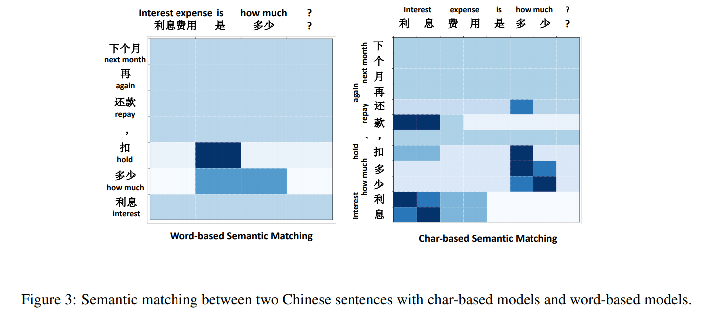

# 语法分析
[toc]

## Word Segment
### [2019ACL Is Word Segmentation Necessary for Deep Learning of Chinese Representations?](resources/notes/d0001/nlplac_2019_is_word_segmentation_necessary_for_deep_learning_of_chinese_representations.md)
- https://www.aclweb.org/anthology/P19-1314.pdf

- 基于字符的模型始终优于基于词的模型
- 基于词的模型的劣势归因于词分布的稀疏性，导致更多的OOV单词和过拟合的问题

## Named Entity Recognition
### [2017 Semi-supervised sequence tagging with bidirectional language models]

## Coreference Resolution
### [2017 ACL End-to-end Neural Coreference Resolution]
- https://www.aclweb.org/anthology/D17-1018.pdf

## Semantic Role Labeling
### [2017 ACL Deep Semantic Role Labeling: What Works and What's Next]()