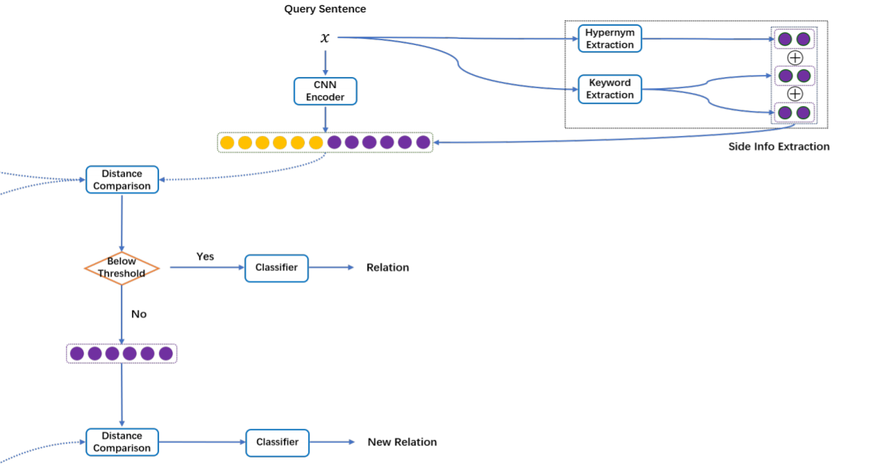
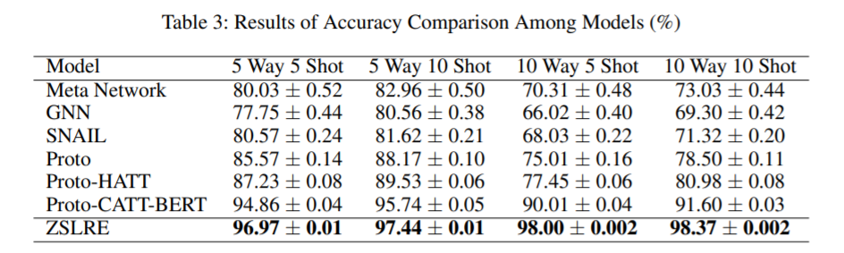
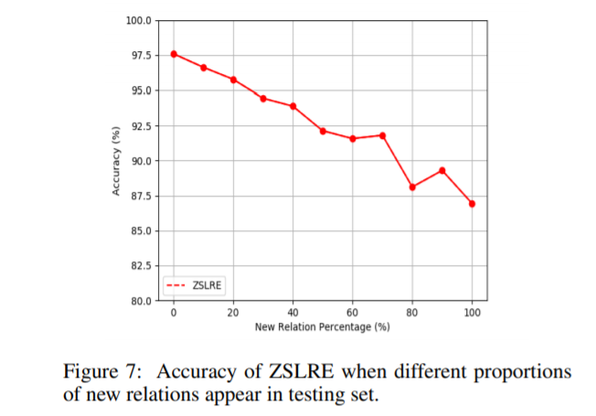

# 论文粗读

<!-- TOC -->

- [论文粗读](#论文粗读)
  - [[EasyTransfer -- A Simple and Scalable Deep Transfer Learning Platform for NLP Applications 一个简单可扩展的 NLP 应用深度传递学习平台]](#easytransfer----a-simple-and-scalable-deep-transfer-learning-platform-for-nlp-applications-一个简单可扩展的-nlp-应用深度传递学习平台)
  - [[Zero-shot Learning for Relation Extraction 零样本学习在关系抽取中的应用]](#zero-shot-learning-for-relation-extraction-零样本学习在关系抽取中的应用)
  - [[A Survey on Recent Advances in Sequence Labeling from Deep Learning Models 基于深度学习模型的序列标注研究进展]](#a-survey-on-recent-advances-in-sequence-labeling-from-deep-learning-models-基于深度学习模型的序列标注研究进展)
  - [[Multi-modal Emotion Detection with Transfer Learning 基于迁移学习的多模态情绪检测]](#multi-modal-emotion-detection-with-transfer-learning-基于迁移学习的多模态情绪检测)
  - [[The Impact of Text Presentation on Translator Performance]](#the-impact-of-text-presentation-on-translator-performance)
  - [[Don’t Read Too Much Into It: Adaptive Computation for Open-Domain Question Answering]](#dont-read-too-much-into-it-adaptive-computation-for-open-domain-question-answering)
  - [[Action State Update Approach to Dialogue Management]](#action-state-update-approach-to-dialogue-management)
  - [[VisBERT: Hidden-State Visualizations for Transformers]](#visbert-hidden-state-visualizations-for-transformers)
  - [[Catch the ”Tails” of BERT]](#catch-the-tails-of-bert)
  - [[CxGBERT: BERT meets Construction Grammar]](#cxgbert-bert-meets-construction-grammar)
  - [[Language Model is All You Need: Natural Language Understanding As Question Answering]](#language-model-is-all-you-need-natural-language-understanding-as-question-answering)
  - [[Semi-Supervised Cleansing of Web Argument Corpora]](#semi-supervised-cleansing-of-web-argument-corpora)
  - [[How Far Does BERT Look At: Distance-based Clustering and Analysis of BERT’s Attention]](#how-far-does-bert-look-at-distance-based-clustering-and-analysis-of-berts-attention)
  - [[Modeling Event Salience in Narratives via Barthes’ Cardinal Functions 基于巴特基本功能的叙事事件显著性建模]](#modeling-event-salience-in-narratives-via-barthes-cardinal-functions-基于巴特基本功能的叙事事件显著性建模)
  - [[Cross-Media Keyphrase Prediction: A Unified Framework with Multi-Modality Multi-Head Attention and Image Wordings 跨媒体关键词预测: 多模态多头注意和图像语义的统一框架]](#cross-media-keyphrase-prediction-a-unified-framework-with-multi-modality-multi-head-attention-and-image-wordings-跨媒体关键词预测-多模态多头注意和图像语义的统一框架)

<!-- /TOC -->

## [EasyTransfer -- A Simple and Scalable Deep Transfer Learning Platform for NLP Applications 一个简单可扩展的 NLP 应用深度传递学习平台]
- https://arxiv.org/abs/2011.09463
- [ ] https://github.com/alibaba/EasyTransfer

https://developer.nvidia.com/transfer-learning-toolkit 
https://github.com/amzn/xfer  KDD ’21, August, 2020, Singapore, Singapore  
https://github.com/FuzhenZhuang/Transfer-Learning-Toolkit 
https://github.com/huggingface/transformers

- 内置数据和模型并行策略比 Tensorflow 的默认分布策略快4倍。EasyTransfer 支持主流的预先培训模型 zoo，包括预先培训的语言模型(plm)和多模态模型。它还为 AppZoo 中的主流 NLP 应用程序集成了各种 SOTA 模型，并支持主流 TL 算法。该工具包便于用户快速启动模型训练、评估、离线预测和在线部署。这个系统目前部署在阿里巴巴，以支持各种业务场景，包括项目推荐，个性化检索和交谈式问答

-  five categories
   -  namely model fine-tuning,: 构建了 ModelZoo，它提供了预先培训的模型
   -  feature-based TL:
      -  基于特征的迁移学习。这些方法寻求一个共同的特征空间，可以减少源域和目标域之间的差异，通过转换特征从一个域到另一个域更接近，或投影不同的域到一个共同的潜在空间，特征分布是接近[21]
   -  instance-based TL: 负迁移问题。基于实例的 TL 方法寻求通过重新加权源样本来减轻负迁移学习，这样来自源域和目标域的数据将共享类似的数据分布[3,7,17], 引入了强化迁移学习(RTL)[15,25] ，通过联合训练一个强化选择器来选择高质量的源数据，以帮助目标域的学习过程
   -  model-based TL 
      -  利用知识提取学习一个轻量级的学生模型，是实时部署 TL 的一个重要方面
      -  配备了多种知识提取方法[2,6,8,19,22] ，将一个大模型(如12层 BERT)压缩成一个小模型(如2层 BERT 或 CNN)。在此基础上，结合可分神经网络结构搜索技术，提出了任务自适应 BERT 压缩算法 AdaBERT [2]
   -  meta learning:
      -  具有元学习能力，能够提高大规模语言模型的领域层和任务层知识转移的性能。例如，MetaFT 算法[26]被提出来学习一个“元学习者”基于预先训练的语言模型，旨在解决一组类似的自然语言处理任务。在从多个任务中获得“元学习者”之后，通过模型微调，该模型能够快速适应具体任务，并具有更好的性能
- 为用户提供低层和高层 api 来构建他们自己的模型。这些层包括基本的深度学习层，如密集层、线性层和 LSTM 层，NLP 层，如 BERT 和 Transformer 层，以及 Conv 和 Flatten 等卷积(CV)层
- 提供了并行策略，包括资料平行、模型并行性、操作符分割、流水线和混合策略。通过 Whale IR 和并行性抽象的设计，Whale 可以在一个框架中支持各种类型的并行性，并且可以与不同的训练前端 api 集合兼容。此外，它还提供了自动并行机制，减少了用户的负担
- 在 EasyTransfer 中构建了 ModelZoo，它提供了预先培训的模型，包括主流语言模型 BERT、 ALBERT 和 T5，以及跨模态模型 FashionBERT [5]。我们的 ModelZoo 完全兼容从开源工具包如 Huggingface 变形金刚预先训练的模型。我们还使用收集的数据集并基于 PAI 平台提供了范围广泛的语言建模预训练

- NLP 应用工具 AppZoo
  - 4类 NLP 应用程序，包括文本分类，文本匹配，机器/阅读理解以及序列标签

- 基于特征的迁移学习。EasyTransfer 支持典型的基于特征的迁移学习方法，如全共享(FS)[13]、特殊共享(SS)[10]、对抗性训练[10](full-shared (FS) [ 13 ], specic-shared (SS) [ 10 ], adversarial training [ 10 ])
- 提出了一种领域关系特定共享体系结构(DRSS)[28用于学习 SS 方法中的领域关系。DRSS 还可以与对抗训练相结合，以进一步提高模型的性能
- EasyTransfer 支持两种基于强化选择器的转移学习算法，基于最小最大对策的 TL (MGTL)[25]和强化 TL (RTL)[15]。我们将这些方法与纯源数据方法[13]和最近的(target-data)进行比较基于贝叶斯优化的实例选择方法 Ruder 和 Plank [18]
- 对 BERT (distillbert [19] ，bertrand pkd [22] ，TinyBERT [8] ，AdaBERT [2])提出了四种典型的 KD 方法

## [Zero-shot Learning for Relation Extraction 零样本学习在关系抽取中的应用]
- https://arxiv.org/abs/2011.07126

- 提出了一种零镜头学习关系抽取(ZSLRE)框架，该框架主要针对没有相应标记数据可用于训练的新关系进行识别。我们提出的 ZSLRE 模型旨在识别新的基于原型网络的关系，这些网络被修改为利用边(辅助)信息。辅助信息的额外使用使得那些被修改的原型网络能够在已知关系的基础上识别新的关系。我们从标签和它们的同义词、名称实体的上位词和关键字构建旁信息。我们构建了一个自动的上位词抽取框架，以帮助直接从 web 上获取各种名称实体的上位词
- 远程监督标记的数据是噪声的。为了克服高质量数据不足的问题，少镜头学习被设计成只需要很少的标记句子进行训练
-  OpenIE 不能有效地选择有意义的关系模式，并丢弃不相关的信息。此外，如果关系的名称没有出现在给定的句子中，这种技术也不能发现关系

- 从标签及其同义词、双名实体上位词和训练句中的关键词中构建副信息。基于 zsl 的模型可以根据提供给它的信息识别新的关系，而不是使用一组标记句子。我们结合侧面信息，使我们的模型能够提取从未出现在训练数据集中的关系。我们还建立了一个自动上位词提取框架，以帮助我们直接从网络获取不同实体的上位词。侧面信息建设的细节在侧面信息抽取中有描述

- Methodology
  - Sentence Encoder
    - Word Embeddings
    - Position Embeddings
      - 位置特征，一个从当前单词到两个实体的相对距离的组合
    - CNN Encoder：   
    - Side Information Embeddings
      - 标记信息和关键词在每个句子中对于提高关系抽取的性能也起着重要作用。对于没有训练句子的关系，使用标签及其相应的同义词作为辅助信息
      - 
  - Side Information Extraction
    - 边信息是用来判断新关系类型的辅助信息。对于训练中的关系，边信息是两个实体的上位词、两个实体之间的关系以及来自同一关系类型的所有训练句的关键词，非训练集中的关系则是通过人工标注两个实体，关系类型本身和关系类型的同义词。对于查询句，边信息是两个实体的上位词和从句子中提取的关键词
    - 关系类型的标签和同义词可以很容易地获得，关系类型的同义词也可以很容易地通过 WordNet 或其他词典获得
    - 上位词是较为特殊的词的广义词。一个句子中两个实体的上位词对于关系抽取极其重要 
      - 不到10% 的实体能够通过 WordNet 实现相应的上位词
      - FIGER 只提供了112种实体类型，其中只有38种被用作实体类型
      - 
    - tf-idf提取关键词 
  - Prototypical Network
    - 通过比较每个关系原型与查询语句之间的距离，可以对关系类型进行分类；原型网络的主要思想是计算一个代表每个关系的原型。每个原型都是属于一个关系的嵌入式句子的平均向量 
    - 使用欧几里得度量而不是余弦距离来计算距离，因为之前的工作表明欧几里得度量可以大幅度提高余弦距离的性能(Snell，Swersky 和 Zemel 2017)。我们没有添加任何注意力层，因为之前的工作表明，与普通的原型网络相比，性能几乎没有提高
    - 
- 该模型通过测量查询语句之间的距离和训练集嵌入平均权重来度量每个关系 r0的概率。对于没有训练句子的关系，r0的概率是通过测量查询句子的边信息和关系类型的边信息之间的距离来计算的。
- 对于在 FewRel 数据集上的少镜头学习场景，我们将模型与 Meta Network、 GNN、 SNAIL、 Proto、 Proto-htt 和 Proto-cactt-BERT 进行了比较。在 FewRel 数据集上面的六个基线是由 Hui 等人2020报告的，这些都是当前最先进的 FSL 模型
- 
- 
- 

## [A Survey on Recent Advances in Sequence Labeling from Deep Learning Models 基于深度学习模型的序列标注研究进展]
- https://arxiv.org/abs/2011.06727

- 传统的序列标记方法严重依赖于手工制作的或语言特定的特性。近年来，深度学习技术在序列标记任务中得到了广泛的应用，因为它能够自动地学习实例的复杂特征，并且能够有效地获得最新的实验结果
- 自然语言处理领域的顺序标注问题可以表述为一个任务，目的是为一类在句子语法结构中具有相似角色和相似语法属性的语素分配标注，而分配标注的意义通常取决于具体任务的类型，经典任务的例子包括词性标注[71]、命名实体识别[52]、文本组块[65]等

- part-of-speech (POS) tagging, named entity recognition (NER) and text chunking 词性标记、命名实体识别和文本组块
  - 词性分析可以被看作是一种粗粒度的词汇聚类任务，其目的是标注句子中词的形式和句法信息，这有利于缓解词级特征的稀疏性，其是自然语言处理领域中的一个重要的前处理步骤，用于后续的任务，如语义角色标注或语法分析
  - NER： BIOES system，
  - 文本组块任务的目的是将文本分为句法相关的非重叠的词组，即词组，如名词词组、动词词组等。这个任务本质上可以看作是一个给句子中的单词分配特定标签的序列标注问题。与 NER 相似，也可以采用 bios 标签系统。例如，“The little dog barked at the cat”这个句子可以分为以下几个短语: “(小狗)(吠叫)(猫)”。因此，在 BIOES 标注系统中，与这个句子对应的标注顺序是“ B-NP I-NP E-NP B-VP B-VP B-NP E-NP” ，这意味着“ The little dog”和“ The cat”是名词短语，“ barted at”是动词短语
  - 应用序列标注框架解决依存句法分析[105,60]、语义角色标注[82,107]、答案选择[132,56]、文本错误检测[92,91]、文档摘要[77]、组成句法分析[24]、子事件检测[4]、对话情感检测[102]和复杂词识别[25]等问题已经取得了很多成果

- 按照三个轴线进行分类: 嵌入模块、上下文编码模块和推理模块
  - 嵌入模型
    - 预训练的词嵌入技术已被广泛应用，如 Word2Vec、 Senna、 GloVe 等
    - ELMO、BERT、knowledge-graph augmented word representations
    - Character-level Representations：RNN、CNN
    - Sentence-level Representations：来自整个句子的全局上下文信息对于建模序列是有用的，但是在类似 Bi-LSTM 的上下文编码器中，这些信息在每个令牌位置没有得到充分的捕获。为了解决这个问题，最近的一些工作[67,68]在嵌入式模块中引入了句子级表示，也就是说，除了预先训练的单词嵌入和字符级表示之外，他们还使用从整个句子中学到的全局表示来分配每个单词  
  - 上下文编码模块
    - Recurrent Neural Network：bi-LSTM，bi-GRU
      - Rei [93]提出了一种多任务学习方法，该方法在 Bi-LSTM 上下文编码模块中加入辅助训练目标，学习预测句子中每个单词的周围词。结果表明，语言建模目标在多个序列标记基准上提供了一致的性能改进，因为它促使模型学习更一般的语义和语法组合模式
      - 张等人[126]提出了一种将低阶和高阶 lstm 相结合的多阶 BiLSTM 方法，以学习更多的标记依赖关系。高阶 lstm 为当前令牌预测多个标记，其中不仅包含当前标记，还包含前几个标记。该模型采用剪枝技术保持了对高阶模型的可扩展性，并在两个 NER 数据集中实现了最新的分块结果和高度竞争的结果
      - [69]提出了一种基于 LSTM 的句子级分类和序列标记任务联合训练模型，该模型采用改进的 LSTM 结构作为上下文编码模块。特别是，该方法在 LSTM 之前使用了一个卷积神经网络来从每个单词的上下文和之前的标签中提取特征。因此，对 LSTM 的输入进行了更改，以包含有意义的上下文和标签信息
      - Gregoric 等人[26]提出了一种不同的结构，它在相同的输入端使用多个并行的独立的双 lstm 单元，并通过使用模型间的正则化项来促进它们之间的多样性。结果表明，该方法减少了模型中的参数总数
      - Liu 等人[67]介绍了序列标记的深度转换体系结构，并在文本组块和 NER 任务上取得了显著的性能改进
      - Wei 等人[114]最近提出了一项工作，在 Bi-LSTM 的基础上，利用自我注意来提供补充的上下文信息。他们提出了一种位置感知的自注意和一个设计良好的自注意上下文融合网络，旨在探索一个输入序列的相对位置信息，以获取标记之间的潜在关系
    - Convolutional Neural Networks
      - 沈等人[103]提出了一个深度主动学习为基础的 NER 任务模型。他们的标记模型使用 CNN 提取每个单词的上下文表示。该结构具有两层卷积层，内核宽度为三，并将最后一层卷积层的表示与输入嵌入连接起来形成输出
      - [113]采用层叠门控卷积神经网络(GCNN)进行命名实体识别，通过门控机制扩展了卷积层  
      - 缺点是由于接受域有限，难以捕获序列中的长程依赖，这使得用 cnn 执行序列标记任务的方法比 rnn 少。近年来，一些基于 cnn 的模型对传统的 cnn 进行了改进，以更好地捕获全局上下文信息，并在序列标记方面取得了很好的效果
      - Strubell 等人[104]提出了一种迭代扩展卷积神经网络(ID-CNNs)方法来完成 NER 的任务，这种方法可以显著提高速度，同时保持与现代技术相当的精度。扩大的卷积[123]像典型的 CNN 层一样在滑动窗口上操作，但是上下文不需要是连续的。通过一次跳过多个输入，在较宽的有效输入宽度上定义卷积，有效输入宽度随深度呈指数增长。因此，它可以结合更广泛的上下文到一个标记的表示比典型的 CNN  
      - Chen 等人[10]提出了门控关系网络(GRN)用于 NER，在 cnn 上建立一个门控关系层，模拟任意两个单词之间的关系，以获取远程上下文信息 
    - Transformers
      - Yan 等人[128]分析了 Transformer 的特性，探讨了 Transformer 为什么不能很好地完成序列标记任务，特别是 NER 的原因。方向信息和相对距离信息在 NER 中都很重要，但是当正弦位置嵌入应用于香草型变压器时，这些信息会丢失。针对这一问题，他们提出了一种采用改进的变压器编码器结构，结合方向和相对距离感知注意和无标度注意，可以大大提高变压器编码器的 NER 性能
      - 星型变压器是邵等人提出的变压器的轻量级替代[28]。该算法采用星型拓扑结构代替全连接结构，每两个不相邻节点通过共享的中继节点连接。该算法大大降低了模型的复杂度，并且与标准的 Transformer 算法相比，在包括序列标记任务在内的各种任务上都有了很大的改进。
  - INFERENCE MODULE
    - Softmax
    - Conditional Random Fields
      - 半马氏条件随机场(Semi-Markov conditional random fields，semi-crf)[100]是传统条件随机场的一种扩展，它将标签分配给输入序列的各个片段，而不是分配给单个单词。该算法提取段的特征，建立段之间的转换模型，适用于命名实体识别和短语组块等段级序列标记任务。与条件随机场相比，半条件随机场的优点在于它可以充分利用段级信息来获取段的内部属性，并且可以考虑高阶的标签依赖。
      - Kong 等人[46]提出了分段级序列标记问题的分段回归神经网络(SRNNs) ，该网络采用半 crf 作为推理模块，通过 Bi-LSTM 学习段的表示
      - 由 Zhuo 等人[134]提出的一种并行工作门控递归半 crf (grsemi-crf)使用门控递归卷积神经网络(grConv)[14]来提取半 crf 的段特征。grConv 是递归神经网络的一个变体，它通过构造一个金字塔结构并递归地组合相邻的段向量来学习段级表示。Kemos 等人提出的后续工作利用相同的 grConv 结构在他们的神经半 crf 模型中提取段特征。它以字符作为基本输入单元，但不需要任何正确的标记边界，这与现有的字符级模型不同。该模型基于半 crf，可以联合分割(标记)和标记字符，对标记困难或噪声较大的语言具有较强的鲁棒性。佐藤等人[101]设计片段级神经 CRF 的片段级序列标记任务。该方法利用细胞神经网络获得段级表示，并构造段格以减少搜索空间。
      - Ye 等人提出的扩展[122]表明，合并词级标签信息有利于构建半 crfs。该模型同时利用词级标签和段级标签来获取段的得分。此外，还进一步提出了将 CRF 和 HSCRF 输出层集成到一个统一的网络中进行联合训练和解码的方法。混合半 crfs 模型也被采用作为后续工作的基准[66]
    - Skip-chain CRF
    - Embedded-State Latent CRF:[108]设计了一种新型的嵌入式状态潜在 CRF 神经序列标记，它具有更多的能力建模非局部标记依赖，往往被传统的 CRF 忽略。该方法将潜在变量引入到 CRF 模型中，捕获标签之间的全局约束，并将表示学习应用于输出空间。为了减少参数的个数，防止过拟合，进一步采用节约分解参数策略学习低秩嵌入矩阵
    - NCRF transducers:基于标签间长程依赖性建模的相似动机，Hu 等[34]提出了进一步的扩展，并提出了神经 CRF 传感器(NCRF) ，引入了 RNN 传感器实现 CRF 模型的边缘电位。边缘潜力通过考虑前面所有标签的依赖性来表示当前标签的得分。因此，提出的模型可以捕获从开始到每个当前位置的长程标签依赖关系。
  - Recurrent Neural Network
    - 在推理模块中也可以采用 RNN 结构来产生最优的标签序列。除了上下文编码器的学习表示输出外，前预测标签的信息也作为输入。因此，基于输入序列的特征和之前的预测标签，生成每个单词的相应标签，从而捕获长程标签依赖关系。然而，与全局归一化 CRF 模型不同的是，基于 rnn 的推理方法贪婪地从左到右对标记进行解码，因此它是一个局部归一化模型，可能存在标记偏差和暴露偏差问题[2]
    - Shen 等人[103]在上下文编码器上使用 LSTM 层进行标签解码。如图6所示，解码器 LSTM 将最后一个生成的标签以及当前单词的上下文表示作为输入，并计算隐藏状态，这个隐藏状态将通过柔性最大激活函数文件最终解码该标签。郑等[130]采用类似的 LSTM 结构作为其序列标记模型的推断模块 
    - Vaswani 等人[110]利用了 LSTM 解码器，可以认为是与上下文编码模块并行的。LSTM 只接受最后一个标签作为输入，以产生一个隐藏状态，该状态将与词语上下文表示结合起来，用于标签解码
    - [127]介绍了一种新的基于 LSTM 译码器的联合标记策略。在标注决策之前，输出隐藏状态和上下文表示并没有结合起来，而是独立地估计标注概率。然后通过加权平均将这两个概率合并，得到最终结果。具体来说，一个参数由一个 gate 机制动态计算，以自适应地平衡两个部分的参与。实验结果表明，该标记 LSTM 能够显著提高系统的性能。
  - Encoder-Decoder-Pointer Framework
    - 翟等[124]提出了一种基于编码-解码-指针框架的神经序列组块模型，该模型适用于需要给句子中有意义的组块分配标签的任务，如短语组块和语义角色标记。建筑如图7所示。该模型将原始序列标记任务分为两个步骤: (1)分割，确定每个块的范围; (2)标记，将每个块作为一个完整的标记单元。它采用指针网络[112]通过确定每个块的结束点来处理分割，并利用 LSTM 解码器根据分割结果进行标记。该模型由 Li 等人[55]提出的文本分割模型也采用了类似的体系结构，其中一个 seq2seq 模型配备了指针网络来推断段的边界
    - 

- 评价指标和数据集
  - 
  - 
  - 词性标注系统通常根据标记的准确性进行评估。而 f1评分，即准确率召回率的调和平均值，通常被用作 NER 和组块的评价指标。

- 方向
  - 低资源数据的序列标记
  - 基于深度学习的序列标记可扩展性研究
  - 外部资源的利用

- Nguyen 等人[79]提出了一个基于机器学习的序列标记问题的系统调查
- [117,54]对基于深度学习的命名实体识别问题(NER)模型进行了较好的文献综述

## [Multi-modal Emotion Detection with Transfer Learning 基于迁移学习的多模态情绪检测]
- https://arxiv.org/abs/2011.07065
- 模型
  - 基于 VoxCeleb1和 VoxCeleb2语料库对 TDNN (表3)进行说话人识别任务的预训练
  - 使用 Crema-D 语料库和表3.1中描述的典型标签聚类，在情感检测任务上微调我们的讲话者识别模型
  - 使用我们的典型情绪类，利用 DailyDialog 语料库对 BERT 模型进行了微调
  - 为了训练我们的 LDA/pLDA 分类器，我们从我们微调的语音模型的第六层和第六层以上提取 Crema-D 和 IEMOCAP 中所有话语的语音嵌入。我们将每个语句对应的文本嵌入连接起来——对于 IEMOCAP 来说，这很简单。我们使用嵌入的文字记录作为其附带的文本。对于 Crema-D，由于口语文本在所有情绪中重复出现，我们取而代之的是从 DailyDialog 中随机抽取具有相同情绪标签的文本，并使用其嵌入代替

- 利用语境来理解语言和非语言交流的情感的能力对于人类来说是微不足道的，但是对于机器来说却是困难的(compl _ fusion)。情绪反应取决于我们的心理和生理，并受我们对情况、人和物体的感知所支配。它们还取决于我们的精神状态(情绪、动机、性情)。我们展示和感知情感的方式也可能因年龄、性别、种族、文化和口音而有所不同(1904.03833)。除此之外，与其他分类任务中的目标不同，我们经历的情绪很少是截然不同的: 它们经常并存，没有明确的时间界限，给任务增加了相当大的复杂性(1704.08619)
- 现有的 IEMOCAP (IEMOCAP)和 Crem-D (cremad)等多模态情感语料库对情感计算的发展起到了至关重要的作用，但它们也存在三个问题
  - 情感注释的成本较高，这些语料库往往较小。这就排除了使用具有高模型复杂性的深层神经模型，因为它们需要许多训练样本来很好地推广
  - 虽然通常有许多中性的、快乐的和悲伤的训练例子，但是经常有极少的例子像厌恶这样的罕见情绪使得它们难以分类。由于第三个问题，
  - 不同的语料库之间缺乏相互兼容性，这个问题很难通过组合不同的语料库来解决——这些语料库在情感识别、对话类型和语言使用者人数表示以及录音的自然度方面存在差异(见图1)。这严重限制了在单个语料库上训练的模型的泛化能力。
- 通过放弃标签来处理这些问题(pappagari2020x; chen2020multi; yoon2020attentive)。从语料库中去除恶心等困难和稀缺的情感，并在修剪后的语料库中训练和评估模型。这允许评估模型在不同的语料库使用话语展示最常见的情绪

- 语音模型是预先训练的辅助任务的讲话者识别(r: beigi-sr-book-2011) ，以学习模型的基本声音特征嵌入。VoxCeleb1和 VoxCeleb2(voxcelebb)是自然语言数据集，将近8000名名人的视频和音频片段上传到 YouTube。总的来说，这两个数据集包含超过100万个话语。他们相当平衡，发言者也相当多样化(66% 为男性，代表了许多不同的民族和国家)
- Crema-D 是一个音频和视觉模式(cremad)中的多模态情感数据集。演员在每个目标情绪中表演一组有限的12个话语(掩盖他们的语义内容和他们的情绪推动力之间的关系)。被标记的情绪是愤怒、厌恶、兴奋、恐惧、快乐、中性和悲伤，包括一个相关的强度等级(低、中、高或不确定)。这个数据集包含了来自91个不同年龄和种族的演员的7442个话语。我们使用 Crema-D 作为我们的情绪微调主体
- 虽然 Crema-D 是一个多模态情感数据集，但由于语句内容缺乏多样性，使得基于文本的情感识别模型的训练效果不佳。为了解决这个问题，我们使用了 DailyDialog (li-etal-2017-DailyDialog) ，一个带有情感注释的多回合对话框数据集。数据集包含13,000多个对话，相当于100,000多个话语。被贴上标签的情绪是愤怒、厌恶、恐惧、快乐、悲伤、惊讶和“其他”
- 交互式情感动作捕捉(IEMOCAP)(IEMOCAP)包括12小时的音频和视频剪辑，由5名男演员和5名女演员表演。这些录音包括即兴表演和照本宣科的对话，都是为了引发某种情绪。然后，他们被分成个别的话语，并注释了维度属性和分类属性: 愤怒，厌恶，兴奋，恐惧，沮丧，快乐，中立，悲伤和惊讶。无法达成人类注释者协议的话语被标记为 xxx，带有这个标签的数据集的分数约为25%

## [The Impact of Text Presentation on Translator Performance]
- https://arxiv.org/abs/2011.05978

- 发现
  - 与不分段的文本相比，逐句呈现能够更快地进行文本复制(Copy)和句内错误识别(Scan) ，而不能更快地进行修改(Revise)
  - 文档(不分段文本)的呈现可以提高句子间照应关系修正的准确性(修正，Anaphor)
  - 源语句和目标语句的自上而下的方向比左右方向的文本复制更快，在所有实验任务中大多数受试者都更喜欢这种方向
  - 左右倾向使得词汇衔接(修改，命名实体)的修改更快

## [Don’t Read Too Much Into It: Adaptive Computation for Open-Domain Question Answering]
- https://arxiv.org/abs/2011.05435

- 开放领域问题回答(oqa)要求系统使用大量文档集合作为信息源来回答问题。与基于上下文的机器理解相反，模型是从单个段落或文档中提取答案，这在大规模机器阅读中提出了一个基本的技术挑战(Chen et al. ，2017)
- 两个阶段的管道组成，其中1)上下文检索器(如 BM25(Robertson，2004)或 DPR (Karpukhin 等人，2020)首先选择可能包含问题答案的一小部分段落，2)机器阅读器(如 BERT Devlin 等人(2019))然后检查检索到的上下文以提取答案
  - 两阶段过程导致了如图1所示的计算折衷。我们可以在大量的通道上运行计算代价昂贵的深度网络，以增加找到正确答案的可能性(“所有层，所有通道”) ，或者减少通道和层的数量，以减少计算代价，而可能错过一个答案(“6层，前2个通道”)
  - 如果计算预算不是静态分配的，而是基于每个通道的复杂性，可以找到一个更好的准确性和效率的权衡，见图1中的“自适应计算”。如果一个段落可能包含答案，分配更多的计算。如果不是，那就减少分配

- 引入了一种全局方法 SkylineBuilder，逐步建立多个塔楼，每次一层，并学习一个策略来决定下一层扩展哪个塔楼。而不是建立单一的变压器塔孤立，它构建了一个不同高度的塔天际线，基于哪些通道似乎最有希望进一步处理
- 发现 SkylineBuilder 保持了24层模型的95% 的精度，平均只使用5.6层。相比之下，对 Schwartz 等人(2020)提出的方法进行调整需要9个层才能得到相同的结果。对于数量较少的图层，改进的效果更为显著ーー例如，SkylineBuilder 的平均3层性能达到了完整性能的89% ，而 Schwartz 等人(2020)的方法达到了57% ，经过训练的模型正好使用3层的效果达到了65% 。最后，SkylineBuilder 在全层计数时保持了几乎相同的精度

- 贡献如下: 1)我们首先提出了两个模型: TowerBuilder 和 SkylineBuilder 来探索 oqa 的自适应计算; 2)我们的实验表明，这两种方法都可以用于自适应地分配计算资源，以保持预测精度的成本显著降低，通过学习策略协调多塔的建设产生更准确的结果; 3)相比于它们的非自适应对应方法，我们提出的方法可以减少计算量多达4.3倍

- [ ] TODO 使用强化学习

## [Action State Update Approach to Dialogue Management]
- https://arxiv.org/abs/2011.04637

- 本文提出了一种用于话语理解的动作状态更新方法(ASU) ，该方法使用一个经过统计训练的二进制分类器来检测用户话语文本中的对话状态更新动作。我们的目标是在没有领域特定的自然语言理解组件的情况下解释用户输入中的引用表达式。对于模型的训练，我们使用主动学习来自动选择模拟训练样本。通过用户模拟和交互式人类评估，我们证明了 ASU 方法在对话系统中成功地解释了用户的话语，包括那些带有指称表达式的话语

- 数据集构建
  - sys：为系统的输出，user为用户的输入， 根据训练集中的系统状态会构建很多的数据集
    - 1. 正样本， 其对应的item描述， 输出的模板
    - 2. 负样本， 其他item，以及其他目标， 对应item描述，以及可能的输出模板
  - 系统进行预测时，将当前状态中的item以及对其可能的询问，以及所有目标都作为二分标签分类，根据结果值进行选择

- 指称用语允许发言者在多个候选人之间的对话语境中口头识别实体。例如，在表1中的第五轮对话中，用户要求输入系统提供的一家餐厅的地址(Zizzi) ，然后再输入另一家餐厅(Nando)。用户通过引用表达式‘ The Italian place’来识别目标餐厅。这个问题的语义表示有两个参数: 目标(描述请求的信息)和引用(描述所引用的实体)。
- 指称用语给对话系统带来了额外的挑战。为了用引用表达式解释用户输入，系统不仅需要识别意图和实体，还需要识别用户所引用的上下文中的特定项。使用引用表达式解释和响应用户请求的能力是现实世界智能界面所需要的一项功能
- 在使用传统流水线架构的对话系统中，自然语言理解组件(NLU)为用户的话语[21,8]赋予语义。在信息状态更新(ISU)方法中，系统使用一套更新规则维护对话上下文的表示，称为”信息状态”。这些更新规则可以由“对话移动”触发，这是由特定领域的自然语言理解单元(NLU)生成的话语的语义表示。要解释这些系统中的指称表达式，需要一个特定于任务的 NLU，这需要花费大量的时间来训练[3]
- 提出了动作状态更新方法(ASU) ，它不需要特定领域的 NLU 就可以解释引用表达式，并且结合了灵活的状态表示、统计状态更新和声明表示[17,18]的优点。ASU 使用一个二进制分类器模型来检测用户话语中的状态更新操作(称为动作)。动作集是根据当前状态动态生成的。因此，我们使用一个多通道的二进制分类器，其中分类器作出预测的每一个行动在一个回合，而不是使用多类分类方法通常用于状态跟踪的插槽填充系统。提出的方法适用于口语和聊天自然语言接口
  - 我们引入了一种新的方法来实现状态更新，这种方法不需要 NLU 并解释引用表达式
  - 实验结果表明，利用主动学习产生的干扰子训练所提出的二进制模型能显著提高模型的性能

- 实现了剑桥饭店搜索域的对话系统[5]。类似于其他的插槽填充系统，我们的系统允许用户找到一个餐馆匹配指定的区域，价格范围，或食物类型(在域定义中的可信息插槽)。用户可以改变搜索标准，并探索其他餐厅。与其他的填充系统不同，我们的系统允许用户查询电话号码、地址、邮政编码、地区、价格范围或者之前讨论过的任何餐馆的食物类型。该系统有三个模块: 1)动作状态更新组件是这项工作的重点(见第2.1节) ，2)系统移动选择组件，和3)基于模板的自然语言生成器。系统的移动选择策略是通过使用强化学习和基于日程的用户模拟器的交互来训练的
- 状态更新被视为一组操作或操作。每个动作都会更改对话状态中的一个值，该值存储关于用户目标和对话历史的系统信念，包括前面讨论过的项。例如，一个状态更新动作的话语’我对意大利食物感兴趣’更新用户的目标食物 = 意大利。“意大利餐厅在哪个地区? ”这句话的状态更新动作打开一个请求位，用于匹配属性 food = Italian 的实体的区域字段。动作检测是识别用户在给定上下文中打算使用哪些状态修改动作的任务。在我们的方法中，作为状态修改指令的动作在没有语义分析的情况下被检测到。
- 为了允许用户询问关于所讨论的任何项目的问题，对于存储在对话历史记录中的每个可请求的插槽，都会生成一个候选的 r e q u e s t 操作。例如，如果对话历史包含三个餐馆，则生成18个请求候选人操作(6个可请求的插槽 x 3个项目)。相比之下，更改用户目标是一个与上下文无关的操作。给定领域本体，该模型在每个回合中对相同数量的目标改变行为进行分类，对应于(可信息的)插槽值对
- 在运行时，对于每个回合，模型做出 n 个分类决策，其中 n 是该回合中动态生成的候选操作的数量。只执行相关性得分大于0.5的动作，即通过更改目标(槽值)或在对话历史中的一个项目上设置请求位来更新对话状态。在更新过程中，我们应用了以下启发式方法: 1)如果一个时隙预测到多个动作，我们使用最高的动作; 2)如果多个请求动作接收到的动作大于0.5，我们只更新最近提到的项目的请求位
-  BERT 模型。该模型的输入是一个词汇序列，包括: 1)一系列词汇化的对话行为33。使用词汇化的对话行为比使用系统话语获得更高的表现。2)用户话语，3)项目描述，4)模板生成的动作句子。项描述是从操作生成的字符串。对于与项目无关的操作(目标更改) ，项目描述为空; 对于与项目相关的操作(信息请求) ，项目描述与请求项目的描述相对应

## [VisBERT: Hidden-State Visualizations for Transformers]
- https://github.com/bvanaken/visbert
- https://visbert.demo.datexis.com/

- VisBERT 工具目前主要用于分析问题回答(QA)的下游任务。问答是一项复杂的任务，不仅需要基本的语言知识，还需要传统的上游任务，如命名实体识别、共指解析和关系抽取
- 使用三个公开的 QA 数据集 SQuAD (Rajpurkar 等人，2016)、 HotpotQA (Yang 等人，2018)和 bAbI QA (Weston 等人，2016)来展示该工具在三个不同的 QA 任务(包括多跳推理案例)上的适用性
- BERT 的每一层输出一个不同的令牌向量分布，我们没有参考的语义意义的位置在这些向量空间。因此，我们将令牌向量之间的距离作为语义关系的指示。接下来，我们可以观察到模型在整个推理过程中形成的不断变化的标记关系。
- 使用 PCA 作为 VisBERT 工具，并将其分别适用于每个样本和层, 进一步根据问题、支持事实(回答问题所必需的事实)或预测答案对标记进行分类，以便于解释

- 回答问题的4个阶段
  - Topical Clustering In the first layers we see that tokens are clustered based on topical similarities, comparable to a static word embeddings like Word2Vec (Mikolov et al., 2013)  在第一个层中，我们看到标记是基于主题相似性进行集群的，类似于 Word2Vec (Mikolov 等人，2013)这样的静态单词嵌入
  - Connecting Entities with Mentions and Attributes Middle layers tend to cluster tokens based on their relation in the specific context. For example, we see multi-token entities clustered together because their tokens share one semantic meaning. One can also observe clusters of entities with their specific attributes.  连接具有 Mentions 和 Attributes Middle 层的实体倾向于基于特定上下文中它们之间的关系进行集群标记。例如，我们看到多令牌实体聚集在一起，因为它们的令牌共享一个语义。我们还可以观察到具有特定属性的实体集群
  - Matching Questions with Supporting Facts In the third quarter of BERT layers, we can see that the question tokens form clusters with the tokens of supporting facts. In multi-hop questions we even observe clusters for each hop that the question contains 可以看到问题标记以支持事实的标记形成了集群。在多跳问题中，我们甚至可以观察问题包含的每个跳的集群
  - Answer Extraction In the last layers the answer tokens are separated from all other tokens. Earlier semantic clusters are dissolved. Based on the certainty of the decision, there might be other potential candidate tokens separated as well, with the furthest answer tokens being chosen as final prediction.  答案提取在最后一个层中，答案标记与所有其他标记分开。早期的语义集群被分解。基于决策的确定性，可能还有其他潜在的候选令牌分隔，选择最远的答案令牌作为最终预测

- 其他用途
  - 分析对抗用例，使用用户自输入样例来进行对抗研究
  - 失败用例研究，可以看是在哪个阶段出错，以及可能的原因

- 样例
  - 
  - 
  - 
  - 
  - 

- 理解：
  - 早期，基于词向量还没有大的变化，因此是相应的以Topic为主的聚集
  - 中期，基于attention会将部分实体进行汇集
  - 中期，需要针对问句的整体句子意思去匹配到相应的支持句子含义
  - 后期，提取出答案，因此针对答案词语进行单独变化
- 为什么是相近？
  - 从attention的机制来说，是将要作用的相关词语之间进行value值的权重混合，因此作用到的词语之间的语义表示距离会变近

## [Catch the ”Tails” of BERT]
- https://arxiv.org/pdf/2011.04393.pdf
- 上下文化的词向量。表示是基于目标单词出现的上下文。由于这些向量对语境敏感，可以更好地解决多义问题。用上下文嵌入代替静态嵌入可以使许多 NLP 任务受益
- 研究结果显示了一些令人惊讶的发现
  - All the contextualized word embeddings share a common pattern. For BERT, the 557th  element is always the smallest element in all words in all non-input layers. For RoBERTa, the 588th  element is always the largest in all vectors and the 77th element is always the smallest except the [CLS] token. We call them as ”tails” of models 所有上下文化的单词嵌入都有一个共同的模式。对于 BERT，557 t h 元素始终是所有非输入层中所有单词中最小的元素。对于 RoBERTa，588t h 元素始终是所有向量中最大的，77t h 元素始终是除[ CLS ]标记之外最小的。我们称之为模型的“尾巴”
  - 上下文字向量空间的几何是各向异性的。这意味着 BERT 中的矢量在空间中占据一个狭窄的圆锥。我们指出，这种现象的主要原因是矢量的“尾巴”。在“切割尾部”之后，向量空间的几何形状变得方向均匀(各向同性)
  - 在“切断尾巴”之后，同一个单词的向量彼此更接近。我们还使用上下文中的词(WiC，(皮勒瓦尔和卡马乔-科拉多斯，2019))数据集来分析“尾”和词义之间的关系。我们发现，“切尾”可以更好地帮助模型表示词义
- 语境化字矢量的几何学有些作品研究语境化字矢量的几何学。Ethayarajh (2019)发现 BERT 中的向量占据空间中一个狭窄的圆锥。也就是说，两个随机的词向量在高层中更相似。他们称这种现象为各向异性。Reif 等人(2019)可视化和测量 BERT 的几何形状。他们在 BERT 中展示了句法表示的几何学，并用数学论证来解释这种几何学。威德曼等人(2019)表明，语境化的单词在 BERT 中嵌入形成不同的集群，对应于词义
- 向量空间的几何关系
  - 自相似定义，w词语在i句l层的表示 
  - 结果表明，上下文化的词向量在所有非输入层中都是各向异性的。这意味着均匀随机抽样的单词之间的平均余弦距离接近1
  - 可以发现 BERT 和 RoBERTa 的上下文化的表示在更高的层次上更具有亲和性。特别是对 RoBERTa 来说，在第一个非输入层之后，随机字之间的平均余弦距离大于0.5。这意味着 BERT 和 RoBERTa 的内部表示在向量空间中占据一个狭窄的圆锥
  - 我们认为“尾巴”是各向异性的主要原因。为了验证我们的假设，我们“砍掉”了伯特和罗伯塔的尾巴。这意味着我们将 BERT 中上下文化向量的557nd 元素设置为零，而 RoBERTa 中向量的77nd 元素和588t h 元素也设置为零
  - 
  - 从 SST-2训练集中抽取了1000个不同的单词。它们都至少出现在10个不同的句子中。我们用它们来计算 BERT 和 RoBERTa 在“切断尾巴”之前和之后的自相似性。为了校正各向异性的影响，我们减去各层各向异性测量的自相似性
  - 显示了一个单词的内部表示方式在更高层变得不那么相似了。然而，在“切断尾巴”之后，自相似性增加。矢量之间的距离越来越近。这意味着“切断尾部”可以减少上下文对向量的影响，使一个词的上下文化向量更加相似
- 与词义的关系
  - 假设“切断尾部”可以提高向量表示词义的能力，减少上下文的影响
  - 使用 word-in-context (WiC)数据集(Pilehvar 和 camacho-colladas，2019)来分析矢量。根据不同的上下文，一个词可以指代多种意义。WiC 数据集被设计用于识别不同上下文中的单词的意义。这是一个二元分类的任务。给定一个目标词和两个包含该词的句子，我们的模型需要确定该词在这两个句子中是否具有相同的意义
  - 
  - 使用目标单词在两个句子中的内部表征来计算余弦距离。如果该值大于阈值，则分配真实标签   

## [CxGBERT: BERT meets Construction Grammar]
- https://github.com/h-tayyarmadabushi/cxgbert-bert-meets-construction-grammar
- https://arxiv.org/abs/2011.04134
- 在理解深度学习模型方面存在固有的困难，但是一个新的自然语言处理领域，被称为 BERTology [ DBLP: journal/corr/abs-2002-12327] ，已经进化到能够更好地理解 BERT 在其结构中捕捉到什么，以及它如何能够通过相对快速的微调将知识有效地传递给如此多的不同任务。这些努力表明，除了封装 NLP 管道[ DBLP:/corr/abs-1905-05950]之外，BERT 嵌入还捕获了语言信息，如时态、词类[ chrupala-alishahi-2019-correlation，tenney2018what ]、整个解析树[ hewitt-manning-2019-structural ]
- 构式学派不严格区分词汇和语法成分，而是认为它们构成了由构式组成的连续体，这些构式是形式、功能或意义的习得配对。构式包括部分或完全填充的词汇、习语或一般语言模式
- 为了使一个结构被认为是这样的，它的意义不能从它的各个部分的总和来预测(例如，在习语的情况下) ，或者，如果这个意义是可预测的，那么一个模式被认为是一个结构，如果它经常出现[ goldberg2006结构]。构式存在于语言组织的多个层次(如形态学、句法)和不同的泛化层次，从低层次构式开始，如 cat +-s (即 cats) ，逐渐发展到更复杂的构式，如 Noun +-s (复数构式)或 Xer The Yer (如: The more I think about it, the less I like it) ，最后是最抽象的层次，不再包含任何元素，如 ditransitive 构式(如词汇性构式 She gave me a book; I emailed her the details)
- 建构主义方法基于通过对语言学习者的研究而发展起来的理论原则: 它既包括对建构的研究(建构语法: CxG，见第2节) ，也包括语言学习者根据输入(人们听到和阅读的东西) ，受到认知和实际约束的建构来构建他们的语言知识的观点[ goldberg2006]
- 如果 BERT 能够获得结构信息，那么它应该能够很好地区分各种结构。然而，这样做的能力并不足以得出 BERT 具有结构信息的结论，因为我们必须对 BERT 进行微调，它才能执行这个操作。此外，BERT 还可以利用其他信息来区分构式。如果 BERT 缺乏结构信息，显式地增加这些信息将会显著地改变 BERT 在下游任务中的执行能力或者它表示语言元素的能力，如词组或解析树，特别是给出了语言学和认知语言学实验的结果(第2和3.1节)。另一方面，如果 BERT 已经包含了结构信息，这种信息的增加将不会产生重大的影响，因此表明 BERT 确实包含了结构信息，或者说是功能等效的信息
  - 结构信息的增加对 BERT 有什么影响？
  - BERT 在识别结构方面的效果如何？

- 构式语法(CXG)
  - 构造是一个形式-意义对(参见图1中的说明和表1中的例子)。也就是说，它有一个具有功能或意义的句法和语音形式，尽管是一个(非常)图式的形式。结构有各种各样的形式和大小，从单词形式到完全图式的论元结构。共同的特点是，要么它们经常出现，要么它们的意义无法从各部分的总和中预测。
  - xG 并没有将单词看作是根据句法规则排列的单个标记，而是假定句法具有意义。根据 CxG 的说法，语言知识是由块(即结构)组成的，例如部分填充的成语“ drive someone x” ，其中的例子可能是“ drive someone crazy/nuts/bananas”等，这反过来又是结果结构“ x MAKES y z”的一个例子
  - 

- 构造语法的计算学习
  - 语法归纳算法
  - newcitedoi 的著作: 10.1080/09296174.2020.1767481，他同样从文本中提取模式语法

- 实验装置
  - 将 WikiText-103语料库中的所有句子进行分类, 基于句子的结构，每个句子都是一个实例，这些实例是用 Dunn 2017年短文的修改版本提取的。他们的系统提供了一个超过22000个结构的列表，我们使用这个预先计算好的结构列表对句子进行分类。应当指出，一个单独的句子可以归类为几个结构的实例。我们对他们的系统进行了大幅度的改进，以便处理 WikiText-103中的所有句子。 WikiText-103包含30,000篇文章和大约460万个句子
  - 两组实验都是基于这样一个前提设计的，即两个句子都是同一结构的实例，这一知识中存在着明显的语言信息编码, 把句子分成超过22000个结构的问题简化为两个句子是否是同一结构的实例的二元分类问题。

- CXGBERT: 将构造编码成 BERT
  - 增加结构信息如何影响 BERT: 利用 NSP 的目标，用 CxG WikiText (第4节)替换培训文档，在 BERT 的情况下，培训文档要么是维基百科文章，要么是书库中的书节，从而将这个预培训目标转换为“相同的 CxG 识别”目标。这个用 CxG WikiText 从头开始训练的 BERT 克隆将被称为“ CxGBERT”(发音为 sig-BERT)
  - 在相同的数据上训练另一个 BERT 实例(我们称之为 BERT Base Clone) ，以便有一个可比较的基线
  - 训练了一个与 BERT 基本克隆完全相同的数据，但语句(包括文档分割)被随机化的第三个模型——我们称之为 BERT 随机。
  - 
    - 利用 CxG 信息进一步训练的 BERT 语料库，即语言可接受性语料库(The Corpus of Linguistic acceptance，CoLA)和斯坦福情感树库(Stanford Sentiment Treebank，SST) ，都是单句分类语料库，这在我们改变 BERT 的 NSP 目标时是令人惊讶的
    - CXGBERT 和 BERT Base Clone 的相对接近的性能表明，结构信息和主题信息(从与单篇维基百科文章相关的文档中提取)似乎与下游任务的性能非常相似
  - 
    - 两种模式捕捉句子结构的能力是可比的

- BERT 的构式语法知识
  - BERT 版本是基于维基百科和图书语料库训练的标准 BERT 基础，没有掺杂任何构造性的预训练
  - 每一组结构(例如那些有2到50个句子的结构)都有不同数量的结构。为了确保我们可以在这些集合之间进行比较，我们从每个集合中选择2个正对和2个负对用于训练，1个正对和1个负对用于开发和测试集合。另一种选择是从每个集合中选择相同数量的训练和测试样本，但是从每个结构中选择不同数量的样本。
  - 探测的一个重要元素是确保在监督模型的训练过程中，编码器提供的句子表示不会被微调(冻结)[ tenney2018what ]——这可以确保探测器特有的信息不会过滤到句子表示中，迫使监督模型学习与探测任务相关的信息表示(例如 PoS 信息)之间的映射(例如标记 PoS)
  - 测试 BERT 的能力，区分句子属于相同的结构和那些不(在某种意义上测试 BERT 的知识的结构)使用以下策略: a)没有微调 BERT 无论什么，b)冻结 BERT 的变压器层和使用顶部的7个完全连接层(我们建立这个和其他相关的超参数使用一个独立的开发集描述相关的代码和数据) ，c) BERT 与100,500,1000,5000训练示例和 d)培训它对完整的训练数据(包括两个正面和两个负面的例子从每个结构)
  - 增加了一个最后的实验，包括测量一个基于 GloVe 的 biLSTM 模型在同一 CxG 消歧任务上的有效性时，对整个训练集进行训练
  - 
    - BERT 具有惊人数量的结构信息，能够预测如果两个句子是同一结构的实例，经过500个实例的训练，准确率接近90% 。更多的训练数据似乎会导致更少的局部极小值(以达到“接近”最大精度的运行次数来衡量)。相对较低的 GloVe 基线性能似乎表明，尽管使用分布式语义生成它们，但所使用的结构在语义上并不太相似。最后，BERT 的冻结版本和接种版本之间的性能差距似乎表明，BERT 在其内部结构中捕获建构信息

- 结论: BERT 确实获得了大量的建构信息。这些信息，和其他信息一样，比如 PoS 信息或解析树，在输出层中并不显式可用，但是可以从 BERT 的内部层中访问

## [Language Model is All You Need: Natural Language Understanding As Question Answering]
- https://arxiv.org/abs/2011.03023
- 创新点： 将意图和槽分类问题也映射为问答问题，并使用已经学习过的问答模型进行迁移，减少数据量的依赖以及新的性能
  - 继续训练，使用了QA数据进行了多余的训练
  - 问答 本质 也是在句子中查找特定的词语， 这点和槽抽取非常类似
  - 问题：耗用算力太多，每个意图，每个槽都会计算一遍

- 将自然语言理解(NLU)问题映射到问题回答(QA)问题，并且我们表明，在低数据状态下，与其他自然语言理解的方法相比，这种方法提供了显著的改进。此外，我们表明，这些收益可以通过顺序迁移学习跨越自然语言理解问题的不同领域。我们表明，我们的方法可以将相同性能所需的数据量减少多达10倍
- 
  
- 在我们称之为 QANLU 的方法中，我们基于 NLU 注释的数据构建插槽和意图检测问题和答案。QA 模型首先在 QA 语料库上进行训练，然后对从 NLU 注释数据创建的问题和答案进行微调。在这种方法中，迁移学习是通过转移知识来寻找问题的答案，这些知识是模型在 QA 模型培训过程中获得的，目的是寻找文本输入中的意图或SLOT的Value
- 通过我们的计算结果表明，在低数据类型和少镜头设置下，QANLU 在意图和时隙检测任务中的性能明显优于句子分类和标记标记方法，在自然语言理解任务中，QANLU 方法[10]也优于新引入的“ IC/SF Flew Shot”方法。我们还展示了 QANLU 在餐馆 -8k 数据集上设置了一个新的最先进的插槽检测性能[11]。此外，我们还表明，使用基于 NLU 注释数据创建的问题和答案来增强 QA 语料库，可以提高 QA 模型的性能。在整个工作中，我们使用基于跨度选择的 QA 模型，它建立在基于转换器的语言模型之上[6]。尽管如此，我们的方法非常通用，可以扩展到任何类型的 QA 系统

- 槽检测
  - 针对每个语句 标注一些槽， 以及针对每个槽构造一个对应的 问句
  -   

- 意图检测
  - is the intent asking about X? 答案为 Yes、No

- 使用基于跨度检测的 QA 模型
- 请注意，在将带注释的 NLU 数据转换为 QANLU 的问题和答案时，因为对于每个文本记录，我们为所有的槽询问所有的问题(无论它们是否出现在文本中) ，许多问题是无法回答的
- 实验主要基于预先训练过的 distillbert [24]和 ALBERT [25]模型
- ATIS 数据集是一个 NLU 基准，它为查询航班预订系统的话语提供手工注释
  - 使用 F1评分进行意图检测，是因为在 ATIS 数据集中，每个记录可能有多个意图
  - 对标题为“ n samples per slot”的行集进行抽样，使得每个样本对于任何槽都至少包含 n 个实例，其中 n 为1、2、5或10。对标题为“ n samples per intent”的行集进行抽样，使每个 intent 至少出现在 n 个实例中，其中 n 为1、2、5或10。N 前括号中的数字表示样本中 ATIS 记录的数量。对于每个 ATIS 记录，我们有179个问题和答案的意图和插槽
  - 对于基于 DistilBERT 和 ALBERT 的模型，我们看到 QANLU 在少镜头设置中明显优于意图和槽分类模型，这表明性能改进很可能来自于从 QA 任务中学习的学习阅读理解的转移
  - 
  - 

- 餐馆-8k 数据集[11]是一组注释的话语来自餐馆预订领域的实际交谈。数据集只包含用户端的话语和插槽(共5个)注释
  - 微调了 QANLU 模型，这个模型是在整个 ATIS 训练集上训练的，是在 Restaurants-8k 数据集的样本上训练的
  - 微调了 QANLU 模型，是在 Restaurants-8k 数据集的样本上训练的
  - 
  - 

- 输入标记将一个句子嵌入到一个网络中，并将每个标记的网络输出映射到一定数量的 NLU 类上，这似乎与我们对人类如何理解自然语言的直觉相去甚远。我们试图回答的主要研究问题是，是否所有的 NLP 问题都能有效地映射到一个典型问题上。如果答案是肯定的，那么标准问题是 QA 吗？
- QANLU 的一个有趣的副产品是为 NLU 任务创建的问题和答案可以增加 QA 任务的问题和答案(本工作中的Squard2.0) ，以提高 QA 模型的性能
- 

## [Semi-Supervised Cleansing of Web Argument Corpora]
- https://arxiv.org/abs/2011.01798
- https://webis.de/data.html#args-me-corpus
- https://github.com/webis-de/argmining-20
- 提出了一种精度导向的方法来检测这些无关文本在半监督的方式。通过给定一些种子示例，该方法自动学习关联性和非关联性的基本词汇模式，然后逐步从与模式匹配的句子中引导出新的模式。在现有的40万篇论证文本的 args.me 语料库中，我们的方法检测到近87k 的无关句子，根据人工评估的精度为0.97。该方法成本低，可以应用于其他网络论点语料库，为提高语料库质量提供了一种通用的方法。

- 最常用的网络辩论来源之一是辩论门户网站，人们在这里共同收集辩论或者就已定义的问题相互辩论。辩论门户网站和类似的网络平台，都有丰富的与论点相关的内容和结构，包括论点、事实、背景信息等等。这使研究人员能够在远处监督的方式下抓取大规模论元语料库
  - 辩论门户网站上的案文还包括与辩论有关的语言和样板文本，这些文本可能与所提到的应用程序无关，甚至有害
  - 在其他情况下，不相关的文本包括称呼、侮辱、纯粹的修辞手法和垃圾邮件
- 开发了一种半监督学习方法，旨在以非常高的精度检测尽可能多的不相关的句子，也就是说，几乎没有任何相关的句子应该被归类为不相关的句子。给定一组种子句，该方法学习基本的词法 n-gram 模式，这些模式经常与相关或不相关句子中的文本相匹配，并以一定的最低精度保持所有模式(对所有匹配句子进行估计)。它基于给定语料库中所有匹配的句子，然后启动新的模式，修改以前的模式，并逐步重复这个过程。最后一组不相关模式用于清理语料库

- 贡献
  - A semi-supervised approach to detect argumentatively irrelevant sentences in web arguments. 基于半监督方法的网络论证中议论文无关句检测。
  - Several common lexical patterns of relevance and irrelevance in web arguments. 网络争论中几种常见的关联和不关联词汇模式。
  - A cleaned version of the largest available argument corpus, with notably less irrelevant text. 一个最大可用参数语料库的清理版本，具有明显更少的不相关文本。

- 遵循成功模式挖掘方法的自举思想，如 DIPRE [6]、 Snowball [1]和 Espresso [14]。尽管这些方法都是针对语义相关的信息，但我们在作者的论辩语篇中区分了语用相关和不相关的文本
  
- 方法的目的是以超过阈值 τ 的估计精度找到尽可能多的无关文本单元(在第5节中，我们使用 τ = 0.95)。为此，它学习的语言模式常常出现在不相关的单位，很少出现在相关的单位(反之亦然)
- 三个主要阶段  
  - 种子模式选择。给定一个语料库作为输入，从它的单位中挖掘出一个共同的语言模式库，从中手动选择表示不相关性和关联性的种子模式
    - 建议半自动地处理选择，也就是说，我们首先从样本数据中自动地挖掘出最有希望的候选模式(我们在第5节中使用给定语料库中10% 的随机样本)。然后，我们手动将其中的一个子集分类为不相关或相关的种子模式
    - 候选模式
      - 计数与 TF-IDF。在计数的情况下，我们简单地将 m 个最频繁的 n-gram 看作每个 n 的候选项。对于 TF-IDF，我们取样数据中 TF-IDF 得分最高的 n-g (每个单位为一个文档)。在我们的实验中，我们使用 m = 100和 n ∈{1，... ，5}
      - W/stopwords vs. w/o stopwords.我们可以根据全单元文本(w/stopwords)确定 n-gram，也可以在(w/o stopwords)之前进行 stopword 删除
  - 模式自举。检索所有匹配任何种子不相关(相关)模式的单元，从单元中挖掘新的候选模式并添加到池中。然后，池中只保留高精度的不相关(相关)模式，即那些几乎只在不相关(相关)单元中发现的模式。这个过程一直重复，直到没有发现新的模式或者 k 次迭代已经过去
    - 第一步是从语料库中检索匹配任何不相关模式的所有单元集和匹配任何相关模式的所有单元集
    - 估计精确度
      - 设 t p 是匹配特定不相关(相关)模式的所有检索到的不相关(相关)单元的数量，f p 是匹配该模式的所有相关(不相关)单元的数量。然后估计模式的精度为 p = tp/(tp + fp)
    - 需要决定的一个参数是将模式视为候选模式的最小频率。我们建议从种子模式的频率推导出这个参数的值
      - 如果所有的种子模式在样本中至少有20个匹配项，并且完整的语料库有10倍的样本大小，那么一个合理的值可能是20 · 10 = 200。在过滤步骤中，两个单位集的大小保持平衡是有利的，因为不平衡的大小降低了两个单位集值 tp 和 fp 的可比性。因此，我们建议根据不相关单位的估计比例来调整最小数量。例如，如果相关单位的数量是不相关单位的10倍，那么合理的相关单位可能是2000
    - 一个重要特征是，在前一个迭代中添加到池中的模式可能在稍后再次从池中删除。这是因为检索到的相关和不相关的单位集在过程中发生了变化，这反过来又可能改变模式的精确估计。这可以理解为我们的方法的内部修订机制，它优化了最终池的精确性
  - 语料库清理。最后一个不相关模式库用于自动从语料库中删除不相关的单位
    - 基于最终的不相关模式库，实际清理给定的语料库
- 重要的是要看到相关的模式最终并没有用于实际的清理。它们仅用于区分相关单元和不相关单元，从而有助于识别高精度的不相关模式

- 一个网络论点的单位被认为是不相关的，当且仅当它不代表任何主张、证据、事实、背景资料或与文本作者所讨论的问题相关的类似陈述。不相关单位的例子包括关于辩论的元评论、称呼、感激的表达、人身侮辱、纯粹的修辞动作和垃圾邮件。

- 两种 TF-IDF 模式类型，我们发现相关模式明显服务于其目的，与论证的内容相关。在完整的列表中可以找到许多这样的模式。然而，很少有任何 TF-IDF 模式似乎可靠地表明无关。这与 TF-IDF 得分较高的短语是针对文档内容而不是反映一般语言的直觉相吻合

- 为 Counts w/o Stopwords 做出了决定，因为它产生的模式澄清了许多 Counts w/Stopwords 模糊不清的案例

- 将 τ 值设置为0.95，保留了所有至少2000个匹配的挖掘相关模式，以及至少200个匹配的挖掘不相关模式。给定种子模式，然后运行引导过程，直到再也找不到新模式
- 选择了600个不相关的句子作为随机样本进行人工评估(见补充材料) : 100个匹配种子不相关模式，100个匹配来自五次迭代的不相关模式

## [How Far Does BERT Look At: Distance-based Clustering and Analysis of BERT’s Attention]
- https://arxiv.org/abs/2011.00943
- [ ] TODO
- 通过无监督的聚类将注意力热图聚类到一系列特征之上，这些特征与之前的观察结果相一致。通过分析研究，进一步研究了它们的相应功能。此外，我们提出的特征可以用来解释和校准变压器模型中不同的注意头
- 除了将 BERT 模型的有效性归因于其长程依赖性和语境嵌入性的一般解释外，对 BERT 中 MHA 机制的更详细的分析仍然是一个活跃的研究课题[12,18,7,15]。通过检查隐藏的状态嵌入，可视化探索语言信息或 BERT 的重要性
- 研究人员开始探索多头注意成分的工作机制。一个常见的方法是将注意力权重矩阵可视化，它经常发现 BERT 中的注意力头表现出几种特定的模式。例如，一些注意头在对角线方向上显示主导的条纹图案，而另一些则显示主导的垂直条纹图案。还有一些注意力分布相对均匀的注意力头。在这项工作中，我们将这些图案称为密集型、垂直型或对角型
- 以往的工作依赖于简单的启发式规则或人工注释，这使得它们不可扩展且容易出错。在这项工作中，我们提出了一种可扩展的、高效的非监督式学习/注意力方法，它可以自动将不同的注意力头自动集群，让我们系统地研究它们在 NLP 任务中的不同

## [Modeling Event Salience in Narratives via Barthes’ Cardinal Functions 基于巴特基本功能的叙事事件显著性建模]
- https://arxiv.org/abs/2011.01785

- 叙述中的事件突出程度各不相同: 有些事件对故事的重要性要大于其他事件。事件显著性评估对故事生成等任务有重要意义，也是叙事学和民俗学中进行文本分析的工具。为了在没有任何注释的情况下计算事件显著性，我们采用了巴特的事件显著性定义，并提出了几种只需要预先训练语言模型的无监督方法
  - 以灰姑娘为例，王子爱上了灰姑娘是一个突出的事件，而灰姑娘从井里打水却不是。评估事件显著性是分析和处理叙事的基本任务，范围从叙事分析到自动生成故事

> cardinal functions are logically essential to the narrative action and cannot be eliminated without destroying its causal-chronological coherence 基本功能在逻辑上对于叙事行为是必不可少的，如果不破坏其因果时间上的连贯性，就无法消除它

- 首先，常用于叙述性分析[ citenameAbbott2008]。其次，CFs 的概念可以直接操作，不需要任何带注释的数据。基于语篇连贯理论的事件突显度计算需要测量叙事文本的连贯性，而语篇连贯模型的最新进展为这一难题提供了解决方案

- 相关工作
  - 先，删除测试[ citenameCarlson 和 Marcu2001]旨在识别修辞结构理论中的显著语段。在删除测试中，注释者通过删除感兴趣的语篇单位来检测语篇连贯减少的程度
  - 提取式摘要是一项识别文档中突出句子的任务，在形式上与我们的工作非常相似。尽管现有的提取式摘要方法有很多种，但是这些方法能否直接应用于叙事文本还是一个悬而未决的问题。精炼摘要通常侧重于具有严格结构的领域，如新闻文章或科学论文，而叙事文本没有这样严格的结构
- 在 NLP 的叙事处理过程中，已经提出了几种方法来识别一些突出事件: 娱乐故事中的悬疑事件[ citenameWilmot 和 Keller2020] ，电影剧本中的转折点[ citenemapalampidi 等人2019] ，以及个人叙事中可报告的事件[ citenameOuyang 和 McKeown2015]

- 方法
  - 我们估计一个句子的突出程度而不是一个事件的突出程度; 我们根据每个句子包含一个突出事件的程度在叙述中打分。这种简化使我们能够避免确定表达事件的短语和句子这一困难的子任务，同时处理确定表达突出事件的句子这一任务
  - 计算突显分数 σ (sk，s {1: n })作为从原始叙事 s {1: n }中删除 sk 中的事件时连贯性损失的量

- 删除一个句子中的事件
  - Sentence Deletion (SD): Removing the entire sentence
  - Verb Anonymization (VA): 基于每个动词的词性标签，用常用动词(例如，do，does，did)替换句子中的所有动词
  - Predicate and Arguments Anonymization (PAA): 用一般动词(如 VA)替换所有动词，用不定代词(如“ someone”、“ something”)替换主要论元
    - 使用 VA 和 PAA 是因为谓词和它们的参数是常用事件表示的主要组成部分

- Computing narratives’ coherence 计算机叙事的连贯性
  - 使用预先训练的语言模型计算叙事的生成概率，并将其作为叙事的连贯性得分
  - 用所有标记的平均对数似然估计相干性得分（受到叙事中单词数量的影响）
  - 只考虑目标句 s { k + 1: n }之后的句子

- ProppLearner corpus
  - 15 Russian folktales
- GPT-2作为一个预先训练的语言模型来计算相干性分数
- 三个微调设置
  - No fine-tuning
  - Fine-tuning GPT-2 on BookCorpus
  - Fine-tuning GPT-2 on ProppLearner as transductive domain adaptation
- 基线: 这个方法指定 TF-IDF 值的和
- 平均平均精度(MAP)作为评估指标

- 效果
  - VA 和 PAA 中的操作产生的非自然的句子可能会对语言模型的推理产生负面影响，这表明如何从句子中删除事件还有改进的余地
  - 我们发现最后一句话的显著性得分往往有很大的差异，因为在接下来的故事中只有一个特殊的标记被用来估计显著性
  - 将每种方法与 TF-IDF 基线方法相结合，这是最好的基线方法。在每个故事中，我们将每个方法和 TF-IDF 基线方法的显著性评分归一化为[0,1]。我们使用 scikit-learn [ citenameBuitinck 等人2013]实现 MinMaxScaler，然后将它们添加到最终显著性评分中

## [Cross-Media Keyphrase Prediction: A Unified Framework with Multi-Modality Multi-Head Attention and Image Wordings 跨媒体关键词预测: 多模态多头注意和图像语义的统一框架]
- https://arxiv.org/abs/2011.01565
- https://github.com/yuewang-cuhk/CMKP.

- 为了更好地对齐社交媒体风格的文本和图像，我们提出: (1)一种新的多模态多头注意(M3 H-Att)来捕捉复杂的跨媒体交互; (2)图像字符和图像属性的形式，桥接这两种模式。此外，我们设计了一个新颖的统一框架，利用关键词分类和生成的输出，并结合它们的优点
- 我们认为井号标签是一个帖子的关键词注释
- 图像在反映关键信息方面比文本起着更重要的作用。这些观点促进了我们的跨媒体关键词预测研究，该研究探讨了如何通过后文本与其匹配图像的耦合效应来表示显著的内容

