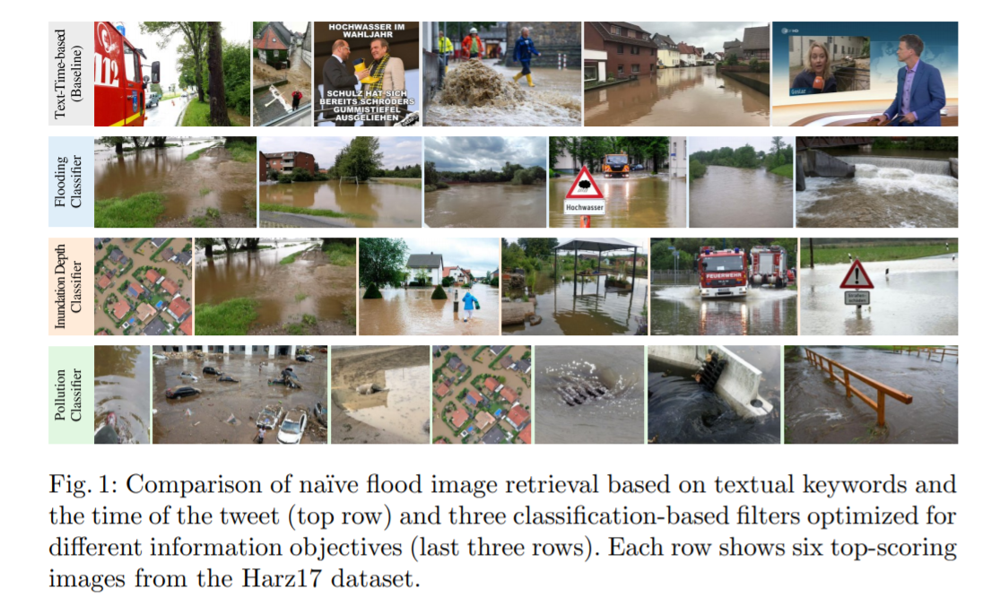
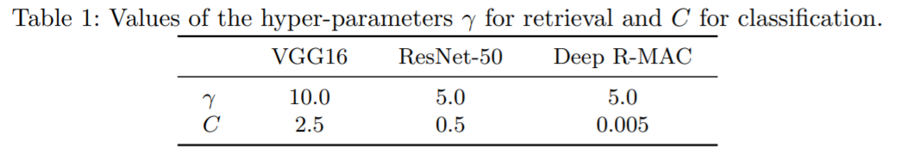
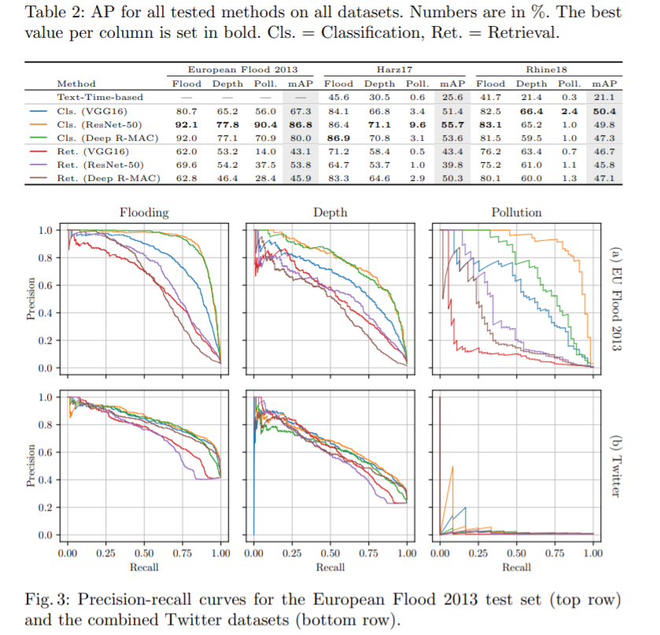
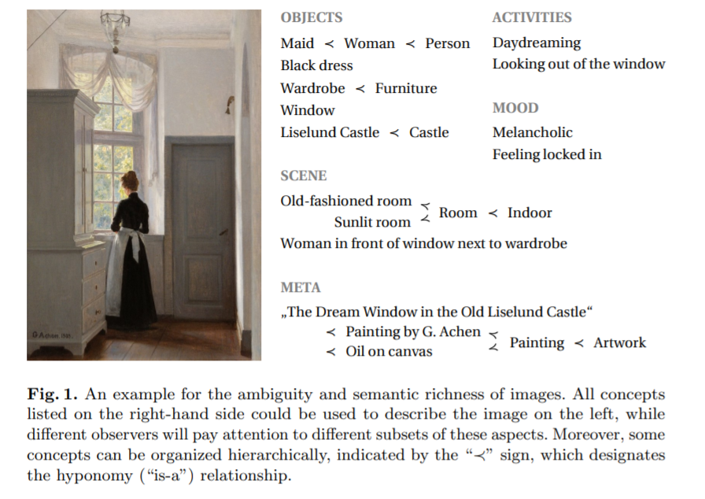
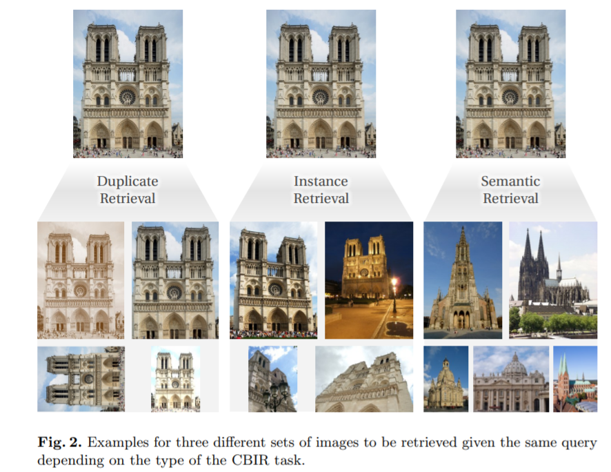

# 论文阅读 - CV
<!-- TOC -->

- [论文阅读 - CV](#论文阅读---cv)
  - [[Finding Relevant Flood Images on Twitter using Content-based Filters]](#finding-relevant-flood-images-on-twitter-using-content-based-filters)
  - [[Content-based Image Retrieval and the Semantic Gap in the Deep Learning Era 基于内容的图像检索与深度学习时代的语义鸿沟]](#content-based-image-retrieval-and-the-semantic-gap-in-the-deep-learning-era-基于内容的图像检索与深度学习时代的语义鸿沟)

<!-- /TOC -->
## [Finding Relevant Flood Images on Twitter using Content-based Filters]
- https://arxiv.org/abs/2011.05756
- https://github.com/cvjena/twitter-flood-dataset

- 结论：
  - 分类和检索差别不大
  - 如果有数据则分类可以使用，而如果是开放的，则检索更为合适

- 使用机器学习技术的自动过滤方法来寻找与下列信息目标之一相关的 Twitter 图像: 评估洪水区域、淹没深度和水污染程度。过滤器不依赖 tweet 中的文本信息，而是直接分析图像内容
- 与基于关键词的过滤器相比，我们的基于图像的过滤器能够显著提高结果的质量，平均平均精度从23% 提高到53%
- 基于文本的方法在查找事件图像时有两个主要缺点: 首先，基于文本的过滤器在洪水影响快速评估的背景下捕获的图像太多，无法进行人工检查。其次，用户可能不会总是在推文中直接提到洪水，因为主题已经从图片中可以辨认出来了。基于文本的过滤器会漏掉这些图像，因此会忽略潜在的有用信息
- Barz 等人最近提出了一种纯粹基于图像内容的交互式图像检索过滤技术。在他们的框架中，用户通过提供一个示例图像来说明他们正在寻找的内容，从而启动这个过程。然后系统检索第一组相似的图像，用户标记一些相关或不相关的图像，然后通过几轮反馈来优化搜索结果。这种交互式方法适用于开放的一系列可能的搜索目标，因为系统在每个会话期间从头开始适应用户的需求

- 洪水过滤器的结果主要包含描绘洪水区和非洪水区边界的图像。洪水深度滤波器的重点是视觉线索，有助于确定近似深度的洪水，如交通标志和人站在水中。最后，污染过滤器搜索重度污染水的图像

- 依赖文本关键字和推文日期的客观不可知基线
- 检索方法
  - 1. 
    - 为了计算来自数据库的图像特征向量 x ∈ x 和所有查询之间的相似性，我们使用了核密度估计特征向量(KDE) 
    - 
    - 使用从 VGG16架构[11]和 ResNet-50架构[7]的最后一个卷积层提取的特征，这两个架构都经过 ImageNet [10]120万张图像的预先训练。对这些区域特征进行平均，最后进行 l2归一化，得到 VGG16的512维特征空间和 ResNet-50的2048维特征空间。这些图片最初被缩放为768 × 512或512 × 768像素，这取决于它们的方向
  - 2. 
    - Deep R-MAC 体系结构[6]基于 ResNet-101，将2048维图像特征聚合到多个感兴趣的区域和图像分辨率上，使用 PCA 对它们进行解聚，最后应用 l2归一化。它已经预先训练了一个标志性的数据集，使用一个度量学习目标，强制类似的图像比不同的图像更接近由预先定义的边界
- 基于分类的方法
  - 使用欧洲洪水2013数据集中注释为相关的所有图像作为正面例子训练一个二元线性支持向量机(SVM)[3] ，所有剩余图像以及 Flickr100k 数据集中的图像作为负面例子。我们检查相同的图像特征用于检索技术(见上文)和优化正则化超参数 c ∈ r + 的支持向量机使用5倍的交叉验证在训练集

检索方法和基于分类方法之间的性能差异在 Twitter 数据上没有在2013年欧洲洪水数据集上那么大，因为分类器是在后者的领域训练的。根据分类得分进行的排名优于传统的检索方法，这仅仅是因为我们在这项工作中采用了封闭世界的场景: Barz 等人[1]所做的检索更适合于开放世界，用户搜索的类别事先不知道

## [Content-based Image Retrieval and the Semantic Gap in the Deep Learning Era 基于内容的图像检索与深度学习时代的语义鸿沟]
- [ ] NOTFINISHED
- https://arxiv.org/abs/2011.06490

- 首先简要概述实例检索的最相关的里程碑。然后，我们将它们应用到一个语义图像检索任务中，发现在需要理解图像的环境中，它们的性能低于其他更为复杂和通用的方法。接下来，我们回顾了现有的通过整合先前的世界知识来弥合这种所谓的语义鸿沟的方法。我们认为，语义图像检索进一步发展的关键问题在于缺乏一个标准化的任务定义和合适的基准数据集
- 作为人类，我们第一眼就能够抓住图像中包含的各种各样复杂的信息，比如所描绘的场景中发生的事件，人们所进行的活动，他们之间的关系，图像的氛围和情绪，以及图像所传递的情感。许多这些概念都逃避了文本描述，最好通过提供一个示例图像来说明。

- 语义鸿沟是以圣埃克苏佩里的话来表述的，是用眼睛客观地感知一个图像，作为对物体、形状、纹理的描述，与用心主观地感知一个图像，包括世界知识和情感，读“像素之间”的区别

- 重复检索:搜索内容完全相同的图片。这些变体来自同一张照片，但可能在裁剪、缩放、调整颜色、亮度、对比度等方面进行了不同的后期处理
- 实例检索:搜索描绘同一物体实例的图像，例如，某人或某建筑物。由于它是一个定义明确但不是琐碎的任务，有着清晰的基本事实
- 语义检索:涵盖了大部分剩余的范围，比实例检索更广泛，目的是寻找与查询属于同一类别的图像。在实践中，可能的类别集合仅受用户想象力的限制，而且一张图片通常同时属于非常多的类别(见图1).解决这个问题的方法通常包括与用户的交互，以使系统使用的相似性度量适应用户头脑中的相似性度量

- 实例检索的演进
  - CBIR 中使用的提取图像表示的一般框架: 一个局部特征提取器计算给定图像关键点的特征。这些局部特征然后嵌入到一个不同的空间，如量化的视觉词索引。最后，将它们聚合成一个全局表示
  - 全局表示允许有效地检索候选图像的初始列表。此外，局部特征经常被用于为排名最高的候选者执行空间验证和重新排序步骤，以消除错误匹配[48,39]。该技术特别适用于实例检索，通过匹配查询和检索图像之间的局部特征向量来验证局部特征是否具有匹配的几何布局
  - HAND-CRAFTED FEATURES AND VISUAL WORDS
    - 将不同关键点的局部特征提取出来，然后使用K-means进行聚类，每个类别作为一个视觉单词，然后采用视觉单词的tf-idf进行图像的BOW，使用余弦相似度计算
  - Towards More Complex Embeddings
    - Hessian-affine detector、SIFT、RootSIFT
    - 用一个整数(聚类索引)表示局部特征向量会导致严重的信息丢失，并且不能很好地捕捉局部特征的实际分布。对单个集群的硬分配对于靠近集群边界的局部描述符的微小变化是不健壮的
      - 使用 Fisher 向量进行 CBIR。通过拟合高斯混合模型，将训练数据量化为视觉单词。然后将每个局部特征向量转换为相对于高斯方法的对数似然梯度
      - 局部聚合描述符(VLADs)的向量具有可比性，有时甚至更好的性能。VLAD 仍然使用硬分配的局部描述符到最近的集群，但是从集群的中心捕获所有局部特征的元素残差。这意味着，嵌入的特征向量被分割成 k 段，其中 k 是簇的数量。与最近的集群中心对应的段等于本地描述符与该中心和所有其他段之间的差值为0。嵌入空间的维数就是聚类数乘以局部特征维数。聚合包括对所有变换后的局部特征向量求和，对结果进行 l2标准化，并应用带有白化的 PCA 将全局描述符的高维数降低到更易于管理的状态(通常是几百个维数)
      - VLAD 对本地特征向量与其聚类中心之间的距离非常敏感。Jégou 和 Zisserman [30]通过对残差进行 l2标准化来解释这一事实，从而对残差的角度进行编码，而不是对残差的大小进行编码，从而产生三角化嵌入嵌入。因为距离是没有意义的，硬分配给单个集群也是不合理的。因此，三角化嵌入可以对局部特征向量和所有视觉词之间的角进行编码。这种表示随后被白化，并被发现优于 Fisher 矢量和 VLAD。
      - Husain 和 Bober [25]发现，将每个局部特征向量与所有视觉词汇进行比较并不能扩展到大型数据集。另一方面，软集群赋值在实践中常常表现不稳定，退化为单一赋值。为了克服这个问题，他们提出了一个折中方案，将局部描述符分配给最近的几个聚类中心，并根据它们在最近邻居中的排名来确定权重，而不是它们的实际距离。这些鲁棒的可视化描述符(rvd)并不是全局的白化，而是在每个集群级别上。作者发现 RVD 对于三角嵌入具有竞争性，同时计算速度更快，对降维更健壮
  - The Role of Datasets
    - Oxford Buildings [39], Paris Buildings [40], and INRIA Holidays
    - 两个建筑数据集包含了牛津和巴黎不同地标性建筑的不同照片，包含了各种各样的视角、尺度和遮挡。假日数据集，另一方面，包含了个人假日照片的收集，平均每个场景有三个不同的视角。虽然这些数据集是具有挑战性的，但是检索显示与查询相同的对象或场景的图像的任务是有明确的基本事实的
  - OFF-THE-SHELF CNN FEATURES
    - 从仍然具有空间分辨率的最后一个卷积层提取图像特征，而第一个完全连接层提取全局图像描述符已经没有空间信息
    - 结果是一组特征向量，它们可以粗略地与图像中的不同区域相关联。这些特征被归纳为聚合、 l2规范化、使用 PCA 进行降维和再次进行 l2规范化，从而得到这些描述符的通用名称和汇集卷积特征(SPoC)。
  - END-TO-END LEARNING FOR IMAGE RETRIEVAL
    - 将用于特征提取的 CNN 用于图像检索而不是使用预先训练好的方法时，深度学习终于不可否认地优于基于手工特征的传统 CBIR 技术。我们认为这种从特征转换和聚合到实际特征学习的重点转移是基于内容的图像检索的第二个重要范式转移
    - 

