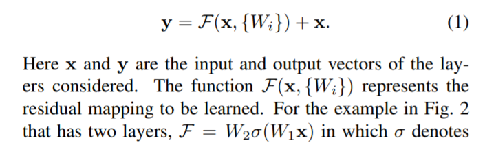

# 论文阅读 - CV
<!-- TOC -->

- [论文阅读 - CV](#论文阅读---cv)
  - [[Finding Relevant Flood Images on Twitter using Content-based Filters]](#finding-relevant-flood-images-on-twitter-using-content-based-filters)
  - [[2011.06490 Content-based Image Retrieval and the Semantic Gap in the Deep Learning Era 基于内容的图像检索与深度学习时代的语义鸿沟]](#201106490-content-based-image-retrieval-and-the-semantic-gap-in-the-deep-learning-era-基于内容的图像检索与深度学习时代的语义鸿沟)
  - [[1512.03385 Resnet: Deep Residual Learning for Image Recognition]](#151203385-resnet-deep-residual-learning-for-image-recognition)
  - [[1409.1556 Very Deep Convolutional Networks for Large-Scale Image Recognition 面向大规模图像识别的超深卷积网络]](#14091556-very-deep-convolutional-networks-for-large-scale-image-recognition-面向大规模图像识别的超深卷积网络)
  - [[1612.03144 FPN：feature pyramid networks for object detection]](#161203144-fpnfeature-pyramid-networks-for-object-detection)

<!-- /TOC -->
## [Finding Relevant Flood Images on Twitter using Content-based Filters]
- https://arxiv.org/abs/2011.05756
- https://github.com/cvjena/twitter-flood-dataset

- 结论：
  - 分类和检索差别不大
  - 如果有数据则分类可以使用，而如果是开放的，则检索更为合适

- 使用机器学习技术的自动过滤方法来寻找与下列信息目标之一相关的 Twitter 图像: 评估洪水区域、淹没深度和水污染程度。过滤器不依赖 tweet 中的文本信息，而是直接分析图像内容
- 与基于关键词的过滤器相比，我们的基于图像的过滤器能够显著提高结果的质量，平均平均精度从23% 提高到53%
- 基于文本的方法在查找事件图像时有两个主要缺点: 首先，基于文本的过滤器在洪水影响快速评估的背景下捕获的图像太多，无法进行人工检查。其次，用户可能不会总是在推文中直接提到洪水，因为主题已经从图片中可以辨认出来了。基于文本的过滤器会漏掉这些图像，因此会忽略潜在的有用信息
- Barz 等人最近提出了一种纯粹基于图像内容的交互式图像检索过滤技术。在他们的框架中，用户通过提供一个示例图像来说明他们正在寻找的内容，从而启动这个过程。然后系统检索第一组相似的图像，用户标记一些相关或不相关的图像，然后通过几轮反馈来优化搜索结果。这种交互式方法适用于开放的一系列可能的搜索目标，因为系统在每个会话期间从头开始适应用户的需求

- 洪水过滤器的结果主要包含描绘洪水区和非洪水区边界的图像。洪水深度滤波器的重点是视觉线索，有助于确定近似深度的洪水，如交通标志和人站在水中。最后，污染过滤器搜索重度污染水的图像


- 依赖文本关键字和推文日期的客观不可知基线
- 检索方法
  - 1. 
    - 为了计算来自数据库的图像特征向量 x ∈ x 和所有查询之间的相似性，我们使用了核密度估计特征向量(KDE) 
    - 
    - 使用从 VGG16架构[11]和 ResNet-50架构[7]的最后一个卷积层提取的特征，这两个架构都经过 ImageNet [10]120万张图像的预先训练。对这些区域特征进行平均，最后进行 l2归一化，得到 VGG16的512维特征空间和 ResNet-50的2048维特征空间。这些图片最初被缩放为768 × 512或512 × 768像素，这取决于它们的方向
  - 2. 
    - Deep R-MAC 体系结构[6]基于 ResNet-101，将2048维图像特征聚合到多个感兴趣的区域和图像分辨率上，使用 PCA 对它们进行解聚，最后应用 l2归一化。它已经预先训练了一个标志性的数据集，使用一个度量学习目标，强制类似的图像比不同的图像更接近由预先定义的边界
- 基于分类的方法
  - 使用欧洲洪水2013数据集中注释为相关的所有图像作为正面例子训练一个二元线性支持向量机(SVM)[3] ，所有剩余图像以及 Flickr100k 数据集中的图像作为负面例子。我们检查相同的图像特征用于检索技术(见上文)和优化正则化超参数 c ∈ r + 的支持向量机使用5倍的交叉验证在训练集


检索方法和基于分类方法之间的性能差异在 Twitter 数据上没有在2013年欧洲洪水数据集上那么大，因为分类器是在后者的领域训练的。根据分类得分进行的排名优于传统的检索方法，这仅仅是因为我们在这项工作中采用了封闭世界的场景: Barz 等人[1]所做的检索更适合于开放世界，用户搜索的类别事先不知道

## [2011.06490 Content-based Image Retrieval and the Semantic Gap in the Deep Learning Era 基于内容的图像检索与深度学习时代的语义鸿沟]
- [ ] NOTFINISHED
- https://arxiv.org/abs/2011.06490

- 首先简要概述实例检索的最相关的里程碑。然后，我们将它们应用到一个语义图像检索任务中，发现在需要理解图像的环境中，它们的性能低于其他更为复杂和通用的方法。接下来，我们回顾了现有的通过整合先前的世界知识来弥合这种所谓的语义鸿沟的方法。我们认为，语义图像检索进一步发展的关键问题在于缺乏一个标准化的任务定义和合适的基准数据集
- 作为人类，我们第一眼就能够抓住图像中包含的各种各样复杂的信息，比如所描绘的场景中发生的事件，人们所进行的活动，他们之间的关系，图像的氛围和情绪，以及图像所传递的情感。许多这些概念都逃避了文本描述，最好通过提供一个示例图像来说明。


- 语义鸿沟是以圣埃克苏佩里的话来表述的，是用眼睛客观地感知一个图像，作为对物体、形状、纹理的描述，与用心主观地感知一个图像，包括世界知识和情感，读“像素之间”的区别

- 重复检索:搜索内容完全相同的图片。这些变体来自同一张照片，但可能在裁剪、缩放、调整颜色、亮度、对比度等方面进行了不同的后期处理
- 实例检索:搜索描绘同一物体实例的图像，例如，某人或某建筑物。由于它是一个定义明确但不是琐碎的任务，有着清晰的基本事实
- 语义检索:涵盖了大部分剩余的范围，比实例检索更广泛，目的是寻找与查询属于同一类别的图像。在实践中，可能的类别集合仅受用户想象力的限制，而且一张图片通常同时属于非常多的类别(见图1).解决这个问题的方法通常包括与用户的交互，以使系统使用的相似性度量适应用户头脑中的相似性度量

- 实例检索的演进
  - CBIR 中使用的提取图像表示的一般框架: 一个局部特征提取器计算给定图像关键点的特征。这些局部特征然后嵌入到一个不同的空间，如量化的视觉词索引。最后，将它们聚合成一个全局表示
  - 全局表示允许有效地检索候选图像的初始列表。此外，局部特征经常被用于为排名最高的候选者执行空间验证和重新排序步骤，以消除错误匹配[48,39]。该技术特别适用于实例检索，通过匹配查询和检索图像之间的局部特征向量来验证局部特征是否具有匹配的几何布局
  - HAND-CRAFTED FEATURES AND VISUAL WORDS
    - 将不同关键点的局部特征提取出来，然后使用K-means进行聚类，每个类别作为一个视觉单词，然后采用视觉单词的tf-idf进行图像的BOW，使用余弦相似度计算
  - Towards More Complex Embeddings
    - Hessian-affine detector、SIFT、RootSIFT
    - 用一个整数(聚类索引)表示局部特征向量会导致严重的信息丢失，并且不能很好地捕捉局部特征的实际分布。对单个集群的硬分配对于靠近集群边界的局部描述符的微小变化是不健壮的
      - 使用 Fisher 向量进行 CBIR。通过拟合高斯混合模型，将训练数据量化为视觉单词。然后将每个局部特征向量转换为相对于高斯方法的对数似然梯度
      - 局部聚合描述符(VLADs)的向量具有可比性，有时甚至更好的性能。VLAD 仍然使用硬分配的局部描述符到最近的集群，但是从集群的中心捕获所有局部特征的元素残差。这意味着，嵌入的特征向量被分割成 k 段，其中 k 是簇的数量。与最近的集群中心对应的段等于本地描述符与该中心和所有其他段之间的差值为0。嵌入空间的维数就是聚类数乘以局部特征维数。聚合包括对所有变换后的局部特征向量求和，对结果进行 l2标准化，并应用带有白化的 PCA 将全局描述符的高维数降低到更易于管理的状态(通常是几百个维数)
      - VLAD 对本地特征向量与其聚类中心之间的距离非常敏感。Jégou 和 Zisserman [30]通过对残差进行 l2标准化来解释这一事实，从而对残差的角度进行编码，而不是对残差的大小进行编码，从而产生三角化嵌入嵌入。因为距离是没有意义的，硬分配给单个集群也是不合理的。因此，三角化嵌入可以对局部特征向量和所有视觉词之间的角进行编码。这种表示随后被白化，并被发现优于 Fisher 矢量和 VLAD。
      - Husain 和 Bober [25]发现，将每个局部特征向量与所有视觉词汇进行比较并不能扩展到大型数据集。另一方面，软集群赋值在实践中常常表现不稳定，退化为单一赋值。为了克服这个问题，他们提出了一个折中方案，将局部描述符分配给最近的几个聚类中心，并根据它们在最近邻居中的排名来确定权重，而不是它们的实际距离。这些鲁棒的可视化描述符(rvd)并不是全局的白化，而是在每个集群级别上。作者发现 RVD 对于三角嵌入具有竞争性，同时计算速度更快，对降维更健壮
  - The Role of Datasets
    - Oxford Buildings [39], Paris Buildings [40], and INRIA Holidays
    - 两个建筑数据集包含了牛津和巴黎不同地标性建筑的不同照片，包含了各种各样的视角、尺度和遮挡。假日数据集，另一方面，包含了个人假日照片的收集，平均每个场景有三个不同的视角。虽然这些数据集是具有挑战性的，但是检索显示与查询相同的对象或场景的图像的任务是有明确的基本事实的
  - OFF-THE-SHELF CNN FEATURES
    - 从仍然具有空间分辨率的最后一个卷积层提取图像特征，而第一个完全连接层提取全局图像描述符已经没有空间信息
    - 结果是一组特征向量，它们可以粗略地与图像中的不同区域相关联。这些特征被归纳为聚合、 l2规范化、使用 PCA 进行降维和再次进行 l2规范化，从而得到这些描述符的通用名称和汇集卷积特征(SPoC)。
  - END-TO-END LEARNING FOR IMAGE RETRIEVAL
    - 将用于特征提取的 CNN 用于图像检索而不是使用预先训练好的方法时，深度学习终于不可否认地优于基于手工特征的传统 CBIR 技术。我们认为这种从特征转换和聚合到实际特征学习的重点转移是基于内容的图像检索的第二个重要范式转移

## [1512.03385 Resnet: Deep Residual Learning for Image Recognition]
- https://arxiv.org/pdf/1512.03385.pdf
- 更深的神经网络更难训练。 因此本文提出了一种残差学习框架，以简化对更深网络的训练。 该方法显式地将层重新配置为参考输入层的学习残差函数，而不是学习非参考函数
- 当更深层的网络能够开始聚合时，就会出现降级问题：随着网络深度的增加，精度达到饱和（这可能不足为奇），然后迅速降级。 出乎意料的是，这种降级不是由过度拟合引起的，这在[11，42]中提到过，并且由我们的实验完全可以验证，将更多层添加到适当深度的模型中会导致更高的训练误差


- 通过构建更深层的模型可以找到解决方案：添加的层是恒等映射，其他层是从学习的浅层模型中复制的。 此构造解决方案的存在表明，较深的模型不会比浅模型产生更高的训练误差。 但是实验表明，我们现有的求解器无法找到比构造的解决方案好或更好的解决方案，或者无法在可行的时间内找到解决方案
- 通过引入深度残差学习框架来解决退化问题。 而不是希望每个堆叠的层都直接适合所需的基础映射，我们明确让这些层适合残差映射。 形式上，将所需的基础映射表示为H ( x ) H(x)H(x)，我们让堆叠的非线性层适合 F ( x ) : = H ( x ) − x F(x):= H(x)-xF(x):=H(x)−x 的另一个映射。 原始映射将重铸为F ( x ) + x F(x) + xF(x)+x。 我们假设优化残差映射比优化原始未引用映射要容易。 极端地，如果恒等映射是最佳的，则将残差推到零比通过非线性层的堆栈拟合恒等映射要容易
- F（x）+x 的公式可通过具有“快捷连接（shortcut connections）”的前馈神经网络来实现（图2）。 快捷连接[2、34、49]是跳过一层或多层的连接。 在我们的例子中，快捷方式连接仅执行恒等映射（identity mapping），并将其输出添加到堆叠层的输出中（图2）。 恒等快捷方式连接既不增加额外的参数，也不增加计算复杂度。 整个网络仍然可以通过SGD反向传播进行端到端训练，并且可以使用通用库（例如Caffe [19]）轻松实现，而无需修改求解器


- 我们证明：1）我们极深的残差网络易于优化，但是当深度增加时，对应的“普通”网络（简单地堆叠层）显示出更高的训练误差； 2）我们的深层残差网络可以通过大大增加深度来轻松享受精度提升，从而产生比以前的网络更好的结果
- 退化问题表明，求解器可能难以通过多个非线性层来逼近恒等映射。 利用残差学习重新形成，如果恒等映射是最佳的，则求解器可以简单地将多个非线性层的权重逼近零以逼近恒等映射




- 我们对ImageNet的实现遵循[21，41]中的做法。 调整图像大小，并在[256,480]中随机采样其较短的一面，以进行比例增强[41]。 从图像或其水平翻转中随机采样成224×224的裁剪大小，并减去每像素均值[21]。 使用[21]中的标准颜色增强。 在每次卷积之后和激活之前，紧接着[16]，我们采用批归一化（BN）[16]。 我们按照[13]中的方法初始化权重，并从头开始训练所有普通/残差网络。 我们使用最小批量为256的SGD。学习率从0.1开始，当误差平稳时除以10，并且对模型进行了多达60×10 4次迭代的训练。 我们使用0.0001的权重衰减和0.9的动量。 我们不遵循[16]中的做法使用Dropout [14]。
- 在测试中，为了进行比较研究，我们采用了标准的10种crops测试方法[21]。 为了获得最佳结果，我们采用[41，13]中的全卷积形式，并在多个尺度上对分数取平均（图像被调整大小，使得较短的边在{224,256,384,480,640}中）


- Identity vs. Projection Shortcuts 恒等与投影捷径。我们已经证明，无参数的恒等快捷方式有助于训练。 接下来，我们研究投影快捷方式（等式（2））。 在表3中，我们比较了三个选项：（A）零填充快捷键用于增加尺寸，并且所有快捷键都没有参数（与表2和右图4相同）； （B）投影快捷方式用于增加尺寸，其他快捷方式用于标识。 （C）所有快捷方式都是投影。


- 更深的瓶颈架构。 接下来，我们将介绍ImageNet上的更深层网络。 考虑到我们负担不起的训练时间，我们将构建模块修改为瓶颈设计。 对于每个残差函数F FF，我们使用3层而不是2层的堆栈（图5）。 这三层分别是1×1、3×3和1×1卷积，其中1×1层负责减小然后增加（还原）尺寸，使3×3层成为输入/输出尺寸较小的瓶颈 。 图5显示了一个示例，其中两种设计都具有相似的时间复杂度


- 基准34层ResNet获得了非常具有竞争力的准确性。我们的152层ResNet的单模型top-5验证错误为4.49％。 这个单一模型的结果优于所有先前的整体结果（表5）。 我们将六个不同深度的模型组合在一起以形成一个整体（提交时只有两个152层模型）。这导致测试集上3.57的top-5错误（表5）

## [1409.1556 Very Deep Convolutional Networks for Large-Scale Image Recognition 面向大规模图像识别的超深卷积网络]
- https://arxiv.org/pdf/1409.1556.pdf


从Alex-net发展而来的网络主要修改一下两个方面：
1，在第一个卷基层层使用更小的filter尺寸和间隔；
2，在整个图片和multi-scale上训练和测试图片。
2.1.1 小的Filter尺寸为3*3
卷积的间隔s=1；3*3的卷基层有1个像素的填充。
1：3*3是最小的能够捕获上下左右和中心概念的尺寸。
2：两个3*3的卷基层的有限感受野是5*5；三个3*3的感受野是7*7，可以替代大的filter尺寸
3：多个3*3的卷基层比一个大尺寸filter卷基层有更多的非线性，使得判决函数更加具有判决性。
4：多个3*3的卷积层比一个大尺寸的filter有更少的参数，假设卷基层的输入和输出的特征图大小相同为C，那么三个3*3的卷积层参数个数3*（3*3*C*C）=27CC；一个7*7的卷积层参数为49CC；所以可以把三个3*3的filter看成是一个7*7filter的分解（中间层有非线性的分解）。
2.1.2 1*1 filter:
作用是在不影响输入输出维数的情况下，对输入线进行线性形变，然后通过Relu进行非线性处理，增加网络的非线性表达能力。
Pooling：2*2，间隔s=2；

- Minibatch=256，其它的都一样。
作者发现，尽管VGG比Alex-net有更多的参数，更深的层次；但是VGG需要很少的迭代次数就开始收敛。这是因为
1，深度和小的filter尺寸起到了隐式的规则化的作用
2，一些层的pre-initialisation
pre-initialisation：网络A的权值W~（0,0.01）的高斯分布，bias为0；由于存在大量的ReLU函数，不好的权值初始值对于网络训练影响较大。为了绕开这个问题，作者现在通过随机的方式训练最浅的网络A；然后在训练其他网络时，把A的前4个卷基层（感觉是每个阶段的以第一卷积层）和最后全连接层的权值当做其他网络的初始值，未赋值的中间层通过随机初始化。

- Multi-scale 训练
把原始 image缩放到最小边S>224；然后在full image上提取224*224片段，进行训练。
方法1：在S=256，和S=384上训练两个模型，然后求平均
方法2：类似OverFeat测试时使用的方法，在[Smin,Smax]scale上，随机选取一个scale，然后提取224*224的图片，训练一个网络。这种方法类似图片尺寸上的数据增益

- 测试
测试阶段的方法和OverFeat测试方法相同，首先选定一个scale：Q，然后在这个图片上应用卷积网络，在最后一个卷积阶段产生unpooled FM，然后利用sliding window方法，每个pooling window产生一个分类输出，然后融合各个pooling window的结果，得到最终分类。这样比10-view更加高效，只需计算一次卷积过程。

- Multi-scale训练
方法1：single-scale训练 S，multi-scale测试 {S-32,S,S+32}
方法2：multi-scale训练[Smin;Smax]，multi-scale测试{Smin，middle，Smax}

- 模型融合
通过结果求平均，融合上面不同网络的结果。
模型融合结果如上图，比较有意思的是，模型D和E两个顶尖模型融合的结果比融合7个模型的结果还要好。这个比较有意思，模型融合个数多，反而没有两个网络的好


- 主要贡献是使用一个非常小的(3 × 3)卷积滤波器的体系结构对增加深度的网络进行了彻底的评估，这表明通过将深度推到16-19权重层，可以在现有技术配置上取得显著的改进
- 在整个网络中使用非常小的3 × 3接收域，这些接收域随着每个像素的输入而卷积(每个像素的输入为1)。我们可以很容易地看到一个由两个3 × 3连续变量组成的堆栈。有效感受野为5 × 5，三层有效感受野为7 × 7。那么，我们通过使用，例如，一个3 × 3 conv 的堆栈得到了什么呢。而不是一个单一的7 × 7层？首先将整流层由单层改为三层，使决策函数更具有判别性;。其次，我们减少了参数的个数
- 1 × 1conv.层(配置 c，表1)是一种增加非线性的决策函数，而不影响的共同领域的接受。层。即使在我们的情况下，1 × 1卷积实质上是对同一维空间的线性投影(输入通道和输出通道数相同) ，校正函数引入了一个额外的非线性
- 为了获得固定大小的224 × 224张 ConvNet 输入图像，对重新标定的训练图像进行随机裁剪(每图像一次 SGD 迭代一次裁剪)。为了进一步增加训练集，作物经历了随机水平翻转和随机 RGB 颜色变化
- 我们考虑了两种设置训练量表 s 的方法
  - 第一种是修正 s，它对应于单尺度训练(注意，采样作物中的图像内容仍然可以代表多尺度图像统计)。在我们的实验中，我们评估了在两个固定尺度上训练的模型: s = 256(在现有技术中已经广泛使用(Krizhevsky 等人，2012; Zeiler & Fergus，2013; Sermanet 等人，2014)和 s = 384。给定一个 ConvNet 配置，我们首先使用 s = 256对网络进行训练。为了提高 s = 384网络的训练速度，采用 s = 256的预训练权重初始化，初始学习率较小，为10-3
  - 设置 s 的第二种方法是多尺度训练，每个训练图像在一定范围内[ sm i n，sm a x ](我们使用 sm i n = 256和 sm a x = 512)被随机抽样 s 分别重标。因为图像中的物体可以是不同大小的，所以在训练中考虑这一点是有益的。这也可以被看作是规模抖动的训练集的扩展，在这里一个单一的模型被训练来识别在广泛的规模范围内的物体。出于速度方面的考虑，我们通过对单一比例模型的所有层次进行微调来训练多比例模型，并使用固定的 s = 384进行预训练


- 训练时刻度抖动(s ∈[256; 512])比固定最小边的图像(s = 256或 s = 384)训练效果显著，即使在测试时刻采用单一刻度。这证实了训练集增加规模抖动确实有助于捕获多尺度图像统计
- 表明在测试时间的规模抖动导致更好的性能(相比评估同一模型在单一规模，如表3所示)。和以前一样，最深的配置(d 和 e)表现最好，规模抖动优于训练与一个固定的最小侧面 s

## [1612.03144 FPN：feature pyramid networks for object detection]
- https://arxiv.org/pdf/1612.03144.pdf

- 对用卷积神经网络进行目标检测方法的一种改进，通过提取多尺度的特征信息进行融合，进而提高目标检测的精度，特别是在小物体检测上的精度。FPN是ResNet或DenseNet等通用特征提取网络的附加组件，可以和经典网络组合提升原网络效果
- 问题背景
网络的深度（对应到感受野）与总stride通常是一对矛盾的东西，常用的网络结构对应的总stride一般会比较大（如32），而图像中的小物体甚至会小于stride的大小，造成的结果就是小物体的检测性能急剧下降。
传统解决这个问题的思路包括：
- （1）多尺度训练和测试，又称图像金字塔，如下图(a)所示。目前几乎所有在ImageNet和COCO检测任务上取得好成绩的方法都使用了图像金字塔方法。然而这样的方法由于很高的时间及计算量消耗，难以在实际中应用。
- （2）特征分层，即每层分别预测对应的scale分辨率的检测结果。如下图(c)所示。SSD检测框架采用了类似的思想。这样的方法问题在于直接强行让不同层学习同样的语义信息。而对于卷积神经网络而言，不同深度对应着不同层次的语义特征，浅层网络分辨率高，学的更多是细节特征，深层网络分辨率低，学的更多是语义特征。

- 因而，目前多尺度的物体检测主要面临的挑战为：
1. 如何学习具有强语义信息的多尺度特征表示？
2. 如何设计通用的特征表示来解决物体检测中的多个子问题？如object proposal, box localization, instance segmentation.
3. 如何高效计算多尺度的特征表示？

- 特征金字塔网络（Feature Pyramid Networks）
作者提出了FPN算法。做法很简单，如下图所示。把低分辨率、高语义信息的高层特征和高分辨率、低语义信息的低层特征进行自上而下的侧边连接，使得所有尺度下的特征都有丰富的语义信息。


算法结构可以分为三个部分：自下而上的卷积神经网络（上图左），自上而下过程（上图右）和特征与特征之间的侧边连接。
- 自下而上的部分其实就是卷积神经网络的前向过程。在前向过程中，特征图的大小在经过某些层后会改变，而在经过其他一些层的时候不会改变，作者将不改变特征图大小的层归为一个阶段，因此每次抽取的特征都是每个阶段的最后一个层的输出，这样就能构成特征金字塔。具体来说，对于ResNets，作者使用了每个阶段的最后一个残差结构的特征激活输出。将这些残差模块输出表示为{C2, C3, C4, C5}，对应于conv2，conv3，conv4和conv5的输出。
- 自上而下的过程采用上采样进行。上采样几乎都是采用内插值方法，即在原有图像像素的基础上在像素点之间采用合适的插值算法插入新的元素，从而扩大原图像的大小。通过对特征图进行上采样，使得上采样后的特征图具有和下一层的特征图相同的大小。
- 根本上来说，侧边之间的横向连接是将上采样的结果和自下而上生成的特征图进行融合。我们将卷积神经网络中生成的对应层的特征图进行1×1的卷积操作，将之与经过上采样的特征图融合，得到一个新的特征图，这个特征图融合了不同层的特征，具有更丰富的信息。 这里1×1的卷积操作目的是改变channels，要求和后一层的channels相同。在融合之后还会再采用3*3的卷积核对每个融合结果进行卷积，目的是消除上采样的混叠效应，如此就得到了一个新的特征图。这样一层一层地迭代下去，就可以得到多个新的特征图。假设生成的特征图结果是P2，P3，P4，P5，它们和原来自底向上的卷积结果C2，C3，C4，C5一一对应。金字塔结构中所有层级共享分类层（回归层）。

- fast rcnn中的特征金字塔
  - Fast rcnn中的ROI Pooling层使用region proposal的结果和特征图作为输入。经过特征金字塔，我们得到了许多特征图，作者认为，不同层次的特征图上包含的物体大小也不同，因此，不同尺度的ROI，使用不同特征层作为ROI pooling层的输入。大尺度ROI就用后面一些的金字塔层，比如P5；小尺度ROI就用前面一点的特征层，比如P4。但是如何确定不同的roi对应的不同特征层呢？作者提出了一种方法：，224是ImageNet的标准输入，k0是基准值，设置为5，代表P5层的输出（原图大小就用P5层），w和h是ROI区域的长和宽，假设ROI是112 * 112的大小，那么k = k0-1 = 5-1 = 4，意味着该ROI应该使用P4的特征层。k值做取整处理。这意味着如果RoI的尺度变小（比如224的1/2），那么它应该被映射到一个精细的分辨率水平。 
  - 与RPN一样，FPN每层feature map加入3*3的卷积及两个相邻的1*1卷积分别做分类和回归的预测。在RPN中，实验对比了FPN不同层feature map卷积参数共享与否，发现共享仍然能达到很好性能，说明特征金字塔使得不同层学到了相同层次的语义特征。
    - 用于RPN的FPN：用FPN替换单一尺度的FMap。它们对每个级都有一个单一尺度的anchor（不需要多级作为其FPN）。它们还表明，金字塔的所有层级都有相似的语义层级。
    - Faster RCNN：他们以类似于图像金字塔输出的方式观察金字塔。因此，使用下面这个公式将RoI分配到特定level。
      - 
      - 其中w，h分别表示宽度和高度。k是分配RoI的level。k0是w,h=224,224时映射的level。

- 其他问题
  - Q1：不同深度的feature map为什么可以经过upsample后直接相加？
答：作者解释说这个原因在于我们做了end-to-end的training，因为不同层的参数不是固定的，不同层同时给监督做end-to-end training，所以相加训练出来的东西能够更有效地融合浅层和深层的信息。
  - Q2：为什么FPN相比去掉深层特征upsample(bottom-up pyramid)对于小物体检测提升明显？（RPN步骤AR从30.5到44.9，Fast RCNN步骤AP从24.9到33.9）
答：作者在poster里给出了这个问题的答案

对于小物体，一方面我们需要高分辨率的feature map更多关注小区域信息，另一方面，如图中的挎包一样，需要更全局的信息更准确判断挎包的存在及位置。
  - Q3：如果不考虑时间情况下，image pyramid是否可能会比feature pyramid的性能更高？
答：作者觉得经过精细调整训练是可能的，但是image pyramid（金字塔）主要的问题在于时间和空间占用太大，而feature pyramid可以在几乎不增加额外计算量情况下解决多尺度检测问题。
  - 怎么做的上采样？
高层特征怎么上采样和下一层的特征融合的，代码里面可以看到:
```python
P5 = KL.Conv2D(256, (1, 1), name='fpn_c5p5')(C5)
# C5是 resnet最顶层的输出，它会先通过一个1*1的卷积层，同时把通道数转为256，得到FPN 的最上面的一层 P5。
KL.UpSampling2D(size=(2, 2),name="fpn_p5upsampled")(P5)
# 这里的实现使用的是最简单的上采样，没有使用线性插值，没有使用反卷积，而是直接复制
```
  - 怎么做的横向连接？
```python
P4 = KL.Add(name="fpn_p4add")
    ([KL.UpSampling2D(size=(2, 2), name="fpn_p5upsampled")(P5),
      KL.Conv2D(256,(1, 1), name='fpn_c4p4')(C4)])
```
这里可以很明显的看到，P4就是上采样之后的 P5加上1*1 卷积之后的 C4，这里的横向连接实际上就是像素加法，先把 P5和C4转换到一样的尺寸，再直接进行相加。注意这里对从 resnet抽取的特征图做的是 1*1 的卷积：1x1的卷积我认为有三个作用：使bottom-up对应层降维至256；缓冲作用，防止梯度直接影响bottom-up主干网络，更稳定；组合特征。


