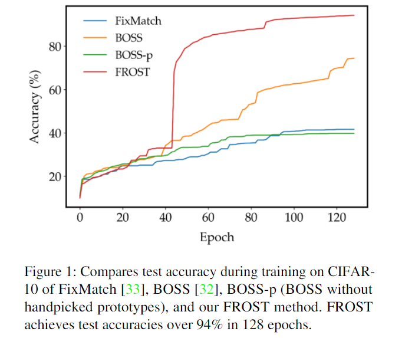
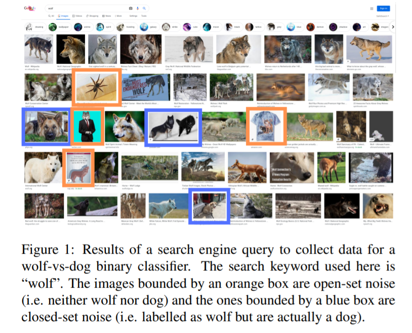
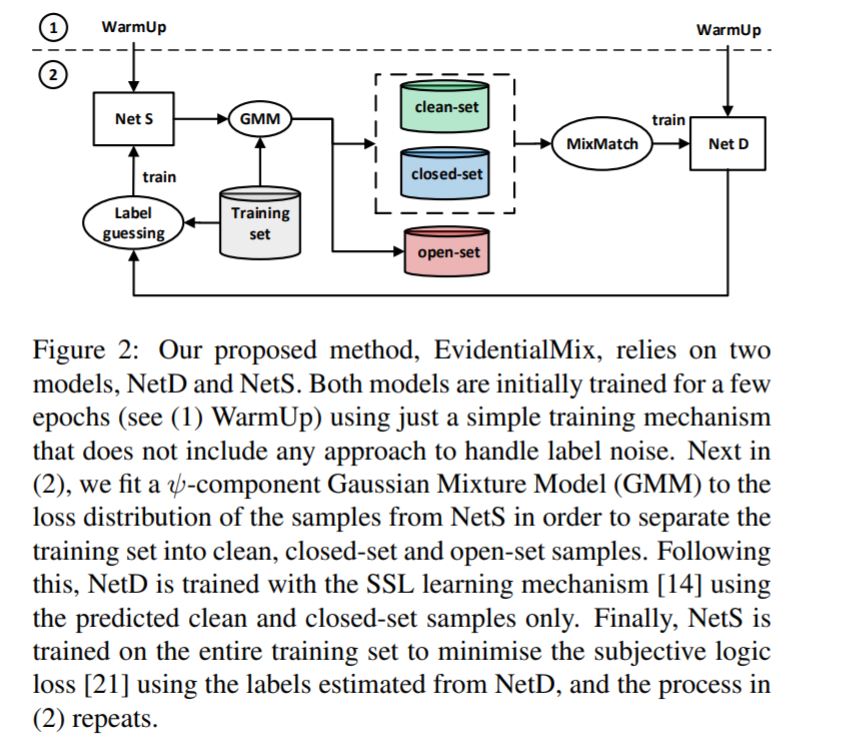
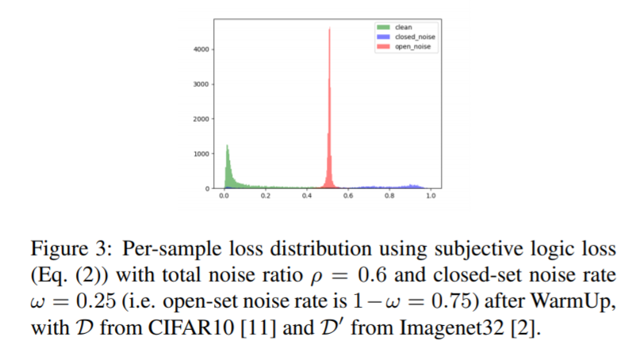
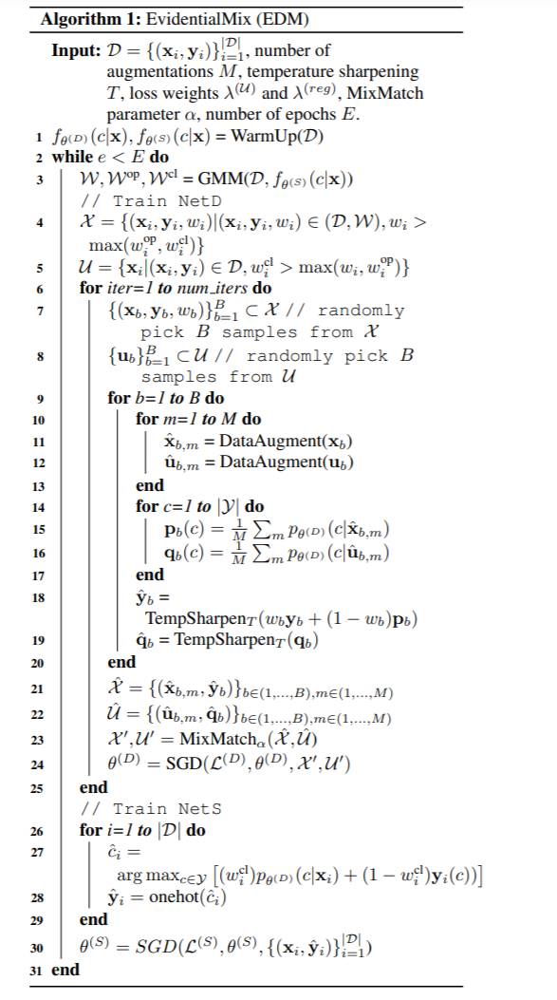

# 论文初读 - DL

<!-- TOC -->

- [论文初读 - DL](#论文初读---dl)
  - [[FROST: Faster and more Robust One-shot Semi-supervised Training 更快更健壮的One-Shot半监督训练]](#frost-faster-and-more-robust-one-shot-semi-supervised-training-更快更健壮的one-shot半监督训练)
  - [[EvidentialMix: Learning with Combined Open-set and Closed-set Noisy Labels 证据组合: 混合开集和闭集的噪声标签学习]](#evidentialmix-learning-with-combined-open-set-and-closed-set-noisy-labels-证据组合-混合开集和闭集的噪声标签学习)

<!-- /TOC -->

## [FROST: Faster and more Robust One-shot Semi-supervised Training 更快更健壮的One-Shot半监督训练]
- https://arxiv.org/abs/2011.09471
- https://github.com/helenaeliu/frost 

- combining semi-supervised learning with a onestage, single network version of self-training, our FROST methodology trains faster and is more robust to choices for the labeled samples and changes in hyper-parameters 通过将半监督学习和一站式、单一网络版本的自我训练结合起来，我们的 FROST 方法训练速度更快，对于标记样本的选择和超参数的变化更加健壮

- FROST 可以用在更现实的场景中，每个类中未标记的样本数量不平衡，未标记的数据集可能包含不属于任何训练类的样本
- 半监督学习使用少量的标记数据来定义所需的任务，并使用大量的未标记数据来避免对标记数据的过度拟合

- 贡献
  - 我们提出了一种新颖的方法论，它结合了半监督学习和单阶段自我训练的形式，我们称之为自我训练
  - 实验结果表明，该方法具有良好的性能，训练速度快，比以往的单镜头半监督训练方法更具有鲁棒性
  - 我们的实验比较了 FROST 方法在一系列数据集(CIFAR-10、 CIFAR-100、 SVHN 和 STL-10)和未标记数据不平衡或包含非训练类图像时的效果
  - 通过比较我们的基本模型与一致性正则化、对比表征学习、类平衡和类原型的许多组合，我们证明了我们的框架是多样的

- BOSS
  - BOSS 算法通过引入3种技术: 标志性的原型选择和改进、类平衡和自我训练，实现了高性能的一次性半监督学习
  - 

- 【46，37，3，45】半监督学习、无监督学习、自监督学习
- 【33】 FixMatch
- 【32】BOSS
-  contrastive rep-  resentation learning (CRL) [20 16] 

## [EvidentialMix: Learning with Combined Open-set and Closed-set Noisy Labels 证据组合: 混合开集和闭集的噪声标签学习]
- https://arxiv.org/abs/2011.05704
- https://github.com/ragavsachdeva/evidentialmix

- 备选方案通常会产生标签杂乱的数据集。该领域已经解决了这个问题，重点放在两种类型的标签噪声下的训练模型: 1)闭集噪声，其中一些训练样本被错误地注释到训练标签上，而不是它们已知的真实类别; 2)开集噪声，其中训练集包括拥有一个真实类别的样本，而这个真实类别(严格地)不包含在已知的训练标签集中

- 本文提出的基准估计是由三个变量定义的: 1)标记噪声在训练集中的总比例，以 ρ ∈[0,1]表示; 2)闭集噪声在含有噪声标记样本集中的比例，以 ω ∈[0,1]表示(这意味着整个数据集中 ρ × ω% 的样本具有闭集噪声标记，ρ × (1-ω)% 的样本具有开集噪声标记) ; 3)开集噪声标记数据的来源
- 最先进的方法(SOTA)旨在解决封闭集噪声标签问题，它关注于识别标注错误的样本，并在下一个训练迭代中使用半监督学习标记(SSL)方法更新其标签的方法。这种策略在开集问题中可能会失败，因为它假设每个训练样本的训练标签中都有一个正确的类，但事实并非如此
- 解决开集噪声问题的主要方法是在学习过程中识别带噪样本以降低其权重[24]。这种策略在封闭集问题中效率很低，因为在 SSL 阶段封闭集的噪声标签样本仍然是非常有意义的。因此，为了在同时存在闭集和开集噪声样本的情况下保持鲁棒性，学习算法必须能够识别影响每个训练样本的标签噪声类型，然后更新闭集噪声标签，或者降低开集噪声标签的权重

- 目前用于封闭集噪声标记方法的 SOTA 是 SELF [22]和 DivideMix [14]——两者都包含结合了上述几种方法的方法。SELF [22]结合了模型集成、重新标记、噪声样本识别和数据增强; 而 DivideMix [14]使用了多模型训练、噪声样本识别和数据增强[1]。这两种方法很可能容易受到开集噪声的影响，因为它们假设训练样本必须属于某个训练类——这种假设对于开集噪声是不正确的
- associating closed-set samples with high losses computed from confident but incorrect classification [14], and open-set samples with uncertain classification 
- subjective logic (SL) loss function  
- two networks: NetS, which uses the SL loss [21], and NetD, which uses the SSL training mechanism and the DivideMix (DM) loss [14]
- SL 损失估计分类不确定性的能力允许 netS 将训练集划分为洁净集、开集和闭集样本。然后使用文献[14]中概述的 DivideMix 匹配方法，将预测的清洁集样本和闭合集样本用于训练 NetD，而将预测的开放集样本丢弃。在此之后，NetD 重新标记整个训练数据集(包括预测的开集样本) ，然后用于训练 netS

