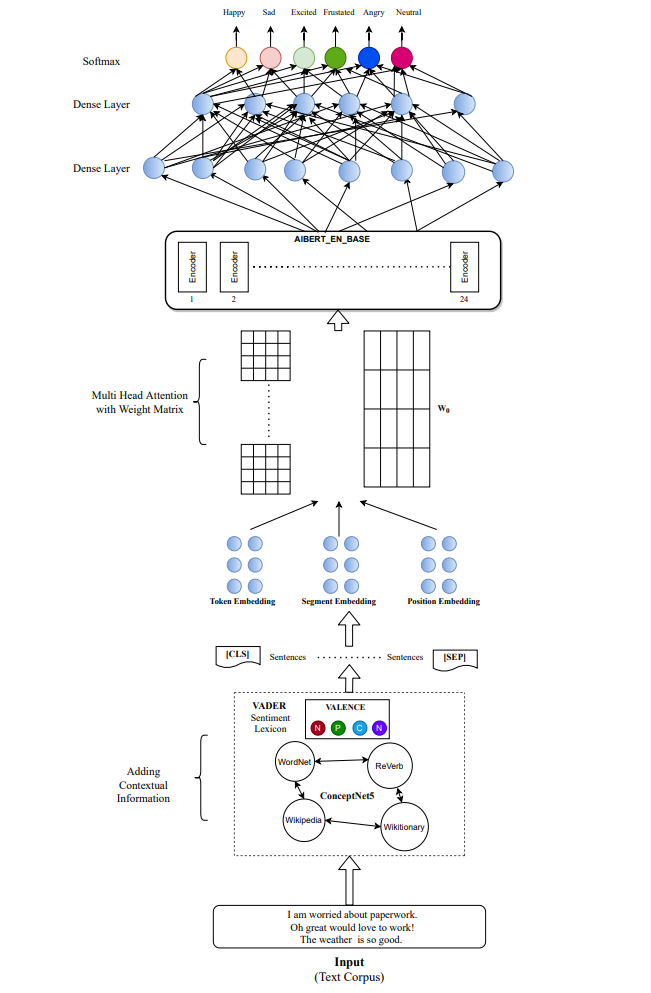
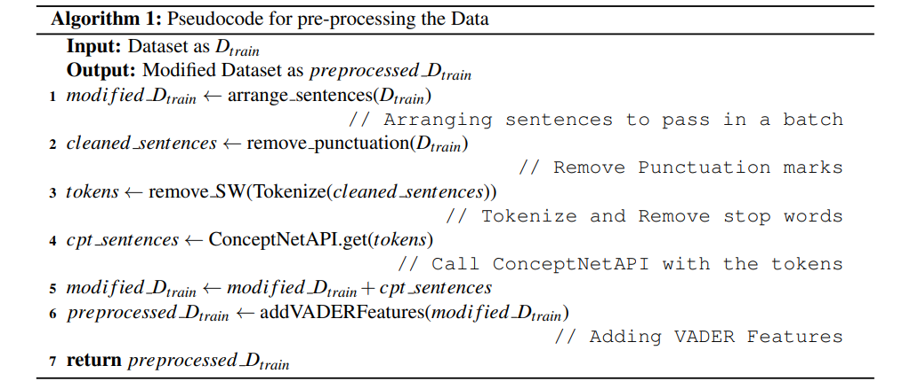
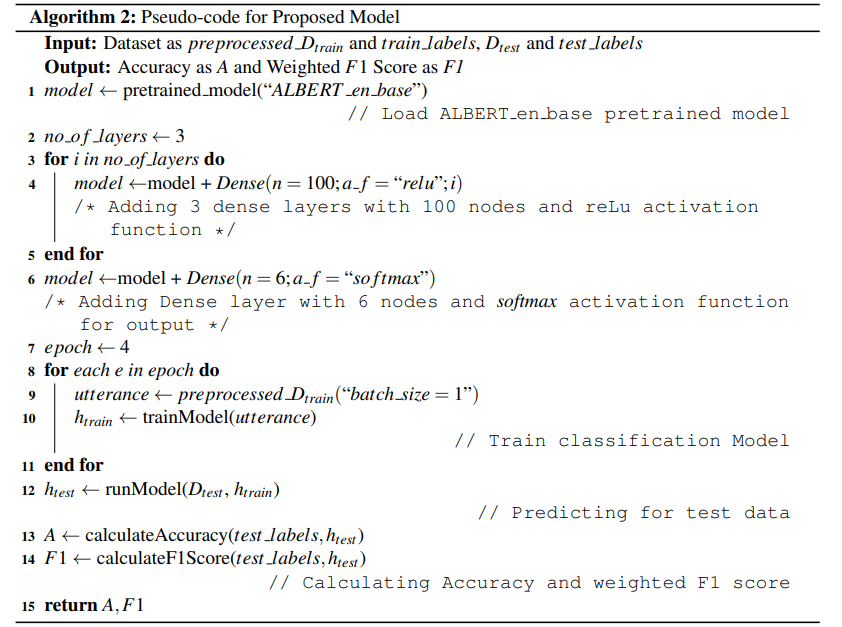

[toc]
# 论文初读

## PLM 
---
**2104.05694 On the Inductive Bias of Masked Language Modeling: From Statistical to Syntactic Dependencies 论掩蔽语言建模中的归纳偏差: 从统计到句法依赖**
- https://arxiv.org/abs/2104.05694
- https://github.com/tatsu-lab/mlm_inductive_bias
- 为什么任务不可知的词汇掩蔽能够捕获语言结构并转移到下游任务中?
  - 完形填空将一个 NLP 任务重新组合成一个提示问题和一个空白问题，并通过填空得到答案
  - 启发了最近的一些假设，即一些单词的 AMSK 是完形填空，并提供间接监督下游任务, 例如，一个情感分类任务可以被重新制定为在这部电影的完形填空 i [ MASK ]中填写 like 或 hate
- 并没有提供一个清楚的理由来解释为什么像 BERT 中使用的那些一致随机的 MASK 能够提供如此强大的收益

# 2021.04.12
## **2104.04517 AdCOFE: Advanced Contextual Feature Extraction in Conversations for emotion classification 面向情感分类的会话语境特征提取**
- https://arxiv.org/abs/2104.04517
- https://github.com/vbhat97/adcofe 
- 数据集： IEMOCAP
- 当前会话情绪识别模型面临的问题有: (a)会话中两个对话之间语境信息的丢失，(b)在每个话语中没有适当重视重要标记，以及(c)无法传递以前话语中的情绪信息
- 高级上下文特征抽取模型(AdCOFE)通过使用自然语言的知识图、情感词汇和短语在话语的各个层次(词和位置嵌入)进行特征抽取来解决这些问题
- 首先，使用 NLTK 库对数据进行预处理以删除停止词和标点符号，然后使用 ConceptNet Web API (Speer2016)和 Python GET 请求对上下文信息进行标记化以提取上下文信息。这个预处理的数据进一步通过语句片 tokenizer 和 BERT (Devlin2019)预处理器，以获得 a Lite BERT (ALBERT)(Lan2019)预训练分类模型的微调数据

通过知识图谱相关接口对语料进行扩充，并进行部分预处理与实际文本进行区分
- 处理流程

AdCOFE 通过在一批句子中传递单个说话人的话语来处理语境提取

EmoGraph 65.4
AGHMN 63.5
RGAT 65.22
AdCOFE 64.7

----
## **2104.04515 Evaluating Explanations for Reading Comprehension with Realistic Counterfactuals 用现实的反事实来评价阅读理解释**
- https://github.com/xiye17/EvalQAExpl
- https://arxiv.org/abs/2104.04515
- 这项工作的重点是如何评估解释阅读理解的能力，以揭示模型的高层次的行为。也就是说，我们想得出的结论不是说“这个词很重要”，而是“模型挑选出这两个词并进行比较”，这个陈述可以用来评估它的忠实性，帮助用户对系统得出有意义的结论

- 如果模型真的认识到这两部电影都是纪录片，那么用浪漫代替其中一部或两部纪录片应该会改变预测。为了验证这一点，我们扰乱原始示例以获得另外三个示例
- 模型的实际预测对于3个反例也是yes，错误？而由LattrAttn中可以看到其对后面两个句子中的关键词语并没有给予关注，因此会错误
- Integrated Gradient (IntGrad)
- Differentiable Mask (DiffMask)
- LAtAttr

----
## **2104.04488 Explaining Neural Network Predictions on Sentence Pairs via Learning Word-Group Masks 通过学习词组掩码解释句子对的神经网络预测**
- https://arxiv.org/abs/2104.04488
- https://github.com/UVa-NLP/GMASK
- 现有的方法大多通过识别单个特征属性或检测相邻特征之间的相互作用来对神经网络模型进行事后解释， 对于以文本对作为输入的模型(例如，复述识别) ，现有的方法不足以捕捉两个文本之间的特征交互作用，而且简单地扩展计算两个文本之间的所有词对交互作用是计算效率低下的

- 第一栏可视化预测的单词属性，其中最重要的四个词是 man，banjo，guitar，a。然而，它们之间的相关性不清楚，直观的 man 和 a 与模型预测无关，这使得解释不可信。一个好的解释应该能够捕获句子对之间的相关词，并确定它们对模型预测的重要性
- 输入的单词被分成四组，重要性 g2 > g1 > g3 > g4。紫色线条的颜色饱和度表示一个词属于一个组的概率。Gmsk 将电子琴、吉他和班卓琴分为重要组(g2/g1) ，而将人和不重要组(g3/g4) ，这与单个词的属性不同。以群体重要性的加权和计算加权词属性，识别出重要词语 electric，guitar from x1，banjo from x2，解释了模型的预测

- 单词掩码应用于输入单词嵌入，学习选择重要单词来解释模型预测。对于每个输入数据，我们通过学习一组代表单词属性的掩码值来生成一个特定的解释

----
## **2104.04473 Efficient Large-Scale Language Model Training on GPU Clusters 基于 GPU 集群的高效大规模语言模型训练**
- https://arxiv.org/abs/2104.04473
- https://github.com/nvidia/megatron-lm
- 展示了如何组合不同类型的平行性方法(张量、流水线和数据平行性)来扩展到数千个 gpu，实现了与现有系统相比我们可以有效训练的模型大小的两个数量级的增长；讨论了各种流水线并行性的实现，并提出了一种新的调度方案，与以前提出的方法相比，该调度方案可以使吞吐量提高10% 以上，并且具有可比的内存占用。我们定量地研究了张量、管道和资料平行之间的权衡，并提供了如何配置大型模型的分布式训练的直觉。这些技术的组合使我们能够在一个模型上进行训练迭代，这个模型有1万亿个参数，在3072个 gpu 上，每个 gpu 的吞吐量达到峰值的52% ，以前训练类似大小的模型的吞吐量要低得多(理论峰值的36%)

----
## Did they answer? Subjective acts and intents in conversational discourse 他们回答了吗? 会话语篇中的主观行为和意图
- https://arxiv.org/abs/2104.04470
- http://github.com/elisaF/subjective_discourse
- 检验话语的主观性: 你如何通过应用你的个人信念和偏好来解决模糊性

- 两个注释者是带有偏见的评判者，他们对扎克伯格是什么类型的玩家有着不同的判断: 第一个假设他是真诚的，第二个假设他是虚伪的。对于扎克伯格的第一反应，对话行为的解释是毫不含糊的: 两个注释者都认为他在暗示他不能回答这个问题。然而，其意图是模棱两可的，愤世嫉俗的注释者将澄清问题解释为为了拖延而撒谎与诚实。第二种反应会产生不同的对话行为和意图: 第一种法官将对话行为解释为一个有意提供直接回应的答案，而第二种法官将对话行为视为一种转变，为了回避原始的、不利的问题而回答一个不同的问题
- 数据集包含了1k 个问答对的6k 判断，53.5% 的数据有不同意见。然而，与我们先前的例子不同的是，分歧往往不能简单地归因于不同的情绪。不管注释者的情绪如何，不合作的举动有时是合理的。一个回答的解释会进一步受到它的问题的影响。对注释者解释的定性分析揭示了主观语言在不同诠释中的不同用法
- 我们的会话数据不是面向任务的，因此我们的意图与说话者的真诚度的信念更加一致。与许多其他 NLP 任务不同，对欺骗的检测甚至对人类来说都是一个挑战。大多数数据集由指示性谎言组成(参与者被要求说谎)。我们的研究包含了自然发生的欺骗，其中我们不仅包括撒谎，还包括其他更隐蔽的机制，比如故意含糊其辞或闪烁其词
- 作为我们的数据来源，我们选择美国国会听证会的问答部分(全部用英语)有几个原因: 它们包含政治和社会争议，可以被众包工作者识别，它们在回应的形式和意图方面有强烈的模糊信号，而且数据是丰富的

## 2104.04466 Knowledge-Aware Graph-Enhanced GPT-2 for Dialogue State Tracking 基于知识感知图的 GPT-2对话状态跟踪
- https://arxiv.org/abs/2104.04466
- 
- MultiWOZ 2.0 中有30个不同的域槽对，每一个都是一个系统需要从数百个可能的候选者中进行分类的任务
- 在实际场景中，电话操作员总是更容易在电话通话后收集整个会话的状态标签，而不是在会话进行时注释所有中间状态。这样的会话级最后一轮注释也可以通过操作符操作快速收集
- 如果 DST 学习只能利用最后一个回合的标签，这将导致一个稀疏的监督方案，建立一个数据集所需的样本将大大减少约10倍。例如，MultiWOZ 2.0 Eric 等人(2019)中的最后一轮样本只占原始样本的14.3% 左右
- 利用领域-槽之间的关系。有三种类型的关系是有用的: (1)两个领域槽对具有相同的候选集。例如:。(2)一个域-槽对的候选集是另一个域-槽对的子集。例如，候选集 < restaurant-name > 是 < taxi-destination > 的子集; (3)两个域槽对具有相关值。预订酒店的星级水平与预订餐厅的价格范围有关
- 贡献
  - (1)针对对话状态跟踪问题，提出了一种 GPT-2与图注意网络(GATs)的集成结构。在稀疏监督下，当训练样本明显减少时，该模型具有较强的鲁棒性
  - (2)我们演示了我们的体系结构还减轻了仅基于 GPT-2的 dst 所面临的问题，因为域槽是以从左到右的方式生成的
  - (3)阐述了我们的知识感知模型如何利用领域槽之间的关系，并进一步说明了图模块如何利用不同领域槽之间的相关性

- 首先目前 GPT-2与对话的历史，以生成特征的所有可能的领域插槽和价值在本体。然后，这些特性被输入到一个 GAT，该 GAT 捕获域槽和值之间的关系。然后，在 GAT 输出层产生的特性被合并到 GPT-2的第二个应用程序中，该程序执行对话状态值的实际预测

## 2104.04434 Larger-Context Tagging: When and Why Does It Work? 更大的上下文标签: 何时和为什么它工作？
- https://github.com/jlfu/larger-context
- https://arxiv.org/abs/2104.04434
- 我们对四种用于上下文信息收集的聚合器进行了深入的比较研究，并提出了一种基于属性的评价方法来解释大上下文训练带来的改进。在实验上，我们建立了一个基于4个标记任务和十三个数据集的测试平台。希望我们的初步观察能够加深对大背景训练的理解，并启发后续工作对背景信息的使用
- 序列标签的目的是在一个序列中为每个令牌分配一个预定义的标签。本文考虑了四种具体任务: 命名实体识别(NER)、中文分词(CWS)、词性标注(POS)和组块
- 对于序列标签，Devlin 等人(2018年)总结了两个一般框架: (i) cEnc-wEnc-CRF 由字级编码器、句级编码器和 CRF 层 Lafferty 等人(2001年)组成; (ii) ContPre-MLP 由语境化的预训练层组成，后面是 MLP 或 CRF 层。在本文中，我们将这两个框架作为我们三个研究问题的研究对象，33显然，在设置中，我们的目标不是提高性能超过最先进的模型。并将它们实例化为两个特定的模型: CNN-LSTM-CRF Ma 和 Hovy (2016)和 BERT-MLP Devlin 等人(2018)

- 1)对于大多数数据集来说，引入大背景信息会带来收益，而不管引入的方式如何

- 可解释性评价的第一步是属性定义。高层次的思想是，给定一个属性，每个标记任务的测试集将根据它被划分为若干个可解释的桶。而 f1分数(POS 的准确度)将被明智地计算。接下来，我们将解释我们在本文中定义的一般属性

- 1)标签一致性较低的测试跨度可以从大背景训练中获益更多
- 2) NER 任务在低频和高频测试时间跨度上获得了更多的增益，而 CWS 任务在低频测试时间跨度上获得了更多的增益
- 3)实体密度较低的 NER 任务的测试跨度在大背景训练的帮助下得到了较大的提高
- 4)较大语境训练可以在较短的 NER 实体上获得更多的增益，而在较长的 CWS 词汇上获得更多的增益
- 5) NER 任务和 CWS 任务在较高的 OOV 密度都可以获得更大的跨度增益

## 2104.04128 An Empirical Comparison of Instance Attribution Methods for NLP 自然语言处理实例归因方法的实证比较
- https://github.com/successar/instance_attributions_nlp
- https://arxiv.org/abs/2104.04128
- 探讨以下研究问题: (1)梯度和基于相似性的归因方法(评估更有效的近似值的质量)在排名中的相关性如何？(2)与基于梯度的方法相比，相似性方法的解释质量如何(说明采用更复杂方法的必要性) ？

