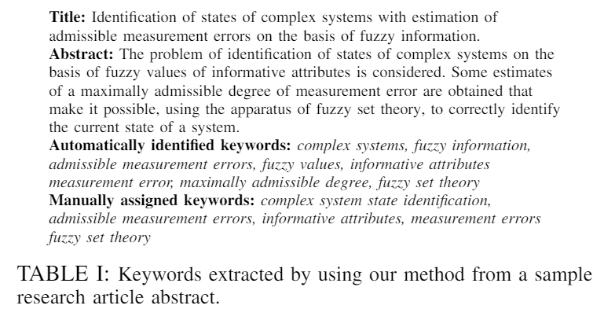
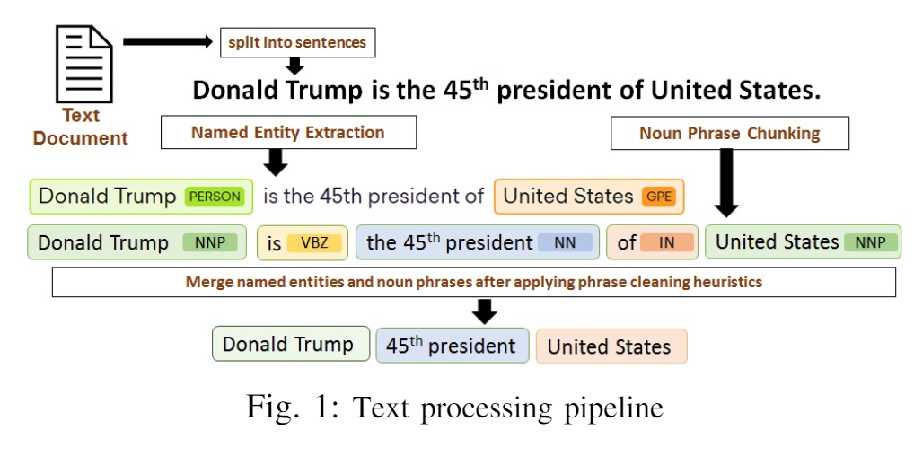

# NLP论文阅读 - 关键词和关键短语

## [1807.05962 Theme-weighted Ranking of Keywords from Text Documents using Phrase Embeddings 基于短语嵌入的文本关键词主题加权排序]
- https://arxiv.org/abs/1807.05962

- 理解 

- 文本文件中的关键字主要是使用监督和非监督的方法提取的。在本文中，我们提出了一种无监督的技术，它结合了主题加权的个性化 PageRank 算法和神经短语嵌入来提取和排序关键词。我们还介绍了一种利用现有技术处理文本文档和训练短语嵌入的有效方法。我们共享从现有数据集派生的评估数据集，该数据集用于选择基础嵌入模型。对排名关键词提取的评估是在两个基准数据集上进行的，其中包括短文摘要(Inspec)和长科学论文(seeval 2010) ，结果表明，提取的结果优于最先进的系统
- 关键词是单个或多个单词的语言单位，代表文档的显著方面。在本文中，我们使用术语关键词统一地表示单词和多词短语。关键词在许多工作中都很有用，如索引文档[1]、摘要[2]、聚类[3]、本体创建[4]、分类[5]、自动标注[6]和文本可视化[7]
- 研究团体一直在主持像 SemeEval 2010 Task 5[8]和 SemeEval 2017 Task 10[9]这样的共享任务。然而，这个任务远远没有解决，目前系统的性能比许多其他 NLP 任务差[10]。一些主要的挑战是需要处理的文件的长度不同，它们的结构不一致，以及可以在不同领域表现良好的开发策略[11]
- 关键词自动抽取方法主要分为两类: vised 方法将关键词抽取问题看作是一个二分类问题[11] ，而非监督方法大多基于 TFIDF、聚类和基于图形的排序[12]。对于特定领域的数据，有监督的方法比无监督的方法表现出更好的性能。非监督方法的假设并不适用于所有类型的文档。
- 神经表征已经被证明等于或优于其他方法(例如 LSA，SVD)[13]。词的向量表示，是为了保持词与词之间的语义和句法相似性。它们已经被证明在一些自然语言处理(NLP)任务中非常有用，比如词性标注、组块分析、命名实体识别、语义角色标注、句法分析和语音处理等等。生成单词嵌入的一些最流行的方法是 Word2 v e c [15]、 Glove [16]和 Fasttext [17]。
- 在从科学文章[18]、[19]中提取关键词的过程中，词的嵌入已经显示出可喜的结果。
- 在这项工作中，我们用领域特定的短语嵌入表示从科学论文中提取的候选关键词，并使用主题加权的 PageRank 算法[20]对它们进行排序，这样候选关键词的主题权重表示它与论文的主题表示有多么相似，这也是使用嵌入构建的。据我们所知，使用多词短语嵌入来构建给定文档的主题表示和给短语分配主题权重，并没有被用于排序关键词提取，这项工作是首次尝试这样做。
- 我们的目标不仅是提取与给定文档在统计学上相关的关键词，正如以前的研究[11]所尝试的那样，而且还要正确地确定与文档主题在语义上最相关的有意义的短语。

- 对于我们选择的前 k 关键字，如[21]中提到的
  - 可理解性——排名关键词应该能够选择语法正确和有意义的短语，这些短语应该具有人类高可读性的特点(第二部分 -- a)。例如，科技文章比单个的科技文章更容易理解
  - 相关性——最前面的 k 关键词应该是语义行 II-D
  - 良好的覆盖率——关键词应该覆盖所有的线这引起了我们的兴趣，看看本文中提出的训练短语嵌入的路径，而不是首先训练嵌入模型的 unigram 单词，然后结合它们的稠密向量表示，以获得多词短语的类似表示。

- 本文的主要贡献
  - 高效处理训练神经元片段嵌入的文本
  - 使用短语排列的 didate 关键字对文本文件进行专题表示  Thematic representation of text documents using phraseline didate keywords
  - 主题加权的个性化 PageRank 算法适用于文本文档

- Text Processing
  - 文献[15]表明，多词短语与非标准词混合使用可以提高嵌入模型的性能和计算精度
  - 依赖于 Spacy 提供的已经训练过的依赖句法分析和命名实体提取模型
  - 我们把文本文件分成复杂的系统，模糊信息，句子，把一个句子标记为 unigram 标记，以及最大可容许度，模糊集合论识别名词短语和命名实体。在这个复杂的系统状态识别过程中，如果一个命名实体在句子中的某个偏移位置被检测到，那么用我们的方法从样本中提取的同一偏移位置上出现的名词短语就不会被考虑
  - 清理获得的单个单词和多个单词标记
    - 完全数字的名词短语和命名实体
    - 属于以下类别的命名实体被过滤掉: d a t e，TIME，PERCENT，MONE y，QUANTIT y，o RDINAL，CARDINAL。参考 Spacy 的命名实体文档2了解标签的详细信息
    - 标准的stopword词被删除
    - 标点符号被删除，除了“-”。我们还采取措施清理多词名词短语和命名实体的前导标记和结尾标记
    - 如果常见的形容词和转述动词作为名词短语/命名实体的第一个或最后一个标记出现，则将其删除
    - 从名词短语/命名实体的第一个标记中删除限定词
    - 名词短语/名词实体的第一个或最后一个标记属于下列词类: INTJ 叹词，AUX 助动词，CCONJ 并列连词，ADP 介词，DET 叹词，NUM 数词，p a RT 助词，PRON 代词，SCONJ 从属连词，PUNCT 标点，SYM 符号，x Other，被删除。关于这些 POS 标签的详细参考，请参阅 Spacy 的文档3
    - 名词短语/命名实体的起始和结束标记如果属于标准的英语中止词列表，则会被删除
    - 名词短语/命名实体的起始和结束标记如果属于英语功能词的标准列表，将被删除。除了依赖 Spacy 的解析器之外，我们还使用手工编写的正则表达式来清理在上述数据清理步骤之后获得的令牌的最终列表。正则表达式是从 Textacy 4中获得的，它是一个建立在 Spacy 之上的文本挖掘库
    - 去掉主要/尾随的垃圾字符
    - 处理悬挂/向后的括号。如果没有另一个括号，我们不允许“(或)”出现
    - 处理奇怪的分隔连字符的单词
    - 处理奇怪地分开的单词
    - 使空格标准化
  - 由此产生的 unigram 标记和多词词组按照它们在原句中出现的顺序进行合并。图1显示了文本处理管道如何处理一个示例句子的示例，以准备作为嵌入算法输入的训练样本

- 嵌入式模型选择
  - 我们将在前面的工作[22]的基础上进行构建，并使用流行的技术培训我们的嵌入。为了实现我们的框架，需要一个短语嵌入模型，它可以用来构建短语、句子和文本内容的语义感知表示，这些表示形成了计算相似度的基础
  - 从现有的数据集5中创建了三个数据集，最初是为了评估捕获文档相似性的文档表示而开发的
    - 1)评估数据集: 第一个数据集由106个三联体组成，这是在原始数据集中提供的手动管理的三联体的子集。它由三个短语组成，用于计算短语相似度，其中第一个短语在语义上更接近第二个短语，而不是第三个短语。例如，深度学习比计算机网络更接近机器学习，或者九月比六月更接近十月。第二个数据集由6247个三联体组成，这也是在原始数据集中自动生成的三联体的子集。三连词是维基百科文章的标题，也用于评估短语相似度。第一个短语应该更接近第二个短语而不是第三个短语，因为第一和第二个短语是维基百科中属于同一类别的文章的标题，而第三个短语是维基百科中属于不同类别的文章的标题。与原始数据集使用维基百科文章的全部内容映射到这些三联体来评估文档的相似性相反，我们只使用标题短语。
      - http://cs.stanford.edu/ quocle/triplets-data.tar.gz
    - 第三个数据集由6,353个三元组组成，这些三元组来自于前两个数据集和自动从维基百科收集的原始文章。三连体是用来评价短语-句子和句子-句子相似性的短语-句子组合。我们将前两个数据集中的三个数据组合在一起，并使用爬虫收集所有映射到它们的 Wikipedia 文章。三联体的每一部分都由一个短语组合而成，这个短语是维基百科文章的标题，而文章的第一句话提到了这个短语。第一个短语被认为在语义上更类似于与之相关的句子，而不是与第二或第三个短语相关的句子。例如，深度学习更接近于“深度学习(也称为深度学习、深度学习或深度机器学习)是一类机器学习算法: 使用多层次的非线性处理单元进行特征提取和转换” ，而不是“计算机网络或数据网络是允许节点共享资源的电信网络” ，这是一句话。此外，第一句话更接近于机器学习是计算机科学的一个分支领域，根据 Arthur Samuel 在1959年的说法，机器学习赋予计算机学习的能力，而不是第三句话。此外，我们自动收集了17,326篇维基百科文章的完整内容，这些文章映射到原始数据集中提供的三联体标题上，我们用这些标题来训练不同配置的短语嵌入模型，这些模型进一步用于执行相似性评估任务

