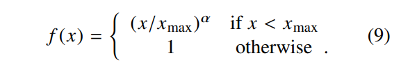
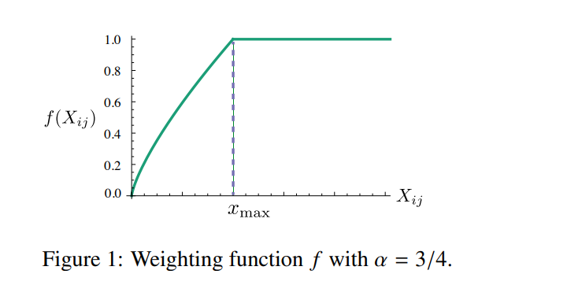
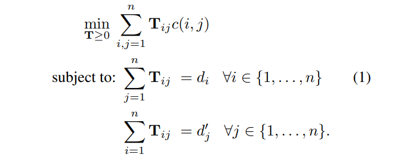
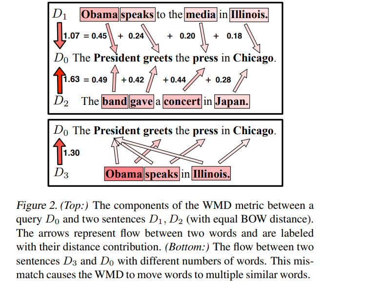

# 表征学习

[toc]

## 词向量
### [2013 Efficient Estimation of Word Representations in Vector Space](resources/notes/d0001/w2v_2013_efficient_estimation_of_word_representations_in_vector_space.md)
- https://arxiv.org/pdf/1301.3781.pdf

引入CBOW和skip-gram的词向量预训练方法，以及词类比等词语相似度评估方法

### [2013 Distributed Representations of Words and Phrases and their Compositionality](resources/notes/d0001/w2v_2013_distributed_representations_of_words_and_phrases_and_their_compositionality.md)
- http://papers.nips.cc/paper/5021-distributed-representations-of-words-and-phrases-and-their-compositionality.pdf
- 通过对frequent words进行二次抽样获得加速，同时还学习了更多的regular word representations(常规单词表示)。
- 提出了一个分层softmax的简单替代方案，称为negative sampling(负采样）

- 提出了一种在文本中查找短语的简单方法，并表明学习数百万个短语的良好向量表示是可能的

### [201411 Word2vec Parameter Learning Explained]()
- https://arxiv.org/pdf/1411.2738.pdf

### [2014 Glove: Global Vectors for Word Representation](resources/notes/d0001/w2v_2014_Glove__Global_Vectors_for_Word_Representation.md)
- http://xueshu.baidu.com/usercenter/paper/show?paperid=abc5bb7df2d1d2b21b7949717ca48012&site=xueshu_se
$$J = \sum_{i,j=1}^V f(X_{ij})(w_i^T\hat w_j + b_i + \hat b_k - log(X_{ij}))^2$$

## 句向量
###  [2014 Doc2Vec Distributed Representations of Sentences and Documents](resources/notes/d0001/d2v_2014_distributed_representations_of_sentences_and_documents.md)
- https://arxiv.org/abs/1405.4053

Distributed Memory Model of Paragraph Vectors (PV-DM)

Distributed Bag of Words version of Paragraph Vector (PV-DBOW)

### [2015 From Word Embeddings To Document Distances](resources/notes/d0001/d2v_2015_From_Word_Embeddings_To_Document_Distances.md)
- http://proceedings.mlr.press/v37/kusnerb15.pdf
- Transportation problem: 
- Visualization

### [2015 Skip-Thought Vectors](https://arxiv.org/pdf/1506.06726) 
- https://arxiv.org/pdf/1506.06726.pdf

### [2016 An Empirical Evaluation of doc2vec with Practical Insights into Document Embedding Generation Jey Han Lau, Timothy Baldwin](resources/notes/d0001/d2v_2016_an_empirical_evaluation_of_doc2vec_with_practical_insights_into_document_embedding_generation_jey_han_lau_timothy_baldwin.md)
- https://arxiv.org/abs/1607.05368

### [2017 Sent2vec Pagliardini et al Unsupervised Learning of Sentence Embeddings using  Compositional n-Gram Features]()
- https://arxiv.org/abs/1703.02507
- 采用词向量的CBOW的方式进行训练，源除了词语外添加n-gram，窗口变为整个句子。预测的时候直接对句子进行词语以及n-gram分解，取词向量求平均
- 在很多任务上优于其他非监督学习模型，次于skip-thought，而在句子相似性上优于skip-thought。

Doc2Vec (Lau and Baldwin, 2016) or Sent2vec (Pagliardini et al., 2018)
