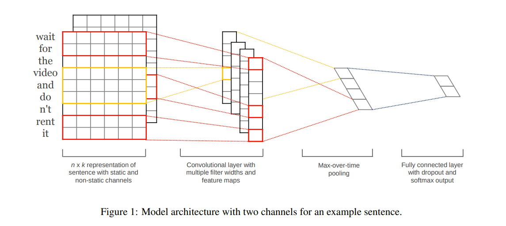
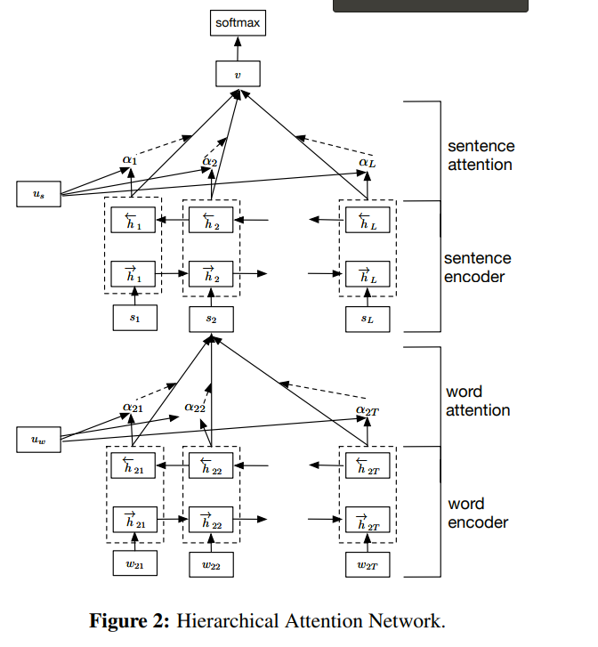
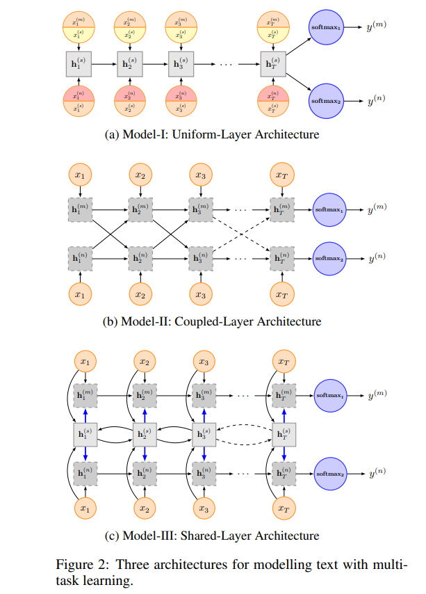
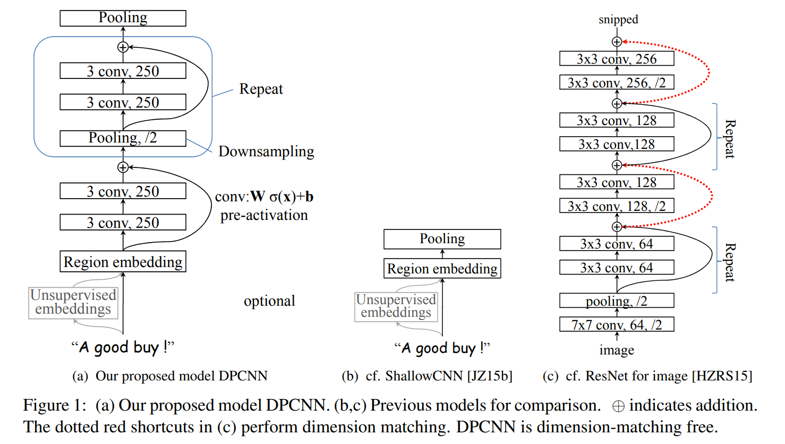

# 文本分类

[toc]

### 通用
##### [2018 A NEW METHOD OF REGION EMBEDDING FOR TEXT CLASSIFICATION](../resources/notes/d0001/classification_2018_REGION_EMBEDDING_FOR_TEXT_CLASSIFICATION.md)
- http://research.baidu.com/Public/uploads/5acc1e230d179.pdf

#####  [2014 Convolutional Neural Networks for Sentence Classification](../resources/notes/d0001/Classification_2014_TextCNN__Convolutional_Neural_Networks_for_Sentence_Classification.md)

- https://arxiv.org/pdf/1408.5882.pdf
使用w2v预训练词向量以及双通道（另外一个通道可fine tuning）可以提高分类性能 

##### [201412 Effective Use of Word Order for Text Categorization with Convolutional Neural Networks](../resources/notes/d0001/classification_201412_Effective_Use_of_Word_Order_for_Text_Categorization_with_Convolutional_Neural_Networks.md)
- 直接利用高维的one-hot向量进行CNN特征变换，相当于输入为txt序列，其特征通道为词库大小
- 两种对n-gram编码的方法
    - seq-cnn: 采用序列表示方式，因此序列p则维度为 p|V|
    - bow-cnn: 采用BOW的表示方式，因此序列长p的维度为 |V|
- 问题：
    - 稀疏问题，n-gram的稀疏问题
    - CNN本来就是对n-gram编码的，何必需要人工进行筛选

##### 

- http://www.aclweb.org/anthology/D14-1181
- 

##### Very Deep Convolutional Networks for Natural Language Processing
- https://blog.csdn.net/u014475479/article/details/82017535

##### Convolutional Neural Networks for Text Categorization: Shallow Word-level vs. Deep Charact

##### [2016 Hierarchical Attention Networks for Document Classification](../resources/notes/d0001/classification_2016_hierarchical_attention_networks_for_document_classification.md)
- https://www.cs.cmu.edu/~hovy/papers/16HLT-hierarchical-attention-networks.pdf
- 
基于双向GRU, 双层注意力机制来进行文本分类

##### [2016 Recurrent Neural Network for Text Classification with Multi-Task Learning](../resources/notes/d0001/classification_2016_Recurrent_Neural_Network_for_Text_Classification_with_MultiTask_Learning.md)
LSTM中进行多任务学习的几种方式

##### [201607 Bag of Tricks for Efficient Text Classification](../resources/notes/d0001/classification_201607_bag_of_tricks_for_efficient_text_classification.md)

##### [2017ACL Deep Pyramid Convolutional Neural Networks for Text Categorization](../resources/notes/d0001/classification_2017_Deep_Pyramid_Convolutional_Neural_Networks_for_Text_Categorization.md)

URL: https://ai.tencent.com/ailab/media/publications/ACL3-Brady.pdf
特点：Region Embedding，固定CNN特征数目，POOLING特征减半，RESNET直连

##### [2013 Recursive Regularization for Large-scale Classification with Hierarchical and Graphical Dependencies](../resources/notes/d0001/classification_2013_Recursive_Regularization_for_Large_scale_Classification_with_Hierarchical_and_Graphical_Dependencies.md)
- http://www.cs.cmu.edu/~sgopal1/papers/KDD13.pdf

##### [2018 Large-Scale Hierarchical Text Classification with Recursively Regularized Deep Graph-CNN](../resources/notes/d0001/classification_2018_Large_Scale_Hierarchical_Text_Classification_with_Recursively_Regularized_Deep_Graph_CNN.md)
- http://www.cse.ust.hk/~yqsong/papers/2018-WWW-Text-GraphCNN.pdf

