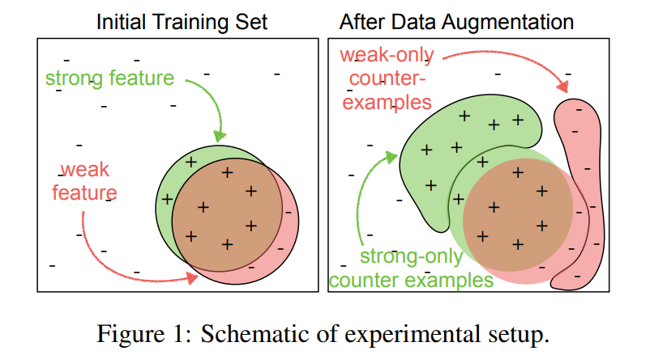
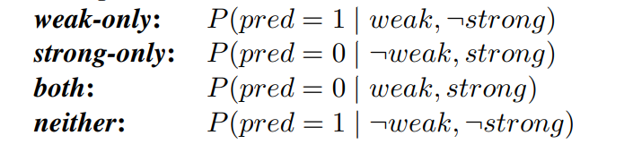

## Data Augmentation
[toc]

#### [202004 When does data augmentation help generalization in NLP?](../resources/notes/d0001/DataAugNLP_202004_When_does_data_augmentation_help_generalization.md)
- https://arxiv.org/pdf/2004.15012v1.pdf

 

 - 添加weak-only的反例可以导致weak-only的错误得到改善，但是对strong-only的错误的影响却很小
- 添加strong-only反例会同时影响两种错误
  - 对weak-only错误的影响仅限于强特征易于检测的数据集
  - 当强特征是不易察觉，加上strong-only的反例也导致模型检测强特征并将其正确与正标签相关联，但不必然导致模型放弃在预测阳性标签时使用弱特征

#### [2019 EDA: Easy Data Augmentation Techniques for Boosting Performance on Text Classification ](../resources/notes/d0001/DataAugNLP_201901_EDA__Easy_Data_Augmentation_Techniques_for_Boosting_Performance_onText_Classification_Tasks.md)
- https://arxiv.org/abs/1901.11196
    - 随机删除一个词
    - 随机选择一个词，用它的同义词替换
    - 随机选择两个词，然后交换它们的位置
    - 随机选择一个词，然后随机选择一个它的近义词，然后随机插入句子的任意位置

)

理解：
- 通过四种操作改变以前的向量表示，引入了噪声，避免了过拟合
- 通过引入同义词，引入了新词汇，一定程度上解决了验证时模型碰到训练时所没有碰到的词语的情况
- 操作并没有改变语义，但是改变了分类前的句子表示，因此在一定程度上扩充了数据

#### []
- IBM 提出基于语言模型的数据增强新方法 https://blog.csdn.net/jdbc/article/details/103105633

#### [BPE-Dropout: Simple and Effective Subword Regularization]