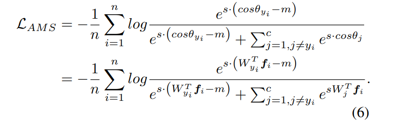
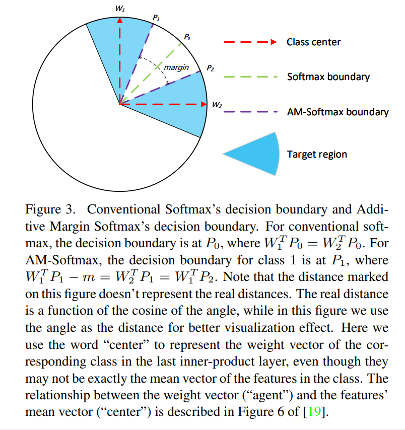

# DeepLearning
[toc]

### 正则化
##### [2016 Layer normalization]
- Jimmy Lei Ba, Jamie Ryan Kiros, and Geoffrey E Hinton. 2016. . arXiv preprint
- arXiv:1607.06450.

### 损失函数
##### [AMSoftmax: Additive Margin Softmax for Face Verification](../resources/notes/d0001/loss_201801_AMSoftmax.md)
https://arxiv.org/abs/1801.05599

