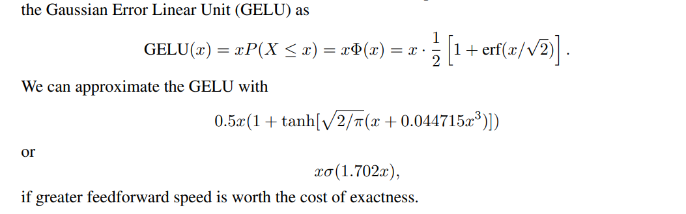

# DeepLearning
[toc]

### 激活函数
##### [1606.08415 Gaussian Error Linear Units (GELUs) 高斯误差线性单位(GELUs)](../resources/notes/d0001/dl_gelu.md)

### 正则化
##### [2016 Layer normalization]()
- Jimmy Lei Ba, Jamie Ryan Kiros, and Geoffrey E Hinton. 2016. . arXiv preprint
- arXiv:1607.06450.

### 损失函数
##### [201801 AMSoftmax: Additive Margin Softmax for Face Verification](../resources/notes/d0001/loss_201801_AMSoftmax.md)
https://arxiv.org/abs/1801.05599

##### [201708 Focal Loss for Dense Object Detection](../resources/notes/d0001/loss_201708_Focal_Loss.md)
https://arxiv.org/pdf/1708.02002.pdf

