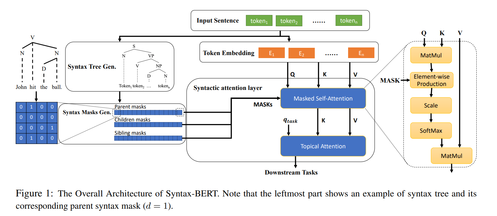
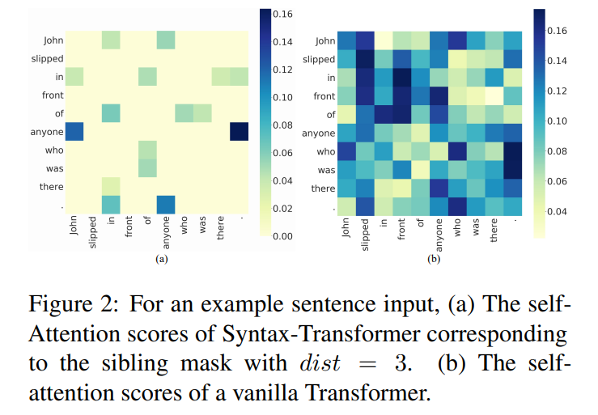
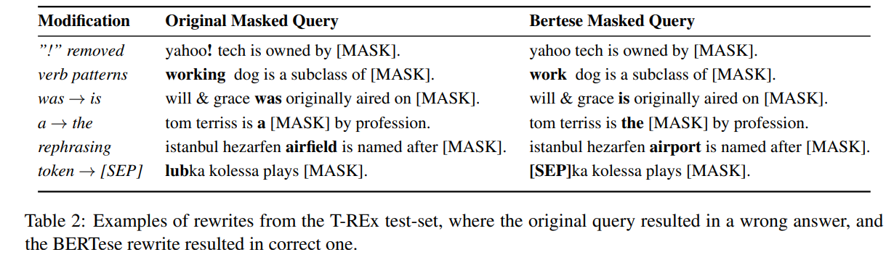
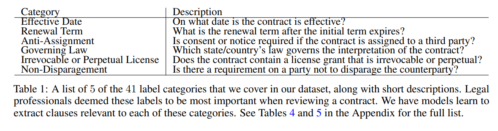

<!-- TOC -->

- [2103.04350 Syntax-BERT: Improving Pre-trained Transformers with Syntax Trees](#210304350-syntax-bert-improving-pre-trained-transformers-with-syntax-trees)
- [2103.05327 BERTese: Learning to Speak to BERT](#210305327-bertese-learning-to-speak-to-bert)
- [2103.05908 DeepCPCFG: Deep Learning and Context Free Grammars for End-to-End Information Extraction](#210305908-deepcpcfg-deep-learning-and-context-free-grammars-for-end-to-end-information-extraction)
- [2103.06268 CUAD: An Expert-Annotated NLP Dataset for Legal Contract Review](#210306268-cuad-an-expert-annotated-nlp-dataset-for-legal-contract-review)
- [1912.09156 CJRC: A Reliable Human-Annotated Benchmark DataSet for Chinese Judicial Reading Comprehension](#191209156-cjrc-a-reliable-human-annotated-benchmark-dataset-for-chinese-judicial-reading-comprehension)
- [2103.07098 A Weakly Supervised Approach for Classifying Stance in Twitter Replies](#210307098-a-weakly-supervised-approach-for-classifying-stance-in-twitter-replies)
- [2006.05987 Revisiting Few-sample BERT Fine-tuning](#200605987-revisiting-few-sample-bert-fine-tuning)
- [2009.10229 An Empirical Study on Neural Keyphrase Generation](#200910229-an-empirical-study-on-neural-keyphrase-generation)

<!-- /TOC -->
# 2103.04350 Syntax-BERT: Improving Pre-trained Transformers with Syntax Trees
- 即插即用模式工作
- 将语法树有效和高效地纳入到预先训练
- https://github.com/nkh2235/syntaxbert.git

---
- 设计目的是把语法和句法知识作为前置的自我注意层和支持细粒度的适应不同的下游任务。具体来说，它基于稀疏掩码生成一组子网络，反映语法树中标记的不同关系和距离。直观地看，子网络中的标记通常在语义上相互关联，从而产生一种局部表示。因此，我们可以采用一个局部注意层来聚合来自不同子网络的面向任务的表示
- 首先，通过语法分析器将输入句子转换为相应的树结构;。其次，我们根据语法树中包含的不同特征提取一组与语法相关的掩码。接下来，句子被嵌入类似于标准的 BERT (令牌 + 位置 + 字段嵌入) ，作为自注意层的输入。句法 bert 中的每个自我注意层由两种注意模块组成，即屏蔽自我注意和局部注意。在掩码自注意模块中，我们对全连接拓扑应用语法掩码，生成相互共享参数的局部子网络。此外，通过专题注意模块对来自不同子网络的表征进行聚合，从而将任务相关知识提取为最终的表征向量
- 设计了3个类别的掩码，反映了树结构的不同方面，即父掩码、子掩码和兄弟掩码
- 距离 d 

  - i th head and j th sub-network
  - 相当于将父亲、孩子、兄弟等节点重新计算一下attnetion，而实际节点出来的值对上述3个部分的值进行了加强

# 2103.05327 BERTese: Learning to Speak to BERT
- https://github.com/adihaviv/bertese
- 大量研究开发提取知识的方法
  - 最直接的方法是使用手工制作的查询(如“ Dante was born in [ MASK ]”)来显示模型，并检查模型是否预测“ Florence”处于[ MASK ]的位置。但是，当这种方法失败时，就很难确定 LM 中是否缺少知识，或者模型是否未能理解查询本身。例如，如果查询是“ Dante 出生在[ MASK ]的城市”，模型可能会返回正确的答案
- 我们是否能够自动找到最好的方式来“询问”一个 LM 的知识？我们将这一挑战称为“ BERTese”
- 模型包含一个基于 bert 的重写器，它接受一个查询作为输入，并为每个输入位置输出一个新的令牌，这就是它的重写。这个新的查询被输入一个不同的 BERT 预测器，从中提取答案。重要的是，下游预测器 BERT 是一个固定的预训练模型，因此目标是训练重写器生成预测器输出正确答案的查询
- 在 LAMA 数据集 petroni2019 languagema 上对我们的方法进行了评估，结果表明我们的模型显著提高了知识提取的准确性。此外，许多重写对应于查询语句中的一致变化(例如，变化的时态) ，因此提供了关于变化类型的信息，这些信息对于从 BERT 中提取知识非常有用

---

- 目标是构建一个模型，将自然语言中的查询作为输入，并将其重写到一个查询中，该查询将作为输入提供给现有的 BERT 模型
- 模型涉及两个技术挑战。首先，最近邻操作是不可微的。其次，为了获得[ MASK ]令牌的预测，我们需要保证重写器生成[ MASK ]令牌，并且知道它的位置(因为这是应该预测基本真实值的位置)。我们通过增加两个辅助损耗函数来克服这些缺点。前者鼓励模型输出类似于 BERT 嵌入的向量(从而减少最近邻操作中的损失) ，后者鼓励模型输出一个掩码标记

---

# 2103.05908 DeepCPCFG: Deep Learning and Context Free Grammars for End-to-End Information Extraction

- 将深度学习和条件概率上下文无关语法(CPCFG)相结合，创建了一个从复杂文档中提取结构化信息的端到端系统
- 解析发票

- 语法树

---

---

# 2103.06268 CUAD: An Expert-Annotated NLP Dataset for Legal Contract Review
- github.com/TheAtticusProject/cuad/
- 合同评审是一项非常有价值的专门任务，它耗费人类大量的时间、金钱和注意力
- 数据集包括500多份合同和13,000多份跨越41个标签类别的专家注释。对于41个不同的标签中的每一个，模型必须学会突出显示合同中对该标签最显著的部分
- Labels
  - 41个标签类别
    - 一般信息。这包括诸如政党名称、文件名称、日期、管辖法律、许可证授权和续约条款等术语
    - “限制性契约。”这些条款被认为是最麻烦的条款，因为它们限制了买方或公司经营业务的能力
    - “收入风险。”其中包括可能要求合同一方当事人承担额外费用或采取补救措施的条款
  - 对于每个标签类别，我们确定每个合同中与该标签类别最相关的每个条款。然后，我们让模型通过输出标识与标签类别相关的文本跨度的开始和结束标记，从契约中提取相关的条款。直观地说，模型学会突出显示律师应该关注的文本部分
  - 对于每个标签类别和每个合同，我们还包括可以从提取的条款中确定的附加合同注释。例如，对于”无上限责任”这一类别，我们对”一方当事人的责任是否因违反合同义务而无上限”这一问题的回答包括”是”或”否”对于每个合同，可以从提取的条款(如果有的话)回答这个标签。为了保持一致性和简单性，本文中不关注这些补充注释。相反，我们将重点放在评估这项任务中更具挑战性和更耗时的部分，即提取相关条款。然而，我们还发布了这些附加的注释，它们可以进一步帮助在实践中将模型应用于合同评审
  - 合同的大部分内容不应突出显示。平均而言，带标签的条款约占每份合同的10% 。由于有41个标签类别，这意味着平均每个标签只有0.25% 的合同被突出显示

---
- CUAD 上使用 HuggingFace Transformers 库(Wolf et al. ，2020)完善了一些预先训练好的语言模型。因为我们的预测任务的结构类似于提取性的问题回答任务
- 每个”问题”标明所考虑的标签类别，以及该标签类别的简短说明(一句或两句话) ，并询问上下文的哪些部分与该标签类别相关。为了解决文档长度过长的问题，我们在每个契约上使用一个滑动窗口

# 1912.09156 CJRC: A Reliable Human-Annotated Benchmark DataSet for Chinese Judicial Reading Comprehension

- 提出了一个中国司法阅读理解的数据集，其中包含了大约10K 的文件和近50K 的问答。这些文件来自判决文件，问题由法律专家加以说明。数据集可以帮助研究人员通过阅读理解数据库技术提取元素。要素提取是法律领域的一项重要任务。然而，由于文档类型和操作原因的多样性，很难完全预定义元素类型。相比之下，机器/阅读理解技术可以通过回答长文档中的各种问题来快速提取元素。我们基于 BERT 和 BiDAF 建立了两个强基线模型。实验结果表明，与人工注释器相比，有足够的改进空间
- 主要从判决文件中抽取事实描述，并请法律专家根据事实对四至五个问答对进行注释。最终，我们的数据集包含了大约5万个带有答案的问题。由于有些问题不能从事实描述中直接回答，我们请法律专家注释一些无法回答的问题和是/否问题

# 2103.07098 A Weakly Supervised Approach for Classifying Stance in Twitter Replies
- https://arxiv.org/abs/2103.07098

# 2006.05987 Revisiting Few-sample BERT Fine-tuning

# 2009.10229 An Empirical Study on Neural Keyphrase Generation
- 通过提供大量的实验结果和分析影响关键词生成模型性能的最关键因素来填补这个空白。我们希望这项研究可以帮助澄清围绕关键词生成任务的一些不确定性，并促进该课题的进一步研究

---
- 键词生成本质上是一个自然语言生成(NLG)任务。在现有的文献中，它被特别地定义为一个序列到序列(Seq2Seq)问题
- 回答四个主要问题: 1。使用 One2One 和 One2Seq 的优缺点是什么？图2。不同的解码策略如何影响关键词生成？图3。训练 One2Seq 时，目标关键词的顺序重要吗？图4。更大的模型有用吗？那么更多的培训数据呢？
- One2One 一次只使用一个短语，并将其与源文本 t 配对，从而形成 n 个数据点(t，pi) i = 1: n。在训练期间，模型学习从 t 到 p i 的一对多映射，也就是说，同一个源字符串通常有多个对应的目标字符串
- One2Seq 系统将所有地面真实关键词组 pi 连接成一个字符串
  - 根据短语在源文本中出现的次数对它们进行排序，并在结尾附加缺少的关键短语 ，这种排序被称为 Pres-Abs
- 解码策略关键词生成任务不同于其他 NLG 任务，如摘要和翻译，因为它需要一组多词短语(而不是单个序列)作为模型预测
  - 通常的做法是利用波束搜索(reddy1977年语音)并从所有波束中获取预测
  - 推理过程中预测词组数量的增加，使推理过程中预测词组数量增加。在这项工作中，默认情况下，我们使用 One2One 模式的波束宽度为200，而 One2Seq 模式的波束宽度为50

