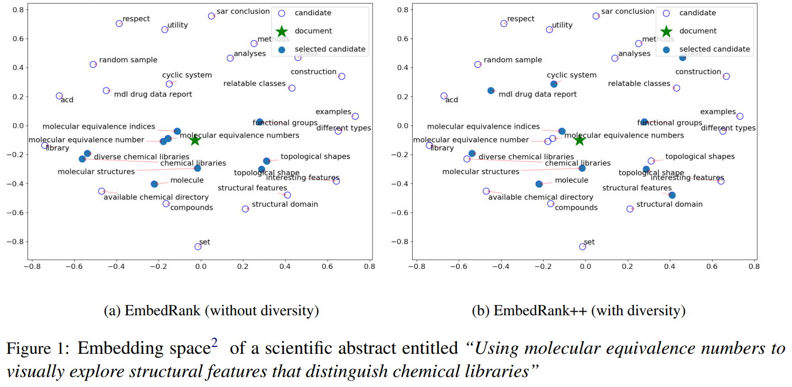
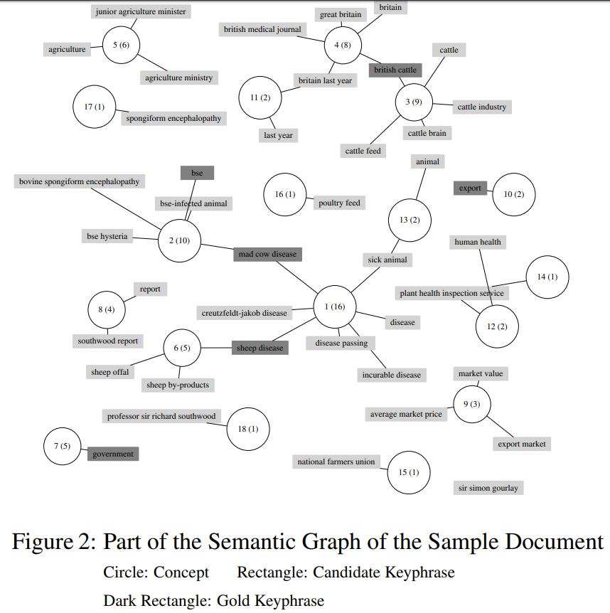
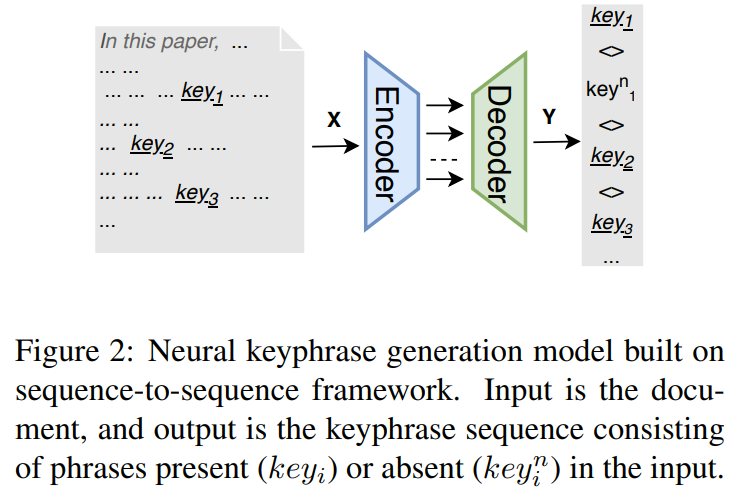
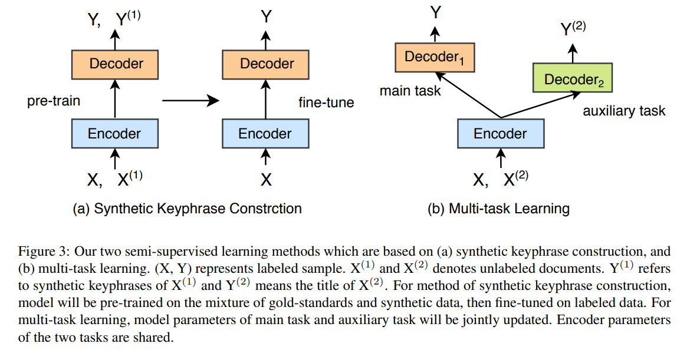

# Keyphrase Extraction

[toc]

## Review
#### [201905 A review of keyphrase extraction](../resources/notes/d0001/keyphrase_2019_A_Review_of_Keyphrase_Extraction.md)

#### [2019 Keyphrase Generation: A Multi-Aspect Survey]
- https://arxiv.org/abs/1910.05059

## Unsupervised
#### [2018 ACL EmbedRank++ Simple Unsupervised Keyphrase Extraction using Sentence Embeddings](../resources/notes/d0001/keyphrase_2018_simple_unsupervisd_keyphrase_embedding.md)    

使用sent2vec将正文以及被选短语进行编码，然后采用MMR依次对被选短语进行筛选

#### [2018 Yu, Y. and Ng, V. (2018) Wikirank: Improving keyphrase extraction based on background knowledge](../resources/notes/d0001/keyphrase_2018_WikiRank_Improving_Keyphrase_Extraction_Based_on_Background_Knowledge.md)
Yu, Y. and Ng, V. (2018) 
In Proceedings of the 11th edition of the Language Resources and Evaluation Conference, LREC 2018, 7-12 May 2018, Miyazaki (Japan), 3723–3727. URL:
http://www.lrec-conf.org/proceedings/lrec2018/pdf/871.pdf

将文章中基于主题的概念（实体）找出来，然后通过计算关键词组与概念的连接来选择关键词组以达到覆盖最重要的概念以及最多的概念

#### [2018 Ye, H. and Wang, L. (2018) Semi-supervised learning for neural keyphrase generation](../resources/notes/d0001/keyphrase_2018_SemiSupervisedLearningforNeuralKeyphraseGeneration.md)
URL: https://arxiv.org/abs/1808.06773v2

## Supervised
#### [2019 Alzaidy, R., Caragea, C. and Giles, C. L Bi-lstm-crf sequence labeling for keyphrase extraction from scholarly documents]()
- In The World Wide Web Conference, WWW 2019, San Francisco, CA, USA, May 13-17, 2019, 2551–2557. 
- URL: https://doi.org/10.1145/3308558.3313642.

Rui Meng, Sanqiang Zhao, Shuguang Han, Daqing
He, Peter Brusilovsky, and Yu Chi. 2017. Deep
keyphrase generation. In Proceedings of the 55th
Annual Meeting of the Association for Computational Linguistics, ACL 2017, Vancouver, Canada,
July 30 - August 4, Volume 1: Long Papers, pages
582–592.

#### [2018 Exploiting Topic-based Adversarial Neural Network for Cross-domain Keyphrase Extraction]()
- http://staff.ustc.edu.cn/~tongxu/Papers/Yanan_ICDM18.pdf

#### 【Topical PageRank】

#### [Event-Oriented Keyphrase Extraction Based on Bi-clustering Model]

#### [A dataset for open event extraction in English]

