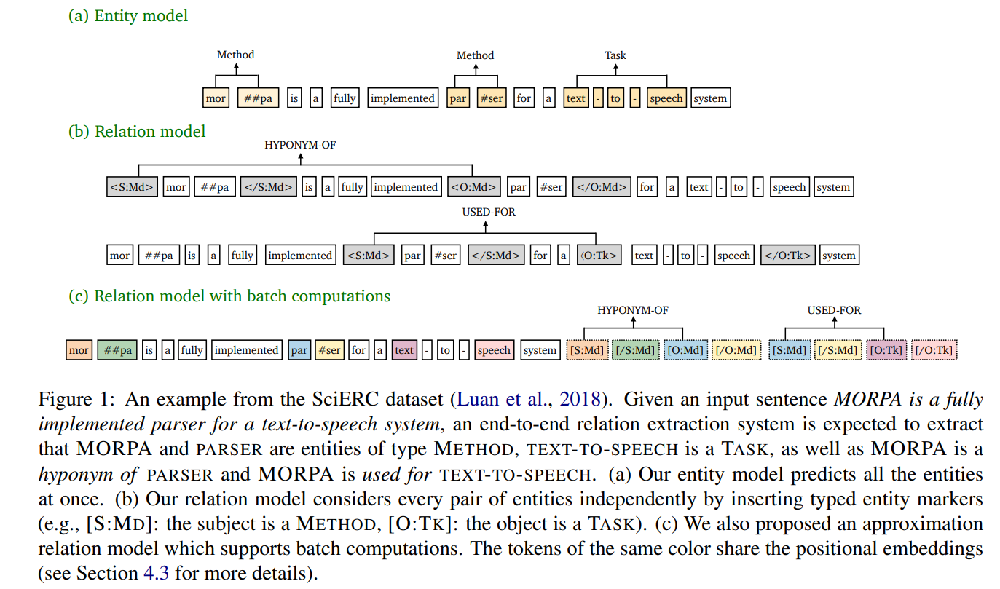

# 知识图谱

[toc]

### Entity Linking
##### [2010 TAGME: on-the-fly annotation of short text fragments (by Wikipedia entities)](../resources/notes/d0001/kgel_2010_TAGME__on_the_fly_annotation_of_short_text_fragments_by_Wikipedia_entities.md)
https://arxiv.org/pdf/1006.3498.pdf

### Relation Extraction

##### [2102.01373 An Improved Baseline for Sentence-level Relation Extraction 一种改进的句级关系抽取基线](../resources/notes/d0001/kgre_2102.01373.md)
- https://arxiv.org/abs/2102.01373
- 基线模型：chendanqi的pipeLine
  - 使用类型标记化 “@* subj-ner * subj@... # ∧ obj-ner ∧ obj #”
  - 基于可信度的分类
  

##### [2102.01156 Improving Distantly-Supervised Relation Extraction through BERT-based Label & Instance Embeddings 基于 bert 标记和实例嵌入的远监督关系抽取](../resources/notes/d0001/kgre_2102.01156.md)
##### [2010.12812 A Frustratingly Easy Approach for Entity and Relation Extraction 一种简单得令人沮丧的实体和关系抽取方法](../resources/notes/d0001/kgre_2020_2010.12812.md)
- https://arxiv.org/abs/2010.12812v2
- 

##### [202004 Review and Outlook for Relation Extraction](../resources/notes/d0001/kgre_2020_Review_and_Outlook_for_Relation_Extraction.md)
https://arxiv.org/abs/2004.03186

### Event Extraction
基于特征的方法
  2006_ACL_The Stages of Event Extraction
  2008_ACL_Refining Event Extractionthrough Cross-document Inference
  2010_ACL_Using Document Level Cross-Event Inference to IMprove Event Extraction
  2011_ACL_Using Cross-Entity Inference to Improve Event Extraction
  2013_ACL_Joint Event Extraction via Structured Prediction with Global Features
  2016_AAAI_A Probabilistic Soft Logic Based Approach to Exploiting Latent and Global Information in Event Classification

  基于表示的神经网络方法
  2015_ACL_Event Detection and Domain Adaptation with Convolutional Neural Networks
  2015_ACL_Event Extraction via Dynamic Multi-Pooling Convolutional Neural Networks
  2016_ACL_A Language-Independent Neural Network for Event Detection
  2016_ACL_Leveraging FrameNet to Improve Automatic Event Detection
  2016_EMNLP_Modeling Skip-Grams for Event Detection with Convolutional Neural Networks
  2016_NAACL_Joint Event Extraction via Recurrent Neural Networks
  2016_CCL_Event Extraction via Bidirectional Long Short-Term Memory Tensor Neural Networks
  2017_ACL_Automatically Labeled Data Generation for Large Scale Event Extraction
  2017_ACL_Exploiting Argument Information  to Improve Event Detection via Supervised Attention Mechanisms
  2017_CCL_Improving Event Detection via Information Sharing among Related Event Types

  
  2018_AAAI_Event Detection via Gated Multilingual Attention Mechanism
  2018_AAAI_Graph Convolutional Networks with Argument-Aware Pooling for Event Detection
  2018_AAAI_Jointly Extracting Event Triggers and Arguments by Dependency-Bridge RNN and Tensor-Based Argument Interaction
  2018_ACL_Self-regualation: Employing a Generative Adversarial Network to Improve Event Detection
  2018_ACL_Document Embedding Enhanced Event Detection with Hierarchical and Supervised Attention
  2018_ACL_Zero-Shot Transfer Learning for Event Extraction
  2018_EMNLP_Jointly Multiple Events Extraction via Attention-based Graph Information Aggregation
  2018_EMNLP_Collective Event Detection via Hierarchical and Bias Tagging Networks with Gated Multi-level Attention Mechanisms
  2018_EMNLP_Exploiting Contextual Information via Dynamic Memory Network for Event Detection

基于符号特征的方法:2005    The stages of event extraction [入门必看]2008    Refining Event Extraction Through Cross-document Inference2010    Using Document Level Cross-Event Inference to Improve Event Extraction2011    Using cross-entity inference to improve event extraction2013    Joint Event Extraction via Structured Prediction with Global Features2016    A Probabilistic Soft Logic Based Approach to Exploiting Latent and Global Information in Event Classification基于表示学习的方法:2015   Event Extraction via Dynamic Multi-Pooling Convolutional Neural Networks2016   Leveraging FrameNet to Improve Automatic Event Detection2016     Modeling Skip-Grams for Event Detection with Convolutional Neural Networks2016   Joint Event Extraction via Recurrent Neural Networks2017   Exploiting Argument Information to Improve Event Detection via Supervised Attention Mechanisms2017   Automatically Labeled Data Generation for Large Scale Event Extraction

Joint Extraction of Events and Entities within a Document Context

##### [An event-extraction approach for business analysis from online Chinese news]()

##### [Information extraction method of financial events based on lexical-semantic pattern]

---
### TODO

- 面向搜索引擎的实体推荐综述
  - http://cjc.ict.ac.cn/online/onlinepaper/42-7-2-201974192218.pdf