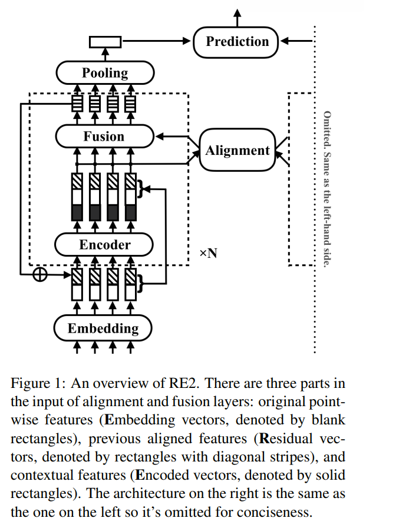
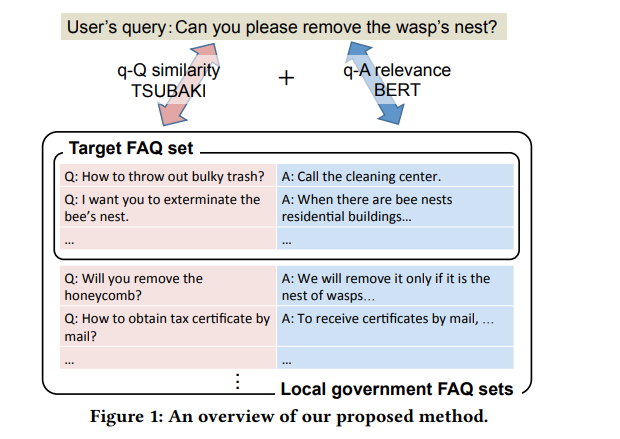
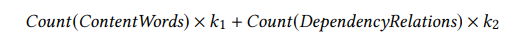
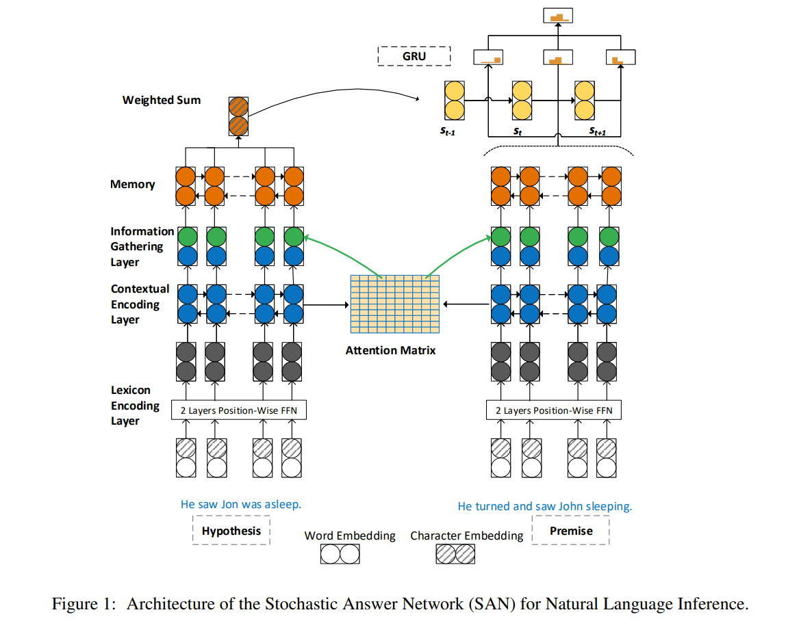
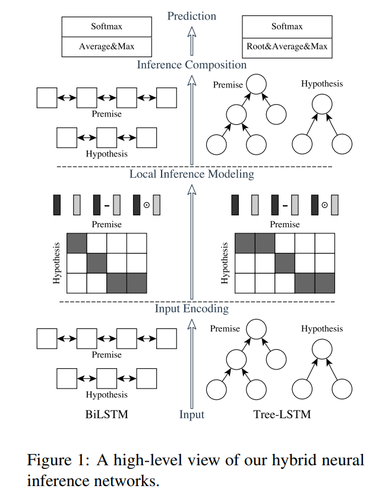
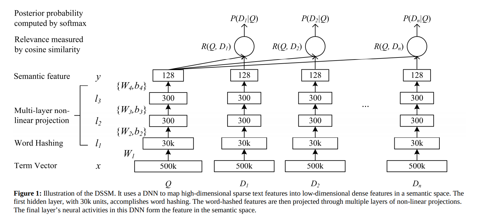

## 文本匹配
[toc]

#### [201908 ACL RE2: Simple and Effective Text Matching with Richer Alignment Features](../resources/notes/d0001/match201908_ACL_RE2__Simple_and_Effective_Text_Matching_with_Richer_Alignment_Features.md)
- https://arxiv.org/abs/1908.00300

---
#### [201905 FAQ Retrieval using Query-Question Similarity and BERT-Based Query-Answer Relevance](../resources/notes/d0001/match_201905_ACL_FAQ_Retrieval_using_Query_Question_Similarity_and_BERT_Based_Query_Answer_Relevance.md)
- https://arxiv.org/pdf/1905.02851v1.pdf

- 由于模型中使用了QA相关性匹配，因此如果Qq从词法上相差太大，也能进行匹配
- 取10个BERT返回的最大相关性的答案
- 对于TSUBAKI score
  - 如果大于α，则直接按照该分数排序
  - 否则则采用合并分数排序 tsubaki + bert
  - 由于TSUBAKI利于长文本，因此需要对长度进行惩罚，除以
  
  k1 = 4, k2 = 2,  α = 0.3

---
#### [201804 SAN - Stochastic Answer Networks for Natural Language Inference](../resources/notes/d0001/match_201804_Stochastic_Answer_Networks_for_Natural_Language_Inference.md)
- https://arxiv.org/pdf/1804.07888.pdf

---
#### [201609 ESIM Enhanced LSTM for Natural Language Inference](../resources/notes/d0001/match_2016_Enhanced_LSTM_for_Natural_Language_Inference.md)
- https://arxiv.org/abs/1609.06038

- input encoding:
  - 使用BiLSTM对输入序列（前提和假设）进行编码，也可以使用Tree LSTM
- local inference modeling
  - 使用注意力机制来软对齐前提与假设之间的词语
  - 基于相似性矩阵计算注意力并基于注意力计算每个词语的软对齐词语
  - 进一步的增强，计算差值以及点积
- inference composition
  - 使用BiLSTM层来对上层的输入分别进行信息的组合
  - 为了控制复杂性，可以使用一个单层RELU的前馈神经网络对输入进行降维
  - 使用平均与最大pooling将变长的序列输入变成固定长度向
  - 分类器进行分类

---
#### [2013 DSSM Learning Deep Structured Semantic Models for Web Search using Clickthrough Data](../resources/notes/d0001/match_2013_Learning_Deep_Structured_Semantic_Models_for_Web_Search_using_Clickthrough_Data.md)
- http://xueshu.baidu.com/usercenter/paper/show?paperid=2568ab8f33304dae23b50a8b17052124&site=xueshu_se

- 词HASH   good -》#good#-》#go, goo, ood, od#
- DNN训练模型向量
- 余弦相似度计算query与文档的相关性

--- 
### TODO
#### [201702 Bilateral Multi-Perspective Matching for Natural Language Sentences](../resources/notes/d0001/match_201702_Bilateral_Multi_Perspective_Matching_for_Natural_Language_Sentences.md)
- https://arxiv.org/abs/1702.03814

#### [201606 A Decomposable Attention Model for Natural Language Inference](../resources/notes/d0001/match_201606_A_Decomposable_Attention_Model_for_Natural_Language_Inference.md)
- https://arxiv.org/abs/1606.01933v2

#### [201503 Convolutional Neural Network Architectures for Matching Natural Language Sentences]()
- https://arxiv.org/abs/1503.03244

