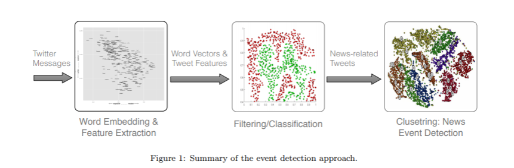
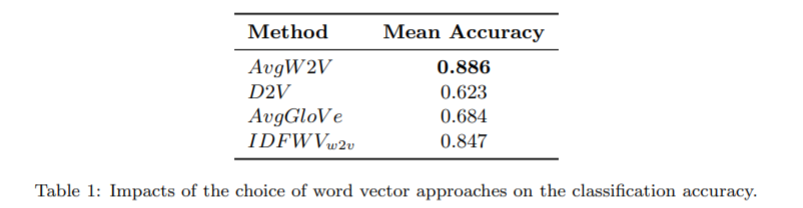
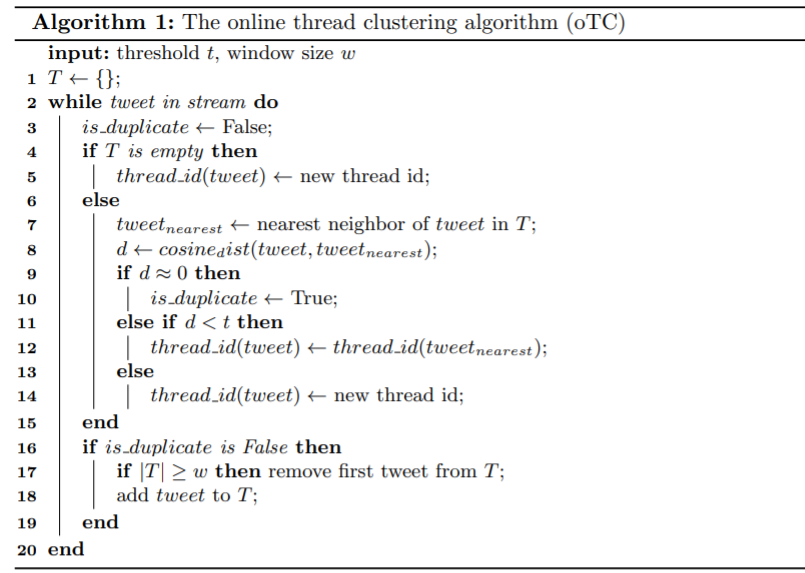
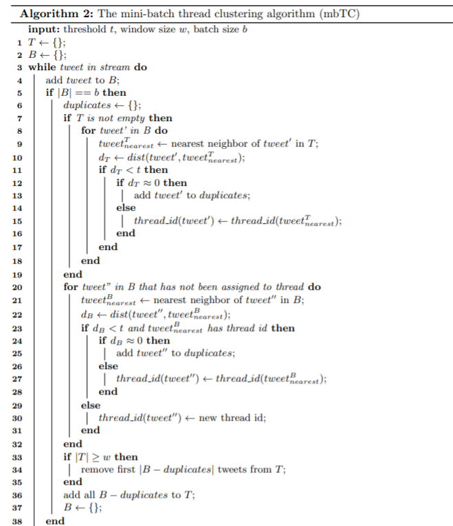

# NLP - 事件

## 热点事件分析
## [2010.00665 Event Detection in Twitter by Weighting Tweet's Features 基于 Tweet 特性的事件检测]
- https://arxiv.org/abs/2010.00665

- 

### [1901 网络热门事件的影响因素及发展态势的预测模型]
-https://www.ixueshu.com/document/b6a0a2e89f6b932266353bfe9511c821318947a18e7f9386.html

- [目的/意义]旨在对网络热门事件走向进行定性判断.[方法/过程]搜集大量历史数据和文献资料,分析影响网络热门事件在网上传播的主要影响因素,分析了中国蓝皮书上2013—2016年的80个热点舆情事件的数据,建立了能预测网络热门事件舆情传播的Logistics回归模型,并检验模型的正确性.[结果/结论]该模型预测的结果与实际情况的匹配度达到了70%,能为政府监管网络热门事件的决策提供参考依据

- 指标选取
  - 传播扩散
    - 地理范围：华东、华北等
  - 发布主体
    - 主体身份：当事人、知情人、围观者
    - 影响力：意见领袖、普通网名
  - 内容要素
    - 主题内容：公公管理、社会矛盾、公共安全、企业舆情、史治反腐、体育娱乐、公众人物、涉外涉军、其他
    - 主题内容倾向：正面、反面态度、中立态度
  - 舆情受众
    - 态度倾向：支持、反对、中立
      - 网络舆情监测指标体系构建研究
      - 敏感要素抽取，信息结构、立场概念库
    - 年龄分布
  - 事件持续时间与民众关注度

- 区网络热门事件发展方向
  - 淡化式、萌芽式、重塑式、溯源式、强力式
  - 分类
    - 可以鼓励宣传的良性事件
    - 无需管理的中性事件
    - 需要监管的恶性事件

- 算法：逻辑回归预测

## [1806.07573 Extracting News Events from Microblogs 从微博中提取新闻事件]
- https://arxiv.org/abs/1806.07573

- 提出了一种从 Twitter 流中实时检测新闻事件的新方法。我们把方法分为三个步骤。第一步是使用神经网络或者深度学习来检测信息流中与新闻相关的 tweets。第二步是将一种新的流数据聚类算法应用于被检测到的新闻推，形成新闻事件。第三步也是最后一步是根据事件群的大小和 tweet 频率的增长速度对检测到的事件进行排名

- 问题
  - 传统的文本挖掘技术通常不适用于 tweets，因为它们最初是为较长的文本设计的，这些文本本身语义丰富，通常遵循严格的语法规则
  - 主要目标是开发能够实时从 Twitter 流中检测新闻事件的方法
    - 一些内容非新闻事件
    - 一些事件要么太小，要么太局部，要么太特定于某个领域，以至于对任何新闻通讯社服务都不会有兴趣。有些事件也可能只在短时间内有价值。因此，至关重要的是要有一个系统，能够识别和分离的新闻事件，从洪水般的垃圾邮件和每天的事件报告在 Twitter 上及时

- 事件定义
  - 事件是在特定的时间和地点发生的重大事件
    - 并不一定意味着提到一个事件的 tweets 会明确地提到时间和地点
  - 如果可以在媒体上讨论的话，则事情是很重要的。例如，你可以阅读一篇新闻文章或者看一篇关于它的新闻报道

- News tweet and News event
  - 新闻推特是指一个特定的新闻事件，或者以任何其他方式与定义2.1中描述的事件直接相关的推特。另一方面，新闻事件是一组新闻推文，由于时间和语义上的相似性，它们自然地相互关联

- 用向量表示文本
  - tf-idf
  - Word Embedding Models
    - Word2vec
    - Paragraph2Vec
  - 

- 方法
  - 特征提取
    - (1)平均 Word 向量(AvgW2V)、(2)段落向量(D2V：能够捕捉文本中词语的顺序，因此能够携带更多的语义信息)、(3)平均 GloVe (AvgGloVe)和(4) idf 加权 Word 向量(IDFWVw 2v)
    - 从表中可以看出，平均字矢量(AvgW2V)是最好的矢量表示方法
  - 分类步骤
    - 还使用其他特征进行了研究，以优化分类步骤。这些信息包括提取出来的信息，比如推文中的关注者数量和标签数量。然而，我们的研究表明，这些特征并没有有助于提高分类性能
    - 以监督的方式训练多层神经网络分类器，将输入 tweets 标记为“事件”和“非事件”
  - EVENT CLUSTERING
    - Online Thread-Clustering
      - 
    - Mini-Batch Thread-Clustering
      - 
  - 认为在一个事件中至少85% 的推文必须由独立用户发布。为了减少垃圾邮件和缺少信息的事件的数量(通常是“我投票给 < 某人 > ”或者“生日快乐 < 名人 > ”) ，我们遵循了 Petrović 等人的建议[2010a ]并且移除了熵低于某个阈值的事件，设计为5

