# NLP - 语言生成

<!-- TOC -->

- [NLP - 语言生成](#nlp---语言生成)
  - [[2010.02650 If Beam Search is the Answer , What was the Question? 如果束搜索是答案，那么问题是什么？]](#201002650-if-beam-search-is-the-answer--what-was-the-question-如果束搜索是答案那么问题是什么)

<!-- /TOC -->

## [2010.02650 If Beam Search is the Answer , What was the Question? 如果束搜索是答案，那么问题是什么？]
- https://arxiv.org/abs/2010.02650
- [ ] [https:// github.com/rycolab/uid-decoding ]

- 理解
  - 完全使用 P(y|x)往往取不到最优的解，会倾向于统计规律
  - 因此使用正则化，可以将Greey，Beam Search看成一种正则化方式
  - 结合P(y|x)和正则化方法可以达到更优效果

- MAP 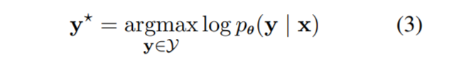
  - generated texts are often short and defaults to highfrequency words
  - 优化鼓励长度 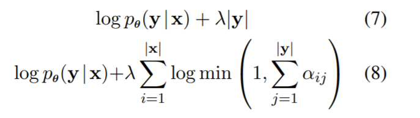
- Beam Search   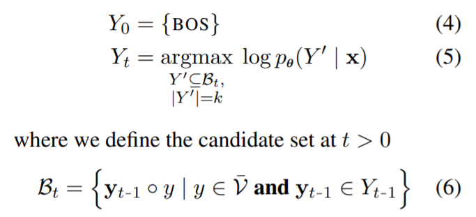
- regularized decoding framework 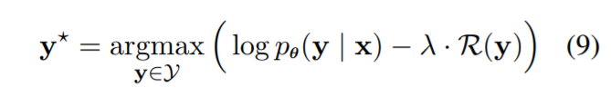  
  -  greedy decoding  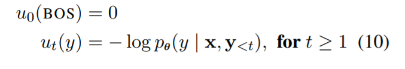 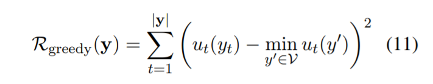 Greedy Search 相当与lambda为无穷大，也即是第一部分不起作用
  -  beam search 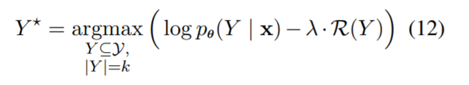  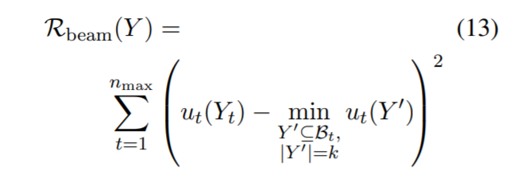 实际中Beam Search 相当与lambda为无穷大，也即是第一部分不起作用

- 对神经语言生成器的精确最大后验(MAP)解码常常导致低质量的结果(Stahlberg 和 Byrne，2019),大多数语言生成任务的最先进的结果都是通过beam search搜索获得的，尽管其极高的搜索错误率。
- 统一信息密度假说(UID; Levy and Jaeger，2007) 假说认为，在语法的约束下，人们更喜欢在语言信号(例如一个句子)之间平均分配信息(从信息论的意义上讲)的句子。换句话说，人类产生的文本，不管是什么语言，往往有均匀分布的惊奇，在信息论中正式定义为负对数概率。这种联系表明光束搜索可以解释为精确解码，但是有一个 uid 促进规则化，鼓励在生成的文本中均匀分布的惊喜。这种洞察力自然导致了几个新的常规人员的发展，这些常规人员也同样执行 UID 属性
- 首先观察到惊喜的标准差ーー UID 的操作主义ーー和 BLEU 之间的密切关系，这表明高质量的文本确实展示了 UID 的特性。此外，我们发现，即使使用精确搜索，我们的常规目标导致性能类似波束搜索标准 NMT 基准。
- 文本生成的解码目标是在所有候选假设中找到最可能假设，即我们的目标是解决以下最佳化问题: $$y=\argmax p(y|x,y)$$
- 为文本生成模型的标准(MAP)译码目标引入了一个正则化目标，使得这个正则化目标的精确解等价于由波束求得的解
- Beam Search 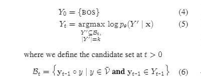

- 当 MAP 目标(方程)。(3)用于神经文本生成器的解码，结果往往不令人满意。在其他问题中，生成的文本通常很短，默认为高频词(Cho et al. ，2014; Vinyals and Le，2015; Shen et al. ，2016)。为了缓解这些问题，人们采用了长度和覆盖范围归一化(Jean et al. ，2015; Tu et al. ，2016; Murray and Chiang，2018)等方法，这些方法通过加法术语或乘法因子来增强 MAP 目标。例如，长度5和覆盖范围正常化这两种形式在解码过程中分别使用以下修改后的 MAP 目标，以产生更高质量的输出: 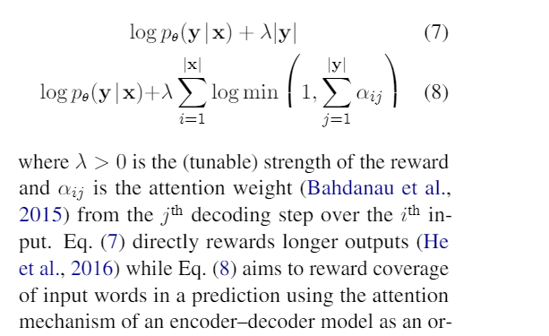

- 衍生波束搜索
  - 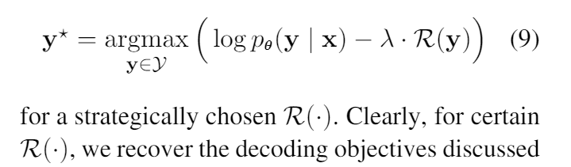
  - 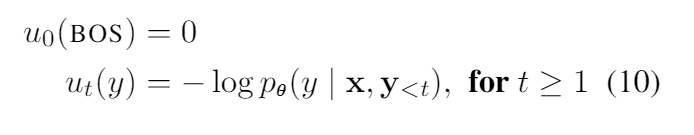
  - Greedy: 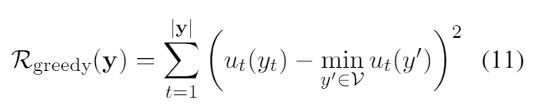
  - 定理3.1证明了贪婪搜索是正则化者的极限情形，正则化者寻求鼓励决策在局部具有高概率。相比之下，最佳 MAP 解决方案通常不具有此属性。这是因为一个全局最优 MAP 译码器可能需要局部次优决策，以便能够在后期做出补偿决策，从而导致全局最优
  - 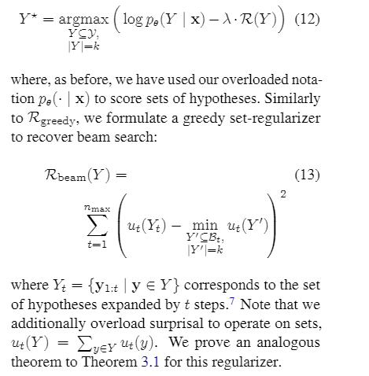
  - 用波束搜索法计算了 logpθ (y | x)-λr (y)的 argmax，其波束尺寸为 k = | y | = λ →∞
  - 我们希望返回单个候选句子作为输出，而不是由 Eq 生成的整个集合

- 从束搜索到 UID
  - 假设4.1。”在语法规定的范围内，信息使用者喜欢在信号上均匀分布信息的语言(信息密度)。如果说话者可以选择几种变体来编码他们的信息，他们更喜欢信息密度更一致的变体。
    - How big is [NP the familyi [RC (that) you cook  for −i]]?   
    - 这个句子不需要相对论符号(由 RC 表示) ; 如果没有它，它在句法上也是正确的。然而，许多人会同意，相对主义使文本质量更好
  - 重要的是，UID 假设建议的偏好是在语法和信息内容保持不变的可能话语(即输出)之间。在测量或优化生成的文本的信息密度时，任何违反这些假设的行为都会产生混淆因素
  - 信息密度调节器与 log p θ (y | x)结合起来: log p θ (y | x)这个术语奖励语法性和内容相关性，而信息密度调节器则鼓励 UID 假设所提出的人类偏好, λ 允许偏好设置为 caliThe 参数，以便在下游评估指标上表现良好，如 BLEU 和 ROUGE。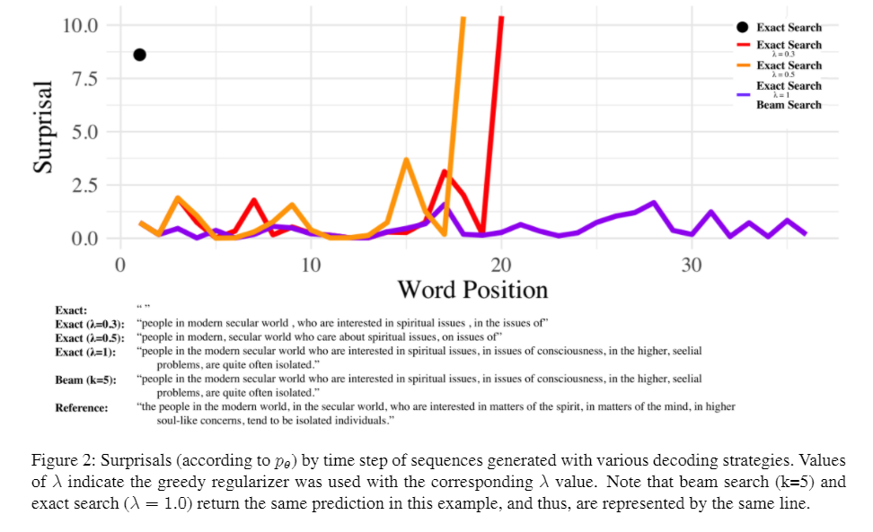
  - 许多成功的抽样方法(nucleus sampling (Holtzman 等人，2020)和 topsampling (Fan 等人，2018)使用与上面相同的逻辑在生成的文本中强制执行 UID k 属性。通过缩小可选令牌集，这两种方法在任意给定的解码步骤中都消除了许多高惊喜选项

- 广义 UID 解码
  - 比较
    - Variance Regularizer 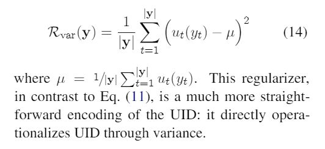
    - local  consistency regularizer  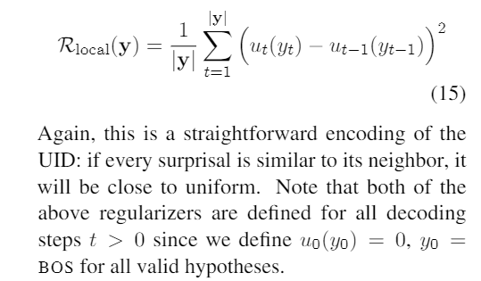 如果每个惊喜都与它的邻居相似
    - Max Regularizer  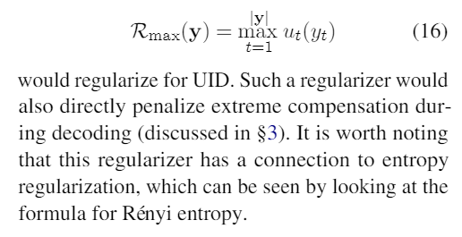
    - Squared Regularizer  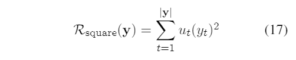

- result
  - 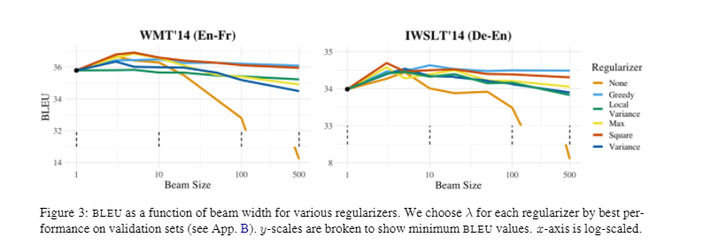
  - 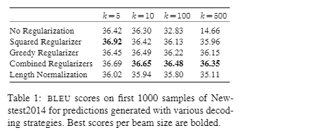