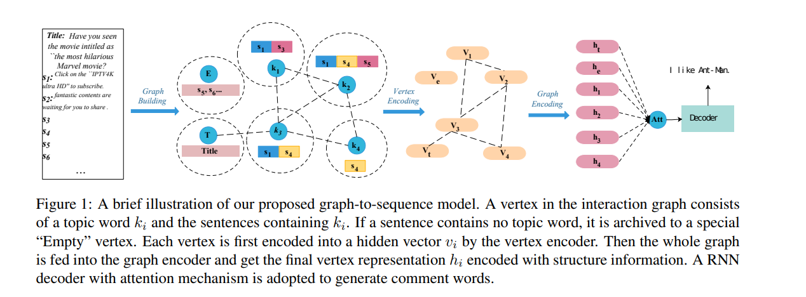
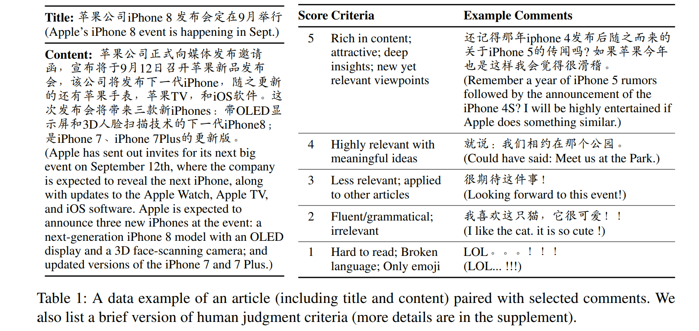
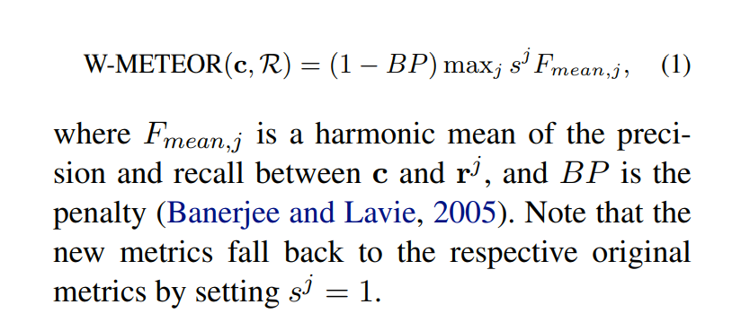

# 自然语言生成
[toc]

### Chatbot

##### [202004 Few-Shot Natural Language Generation by Rewriting Templates](../resources/notes/d0001/NLG_202004_Few_Shot_Natural_Language_Generation_by_Rewriting_Templates.md)
- https://arxiv.org/pdf/2004.15006v1.pdf

### 诗歌
##### [Chinese Poetry Generation with Recurrent Neural Networks]
##### [2019 基于神经网络的集句诗自动生成](../resources/notes/d0001/NLG_Poetry_2019_Neural_Network_based_Jiju_Poetry_Generation.md)

### 新闻评论
##### [201909 Read, Attend and Comment: A Deep Architecture for Automatic News Comment Generation](../resources/notes/d0001/comment_201910_Read__Attend_and_Comment__A_Deep_Architecture_for_Automatic_News_Comment_Generation.md)
- https://arxiv.org/abs/1909.11974
- https://mp.weixin.qq.com/s?__biz=MzU1NDA4NjU2MA==&mid=2247498424&idx=2&sn=b90734d7fd98a98bf5669e0585552d38&chksm=fbea4377cc9dca6195802b0fe2694a397c792896647b5748e7b1413b8b83f01fd87b6b169648&mpshare=1&scene=1&srcid=&sharer_sharetime=1571117053167&sharer_shareid=604c20f9afe3f796e2f8e6fa4f42544d#rd

##### [201906 Coherent Comment Generation for Chinese Articles with a Graph-to-Sequence Model](../resources/notes/d0001/comment_201906_Coherent_Comment_Generation_for_Chinese_Articles_with_a_Graph_to_Sequence_Model.md)
https://arxiv.org/pdf/1906.01231.pdf

##### [201809 Unsupervised Machine Commenting with Neural Variational Topic Model](../resources/notes/d0001/comment_201809_Unsupervised_Machine_Commenting_with_Neural_Variational_Topic_Model.md)
https://arxiv.org/pdf/1809.04960.pdf
- 使用VAE对文章以及评论进行主题编码解码获得其向量
- 引入Seq2Seq等监督学习对编码器进行多任务训练
- 预测时对文章与评论进行内积查询

##### [201805 Automatic Article Commenting: the Task and Dataset](../resources/notes/d0001/comment_201805_Automatic_Article_Commenting__the_Task_and_Dataset.md)
https://arxiv.org/pdf/1805.03668.pdf
提供一个评论数据集

以及权重化的评价指标

附录里面有其他评价指标的扩展

### 评论评价
##### [2017 Using New York Times Picks to Identify Constructive Comments]
https://www.aclweb.org/anthology/W17-4218.pdf

##### [2017 Finding Good Conversations Online: The Yahoo News Annotated Comments Corpus]
https://www.aclweb.org/anthology/W17-0802.pdf

### 自然语言回复
##### [201705 Efficient Natural Language Response Suggestion for Smart Reply](../resources/notes/d0001/response_201705_Efficient_Natural_Language_Response_Suggestion_for_Smart_Reply.md)
https://arxiv.org/abs/1705.00652

### VAE
##### [201708 SenGen: Sentence Generating Neural Variational Topic Model]
- http://xueshu.baidu.com/usercenter/paper/show?paperid=d4333c07f3b8070c9f804bdf9d5efe14&site=xueshu_se
- https://arxiv.org/pdf/1708.00308.pdf

##### [201803 Word Embedding Attention Network: Generating Words by Querying Distributed Word Representations for Paraphrase Generation]
- http://xueshu.baidu.com/usercenter/paper/show?paperid=f03eb3f75ed6036749716671526e18a5&site=xueshu_se

##### [201909 Automatic Fact-guided Sentence Modification]
- https://arxiv.org/abs/1909.13838

### RL
##### [201804 Toward Diverse Text Generation with Inverse Reinforcement Learning]()

##### [201811 Language GANs Falling Short]

### Pretrain ML
##### [201912 Plug and Play Language Models: a Simple Approach to Controlled Text Generation]
- https://zhuanlan.zhihu.com/p/96092209

##### [201909 A Conditional Transformer Language Model for Controllable Generation](../resources/notes/d0001/nlg_201909_A_Conditional_Transformer_Language_Model_for_Controllable_Generation.md)
- https://arxiv.org/pdf/1909.05858.pdf
- https://github.com/salesforce/ctrl

### 作文
##### [202001 基于抽取的高考作文生成](../resources/notes/d0001/nlg_202001_extract_artcle.md)
- http://cjc.ict.ac.cn/online/onlinepaper/fxc-2020119221517.pdf
- 