# 预训练语言模型
[toc]

## 模型

####  [2020 ELECTRA: Pre-training Text Encoders as Discriminators Rather Than Generators](../resources/notes/d0001/pretrainlm_2020_ELECTRA__Pre-training_Text_Encoders_as_Discriminators_Rather_Than_Generators.md)
- https://openreview.net/pdf?id=r1xMH1BtvB
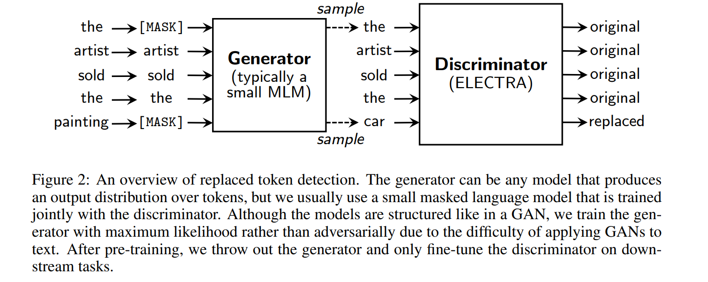
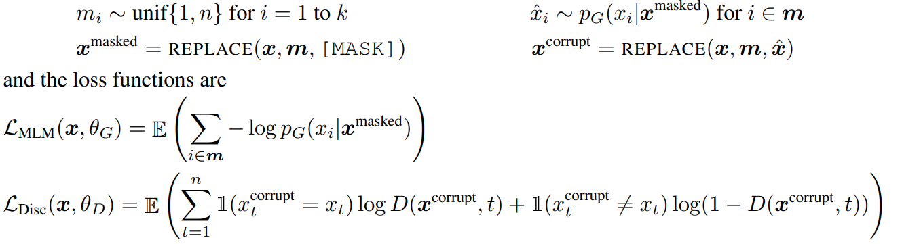

#### [202001 ProphetNet: Predicting Future N-gram for Sequence-to-Sequence Pre-training](../resources/notes/d0001/pretrain_202001_ProphetNet_Predicting_Future_N_gram_for_Sequence_to_Sequence_Pre_training.md)
- https://arxiv.org/pdf/2001.04063.pdf
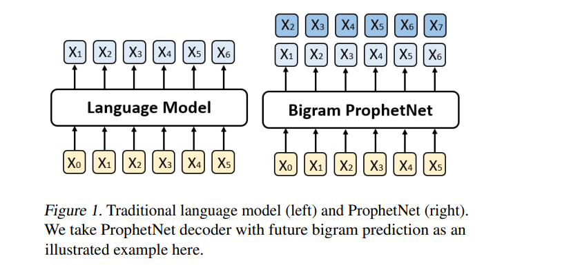

#### [201909 ALBERT: A Lite BERT for Self-supervised Learning of Language Representations](../resources/notes/d0001/pretrainlm_201909_ALBERT__A_Lite_BERT_for_Self_supervised_Learning_of_Language_Representations.md)
https://arxiv.org/abs/1909.11942?context=cs
提出如下改进
- Factorized embedding parameterization
将embedding matrix分解为两个矩阵，也就是说先将单词投影到一个低维的embedding空间，再将其投影到高维的隐藏空间
- Cross-layer parameter sharing
参数共享有三种方式：只共享feed-forward network的参数、只共享attention的参数、共享全部参数。ALBERT默认是共享全部参数的
- Inter-sentence coherence loss
Sentence-order prediction (SOP)来取代NSP。正例与NSP相同，但负例是通过选择一篇文档中的两个连续的句子并将它们的顺序交换构造的

#### [201909 NEZHA: NEURAL CONTEXTUALIZED REPRESENTATION FOR CHINESE LANGUAGE UNDERSTANDING](../resources/notes/d0001/pretrainlm_201909_nezha__neural_contextualized_representation_for_chinese_language_understanding.md)
https://arxiv.org/abs/1909.00204
- 函数式相对位置编码

- 全词覆盖
- 混合精度训练
- 训练过程中使用 LAMB 优化器

#### [201907 ERNIE 2.0: A Continual Pre-Training Framework for Language Understanding](../resources/notes/d0001/pretrainml_201907_ERNIE_2.0__A_Continual_Pre_Training_Framework_for_Language_Understanding.md)
- https://arxiv.org/pdf/1907.12412
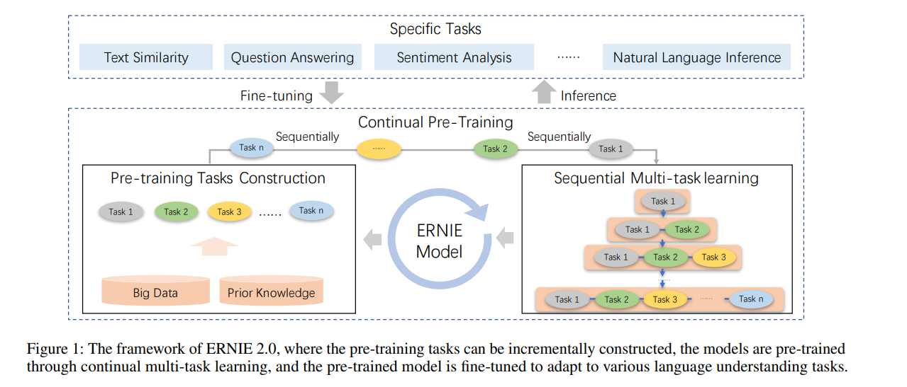
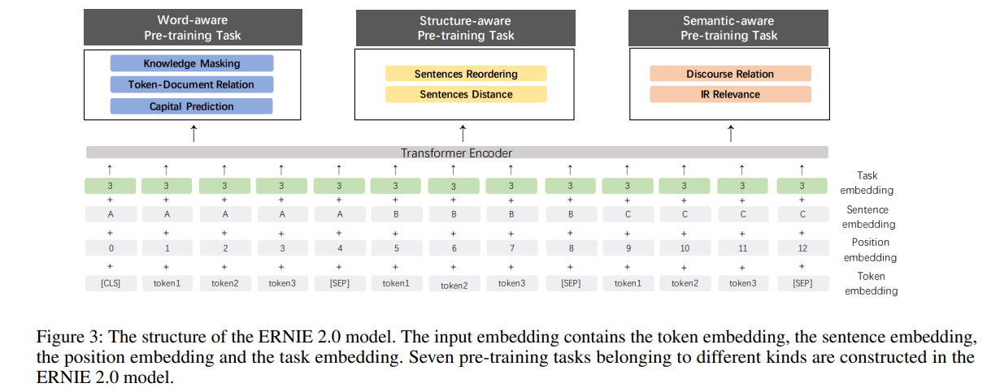

#### [201906 RoBERTa: A Robustly Optimized BERT Pretraining Approach](../resources/notes/d0001/pretrainlm_201907_RoBERTa__A_Robustly_Optimized_BERT_Pretraining_Approach.md)
- https://arxiv.org/abs/1907.11692
- 特点
    - 更大数据，更大的batch size
    - 动态地改变应用于训练数据的遮蔽模式
    - 删除下一句预测目标(NSP)
    - 当采用 bytes-level 的 BPE 之后，编码任何输入文本而不会引入 UNKOWN 标记

#### [201906 ERNIE: Enhanced Language Representation with Informative Entities（THU/ACL2019）](../resources/notes/d0001/pretrainml_201907_ERNIE__Enhanced_Language_Representation_with_Informative_Entities.md)
https://www.aclweb.org/anthology/P19-1139.pdf

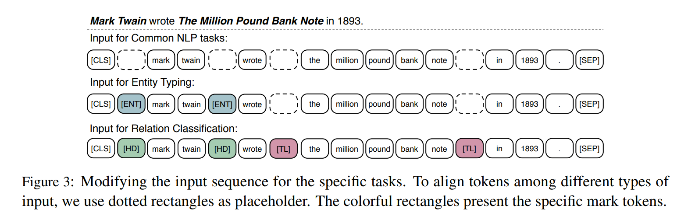
- 引入Trans-E等实体编码到模型中
- 对任务添加一项dEA, 主要是对实体进行预测
- 在实体分类以及实体关系的预测上效果不错

#### [201904 ERNIE: Enhanced Representation through Knowledge Integration](../resources/notes/d0001/pretrainml_201904_ERNIE__Enhanced_Representation_through_Knowledge_Integration.md)
- https://arxiv.org/pdf/1904.09223v1.pdf
- 命名实体、词组mask，以及DLM数据扩充

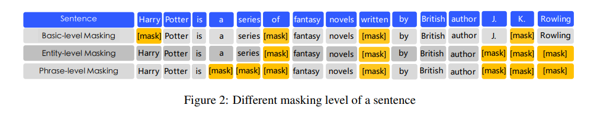
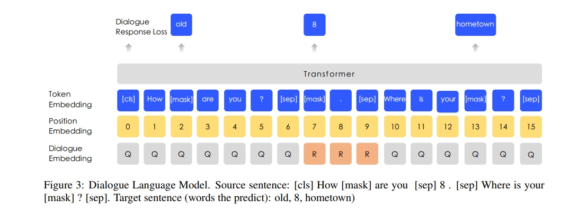

#### [2018 ACL Deep contextualized word representations: ELMO](../resources/notes/d0001/pretrainlm_2018_deep_contextualized_word_representations.md)
- https://arxiv.org/pdf/1802.05365.pdf

#### [2018 GPT Improving Language Understanding by Generative Pre-Training](../resources/notes/d0001/pretrainlm_2018_gpt_Improving_Language_Understanding_by_Generative_Pre_Training.md)
https://s3-us-west-2.amazonaws.com/openai-assets/research-covers/language-unsupervised/language_understanding_paper.pdf

#### [201801 Universal Language Model Fine-tuning for Text Classification](../resources/notes/d0001/pretrainlm_201801_Universal_Language_Model_Fine_tuning_for_Text_Classification.md)
https://arxiv.org/pdf/1801.06146.pdf
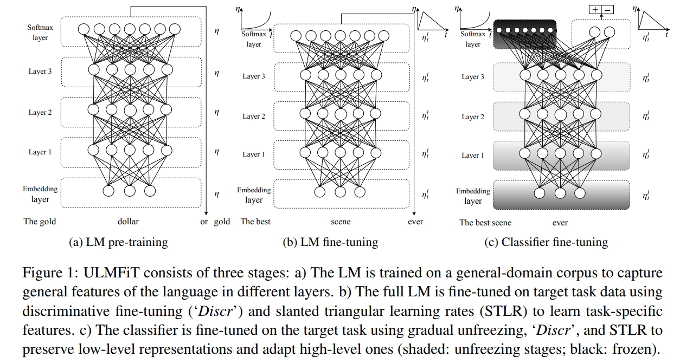
- 训练双向LM，采用多任务训练方式
- 特殊的学习率实现：1) 逐层降低学习率, 2) 倾斜的三角学习率
- 逐层解冻

#### [201706 attention is all you need](../resources/notes/d0001/attention_2017_attention_is_all_you_need.md)
- https://arxiv.org/pdf/1706.03762.pdf
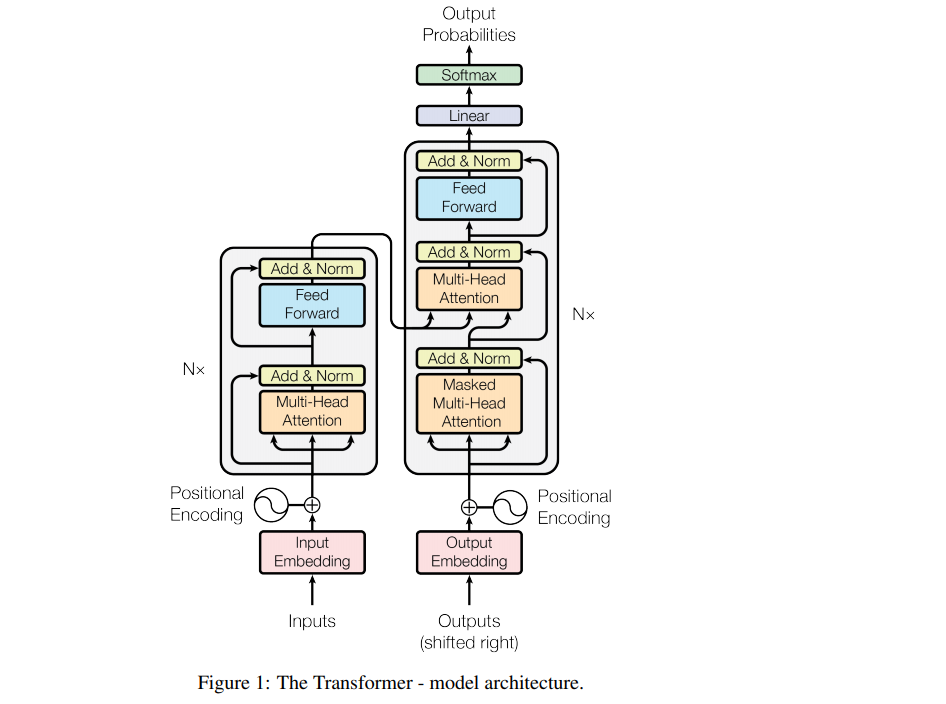
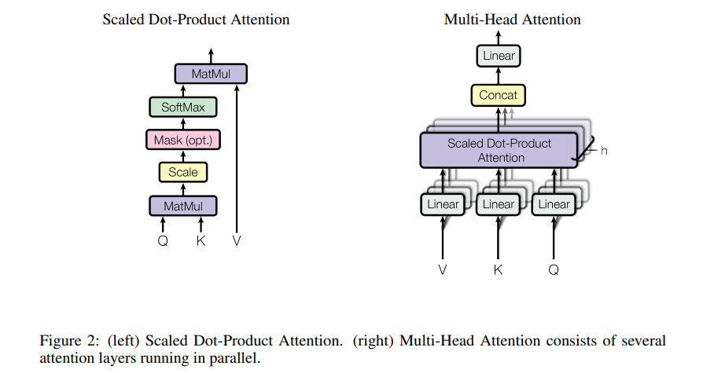

#### [201511 Semi-supervised Sequence Learning](../resources/notes/d0001/pretrainml_201511_Semi-supervised_Sequence_Learning.md)
- https://arxiv.org/abs/1511.01432
利用预训练方法来提高模型的性能
- 利用AutoEncoder, 编码解码参数一样
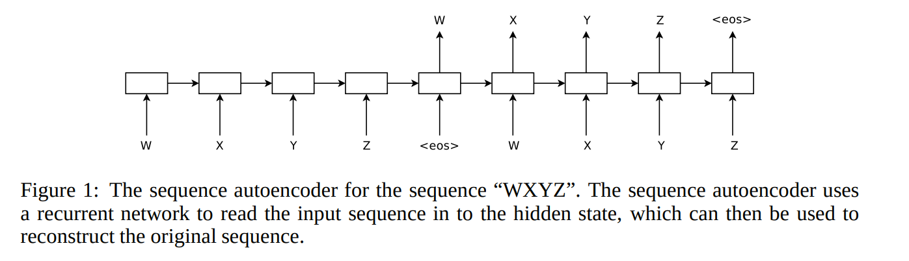
- 利用语言模型,  生成句子中的后一个词语

## QA
#### [202002 REALM: Retrieval-Augmented Language Model Pre-Training](../resources/notes/d0001/pretrainlm_202002_REALM.md)
- https://arxiv.org/abs/2002.08909
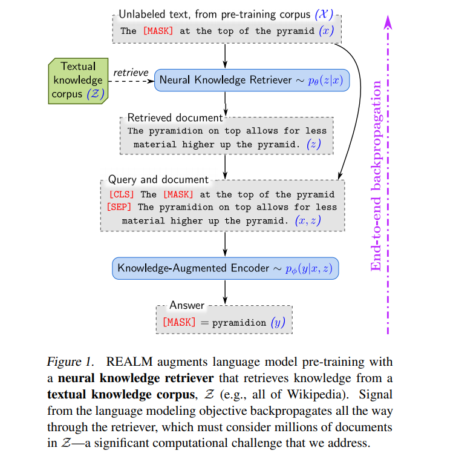
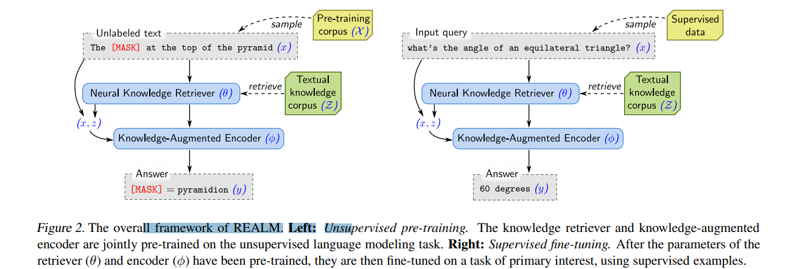
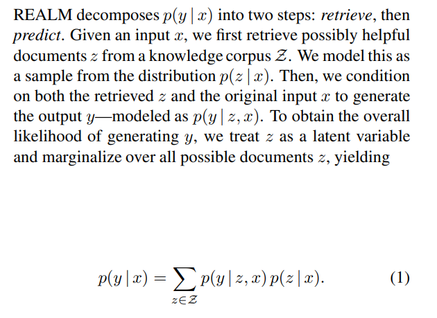

## 原理

#### [202003 What the MASK? Making Sense of Language-Specific BERT Models](../resources/notes/d0001/pretrainlm_202003_What_the_MASK_.md)
- https://arxiv.org/pdf/2003.02912v1.pdf
- 建立一个网站用以比较单语言BERT类与mBERT之间在NLP任务上的性能差别
https://bertlang.unibocconi.it

#### [202002 A Primer in BERTology: What we know about how BERT works](../resources/notes/d0001/pretrain_202002_A_Primer_in_BERTology.md)
- http://www.arxiv-vanity.com/papers/2002.12327/

#### [201909 How Contextual are Contextualized Word Representations? Comparing the Geometry of BERT, ELMo, and GPT-2 Embeddings](../resources/notes/d0001/pretrain_201909_How_Contextual_are_Contextualized_Word_Representations.md)
- https://arxiv.org/pdf/1909.00512v1.pdf
  - 在BERT、ELMo和GPT-2的所有层中，所有的词它们在嵌入空间中占据一个狭窄的锥，而不是分布在整个区域
  - 上层比下层产生更多特定于上下文的表示，然而，这些模型对单词的上下文环境非常不同
  - 如果一个单词的上下文化表示根本不是上下文化的，那么我们可以期望100%的差别可以通过静态嵌入来解释。相反，我们发现，平均而言，只有不到5%的差别可以用静态嵌入来解释
  - 我们可以为每个单词创建一种新的静态嵌入类型，方法是将上下文化表示的第一个主成分放在BERT的较低层中。通过这种方式创建的静态嵌入比GloVe和FastText在解决单词类比等基准测试上的表现更好

#### [Massively Multilingual Sentence Embeddings for Zero-Shot Cross-Lingual Transfer and Beyond（Facebook/2018）]

#### [MASS: Masked Sequence to Sequence Pre-training for Language Generation（Microsoft/2019）]

#### 【Multi-Task Deep Neural Networks for Natural Language Understanding（Microsoft/2019）

#### Improving Multi-Task Deep Neural Networks via Knowledge Distillation for Natural Language Understanding（Microsoft/2019）

#### Language Models are Unsupervised Multitask Learners（OpenAI/2019）

#### VideoBERT: A Joint Model for Video and Language Representation Learning

#### [Unified Language Model Pre-training for Natural Language Understanding and Generation（Microsoft/2019）]
- https://blog.csdn.net/ljp1919/article/details/100125630

#### [201901 XLM Cross-lingual Language Model Pretraining Facebook/2019](../resources/notes/d0001/pretrainml_201901_Cross_lingual_Language_Model_Pretraining.md)
https://arxiv.org/pdf/1901.07291.pdf

#### [201909 Language Models as Knowledge Bases?](../resources/notes/d0001/pretrain_201909_Language_Models_as_Knowledge_Bases.md)
  - https://arxiv.org/abs/1909.01066

#### [201910 T5 Exploring the Limits of Transfer Learning with a Unified Text-to-Text Transformer](../resources/notes/d0001/pretrainlm_201910_T5_Exploring_the_Limits_of_Transfer_Learning_with_a_Unified_Text_to_Text_Transformer.md)
https://arxiv.org/abs/1910.10683

#### [202001 AdaBERT: Task-Adaptive BERT Compression with Differentiable Neural Architecture Search]
- https://arxiv.org/abs/2001.04246
- [推理速度提升29倍，参数少1/10，阿里提出AdaBERT压缩方法](https://zhuanlan.zhihu.com/p/103865578)

