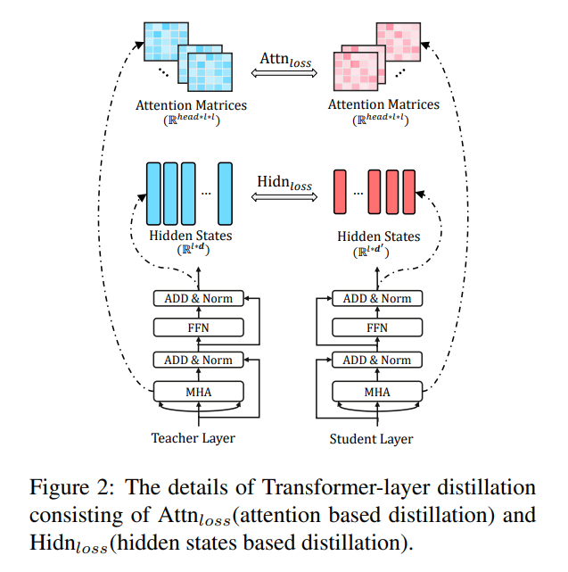
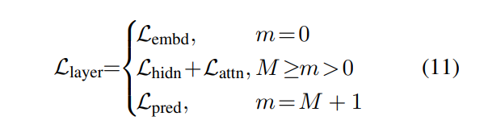
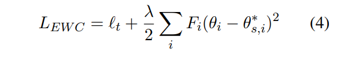

# 预训练语言模型
[toc]

# 模型
## 模型
#### [2103.10360 All NLP Tasks Are Generation Tasks: A General Pretraining Framework 所有 NLP 任务都是生成任务: 一个通用的预训练框架](../resources/notes/d0001/pretrainlm_2103.10360.md)

- 对 BERT 架构进行了两次修改。(1)重新排列了层归一化和 ResNet 连接的顺序，这对于大规模 bert 模型来说是至关重要的。(2)将令牌预测的前馈网络改为线性层，从而将输出位置 i 定义为

- 2D Positional Encoding
  - 每个令牌都用两个位置 id 进行编码。第一个位置 id 表示已损坏的文本 x 已损坏的位置。对于 b 中的标记，它是相应的[ MASK ]标记的位置。第二个位置 id 表示跨距内的位置。对于 a 中的标记，第二个位置 id 为0。对于 b 中的标记，它的范围是从1到跨度的长度。两个位置 id 通过两个独立的嵌入表投影到两个位置矢量中，并添加到输入嵌入中
- PRE-TRAINING OBJECTIVES
  - GLM 的预训练目标被定义为自回归生成的掩蔽跨度。在 BERT 之后，掩码跨度占原始令牌的15% 。根据经验，我们发现这个比率对于下游自然语言理解任务的良好表现是至关重要的。跨度长度取自 λ = 3的泊松分佈，根据 BART (Lewis et al. ，2019)。我们反复对新的跨区域进行Sample ，直到超过15% 的原始标记被屏蔽
- GLM Mask 短时间跨度，适合 NLU 任务。然而，我们感兴趣的是预先培训一个单一的模型，可以处理自然语言理解和文本生成。我们进一步研究了一个多任务的训练前设置，其中第二个目标是生成更长的文本与 GLM 联合优化。具体地说，我们对一个 Span 进行了 Sample，该跨度涵盖了原始令牌的50%-100% 。跨距长度取自均匀分布。新目标的定义与原始目标的定义相同。唯一的区别是只有一个，但跨度要长得多
- FINETUNING GLM

## [2103.06874 CANINE: Pre-training an Efficient Tokenization-Free Encoder
for Language Representation](../resources/notes/d0001/pretrainlm_2103.06874.md)

- 输入编码采用Unicode，输出也使用unicode，针对词表进行Hash降维
- 中间Bert部分使用4个字符进行合并

## [2103.04350 Syntax-BERT: Improving Pre-trained Transformers with Syntax Trees](./resources/../FastReading.md#2103.04350Syntax-BERT:ImprovingPre-trainedTransformerswithSyntaxTrees)

- 相当于将父亲、孩子、兄弟等节点重新MASK计算一下attnetion，而实际节点出来的值对上述3个部分的值进行了加强

## [202004 DeeBERT: Dynamic Early Exiting for Accelerating BERT Inference](../resources/notes/d0001/pretrainlm_202004_DeeBert.md)
- https://arxiv.org/pdf/2004.12993v1.pdf

## [202004 Don't Stop Pretraining: Adapt Language Modecvbls to Domains and Tasks](../resources/notes/d0001/pretrainlm_202004_Adapt_Language_Models_to_Domains_and_Tasks.md)
- https://arxiv.org/abs/2004.10964
- 考虑了四个领域: 生物医学和计算机科学出版物，新闻和评论
- 八个分类任务: 每个领域两个
- 无论有没有域自适应(domain-adaptive pretraining )的预训练，TAPT(task-adaptive pretraining 规模较小，但直接与任务相关的文集：未标记的任务数据集)都能为RoBERTa带来巨大的性能提升
- 从任务分发中获得 由任务设计者或注释者手动策划的其他未标记数据时，任务自适应预训练的好处就会增加。受此成功的启发，我们提出了自动选择其他与任务相关的未标记文本的方法，并展示了如何在某些资源匮乏的情况下提高性能

## [202003 Pre-trained Models for Natural Language Processing: A Survey](../resources/notes/d0001/pretrainlm_202003_Survey.md)
- https://arxiv.org/pdf/2003.08271.pdf

##  [2020 ELECTRA: Pre-training Text Encoders as Discriminators Rather Than Generators](../resources/notes/d0001/pretrainlm_2020_ELECTRA__Pre-training_Text_Encoders_as_Discriminators_Rather_Than_Generators.md)
- https://openreview.net/pdf?id=r1xMH1BtvB

## [202001 ProphetNet: Predicting Future N-gram for Sequence-to-Sequence Pre-training](../resources/notes/d0001/pretrain_202001_ProphetNet_Predicting_Future_N_gram_for_Sequence_to_Sequence_Pre_training.md)
- https://arxiv.org/pdf/2001.04063.pdf

## [201909 ALBERT: A Lite BERT for Self-supervised Learning of Language Representations](../resources/notes/d0001/pretrainlm_201909_ALBERT__A_Lite_BERT_for_Self_supervised_Learning_of_Language_Representations.md)
https://arxiv.org/abs/1909.11942?context=cs
提出如下改进
- Factorized embedding parameterization
将embedding matrix分解为两个矩阵，也就是说先将单词投影到一个低维的embedding空间，再将其投影到高维的隐藏空间
- Cross-layer parameter sharing
参数共享有三种方式：只共享feed-forward network的参数、只共享attention的参数、共享全部参数。ALBERT默认是共享全部参数的
- Inter-sentence coherence loss
Sentence-order prediction (SOP)来取代NSP。正例与NSP相同，但负例是通过选择一篇文档中的两个连续的句子并将它们的顺序交换构造的

## [201909 NEZHA: NEURAL CONTEXTUALIZED REPRESENTATION FOR CHINESE LANGUAGE UNDERSTANDING](../resources/notes/d0001/pretrainlm_201909_nezha__neural_contextualized_representation_for_chinese_language_understanding.md)
https://arxiv.org/abs/1909.00204
- 函数式相对位置编码

- 全词覆盖
- 混合精度训练
- 训练过程中使用 LAMB 优化器

## [201907 ERNIE 2.0: A Continual Pre-Training Framework for Language Understanding](../resources/notes/d0001/pretrainml_201907_ERNIE_2.0__A_Continual_Pre_Training_Framework_for_Language_Understanding.md)
- https://arxiv.org/pdf/1907.12412

## [201906 RoBERTa: A Robustly Optimized BERT Pretraining Approach](../resources/notes/d0001/pretrainlm_201907_RoBERTa__A_Robustly_Optimized_BERT_Pretraining_Approach.md)
- https://arxiv.org/abs/1907.11692
- 特点
    - 更大数据，更大的batch size
    - 动态地改变应用于训练数据的遮蔽模式
    - 删除下一句预测目标(NSP)
    - 当采用 bytes-level 的 BPE 之后，编码任何输入文本而不会引入 UNKOWN 标记

## [201906 ERNIE: Enhanced Language Representation with Informative Entities（THU/ACL2019）](../resources/notes/d0001/pretrainml_201907_ERNIE__Enhanced_Language_Representation_with_Informative_Entities.md)
https://www.aclweb.org/anthology/P19-1139.pdf

- 引入Trans-E等实体编码到模型中
- 对任务添加一项dEA, 主要是对实体进行预测
- 在实体分类以及实体关系的预测上效果不错

## [1905.03197 Unified Language Model Pre-training for Natural Language Understanding and Generation](../resources/notes/d0001/pretrainml_201905_unlm.md)
- https://arxiv.org/abs/1905.03197

- 采用MSAK来控制多种预测方法
- 单向语言模型，左到右，右到左
- 双向语言模型
- Seq2Seq，[SOS] x1 [EOS] x2 [EOS]

## [201904 ERNIE: Enhanced Representation through Knowledge Integration](../resources/notes/d0001/pretrainml_201904_ERNIE__Enhanced_Representation_through_Knowledge_Integration.md)
- https://arxiv.org/pdf/1904.09223v1.pdf
- 命名实体、词组mask，以及DLM数据扩充

## [2018 ACL Deep contextualized word representations: ELMO](../resources/notes/d0001/pretrainlm_2018_deep_contextualized_word_representations.md)
- https://arxiv.org/pdf/1802.05365.pdf

## [2018 GPT Improving Language Understanding by Generative Pre-Training](../resources/notes/d0001/pretrainlm_2018_gpt_Improving_Language_Understanding_by_Generative_Pre_Training.md)
https://s3-us-west-2.amazonaws.com/openai-assets/research-covers/language-unsupervised/language_understanding_paper.pdf

## [201801 Universal Language Model Fine-tuning for Text Classification](../resources/notes/d0001/pretrainlm_201801_Universal_Language_Model_Fine_tuning_for_Text_Classification.md)
https://arxiv.org/pdf/1801.06146.pdf

- 训练双向LM，采用多任务训练方式
- 特殊的学习率实现：1) 逐层降低学习率, 2) 倾斜的三角学习率
- 逐层解冻

## [201706 attention is all you need](../resources/notes/d0001/attention_2017_attention_is_all_you_need.md)
- https://arxiv.org/pdf/1706.03762.pdf

## [201511 Semi-supervised Sequence Learning](../resources/notes/d0001/pretrainml_201511_Semi-supervised_Sequence_Learning.md)
- https://arxiv.org/abs/1511.01432
利用预训练方法来提高模型的性能
- 利用AutoEncoder, 编码解码参数一样

- 利用语言模型,  生成句子中的后一个词语

# 蒸馏

## [1909.10351 TinyBERT: Distilling BERT for Natural Language Understanding](../resources/notes/d0001/pretrainlm_1909_tinyBERT.md)
- https://arxiv.org/abs/1909.10351

## [1910.01108 DistilBERT,adistilledversionofBERT:smaller, faster,cheaperandlighter](../resources/notes/d0001/pretrainlm_1910_DistilBERT.md)
- https://arxiv.org/abs/1910.01108

- 1）文章指出，对计算性能影响较大的不是隐含层节点的个数而是隐含层的层数，所以在大模型每两层去掉一层，之后再指导小模型；2）也要去掉token type embedding；3）小模型的初始化用的是大模型预训练好的参数
- 损失的计算：
  - KLDivLoss: teacher model 和student model的soft label损失两者的KL散度，之所以称之为soft label是在softmax中引入了温度参数T
  
  - Cos: teacher hidden state 和 student hidden state 的余弦相似度，也好理解，约束两个模型的相似性
  - Cross-entropy: hard label 损失函数，传统BERT 的 MLM 损失
- 以上求权重和计算整个网络的损失：Loss = 5.0*KLDivLoss + 2.0*Cross-entropy + 1.0*Cos

## [1908.08962 Well-Read Students Learn Better: On the Importance of Pre-training Compact Models](../resources/notes/d0001/pretrainlm_1908_pdbert.md)

## 应用

#### [2010.05522 Pre-trained Language Model Based Active Learning for Sentence Matching 基于预训练语言模型的主动学习句子匹配](../resources/notes/d0001/pretrainlm_2010.05522.md)
- https://arxiv.org/pdf/2010.05522v1.pdf
- 基于如下序列进行主动学习
  - rank-uncer，熵 8n
  - rank-diver，基于编辑距离，找出删除以及插入队列，队列基于其重建损失占比为权重加和形成一个新的向量，然后基于新的向量使用k-means进行聚类
  - rank-cover，基于重建损失的值进行筛选实例，小于某个门限的重建损失不再进行考虑，最终选择重建损失比较大的
  - rank-noise，选择噪声数据少的，也即是重建损失少的，即是针对每个词在预训练模型上的损失值与长度归一化后选择最小的

## [202004 Pre-training Is (Almost) All You Need: An Application to Commonsense Reasoning](../resources/notes/d0001/pretrainlm_202004_Pre_training_Is_Almost_All_You_Need.md)
#### [2103.10385 GPT Understands, Too GPT 也能理解](../resources/notes/d0001/pretrainlm_2103.10385.md)
- https://arxiv.org/pdf/2103.10385v1.pdf
- [ ]

#### [2103.10673 Cost-effective Deployment of BERT Models in Serverless Environment 无服务环境下 BERT 模型的性价比部署](../resources/notes/d0001/pretrainlm_2103.10673.md)

#### [2004.02288 Continual Domain-Tuning for Pretrained Language Models  预训练语言模型的持续域微调](../resources/notes/d0001/pretrainlm_2004.02288.md)
- 通过在target再训练过程中加入对源语料或源模型的参数正则化等尽量避免对源语言信息的减少
- 对源语言模型损失函数加权

- 对参数的变化做L2正则

- ELASTIC WEIGHT CONSOLIDATION (EWC)

#### [202004 Pre-training Is (Almost) All You Need: An Application to Commonsense Reasoning](../resources/notes/d0001/pretrainlm_202004_Pre_training_Is_Almost_All_You_Need.md)
- https://arxiv.org/pdf/2004.14074.pdf
- 修改[SEP]格式为全文格式，添加So/Because词语进行连接
- 计算前提中每个词语的ＭＬＭ概率分数
  
- 使用Margin-Loss以训练最佳假设与其他假设之间的距离
    

## [202002 REALM: Retrieval-Augmented Language Model Pre-Training](../resources/notes/d0001/pretrainlm_202002_REALM.md)
- https://arxiv.org/abs/2002.08909

# 原理

<<<<<<< HEAD
## [202003 What the MASK? Making Sense of Language-Specific BERT Models](../resources/notes/d0001/pretrainlm_202003_What_the_MASK_.md)
=======
#### [2004.02288 Continual Domain-Tuning for Pretrained Language Models  预训练语言模型的持续域微调](../resources/notes/d0001/pretrainlm_2004.02288.md)

#### [202003 What the MASK? Making Sense of Language-Specific BERT Models](../resources/notes/d0001/pretrainlm_202003_What_the_MASK_.md)
>>>>>>> 858f9910b848056b19d415c6e2169037723a2c61
- https://arxiv.org/pdf/2003.02912v1.pdf
- 建立一个网站用以比较单语言BERT类与mBERT之间在NLP任务上的性能差别
https://bertlang.unibocconi.it

## [202002 A Primer in BERTology: What we know about how BERT works](../resources/notes/d0001/pretrain_202002_A_Primer_in_BERTology.md)
- http://www.arxiv-vanity.com/papers/2002.12327/

## [201909 How Contextual are Contextualized Word Representations? Comparing the Geometry of BERT, ELMo, and GPT-2 Embeddings](../resources/notes/d0001/pretrain_201909_How_Contextual_are_Contextualized_Word_Representations.md)
- https://arxiv.org/pdf/1909.00512v1.pdf
  - 在BERT、ELMo和GPT-2的所有层中，所有的词它们在嵌入空间中占据一个狭窄的锥，而不是分布在整个区域
  - 上层比下层产生更多特定于上下文的表示，然而，这些模型对单词的上下文环境非常不同
  - 如果一个单词的上下文化表示根本不是上下文化的，那么我们可以期望100%的差别可以通过静态嵌入来解释。相反，我们发现，平均而言，只有不到5%的差别可以用静态嵌入来解释
  - 我们可以为每个单词创建一种新的静态嵌入类型，方法是将上下文化表示的第一个主成分放在BERT的较低层中。通过这种方式创建的静态嵌入比GloVe和FastText在解决单词类比等基准测试上的表现更好

## [Massively Multilingual Sentence Embeddings for Zero-Shot Cross-Lingual Transfer and Beyond（Facebook/2018）]

## [MASS: Masked Sequence to Sequence Pre-training for Language Generation（Microsoft/2019）]

## 【Multi-Task Deep Neural Networks for Natural Language Understanding（Microsoft/2019）

## Improving Multi-Task Deep Neural Networks via Knowledge Distillation for Natural Language Understanding（Microsoft/2019）

## Language Models are Unsupervised Multitask Learners（OpenAI/2019）

## VideoBERT: A Joint Model for Video and Language Representation Learning

## [Unified Language Model Pre-training for Natural Language Understanding and Generation（Microsoft/2019）]
- https://blog.csdn.net/ljp1919/article/details/100125630

## [201901 XLM Cross-lingual Language Model Pretraining Facebook/2019](../resources/notes/d0001/pretrainml_201901_Cross_lingual_Language_Model_Pretraining.md)
https://arxiv.org/pdf/1901.07291.pdf

## [201909 Language Models as Knowledge Bases?](../resources/notes/d0001/pretrain_201909_Language_Models_as_Knowledge_Bases.md)
  - https://arxiv.org/abs/1909.01066

## [201910 T5 Exploring the Limits of Transfer Learning with a Unified Text-to-Text Transformer](../resources/notes/d0001/pretrainlm_201910_T5_Exploring_the_Limits_of_Transfer_Learning_with_a_Unified_Text_to_Text_Transformer.md)
https://arxiv.org/abs/1910.10683

## [202001 AdaBERT: Task-Adaptive BERT Compression with Differentiable Neural Architecture Search]
- https://arxiv.org/abs/2001.04246
- [推理速度提升29倍，参数少1/10，阿里提出AdaBERT压缩方法](https://zhuanlan.zhihu.com/p/103865578)

