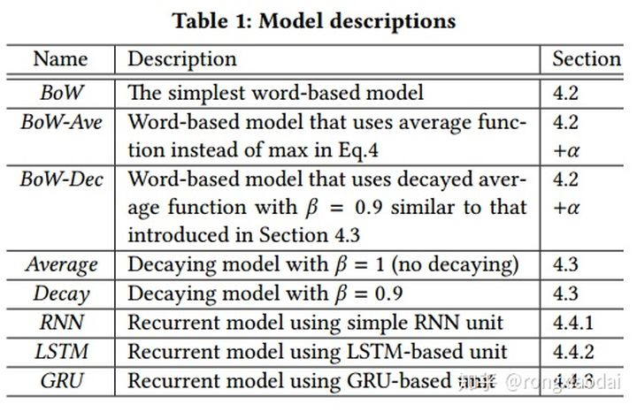
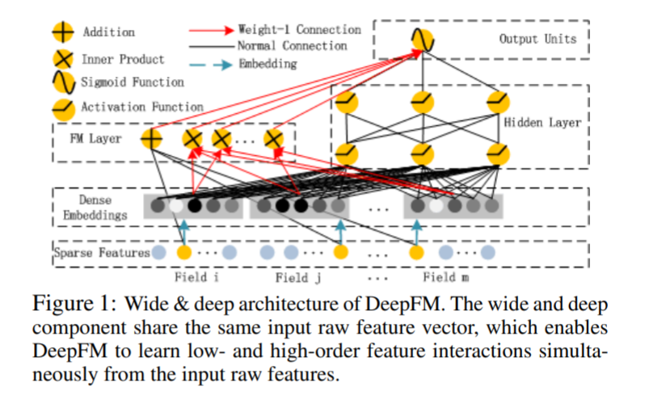
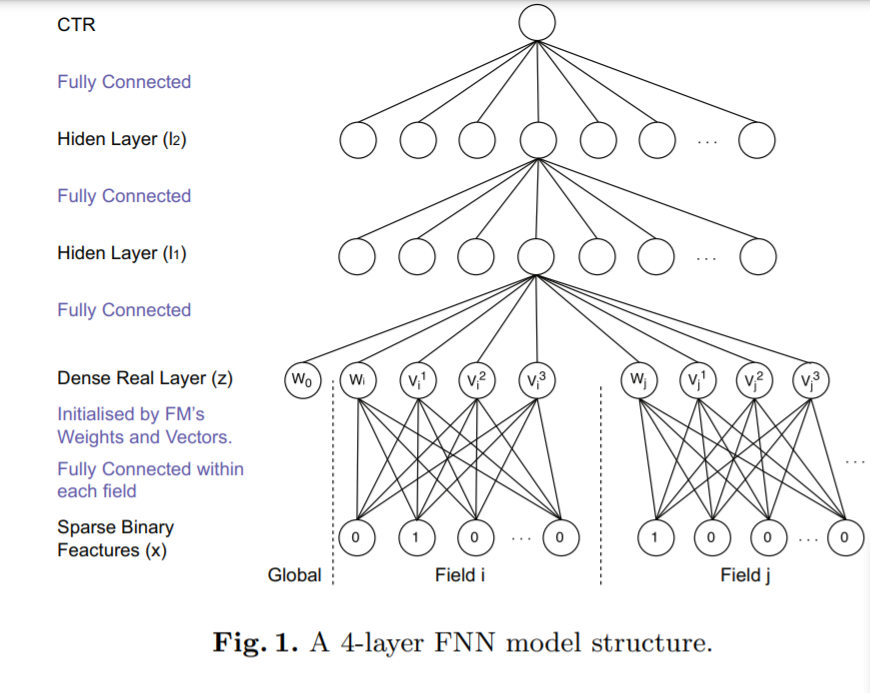
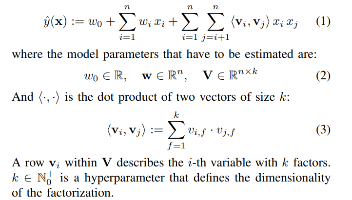
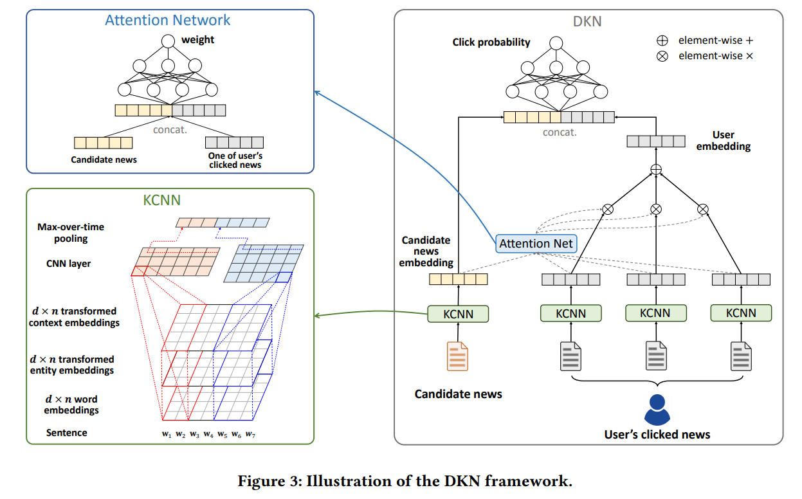

# recommendation
[toc]

### 概念挖掘
##### [201905 A User-Centered Concept Mining System for Query and Document Understanding at tencent](../resources/notes/d0001/rec_201905_A_User_Centered_Concept_Mining_System_for_Query_and_Document_Understanding_at_tencent.md)
https://arxiv.org/abs/1905.08487

### 推荐系统

##### [KDD2017 Embedding-based News Recommendation for Millions of Users](../resources/notes/d0001/rec_kdd2017_news.md)
- https://www.kdd.org/kdd2017/papers/view/embedding-based-news-recommendation-for-millions-of-users
- 基于自编码进行文章向量计算

- 模型
  - 用用户状态与文章向量内积来预测对文章的阅读进行模型训练，GRU更好

##### [1703.04247 DeepFM: A Factorization-Machine based Neural Network for CTR Prediction](../resources/notes/d0001/rec_deepFM.md)

- https://arxiv.org/abs/1703.04247
- FM替换了Wide&Deep的Wide部分使得特征交叉更加泛化
- FM和Deep层共享输入和嵌入

##### [201606  Wide & Deep Learning for Recommender Systems](../resources/notes/d0001/rec_201606_Wide__Deep_Learning_for_Recommender_Systems.md)
- https://arxiv.org/abs/1606.07792

##### [1601.02376 Deep Learning over Multi-field Categorical Data: A Case Study on User Response Prediction](../resources/notes/d0001/rec_1601_FNN.md)

- 使用FM参数进行神经网络的初始化
- https://arxiv.org/abs/1601.02376

##### [2010 Factorization Machines](../resources/notes/d0001/rec_2010_Factorization_Machines.md)
- https://www.csie.ntu.edu.tw/~b97053/paper/Rendle2010FM.pdf

# 新闻推荐

##### [ACL2020 MIND: A Large-scale Dataset for News Recommendation](../resources/notes/d0001/rec_2010_MIND.md)
- https://msnews.github.io/assets/doc/ACL2020_MIND.pdf

##### [201812 Fine-Grained Deep Knowledge-Aware Network for News Recommendation with Self-Attention]
## [201812 Fine-Grained Deep Knowledge-Aware Network for News Recommendation with Self-Attention]

## [201810 Large-Scale Real-Time News Recommendation Based on Semantic Data Analysis and Users’ Implicit and Explicit Behaviors]

## [201805 Faithfully Explaining Rankings in a News Recommender System]
- http://xueshu.baidu.com/usercenter/paper/show?paperid=9af2b2923d56562aa2e9f8d51a15b8fe&site=xueshu_se

## [201801 DKN: Deep Knowledge-Aware Network for News Recommendation]

## [201710 Location-Aware News Recommendation Using Deep Localized Semantic Analysis]

## [201710 Location-Aware Personalized News Recommendation With Deep Semantic Analysis]

## [201910 SMP Challenge: An Overview of Social Media Prediction Challenge 2019]

## [201910 Location prediction in large-scale social networks: an in-depth benchmarking study]

## [201010 Implicit news recommendation based on user interest models and multimodal content analysis]

## [201010 Personalized news recommendation based on click behavior]

## [201010 Implicit news recommendation based on user interest models and multimodal content analysis]

## [1801.08284 DKN: Deep Knowledge-Aware Network for News Recommendation](../resources/notes/d0001/rec_DKN_news.md)

- 三个通道
  - 单词词向量嵌入
  - 单词中的实体词语Trans-D等向量
  - 单词中的实体词语的一跳实体词的Trans-D向量和归一化
- KCNN 形成新闻向量
- https://arxiv.org/abs/1801.08284
- https://github.com/hwwang55/DKN

# 产品
## [A two-stage multiple-factor aware method for travel product recommendation]

