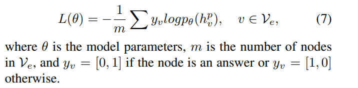
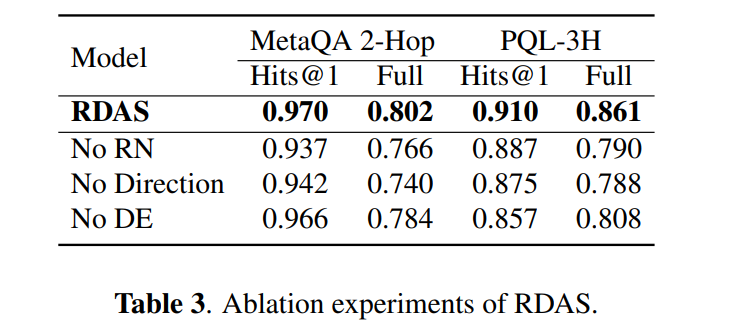

<!-- TOC -->

- [Integrating Subgraph-aware Relation and Direction Reasoning for Question Answering](#integrating-subgraph-aware-relation-and-direction-reasoning-for-question-answering)
  - [理解](#理解)
  - [ABSTRACT](#abstract)
  - [1 INTRODUCTION](#1-introduction)
  - [2 MODEL 模型](#2-model-模型)
    - [2.1 TASK DEFINITION 任务定义](#21-task-definition-任务定义)
    - [2.2 SUBGRAPH-AWARE RELATIONS CONSTRUCTION 子图感知关系的构造](#22-subgraph-aware-relations-construction-子图感知关系的构造)
    - [2.3 DIRECTION INFORMATION CONSTRUCTION 方向信息构建](#23-direction-information-construction-方向信息构建)
    - [2.4 REASONING ON GRAPH 图论推理](#24-reasoning-on-graph-图论推理)
    - [2.5 ANSWER PREDICTION 答案预测](#25-answer-prediction-答案预测)
  - [3 EXPERIMENTS 实验](#3-experiments-实验)

<!-- /TOC -->
# Integrating Subgraph-aware Relation and Direction Reasoning for Question Answering

## 理解
- 将所有的关系也转换为节点以用于后期进行GCN相关运算
- 引入关系的方向信息，能够解决一些关系的问题处理
- 将与seed node的距离引入到实体的向量编码中

## ABSTRACT
- 问题点
  - 大多数模型仅仅依靠固定关系表示来获得不同问题相关的知识库子图的答案。因此，这些子图的丰富结构信息可能被关系表示向量所忽略
  - 推理方向信息在图的答案预测中已被证明是有效的，但在现有工作中还没有得到充分的研究

- 提出了一种新的神经模型——关系更新方向引导的答案选择器(RDAS) ，它将每个子图中的关系转换为其他节点来学习结构信息。另外，我们利用方向信息来提高推理能力。实验结果表明，我们的模型对两个广泛使用的数据集产生了显著的改进

## 1 INTRODUCTION 
- KB 总是包含数以百万计的事实，这些事实由主语-谓语-宾语三元组组成，也称为两个实体之间的关系。这种丰富的结构化信息在基于知识库的问题回答(KBQA)任务中被证明是有效的，该任务旨在利用目标知识库中的事实找到一个事实问题的单一答案(或多个答案)
- KBQA 的一个更具挑战性但实际的问题是组合推理(有时称为“多跳”) ，其中答案沿着由实体和关系组成的 KB 路径表示

## 2 MODEL 模型
### 2.1 TASK DEFINITION 任务定义
- 设 k = (v，e，r)表示一个知识图，其中 v 是 KB 中的实体集，e 是三元组的集合(eo，r，es) ，其中 eo，es ∈ v 是实体，r ∈ r 是 eo 和 es 之间的关系。给定一个自然语言问题 $q = (w1，...，w_|q|)$及其与问题相关的子图 ks = (vs，es，rs) ，其中 wi 表示第i个字和 $k_s \in K$,模型需要从 $v_s$ 中提取答案

### 2.2 SUBGRAPH-AWARE RELATIONS CONSTRUCTION 子图感知关系的构造
- 为了使 $r_i ∈ r$ 的关系具有可学性并获取丰富的图信息，我们将关系边转换为关系节点

- 从另一个角度来看，通过这些步骤，我们构建了实体和关系的邻接矩阵。这使关系能够根据周围的实体信息更新它们的表示，从而捕获丰富的结构化信息

### 2.3 DIRECTION INFORMATION CONSTRUCTION 方向信息构建

- 介绍了一种将方向信息集成到子图中的方法。对于两个相邻节点之间的每一条边，我们首先引入反向边，以确保信息可以双向传播
- Pruning
  - 我们应用方向信息，通过掩盖一些边缘，这是由人类行为启发
  - 我们采用人类搜索问题答案的方式。很自然地从种子节点(0-Hop 节点)“ Dina Korzun”的问题出发。其次，根据“迪娜 · 科尔尊电影”之间的关系，选出了节点“迪娜 · 科尔尊电影”中的1跳节点“冷魂”。第三，人们通过“电影的类型是什么”这一关系来寻找“迪娜 · 科尔尊”节点的“戏剧”节点。最后，2跳节点“戏剧”是问题的答案。我们采用从种子节点到 n 跳节点沿外向边搜索答案的方法。我们期望模型中的信息传播遵循这样的规则，所以我们掩盖了边缘是内向的边缘。图3显示了构造方向信息前后子图的状态

### 2.4 REASONING ON GRAPH 图论推理
- 经过上述分段，我们得到了子图表示 k e = (v e，e e，r e)
- Node Initialization
  - 用预先训练好的字向量表示图中的所有节点，称为 $w_v ∈ R^n$ 表示节点 $e_v$，其中 n 是嵌入的大小。我们还嵌入了从图中的节点到种子节点的距离，如 $d_v ∈ R^n$。为了简单起见，使用单词“0”、“1”、“2”等的嵌入表示 $d_v$。我们将 $w_v$ 和 $d_v$ 连接为初始节点表示形式，定义如下:
  
  - 长短期记忆网络(LSTM)被用来对问题进行编码:
  

- Node Updates
  - 将每个节点表示 n v 与问题 q 连接起来
  
  在每个节点上执行 GCN，其中0≤ l < L 和 L 是模型中的层数。可以直接学习或设置归一化常量 c v，如 c v = | n v |
  - 门机制决定有多少更新消息 $u_v^{l+1}$ 传播到下一步。计算如下
  
  
  - 该模型为 L 层堆叠这样的网络。通过 L 次卷积运算，节点不断更新自己的状态，模拟推理过程。我们得到了节点 ev 的最后一层表示，用于预测答案

### 2.5 ANSWER PREDICTION 答案预测
- 将答案预测问题转化为每个节点上的二进制分类问题，并将节点表示 $h^L_v$ 转化为二维向量，定义为

- Model Training

## 3 EXPERIMENTS 实验
- (1) MetaQA 
- (2) PQL (PathQuestion-Large)

- EVALUATION METRICS 评估指标
  - Full: 这个度量用于多答案预测。对于节点 ev 的表示，如方程6所示，如果第二维数值大于第一维数值，则将节点视为答案。对于一个问题，如果预测的答案集与黄金答案集相同，我们设置 Full = 1，否则 Full = 0
  - Hits@1: 模型选择第二维度值最大的节点作为最终答案。如果这个答案在黄金答案列表中，那么我们认为这个预测是正确的。我们在测试集上对正确的数字进行平均，以得出最后的分数

- SGReader 和 GraftNet 使用 GCN 进行推理，忽略了子图感知关系信息的编码，没有方向信息来指导自己。这可能是我们的模型性能更好的原因
- 与单答预测设置(Hits@1)相比，多答预测更具挑战性。尽管如此，根据 Full 度量标准，我们的模型产生了显著的改进。这表明图感知关系表示和方向信息的集成提高了多答案预测的性能

- (No RN) means removing relations nodes, (No Direction) expresses removing direction information, and (No DE) means removing distance embedding