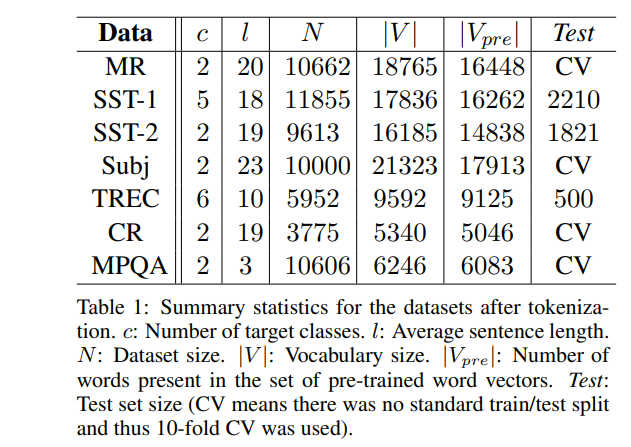
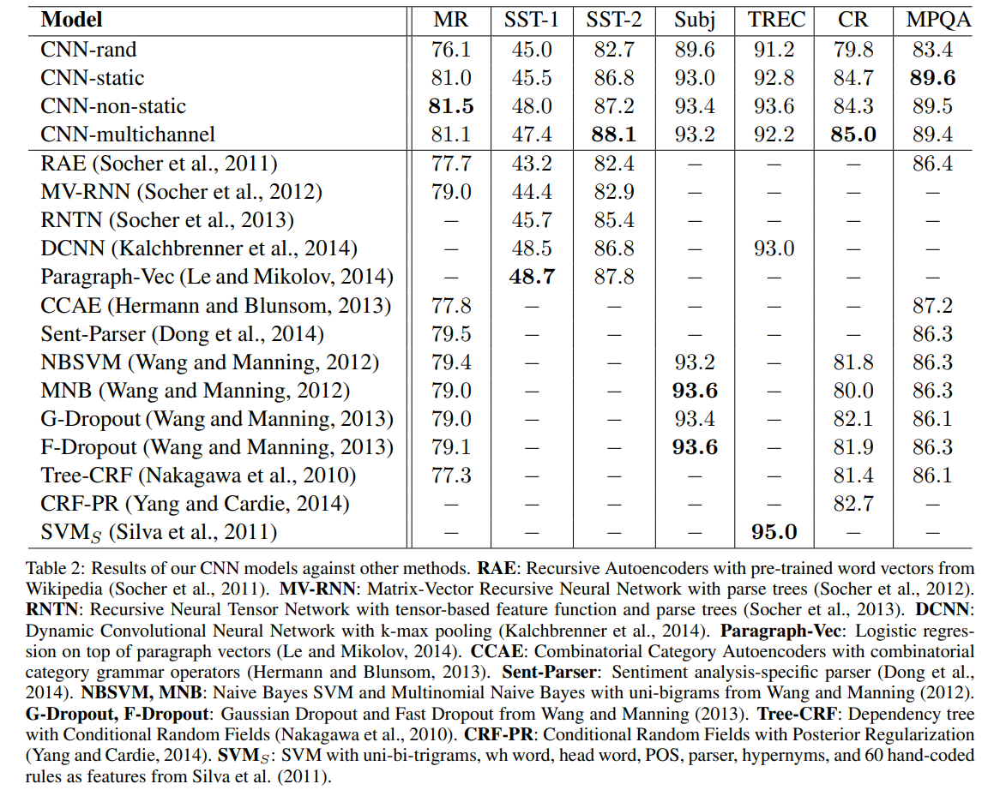
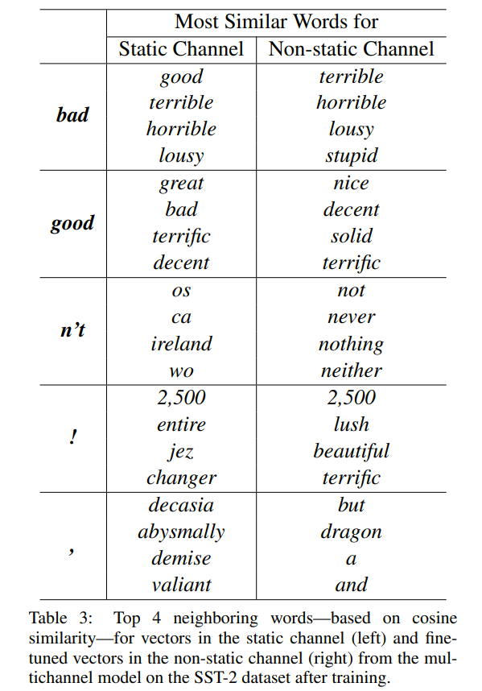

# Convolutional Neural Networks for Sentence Classification

[toc]

URL: https://arxiv.org/pdf/1408.5882.pdf

## 1 Introduction
基于神经语言模型的向量表示学习能让语义相关的词距离较近
CNN能够学习局部特征，在很多NLP任务中都有效

## 2 Model

CNN:

提取最重要的特征，同时可以处理变长句子：
$$\hat c = max{{c}} $$
one feature is extracted from one filter
采用多通道，一个通道为预训练静态词向量，另外一个可以通过反向传播进行更新

### 2.1 Regularization
倒数第二层也即是max-pool后的那层使用 Dropout 和 L2正则化约束

当||w||2 > s时对权重进行缩放

## 3 Datasets and Experimental Setup
MR: Movie reviews
SST-1: Stanford Sentiment Treebank
SST-2: Same as SST-1 but with neutral reviews removed and binary labels
Subj: Subjectivity dataset
TREC: TREC question dataset—task involves classifying a question into 6 question types
CR: Customer reviews
MPQA: Opinion polarity detection subtask of the MPQA dataset

### 3.1 Hyperparameters and Training
rectified linear units,
filter windows (h) of 3, 4, 5 with 100 feature maps each,
dropout rate (p) of 0.5, 
l2 constraint (s) of 3, 
mini-batch size of 50. 
These values were chosen via a grid search on the SST-2 dev set
Adadelta update rule

### 3.2 Pre-trained Word Vectors
word2vec
100 billion words from Google News
dimensionality of 300

### 3.3 Model Variations
CNN-rand:  随机初始化，训练时更新
CNN-static： 使用w2v，不允许进行更新
CNN-non-static: 同上，允许进行fine-tuned
CNN-multichannel：两个使用w2v进行初始化，一个可以更新，一个不更新

## 4 Results and Discussion

CNN-rand:  效果较差，预训练词向量增益较大

### 4.1 Multichannel vs. Single Channel Models
预想能够防止过拟合，实际结果有好有坏

### 4.2 Static vs. Non-static Representations
动态表示能够根据数据集进行改变，如上图，同样也能学习到未在预训练集合中的词语的合理表示

### 4.3 Further Observations
CNN capacity (multiple filter widths and feature maps)会影响效果
Dropout consistently added 2%–4% relative performance

## 5 Conclusion
 CNN with one layer of convolution performs remarkably well
 unsupervised pre-training of word vectors is an important ingredient in deep learning for NLP