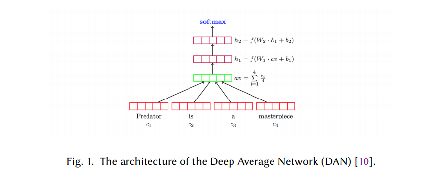
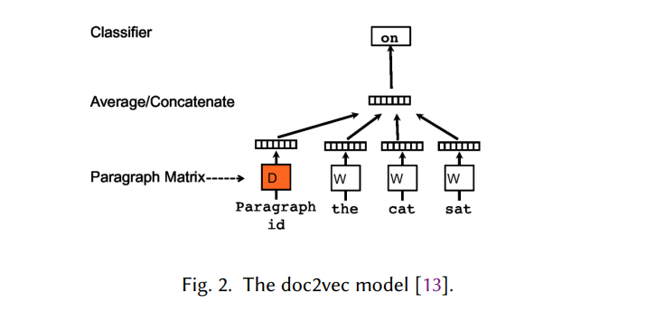
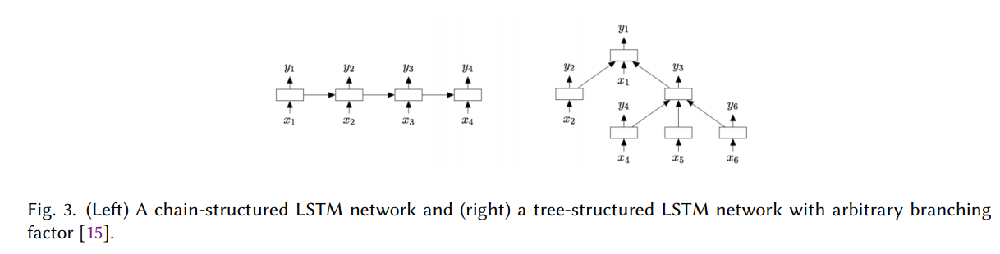
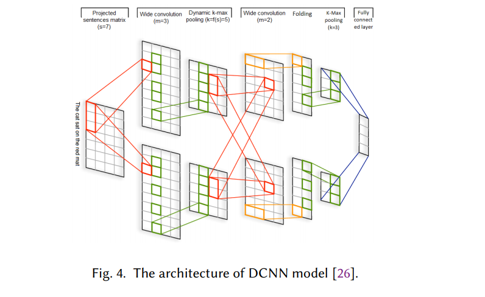
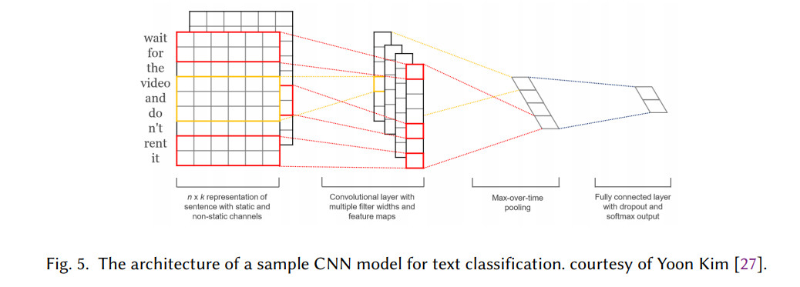
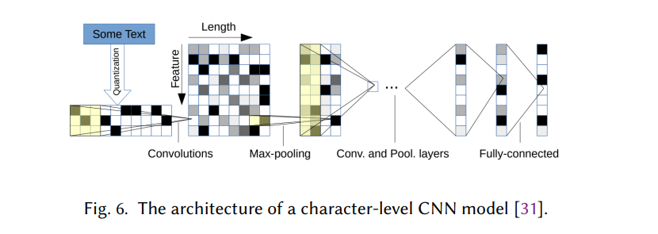

# Deep Learning Based Text Classification: A Comprehensive Review

[toc]

- https://arxiv.org/pdf/2004.03705.pdf

## Abstract
- 文本分类任务
  - 情感分析，新闻分类，问题回答和自然语言推断
  - 对近年来开发的150多种基于深度学习的文本分类模型进行了详细的回顾
  - 提供了40多个广泛用于文本分类的流行数据集的摘要

## 1 INTRODUCTION
- 文本分类: 目的是为文本单位（例如句子，查询，段落和文档）分配标签或标签
  - 应用，包括问题回答，垃圾邮件检测，情感分析，新闻分类，用户意图分类，内容审核
- 文本分类可以通过手动注释或自动标记进行

- 自动文本分类的方法可以分为三类
  - 基于规则的方法
    - 基于规则的方法使用一组预定义的规则将文本分类为不同的类别
      - 任何带有“足球”，“篮球”或“棒球”字样的文档都被赋予“运动”标签
      - 需要对领域有深入的了解，并且系统难以维护
      - 需要针对不同任务的不同规则集
  - 基于机器学习（数据驱动）的方法
    - 基于机器学习的方法学习根据过去对数据的观察进行分类。使用预先标记的示例作为训练数据，机器学习算法可以学习文本片段及其标签之间的固有关联
    - 于机器学习的方法可以检测数据中的隐藏模式，具有更高的可伸缩性，并且可以应用于各种任务
  - 混合方法

- 经典的基于机器学习的模型
  - 遵循流行的两步过程
    - 第一步是从文档（或任何其他文本单元）中提取一些手工制作的特征
      - 词袋（BoW）及其扩展
    - 第二步将这些特征输入到分类器中以进行分类
      - 朴素贝叶斯，支持向量机（SVM），隐马尔可夫模型（HMM），梯度提升树和随机森林
  - 局限
    - 依赖于手工制作的特征需要繁琐的特征工程和分析才能获得良好的性能
    - 设计功能对领域知识的高度依赖使得该方法难以轻松推广到新任务
    - 无法充分利用大量训练数据，因为特征（或特征模板）是预先定义的

- 回顾150多种深度学习模型，包括情感分析，新闻分类，主题分类，问题解答（QA）和自然语言推论（NLI）
- 基于其神经网络体系结构将这些工作分为几类，例如基于递归神经网络（RNN），卷积神经网络（CNN），注意力，transformer，胶囊

### 1.1 Text Classification Tasks
情感分析
: 分析文本数据（例如产品评论，电影评论和推文）中的观点，并提取其极性和观点
情感分类可以是二元问题，也可以是多分类问题。二进制情感分析是将文本分为正面和负面两类，而多类情感分析则侧重于将数据分类为细粒度标签或多级强度

新闻分类
: 新闻分类系统可以帮助用户实时获取感兴趣的信息。识别新兴新闻主题并根据用户兴趣推荐相关新闻是新闻分类的两个主要应用

主题分析
: 主题分析试图通过识别文本主题来自动从文本中获取含义
主题分类的目的是为每个文档分配一个或多个主题，以使其更易于分析

问题解答（QA）
: 抽取式可以视为文本分类的一种特殊情况。给定一个问题和一组候选答案（例如，SQuAD （rajpurkar2016squad，）中给定文档中的文本范围  ），我们需要将每个候选答案分类为正确与否

自然语言推理（NLI）
: 识别文本蕴含（RTE），可预测是否可以从另一文本推断出文本的含义。系统需要为每对文本单元分配一个标签，例如包含，矛盾和中立 
释义是NLI的一种广义形式，也称为文本对比较。任务是测量一个句子对的语义相似性，以确定一个句子是否是另一个句子的释义

### 1.2 Paper Structure
- 第2部分  全面概述了150多种基于深度学习的文本分类模型
- 第3节  回顾了一些最受欢迎的文本分类数据集
- 第4节  提供了基于16个基准的一组深度学习模型的定量性能分析
- 第5节  讨论了基于深度学习的文本分类方法的主要挑战和未来方向

## 2 DEEP LEARNING MODELS FOR TEXT CLASSIFICATION
- 分类
    - 基于前馈网络的模型，该模型将文本视为词袋
    - 基于RNN的模型，该模型将文本视为单词序列，旨在捕获单词相关性和文本结构
    - 基于CNN的模型，经过训练可以识别文本中的模式（例如关键短语）进行分类
    - 胶囊网络解决了CNN的合并操作所遭受的信息丢失问题，最近已应用于文本分类
    - 注意机制可以有效地识别文本中的相关单词，并已成为开发深度学习模型的有用工具
    - 记忆增强网络，将神经网络与外部记忆形式结合起来，模型可以从中读取和写入
    - transformer比RNN允许更多的并行化，从而可以使用GPU集群有效地（预）训练非常大的语言模型
    - 图神经网络，旨在捕获自然语言的内部图结构，例如句法和语义解析树
    - 混合模型，结合注意力，RNN，CNN等以捕获句子和文档的局部和全局特征
    - 监督学习之外的建模技术，包括使用自动编码器和对抗训练的无监督学习，以及强化学习

### 2.1 Feed-Forward Neural Networks
- 对于每个单词，使用诸如word2vec或Glove 之类的嵌入模型学习向量表示，将嵌入 的向量和或平均值作为文本的表示形式，通过一个或多个层，称为多层感知器（MLP），然后使用分类器（例如逻辑回归，朴素贝叶斯或SVM （iyyer2015deep，））对最终层的表示形式进行分类
- 深度平均网络（DAN）2015
  
  - 尽管很简单，但DAN却胜过了其他更复杂的模型，这些模型旨在显式地学习文本的组成
  - DAN在具有较高语法差异的数据集上的表现优于语法模型
- fastText 2016
  - fastText使用n-gram作为附加功能来捕获本地单词顺序信息
- doc2vec 2014
  
  - 使用一种无​​监督算法来学习可变长度文本（例如句子，段落和文档）的定长特征表示
  - 架构类似于连续词袋（CBOW）模型的架构
  - 区别是附加的段落标记通过矩阵D映射到段落向量。在doc2vec中，此向量与三个单词的上下文的串联或平均值用于预测第四个单词
  - 段落向量表示当前上下文中丢失的信息，可以用作该段落主题的记忆。在训练之后，将段落矢量用作该段落的特征

### 2.2 RNN-Based Models
- 将文本视为单词序列，旨在捕获单词依赖性和文本结构以进行文本分类
- 普通的RNN模型不能很好地工作，并且通常表现不如前馈神经网络。在RNN的许多变体中，长短期记忆（LSTM）是最流行的体系结构，旨在更好地捕获长期依赖关系
- Tree-LSTM 2015
  
    - 将LSTM推广到树结构网络类型，以学习丰富的语义表示
    - 因为自然语言具有句法属性，可以自然地将单词和短语组合在一起。他们在两个任务上验证了Tree-LSTM的有效性：情感分类和预测两个句子的语义相关性
    - zhu2015 还使用存储单元在递归过程中存储多个子单元或多个后代单元的历史记录，将链结构LSTM扩展为树结构
      - 模型提供了一种原则上的方式来考虑层次结构（例如语言或图像解析结构）上的远程交互
- chen 2016 
  - 通过存储网络代替单个存储单元来增强LSTM体系结构。这可以在神经注意力启用自适应内存使用，从而提供一种弱化标记之间关系的方法。该模型在语言建模，情感分析和NLI上取得了可喜的结果
- 多时标LSTM（MT-LSTM）神经网络 2015
  - 通过捕获具有不同时标的有价值的信息来对长文本（例如句子和文档）建模
  - 将标准LSTM模型的隐藏状态分为几组。每个组在不同的时间段被激活和更新
  - MT-LSTM在文本分类方面优于一组基准，包括基于LSTM和RNN的模型

- TopicRNN模型
  - RNN擅长捕获单词序列的局部结构，但是要记住远距离依赖关系会遇到困难
  - 潜在主题模型能够捕获文档的全局语义结构，但不考虑单词顺序
  - 使用RNN捕获局部（语法）依赖性，并使用潜在主题捕获全局（语义）依赖性
  - TopicRNN在情感分析方面优于RNN基线

- 其他有趣的基于RNN的模型
  - liu2016recurrent使用多任务学习来训练RNN，以利用来自多个相关任务的标记训练数据
  - johnson2016supervised探索使用LSTM的文本区域嵌入方法
  - zhou2016text将双向LSTM（Bi-LSTM）模型与二维最大池集成在一起，以捕获文本特征
  - wang2017bilateral在“匹配汇总”框架下提出了一个双边多视角匹配模型
  - wan2016deep 探索使用双向LSMT模型生成的多个位置句子表示形式的语义匹配

### 2.3 CNN-Based Models
- 训练RNN识别跨时间的模式，而CNN学会识别跨空间的模式
- 需要理解远程语义的POS标签或QA等NLP任务中，RNN效果很好，而在检测局部和位置不变模式很重要的情况下，CNN效果很好
- 这些模式可能是表达特定情绪（例如“我喜欢”）或主题（例如“濒危物种”）的关键短语。因此，CNN已成为最受欢迎的文本分类模型体系结构之一

- DCNN 2014
  
  - Kalchbrenner2014 该模型使用动态k -max池，称为动态CNN（DCNN
  - DCNN的第一层使用针对句子中每个单词的嵌入来构造句子矩阵。然后，将宽卷积层与动态k- max池给定的动态池层交替的卷积体系结构用于生成句子上的特征图，该特征图能够显式捕获单词和短语的短时和长时关系。合并参数k 可以根据句子大小和卷积层次中的级别动态选择

- TextCNN Kim2014
  
  - 模型在从无监督神经语言模型即word2vec获得的单词向量的顶部仅使用了一层卷积
  - 比较了四种学习单词嵌入的方法
    - CNN-rand，其中所有单词嵌入都在训练过程中被随机初始化，然后进行修改
    - CNN静态，在模型训练期间使用预训练的word2vec嵌入并保持固定
    - CNN非静态，其中word2vec嵌入在针对每个任务的训练过程中进行了微调
    - CNN多通道，其中使用了两组词嵌入向量集，两者均使用word2vec进行了初始化，其中一个在模型训练期间进行了更新，而另一个则在固定的情况下进行了更新

- liu2017
  - 对Kim-CNN的体系结构进行了两次修改
    - 采用动态最大池化方案来从文档的不同区域捕获更多细粒度的特征
    - 在池和输出层之间插入一个隐藏的瓶颈层，以学习紧凑的文档表示形式，以减小模型大小并提高模型性能
- Johnson2015，Johnson2017
  - 不使用预先训练的低维词向量作为CNN的输入，而是直接将CNN应用于高维文本数据，以学习小文本区域的嵌入进行分类

- zhang2015character， ; kim2016character
  
  - 模型以固定大小的字符作为输入，将其编码为“one-hot”矢量，然后使它们通过一个深CNN模型，该模型由六个具有池化操作的卷积层和三个完全连接的层组成

- Prusa2016
  - 提出了一种使用CNN编码文本的方法，该方法大大减少了学习字符级文本表示形式所需的内存消耗和训练时间。这种方法可以根据字母大小很好地缩放，从而可以保留原始文本中的更多信息，从而提高分类性能

- VDCNN conneau2016very，
  - 直接在字级别上运行，并且仅使用小的卷积和池化操作。这项研究表明，VDCNN的性能随深度而增加
- Duque2019
  - 修改VDCNN的结构以适应移动平台的限制并保持性能。他们能够将模型大小压缩10倍至20倍，而精度损失在0.4％至1.3％之间
- le2018convolutional表明，当文本输入表示为字符序列时，深层模型确实优于浅层模型
- Huang2017 一个简单的浅层和广域网络要优于带有单词输入的深度模型，例如DenseNet
- Guo2019 研究了词嵌入的影响，并提出通过多通道CNN模型使用加权词嵌入
- zhang2015 考察了不同单词嵌入方法和池化机制的影响，发现使用非静态word2vec和GloVe优于单热向量，并且最大池化始终优于其他池化方法

- mou2015natural提供了一个基于树的CNN来捕获句子级语义
- Pang2016将文本匹配转换为图像识别任务，并使用多层CNN识别显着的n-gram模式
- Wang2017提出了一个基于CNN的模型，该模型结合了短文本的显式和隐式表示形式进行分类

### 2.4 Capsule Neural Networks

### 2.5 Models with Attention Mechanism 

### 2.6 Memory-Augmented Networks

### 2.7 Transformers

### 2.8 Graph Neural Networks

### 2.9 Siamese Neural Networks

### 2.10 Hybrid Models

### 2.11 Beyond Supervised Learning

## 3 TEXT CLASSIFICATION DATASETS

### 3.1 Sentiment Analysis Datasets

### 3.2 News Classification Datasets

### 3.3 Topic Classification Datasets

### 3.4 QA Datasets

### 3.5 NLI Datasets

