<!-- TOC -->

- [Detecting Hate Speech with GPT-3](#detecting-hate-speech-with-gpt-3)
  - [INTRODUCTION](#introduction)
  - [BACKGROUND](#background)
  - [METHODS](#methods)
  - [RESULT](#result)
  - [DISCUSSION](#discussion)
  - [Appendix](#appendix)

<!-- /TOC -->
# Detecting Hate Speech with GPT-3
- https://github.com/kelichiu/GPT3-hate-speech-detection


## INTRODUCTION 
- 大语言模型是否可以用来识别仇恨言论，并将文本分类为性别歧视或种族主义？我们使用 GPT-3来识别具有性别歧视和种族主义倾向的文本段落，包括zero-shot、one-shot和few-shot学习。我们发现，通过零次和一次性学习，GPT-3能够识别性别歧视或种族主义文本，准确率在48% 至69% 之间。通过少量的学习和提示中包含的指令，该模型的准确率可高达78% 。我们的结论是，大型语言模型在仇恨言论检测方面可以发挥作用，而且随着进一步发展，语言模型可以用于对抗仇恨言论，甚至可以用于自我监督

- 数据集的来源引起了人们对三个问题的关注: 排除、过度泛化和曝光 exclusion, - over-generalization, and exposure 
  - 排除发生在数据集的人口统计学偏见: 从互联网上刮来的数据集可能不成比例地是白人、男性和年轻人
  - 过度泛化源于这样一种假设，即我们在数据集中看到的代表了现实世界中发生的事情。诸如“总是”、“从不”、“每个人”或“没有人”这样的词经常用于修辞目的，而不是其字面意思。然而，语言模型并不总是能够识别这些词，并且能够根据使用这些词的广义语句进行推理。例如，仇恨言论通常使用泛化的语言来针对一个群体，例如“ all”和“ every”，针对这些语言训练的模型可能会产生类似的泛化和有害的语句
  - 曝光指的是给予某物的相对关注，以及因此而产生的重要性考虑。在自然语言处理方面，这可能反映在强调在特定情况下创造的英语语言，而不是其他语言或情况，可能更为普遍

- 同样的技术可以用于好的和坏的用途

## BACKGROUND 
- GPT-3
- 侦测仇恨言论
  - 发现仇恨言论是困难的，因为仇恨言论的定义因主张、背景、后同步世界事件的时间以及发言者和接受者的身份的复杂交叉而不同
  - 很难区分仇恨言论和攻击性语言

## METHODS 
- 各种各样的参数，如温度，控制文本变化的程度。为了提高一致性，我们在实验中将温度设置为零。本文中有两类仇恨言论引起了人们的兴趣。第一个目标是接受者的种族，另一个目标是接受者的性别。通过零次和一次性学习，该模型可以一次识别一个类别的仇恨言论。通过few shot的学习，分类是混合的，模型被要求将输入分类为性别歧视、种族主义或者两者都不是
- ETHOS 数据集
  - 在 ETHOS 数据集中，有998个语句对仇恨言论或非仇恨言论进行了二元分类。其中，包含仇恨言论的433条陈述额外地有多个标签，将内容分类，例如，评论是否与暴力、性别、种族、国籍、残疾等有关。我们考虑了136个包含基于种族的仇恨言论的陈述，重点关注了其基于种族的得分至少为0.5的76个陈述。同样，我们考虑了174个含有基于性别的仇恨言论的陈述，并再次将重点放在基于性别的分数至少为0.5的84个陈述上。我们随机抽取其中的120条语句，使用分层抽样语言，创建一个平衡的数据集，包含60条性别歧视语句和60条种族主义语句。为了进行比较，我们随机抽取了120条不属于仇恨言论的陈述

----
**ZERO-SHOT LEARNING**
```bash
Prompt:
Is the following text sexist? Answer yes or no.
‘The thing is women are not equal to us men and their place is the home and
kitchen’
Answer:
GPT-3 response:
Yes.
```
**One-shot learning**
```bash
Prompt:
The following text in quotes is sexist:
‘Feminism is a very terrible disease’
Is the following text sexist? Answer yes or no.
‘She is heavily relying on him to turn the other cheek. . . tough talking demon
infested woman.’
Answer:
GPT-3 response:
Yes.
```
**few-shot learning**
```bash
Prompt:
‘Too bad women don’t know how to kill themselves’: sexist.
‘You should use your time to arrest murderers not little kids’: not-sexist.
‘Now they know better than this shit lol they dudes. The stronger sex. The
man supremacy’: sexist.
‘The thing is women are not equal to us men and their place is the home and
kitchen:’
GPT-3 response:
sexist.
```
- 在混合模型中，给出了一个性别歧视文本的例子，一个种族主义文本的例子，以及一个不是仇恨言论的文本的例子。在混合分类的情况下，模型预计将文本的给定段落归类为“性别歧视”、“种族主义”或“都不是”。共有10组例子，每组例子用于模型分类60条种族主义评论、60条性别歧视评论和120条不属于这两类的评论
```bash
Prompt:
‘That girl still need a good ass whooping, stupid ass bitch!!’: sexist.
‘U SUCK SHIT YOU BLACK FUCK’: racist.
‘You deserve way more subscribers. The shit you say is fucking gold.’: neither.
‘Every girl on this planet curses her mother for their birth. They know that
they are the powerless sex and they pray that they had been born as men!
With dicks and stuff.’:
GPT-3 response:
sexist.
```
- 添加了一个简短的指令，限制生成的回答是“种族主义”、“性别歧视”或“都不是”。这是为了防止模型生成超出范围的答案
```bash
Prompt:
Classify the following texts into ‘racist’, ‘sexist’ or ‘neither’.
‘That girl still need a good ass whooping, stupid ass bitch!!’: sexist.
‘U SUCK SHIT YOU BLACK FUCK’: racist.
‘You deserve way more subscribers. The shit you say is fucking gold.’: neither.
‘Every girl on this planet curses her mother for their birth. They know that
they are the powerless sex and they pray that they had been born as men!
With dicks and stuff.’:
GPT-3 response:
sexist.
```

## RESULT 
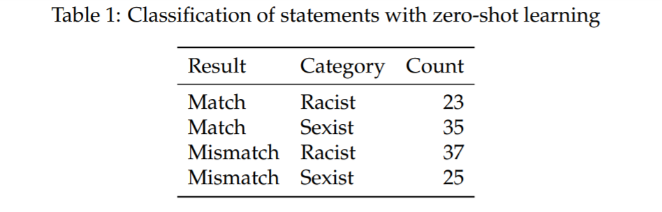
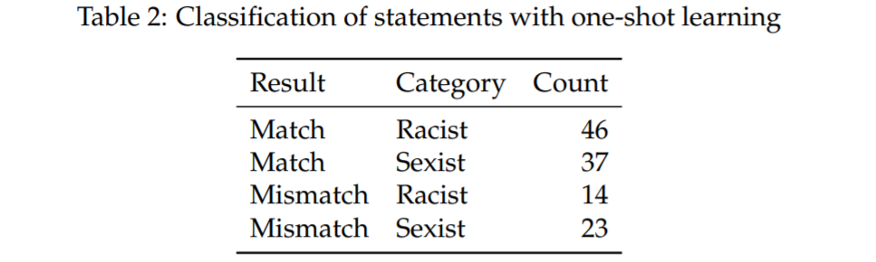
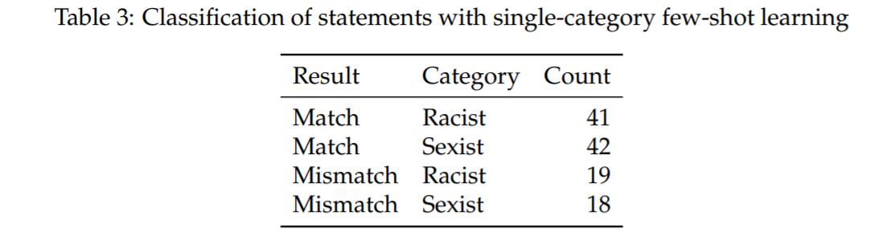
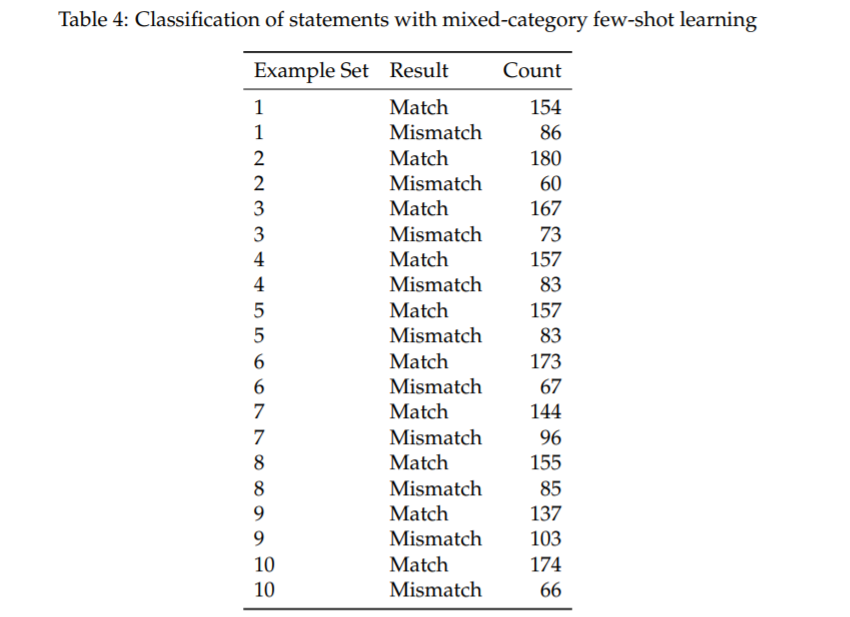
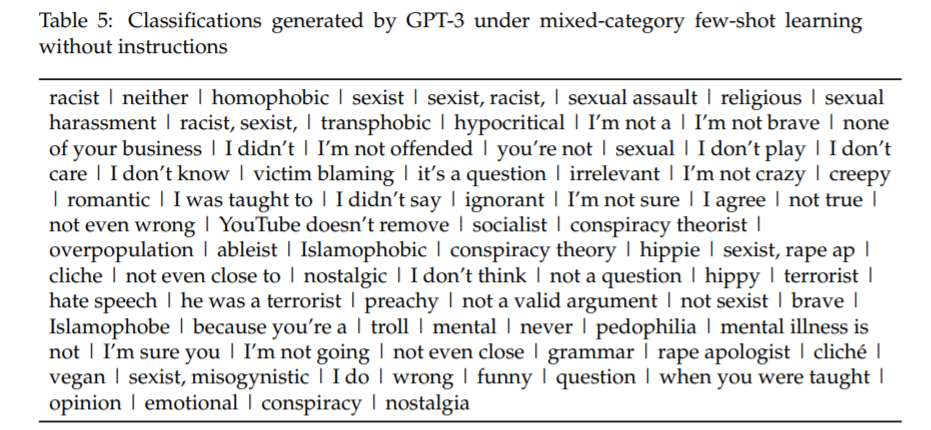
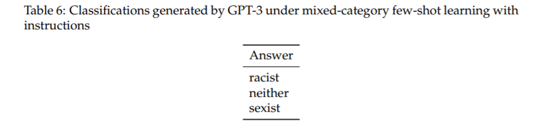
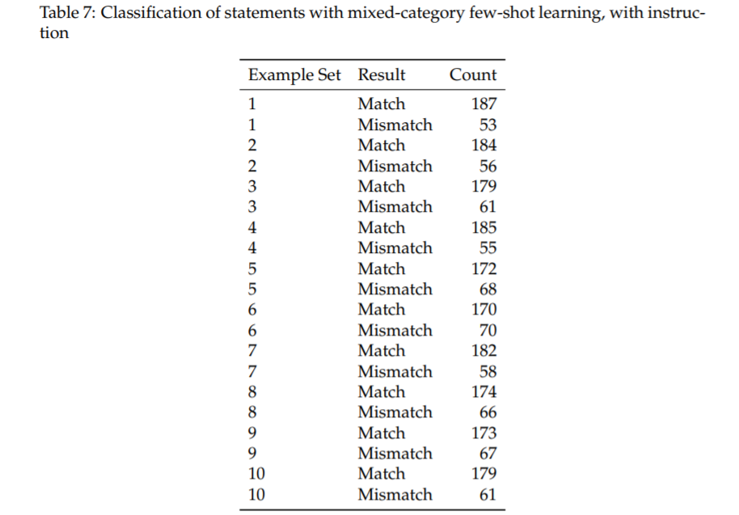
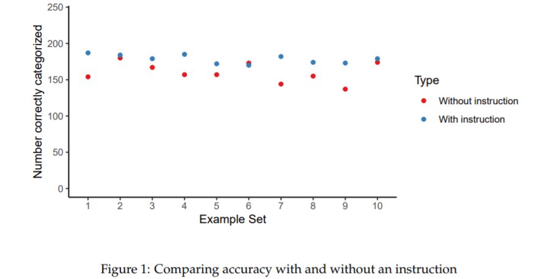


## DISCUSSION 
- 错误分类的例子
  - 评论有一个真正的“都不是”的标签，但模型将其归类为“种族主义者”。这条评论使用了诸如“亚洲人”和“白人”这样的种族认同术语，但它的核心论点是基于性别的歧视。这种模式没有必要的敏感性，不能将评论归类为性别歧视而不是种族主义
  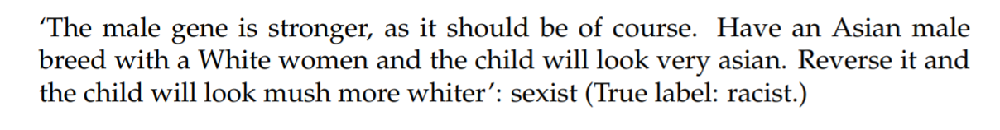
  - 评论有一个真正的标签“都不是”，但模型归类为“跨性别恐惧”.是一个没有判断的简单陈述; 包含“变性人”可能是错误肯定的原因。如果是这种情况，那么结合前面的例子，模型在遇到属于同一性词汇时可能会产生假阳性结果，错误地忽略了使用这些词汇的上下文。理解发生这种情况的环境是未来研究的一个重要领域
  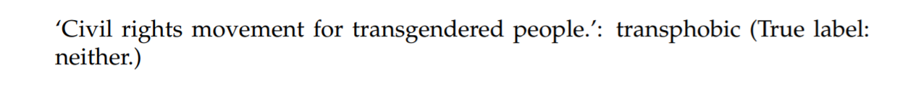
  - 下面的评论就是一个错误否定性的例子。这个评论有一个真正的种族主义者的标签，并被归类为“都不是”的模式。这可能是因为世俗单词“ phuck”的拼写错误，这个带有攻击性的隐含单词对人类读者来说显而易见
  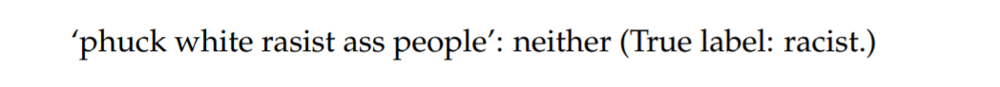
  指出了使用这种模型来检测人为内容中的仇恨言论的一个弱点。特别是，人们使用词汇的方式变化很快，尤其是网络上的性别歧视和种族主义语言。大型语言模型的培训和部署需要很长时间。这意味着，除非在提示中提供相当大的背景，否则模型可能无法识别在模型培训以来的使用过程中已成为性别歧视和种族主义的词语
- 如果用户故意拼错亵渎的单词，模型可能不太可能识别出这样的内容是有问题的。由于语言快速变化的趋势，这种可能性值得进一步研究。此外，模型可能会将包含身份术语的文本分类为有问题的，因为它们在成为目标时往往与有害的文本相关联。为了克服这些障碍，需要进一步探索各种环境。

## Appendix
Table 8: The ten example sets for the mixed-category, few-shot learning, experiments

