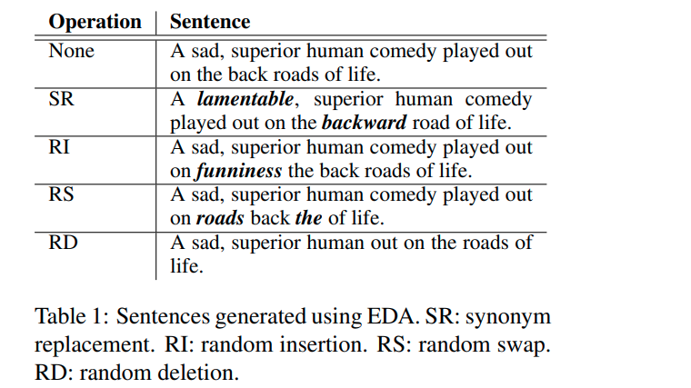
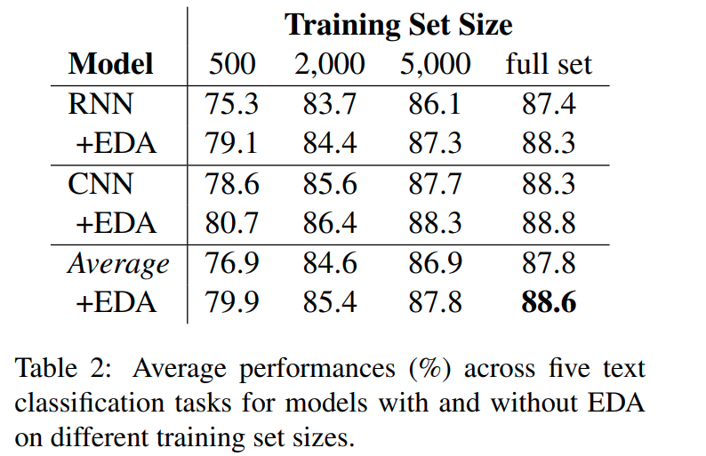
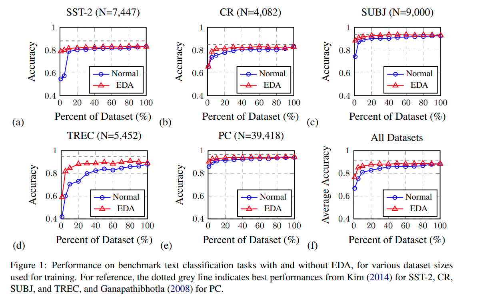
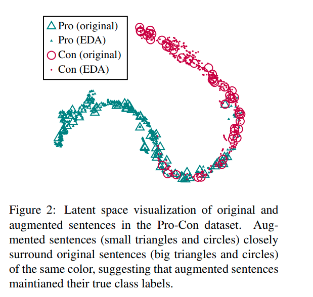
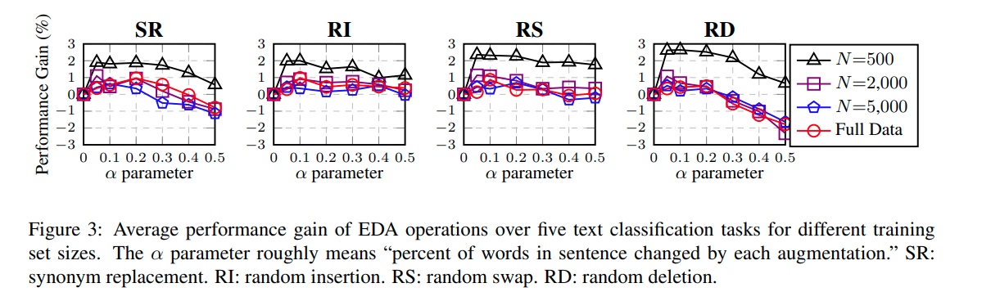
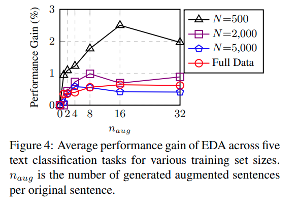
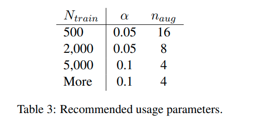

# EDA: Easy Data Augmentation Techniques for Boosting Performance on Text Classification Tasks
[toc]

- PAPER：https://arxiv.org/abs/1901.11196
- CODE：https://github.com/jasonwei20/eda_nlp
## Abstract
- EDA:用于提高文本分类任务性能的简单数据增强技术
- EDA由四个简单但功能强大的操作组成:同义词替换、随机插入、随机交换和随机删除
- EDA在卷积和循环神经网络上都提高了性能
- 对较小的数据集显示了特别强的响应; 在5个数据集中，使用EDA进行训练，而仅使用50%的可用训练集，在所有可用数据集上实现了与正常训练相同的准确性

## 1 Introduction
- 由于难以提出通用的语言转换规则，NLP中的通用数据扩充技术尚未得到深入的研究
- 1) 通过将句子翻译成法语然后在翻译成英语来生成新的数据, 2) 使用预测语言模型来替代同义词(Kobayashi, 2018)和数据处理作为平滑(Xie et al.， 2017)
  - 技术是有效的，在实践中并不经常使用，因为相对于性能的提高，它们具有较高的实现成本

## 2 EDA
- 训练小数据集上的文本分类的性能很差，测试了大量的增强操作，灵感来自于图像处理中使用的增强操作，发现它们有助于训练更健壮的模型
- 四种技术进行数据增强
  - 同义词替换(SR):从句子中随机选择非停止词。用随机选择的同义词替换这些单词
  - 随机插入(RI):在句子中找出一个随机词的随机同音异义词，而不是一个停止词。在句中的random位置插入同义词。做n次
  - 随机交换(RS):在句子中随机选择两个单词并交换它们的位置。做n次
  - 随机删除(RD):以概率p随机删除句子中每个单词

因为长句比短句有更多的单词，所以它们可以吸收更多的噪音，同时保持原来的类标签
$\alpha$为一个参数，表示句子中变化的百分比，替换，插入，交换或者删除都是使用该参数来控制

## 3 Experimental Setup

### 3.1 Benchmark Datasets
-  (1) SST-2: Stanford Sentiment Treebank (Socher et al., 2013)
-  (2) CR: customer reviews (Hu and Liu, 2004; Liu et al., 2015),
- (3) SUBJ: subjectivity/objectivity dataset (Pang and Lee, 2004),
- (4) TREC: question type dataset (Li and Roth, 2002)
-  (5) PC: Pro-Con dataset (Ganapathibhotla and Liu, 2008)
- Ntrain={500, 2,000, 5,000, 全部数据}

### 3.2 Text Classification Models
- LSTM-RNN (Liu et al., 2016).
- CNNs (Kim, 2014).

## 4 Results
### 4.1 EDA Makes Gains

### 4.2 Training Set Sizing

### 4.3 Does EDA conserve true labels?

先使用原始数据进行RNN训练模型，然后数据增强（每条原始数据，9条新数据），然后将句子使用RNN进行分类，将最后一层DENSE层的数据进行t-SNE可见，其新数据都在原始数据的周围
大多数情况下，新生成的数据保持着之前的标签

### 4.4 Ablation Study: EDA Decomposed

- SR, 小好，替换太多可能更改了句子的含义
- 对于四种技术，数据集很小时，每一种技术都能够有2-3%的提升，当数据集很大时，每一种技术也能够有1%的提升。根据作者的经验来看，不要改变超过1/4的词汇的前提下，模型的鲁棒性都能得到很大的提升

### 4.5 How much augmentation?

小数据集越容易过拟合，产生更多的数据会更有好处，数据量够大时，模型本省就足够泛化，推荐见列表

## 5 Comparison with Related Work
与其他的数据增强方法进行比较

## 6 Discussion and Limitations
how can we generate sentences for augmentation without changing their true  labels? 
- EDA 在数据集大的时候可能很小
- 在预训练模型上，EDA可能收益很小甚至有可能是负的

## 7 Conclusions

