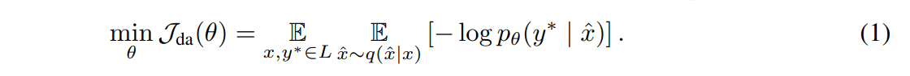
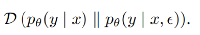
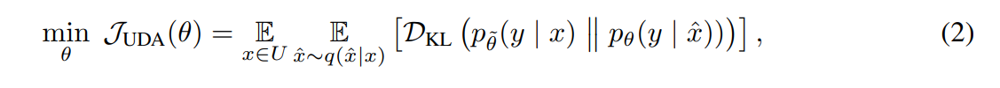
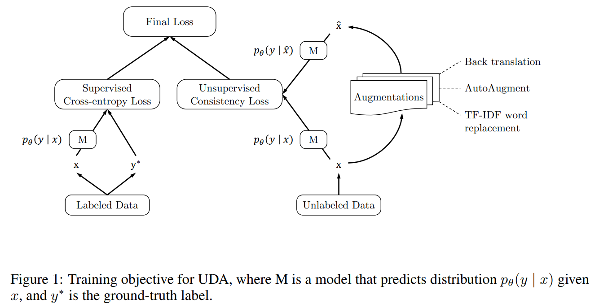
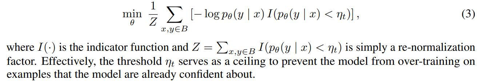
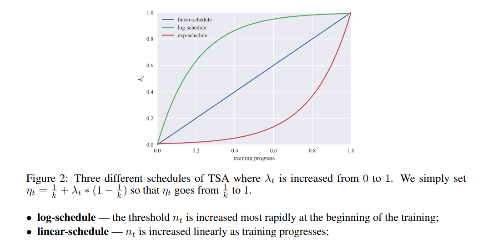
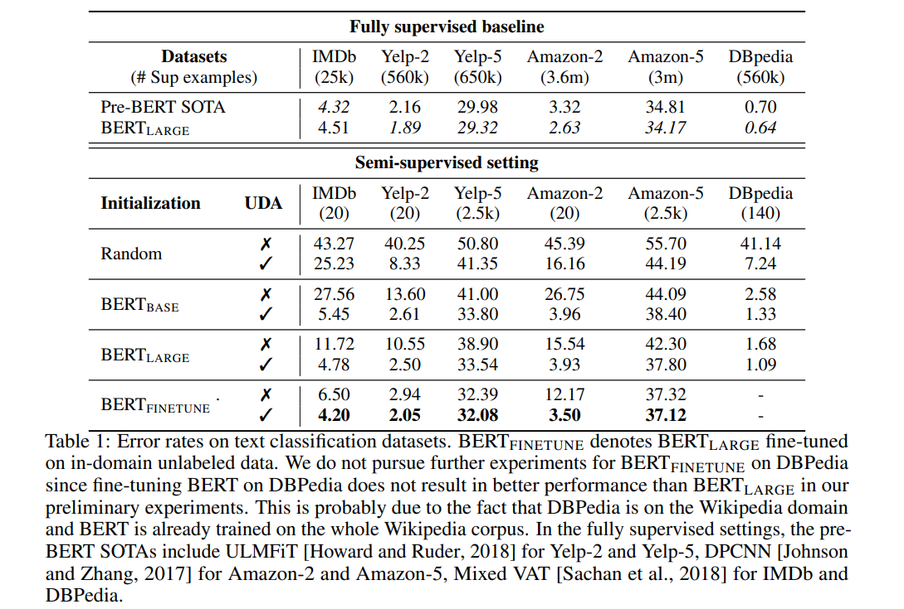
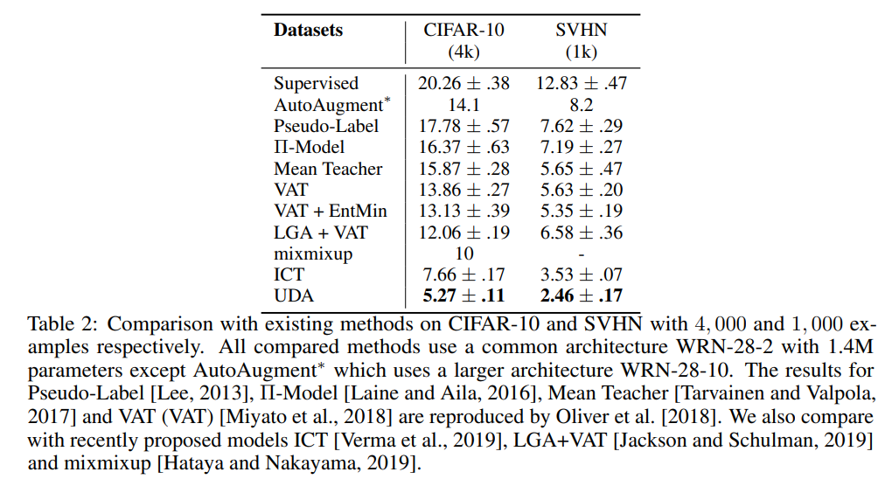
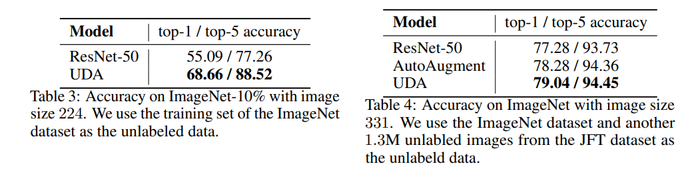
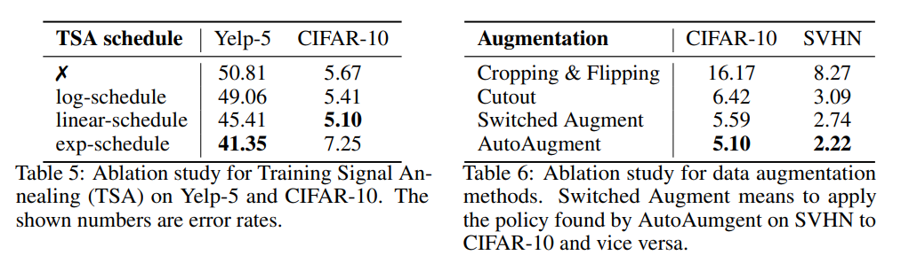

<!-- TOC -->

- [Unsupervised Data Augmentation 无监督数据增强](#unsupervised-data-augmentation-无监督数据增强)
  - [ABSTRACT](#abstract)
  - [1 INTRODUCTION 引言](#1-introduction-引言)
  - [2 UNSUPERVISED DATA AUGMENTATION (UDA) 无监督数据增强(UDA)](#2-unsupervised-data-augmentation-uda-无监督数据增强uda)
    - [2.1 BACKGROUND: SUPERVISED DATA AUGMENTATION 背景: 有监督的数据增强](#21-background-supervised-data-augmentation-背景-有监督的数据增强)
    - [2.2 UNSUPERVISED DATA AUGMENTATION 无监督数据增强](#22-unsupervised-data-augmentation-无监督数据增强)
    - [2.3 AUGMENTATION STRATEGIES FOR DIFFERENT TASKS 针对不同任务的强化策略](#23-augmentation-strategies-for-different-tasks-针对不同任务的强化策略)
    - [2.4 TRAINING SIGNAL ANNEALING 训练信号退火](#24-training-signal-annealing-训练信号退火)
  - [3 EXPERIMENTS 实验](#3-experiments-实验)
    - [3.1 TEXT CLASSIFICATION EXPERIMENTS 文本分类实验](#31-text-classification-experiments-文本分类实验)
    - [3.2 COMPARISON WITH SEMI-SUPERVISED LEARNING METHODS 与半监督学习方法的比较](#32-comparison-with-semi-supervised-learning-methods-与半监督学习方法的比较)
    - [3.3 IMAGENET EXPERIMENTS 实验](#33-imagenet-experiments-实验)
    - [3.4 ABLATION STUDIES 消融研究](#34-ablation-studies-消融研究)

<!-- /TOC -->
# Unsupervised Data Augmentation 无监督数据增强
- https://arxiv.org/pdf/1904.12848v2.pdf
- https://github.com/google-research/uda

## ABSTRACT
- 将数据增强应用于半监督学习设置中的未标记数据。我们的方法，名为无监督数据增强或 UDA，鼓励模型预测之间的未标记的例子和增强未标记的例子是一致的

## 1 INTRODUCTION 引言
- 标记数据是一个昂贵的过程。利用未标记的数据来改进深度学习已经成为解决这一昂贵过程的一个重要研究方向
- 在这个方向上，半监督学习是最有前途的方法之一，最近的工作可以分为3个类别: 
  - (1)基于图的标签通过图卷积传播(Kipf 和 Welling，2016)和图嵌入(Weston 等人，2012) 
  - (2)建模潜在变量预测目标(Kingma 等人，2014) 
  - (3)一致性/强制(Bachman 等人，2014; Laine 和 Aila，2016; Miyato 等人，2018; Clark 等人，2018)。其中，最后一类方法，即基于强制平滑的方法，已被证明在许多任务上工作良好

- 平滑的执行方法只是将模型的预测规则化，使其对应用于示例的小扰动(标记或未标记)不那么敏感
- 强制平滑的方法首先创建一个扰动版本(通常通过添加人为噪声，如高斯噪声或Dropout) ，并强制模型预测在两个例子是相似的。直观地说，一个好的模型应该不受任何小的扰动的影响，这些扰动不会改变一个例子的性质。在这个通用框架下，这类方法的主要区别在于扰动函数，即扰动示例是如何创建的
- 更好的增强方法导致更大的改进
- 最小化模型预测之间的 KL 差异，对原来的例子和一个例子产生的数据增强
- UDA 可以直接对数量较大的非监督数据采用最先进的数据增强方法，因此有可能比标准监督数据增强方法更好地发挥作用

- 在 IMDb 上，UDA 的20个标记示例的性能优于用1250倍标记数据训练的最先进的模型
- 在 CIFAR-10和 SVHN 上评估 UDA 半监督学习基准。该方法的误差率分别为5.27% 和2.46% ，明显优于先前的方法7.66% 和3.53%
- 当有大量的监督数据时，UDA 是有益的。在 ImageNet 上，当我们使用1.3 m 未标记示例的外部数据集时，UDA 的 Top1 和 Top5 准确率分别从78.28%/94.36% 提高到 79.04%/94.45% 

---
**贡献**
- 提出了一种称为 TSA 的训练技术，这种技术可以有效地防止在无监督的数据比有监督的数据多得多的情况下过度拟合
- 展示了有针对性的数据增强方法(例如 autoincrement)相对于其他无针对性的增强具有显著的改进
- 结合了一组 NLP 的数据增强，并表明我们的方法在工作得很好
- 在视觉和语言任务的范围内，与之前的方法相比，我们的方法在性能上有了显著的飞跃
- 提出了一种方法，使 UDA 甚至可以应用于有标记和无标记数据不匹配的类分布

## 2 UNSUPERVISED DATA AUGMENTATION (UDA) 无监督数据增强(UDA)
### 2.1 BACKGROUND: SUPERVISED DATA AUGMENTATION 背景: 有监督的数据增强
- 数据增强旨在通过对示例的输入应用转换，而不改变示例的标签/性质，从而创建新颖且有真实感的训练数据

- 这个目标可以等价地看作是从原有的监督集构造一个增广标记集，然后在增广集上训练该模型。因此，增广集需要提供额外的监督训练信号/归纳偏差才能更有效。因此，如何设计扩容改造成为一个关键问题
- 在问题回答中，QANet (Yu et al. ，2018)使用了一对机器翻译系统来复述一个句子。采用基于回译的扩展已经导致了显著的性能改进(Yu et al. ，2018)。在图像分类方面，Cubuk 等人(2018年)使用强化学习分类技术直接基于验证性能来寻找图像增强操作的“最佳”组合，比任何手工设计的增强操作都有明显的优势。数据增强在语音方面也表现良好

### 2.2 UNSUPERVISED DATA AUGMENTATION 无监督数据增强
- 给定一个输入 x，通过注入一个小噪声 ε，计算给定 x 的输出分布 p θ (y | x)和一个扰动形式p θ (y | x，ε)。噪声可以应用于 x 或隐藏状态，也可以用于改变计算过程
- 最小化两个预测分布 
- 这个过程强制模型对扰动 ε 不敏感，因此对输入(或隐藏)空间的变化更平滑
- 建议使用针对不同任务的最先进的数据增强作为一种特殊形式的扰动，并优化相同的平滑度，对未标记的例子实施目标
- 选择最小化一个未标记的例子和一个增强的未标记的例子上的预测分布之间的 KL 散度

其中 $q (\hat x | x)$是一个数据增量变换，而 $\hat θ$ 是当前参数 θ 的一个固定副本，表明梯度没有像 Miyato 等人(2018)建议的那样通过 $\hat θ$ 传播。这里使用的数据增强变换与监督数据增强中使用的增强变换相同，如文本的反向翻译和图像的随机剪切

- 为了同时使用标记示例和非标记示例，我们在标记示例和方程2中定义的无监督目标上添加了交叉熵损失，并以加权因子作为我们的训练目标

---
- 与高斯噪声、Dropout噪声或仿射变换等常规扰动相比，我们认为针对每个任务的数据增强可以作为更有效的”噪声”来源。具体来说，使用目标数据增强作为扰动函数有以下几个优点
  - 有效/真实的扰动: 在有监督的数据增强中，最先进的增强方法具有生成真实的增强示例的优点，这些示例与原始示例共享相同的真实标签。当应用于未标记的例子时，增强例子的地面真值标记也保持与原例子的真值标记相同。因此，鼓励对原始未标记示例的预测和增强的未标记示例的预测之间的平滑性/一致性是安全的。相比之下，如果在输入例子中加入一个大的高斯噪声来产生扰动，则输入图像可能变得不可分辨，或者增强例子的正确标记可能与原始例子的标记不同
  - 不同的扰动: 数据增强可以产生一组不同的样本，因为它可以在不改变输入样本标记的情况下对输入样本进行大的修改，而高斯或伯努利噪声等扰动只对输入样本进行局部修改。因此，鼓励原始例子和不同增强例子集之间的平滑性/一致性可以显著提高样本效率
  - 有针对性的归纳偏差: 正如 AutoAugment (Cubuk 等人，2018)所示，数据增强策略可以直接优化，以提高每个任务的验证性能。这种以性能为导向的增强策略可以学会在原始标记集中找出缺失的或最想要的训练信号/感应偏差
    - 例如，CIFAR-10上的最佳增强策略主要涉及调整亮度等基于颜色的变换，而 SVHN 上的最佳增强策略主要涉及剪切等几何变换
    - AutoAugment 找到的策略经过优化，以提高模型在监督环境中的性能。我们发现，在我们的半监督环境中，这些策略也很有效

### 2.3 AUGMENTATION STRATEGIES FOR DIFFERENT TASKS 针对不同任务的强化策略
- 数据增强可以针对每个任务提供缺失的训练信号
- AutoAugment for Image Classification.图像分类的自动增强算法
  - https://github.com/tensorflow/models/tree/master/research/autoaugment
- Back translation for Text Classification.文本分类中的反向翻译
  - 使用随机抽样来生成不同的翻译，并且发现将软最高温度设置为0.9解码效果很好
  - 由于 WMT 14中的并行数据是用于句子级别的翻译，而情感分类语料库中的输入示例是段落，因此我们对每个句子执行反向翻译，而不是对整个段落执行反向翻译
- TF-IDF based word replacing for Text Classification.基于 TF-IDF 的文本分类词替换
  - 反向翻译非常善于维护原句的全局语义，但不能保证它会保留某些单词
  - 在 DBPedia 中，一些关键词在确定类别时比其他词更有信息量，在 DBPedia 中，任务是预测维基百科页面的类别。因此，我们提出了一种新的扩展方法，称为基于 TF-IDF 的单词替换，在替换其他单词的同时保留这些关键词
  - 使用 DBPedia 训练语料库获得每个单词的 IDF 分值，并计算示例中每个单词的 tf-IDF 分值。然后根据训练样本的 TF-IDF 分数随机替换每个单词。我们设置了一个低 TF-IDF 分数高概率替换与和高 TF-IDF 分数低概率替换

### 2.4 TRAINING SIGNAL ANNEALING 训练信号退火
- 获取未标记数据要比获取标记数据容易得多，因此在实践中，我们经常会遇到未标记数据量与标记数据量之间存在较大差距的情况。为了使 UDA 能够利用尽可能多的未标记数据，我们通常需要一个足够大的模型，但是一个大的模型可以很容易地过拟合非常有限规模的监督数据。为了解决这一难题，我们引入了一种新的训练技术，称为训练信号退火(TSA)
- TSA 背后的主要直觉是在对越来越多的无监督样本进行训练的同时，逐渐释放监督样本的训练信号。具体地说，对于每个训练步骤 t，我们设置一个阈值 η t ≤1。当一个标记样本的正确类别 pθ (y* | x)的概率大于阈值 η t 时，我们从损失函数中去掉这个例子，只对小批量中其他标记样本进行训练。在形式上，给定一小批标记样本 b，我们用以下目标代替监督目标

- 在训练过程中逐渐将 η t 从 1/k 退火到 1，k 作为类别数时，模型慢慢增加标记样本的数量

- 直观上，对于问题相对简单或标注的例子数量非常有限，且模型可能过度适应非常快的情况，exp 调度是最合适的，因为监督信号大多在训练结束时出现。遵循类似的逻辑，当模型不太可能过度适配(例如，当我们有大量标记的示例)时，log 调度可以很好地发挥作用

## 3 EXPERIMENTS 实验

### 3.1 TEXT CLASSIFICATION EXPERIMENTS 文本分类实验
- IMDb、 Yelp-2、 Yelp-5、 Amazon-2、 Amazon-5和 DBPedia 
- 在我们的半监督环境中，我们为二类情感分类任务(包括 IMDb、 Yelp-2和 Amazon-2)设置了20个监督示例。对于五分类数据集 Yelp-5和 Amazon-5，我们使用了2500个示例(即每个类500个示例)。最后，尽管 DBPedia 有14个类别，但问题相对简单。因此，我们将训练样本的数量设置为140个(即，每类10个样本)

- 三个主要观察结果
  - 不管模型初始化方案如何，UDA 都能持续地提高性能。最值得注意的是，即使 BERT 在域内数据上得到进一步完善，UDA 仍然可以显著降低 IMDb 上的错误率，从6.50% 降低到4.20% 。这一结果表明，UDA 的优点与无监督表征学习的优点是互补的，二者可以结合起来产生最好的实证结果
  - 与完全监督数据的 SOTA 模型相比，UDA 的监督示例数量要少得多，可以提供不错的甚至是有竞争力的性能
  - 五类情感分类任务比它们的二类任务要困难得多，而且 UDA 每个类有500个标记的例子和 BERT 在整个监督集上的训练之间仍然存在明显的差距。这意味着未来还有进一步改进的空间

### 3.2 COMPARISON WITH SEMI-SUPERVISED LEARNING METHODS 与半监督学习方法的比较
- CIFAR-10(Krizhevsky 和 Hinton，2009)和 SVHN (Netzer 等人，2011)
- 使用 AutoAugment 找到其最优策略的同样的示例，因为 AutoAugment 也使用 CIFAR-10中的4,000个监督示例和 SVHN 中的1,000个监督示例找到最优策略
- 由于未标记的例子比标记的例子多，我们对无监督的目标使用较大的批量。例如，在我们的 CIFAR-10实验中，我们对监督损失使用批量大小为32，对非监督损失使用批量大小为960

### 3.3 IMAGENET EXPERIMENTS 实验
- 在两个不同数量的监督例子上进行实验: (a)我们使用 ImageNet-10% 的监督数据，而使用所有其他 ImageNet 数据作为未标记数据; (b)其次，我们考虑完全监督的情况，我们将 ImageNet 中的所有图像作为监督数据，并从 JFT 数据集中获取额外的未标记数据
- 使用 ResNet-50(He et al. ，2016b)作为我们的基线模型
- 希望使用域外未标记数据，因为通常更容易收集大量域外未标记数据，但域外数据的类分布通常与域内数据的类分布不匹配。由于不匹配的类分布，使用域外未标记数据比不使用它会损害性能
- 为了获得与 ImageNet 域相关的图像，我们使用我们在 ImageNet 上训练的基线模型 ResNet-50来推断 JFT 数据集中图像的标签，并挑选出模型最有信心的1.3 m 图像(平均分布在不同类别中)。具体来说，对于每个类别，我们根据分类概率对所有图像进行排序，然后选择最高概率的1300张图像
- 技巧
  - Entropy minimization:
  - Softmax temperature control: 
  - Confidence-based masking: 

### 3.4 ABLATION STUDIES 消融研究
- 本文研究了 TSA 对不同数量未标记数据的两个任务的影响: (a) Yelp-5: 在这个文本分类任务中，我们有大约6 m 的未标记例子，而只有2.5 k 的监督例子。在本研究中，我们没有通过 BERT 对网络进行初始化来排除具有预先训练的表示的因素，(b) CIFAR-10: 我们有5万个未标记的例子，而有4k 个标记的例子
- 如果我们将在 SVHN 上发现的通过 AutoAugment 的增强策略应用于 CIFAR-10(表示为交换式 Augment) ，错误率将从5.10增加到5.59，这证明了目标数据增强的有效性。此外，如果我们删除 AutoAugment 并且只使用 Cutout，错误率将增加到6.42。最后，如果我们只使用简单的裁剪和翻转作为增强，错误率将增加到16.17。对于 SVHN，不同的增强效果是相似的。这些结果表明了针对每个任务应用强化方法注入最需要的归纳偏差的重要性
- 增强方法的有效性，在监督式学习设置转移到我们的半监督设置。具体来说，在完全监督式学习环境下，Cubuk 等人(2018)还表明，AutoAugment 在 Cutout 上改进，Cutout 比基本增强更有效，这与半监督环境下的观测结果一样。在我们情感分类的初步实验中，我们还发现，无论是在监督式学习背景下还是在非监督式学习背景下，**回译都比简单的丢词或替换词要好**

