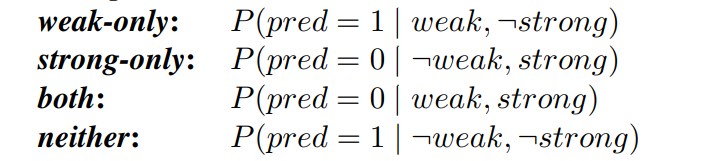

# When does data augmentation help generalization in NLP?
[toc]
https://arxiv.org/pdf/2004.15012v1.pdf

## Abstract
- 神经模型通常利用肤浅的（“弱”）特征来获得良好的性能，而不是派生我们更喜欢的使用模型的泛化（“强”）特征
- 克服这种趋势是表征学习和机器学习公平性等领域的主要挑战
- 最近的工作提出了使用数据增强（即生成这些弱特征失败的训练示例）作为鼓励模型偏爱更强功能的方法
- 通过训练针对弱特征失败的示例（“反例”）可以成功地防止模型依赖弱特征，但通常不会成功地鼓励模型使用一般更强大的特征
- 达到给定错误率所需的反例数与训练数据的数量无关，并且随着目标强特征变得更难学习，这种类型的数据增强变得无效
- 例如：使用同义词扩展，增加模型对单个词的泛化

## 1 Introduction
- 最近的研究通过强调模型在针对包含“反例”的目标挑战集进行评估时如何失败而暴露了这种趋势，在“反例”中，弱特征会导致错误的响应
  - 在视觉问题解答中，模型在使用稀有颜色描述（“绿色香蕉”）进行测试时失败
  - 模型在对不常见的职业-性别配对（“护士照顾他的病人”）进行测试时失败
  - 在自然语言推理（NLI）中，模型在词汇对重叠且含义不同的句子对上失败，（“ 人咬狗 / 人咬狗”）

- 建议的解决方案是增加训练数据以过度代表这些尾部事件，通常使用自动或半自动方法来大规模生成此类反例
- 但是，除了数据扩充所针对的特定现象之外，很难知道这种策略是否总体上是改进系统的可行方法。了解添加此类训练示例的条件会导致模型从使用较弱的特征切换为较强的特征，这对NLP的实践和理论工作都至关重要

- 设计了一组玩具学习问题，以探讨上述类型的数据增强何时（或是否）有助于模型学习更强大的特征
- 在典型的NLP任务数据集中考虑一种简单的神经分类器
  - 标记的输入数据显示与标记相关的弱特征, 模型被端到端训练
- 研究问题是
  - 为了防止模型采用给定的弱特征，在​​训练中必须看到多少反例？更大的训练集需要更多的反例还是更少的反例？
  - 表示特征（强或弱）的相对难度是否会在模型是否采用时产生影响？
  - 数据增强的有效性如何在包含许多弱特征但仅一个强特征的数据集中发生变化？

## 2 Experimental Setup
### 2.1 Intuition
- 研究是基于McCoy 等人提出的两个经验发现
  - 着眼于自然语言推理（NLI）任务中模型对句法启发式方法的使用：给定一对句子-前提p和假设h-预测p是否包含h
  - 在训练中看到的30万个句子对中有1％出现词法重叠（即h中的每个单词都出现在p中），而词法重叠的句子对中有90％带有标签蕴涵，模型采用（不正确）词汇重叠总是与蕴涵相对应的启发法
  - 自动增强生成的训练样本的训练数据之后，以使300K中10％，表现出词汇重叠，并且词汇重叠句对50％的具有标签蕴涵，同样的模式并没有采用启发式，似乎学习普遍适用于域外测试分布的功能

- 从这些结果来看
  - 很难说训练数据集的哪些更改对于模型的通用性提高最为重要
  - 在训练中看到多少词汇重叠的例子？给定的一对词汇重叠表现出的概率蕴涵？还是其他训练示例中的其他一些积极方面？

### 2.2 Assumptions and Terminology
- 考虑一个序列二分类任务。我们假设存在一些可以直接确定正确标签的特征，但是在给定原始输入的情况下，提取这些特征并非易事, 在NLI中，理想情况下，这种特征是h的语义是否包含p的语义, 称为强特征, 假设输入包含一个或多个弱特征，模型可以轻松地从输入中提取这些弱特征。（这类似
p和h之间的词汇重叠）
- 当且仅当强特征成立时，正确的标签才是1
  - 强特征和弱特征经常在训练中同时出现，因此仅代表弱特征的模型将能够在很多时间做出正确的预测
  - 我们可以通过在训练数据中添加反例来改变它们的同时出现率，在这些数据中要么存在强特征，要么存在弱特征

### 2.3 Implementation
- Task
  -  sequences of numbers as input
  -   binary {0, 1} labels as output
  -  sequences of length 5 and set |V | to be 50K

- Model
  - 包括一个嵌入层，一个1层LSTM和一个具有RELU激活的1层MLP
  - 使用尽早停止训练所有模型，直到收敛为止

- Strong and Weak Features
  - weak feature to be the presence of the symbol 2 anywhere in the input
  - strong features
  
  - 设计训练和测试拆分，以便在训练过程中用于实例化强特征的符号永远不会在测试过程中用于实例化强特征
  - 如，对于使用相邻重复项的实验，如果模型在测试时看到字符串1 4 3 3 15，则我们强制其从未在训练看到任何重复项3 3的
    - 确保我们正在测量模型是否学习了所需的模式，并且没有简单地记住二元组

- 量化表示每个强特征的难度
  - 任务使用了一组200K训练示例，该示例在每个特征确实存在时和不存在之间进行划分，判断其是否存在该特征
  - 图2显示了验证损失曲线（在三个运行中平均），并在其最小值（即，其早期停止点）处平坦
  - 作为“难度”的启发式度量，我们使用此平坦损耗曲线（AUC）下的近似面积，该面积通过取所有历时的误差总和来计算

### 2.4 Error Metrics
- Definition
  - 将测试错误分为以下四个感兴趣的区域
  
  - Both 和 neither 两个误差指标均接近或接近零（除了少数边缘情况)

- Interpretation
  - 高的weak-only错误指示模型正在将弱特征与正标签相关联，而高的strong-only错误指示模型要么未完全检测到强特征，要么正在检测到强特征但未将其与正标签关联
  - 在关于偏见和公平的工作中，主要针对weak-only错误
    - 主要目标是确保模型不会错误地将受保护的属性与特定标签或结果相关联
  - 关于更广泛地提高NLP鲁棒性的讨论，针对strong-only错误。也就是说，我们希望通过减少浅层启发式算法的有效性，鼓励模型在其位置上学习更深入，更强大的特征

### 2.5 Data Augmentation
- Definition
  - 对抗性数据增强旨在通过生成使强特征和弱特征脱钩的新训练示例来减少上述错误
  - weak-only counterexamples
    - 弱特征出现时没有强特征，标签为0
  - strong-only counterexamples
    - 强特征出现而没有弱特征，并且标签是1

- Interpretation
  - 仅弱特征的反例很容易获得，而强特征反例的构建更麻烦
    - 再次考虑NLI的情况和McCoy 等人的词汇重叠试探
      - 使用一组设计良好的语法模板可以轻易地人工生成weak-only的反例（具有大量词法重叠的p/h对，但没有必然关系）
  - 在现实问题中，我们可能要删除许多弱特征，并且/或者不可能将强特征与所有弱特征完全隔离开

### 2.6 Limitations
- 简化了问题，以便进行可控且可解释的实验
  - 在附录中提供了许多其他结果来显示不同模型和任务数据集之间的一致性，但我们并不主张所提供的结果适用于更复杂的模型和任务
- 假设模型的输入包含单个“真实”功能，一旦提取该特征，就可以完美地解释输出
  - 对于NLP中当前研究的许多任务，可以说这种假设永远不会成立，或者说，模型只能访问强大特征的相关性
  - 对于像NLI这样的任务，可能我们的模型可以做的最好的事情就是发现“含义”之间越来越紧密的关联，但可能永远不会提取“含义”本身

## 3 Results and Discussion
- 主要的研究问题如下
  - 为了减少模型的预测误差，需要多少个反例? 此数字如何受到强特征的难度，添加的反例的类型（即  strong-only vs.  weak-only）以及训练集的大小的影响
  - 在存在多个弱特征的情况下，该模型是否更愿意基于多个弱特征进行决策，还是提取单个强特征
  - strong-only错误和weak-only报告所有结果错误; 其他错误类别的结果在附录C中给出

### 3.1 Effect of Strong Feature’s Hardness
- 考虑预测误差与添加的反例数量以及检测强特征的难度的函数
- 构建了一个200K样本的初始训练集，其中强特征和弱特征之间完美共现，数据集在正样本（例如同时具有强和弱特征）和负样本（都没有）
- 改变添加的反例的数量从 10（ ⋘ 0.1 ％的训练数据），以100 K（占训练数据的 33 ％），测量对strong-only错误和weak-only错误的影响。现在，我们假设添加的反例在strong-only类型和weak-only类型之间平均分配

- 所需的反例的数量在很大程度上受到强特征难度的影响。例如，仅将10个反例添加到训练中后，当强特征包含1（对于要检测的模型而言这是微不足道的）时，测试错误已降至接近零，但对于包含第一个和相邻重复特征的测试错误几乎保持不变。对于较难的功能，直到三分之一的训练数据由反例组成，我们才达到零错误

### 3.2 Effect of Counterexample Type
- 添加weak-only的反例可以导致weak-only的错误得到改善，但是对strong-only的错误的影响却很小。有趣的例外是，强特征并不比弱特征更难于表示情况。在我们的数据集中，当强特征包含1时会发生这种情况，但尚不清楚此模式是否适用于其他弱特征。在这种情况下，我们发现仅添加了少量的weak-only反例后，strong-only误差和weak-only误差都降为零
  

- 相反添加strong-only反例会同时影响两种错误
  - 对weak-only错误的影响仅限于强特征易于检测的数据集
  - 当强特征是不易察觉，加上strong-only的反例也导致模型检测强特征并将其正确与正标签相关联，但不必然导致模型放弃在预测阳性标签时使用弱特征
  - 这种行为很有趣，因为根据定义，使用弱特征进行的任何正确预测都比使用强特征进行的预测准确，因此继续保持弱特征只会损害性能

### 3.3 Effect of Training Data Size
- 对于我们的大多数特征，该模型只有在其训练数据的20％或更多由反例组成时才达到接近零的误差
  - 错误率是否可以根据所添加的反例的绝对数量更好地建模，或者更确切地说，这些反例所占训练数据的一部分？
  - 直觉激发了这个实验，较大的初始训练集可能会“稀释”相对较小的反例集所提供的信号，因此较大的训练集可能需要更多的反例才能达到相同的错误水平

- 在保持反例数量固定的同时增加训练量不会对误差度量产生正面或负面的影响
- 有几个值得注意的例外。尤其是
  - 当训练集相对于反例的数量（<500 K）非常大（10M）时，这些反例的功效确实下降了
  - 取决于强特征的差异，与较简单的特征（first-last duplicate and prefix duplicate）相比，较难的特征能（contains first and adjacent duplicate）在行为上更符合上述“稀释”直觉

### 3.4 Multiple Weak Features
- 通过组合多个弱特征来最小化损失的选项是否会降低模型提取强特征的意愿？

- 假设有k个弱特征d1，…，dk，每个特征都与强特征t相关，但除了与t的相关性外，它们彼此不相关
  - initial
      - P(t|di) is 1, and P(di|t) is close to 1/2
      -  weak-only counterexamples 与上面类似
      -  strong-only counterexamples cannot be generated perfectly
         -  考虑NLI数据集。一个人很容易产生带有标签矛盾的p/h对，但是这样做是在满足句子表现出词法重叠的约束的同时，但不包含任何反义对或显式否定可能会导致不自然且无益的训练句子
      -  对于给定的弱特征di，我们可以生成strong-only的反例
         -   definitely exhibit the strong feature
         -   definitely do not exhibit di
         -   exhibit every other weak features dj with probability P(dj |t)
   -   strong-only counterexamples are not “pure”
       -   they might contain weak features other than the one specifically targeted
       -   strong-only error is still computed on examples that are free of all weak features
       -   weak-only error is computed over examples that contain no strong feature and at least one weak features

- 固定反例数量的情况下，特征越弱，则有更高的stong-only错误。我们还看到，在可以生成“纯” stong-only反例的理想化设置中，这种趋势不成立，并且单个弱特征和多个弱特征设置之间没有差异。就weak-only错误而言，随着弱特征数量的增加，我们只会看到错误的少量增加。

## 4 Related Work
### 4.1 Adversarial Data Augmentation
- 最近的一波工作采用了一种策略，该策略构造由“对抗性示例”（也称为“挑战性示例”或“探测集”）组成的评估集，以便分析和揭示神经NLP模型

### 4.2 Adversarial Robustness
- 对抗性鲁棒性涉及当输入受到干扰以致其基本语义不变时，模型是否产生相同的输出
- 定义有效扰动集是NLP中的开放问题，其中，表面形式的微小变化可能会显着改变话语的基本含义（例如，删除“ not”）。但是，已经有人通过用同义词替换话语中的单词来构造扰动并通过释义生成新句子的工作

### 4.3 Encoding Structure in NLP Models
- 了解神经语言模型提取了哪些类型的特征，尤其是寻找证据证明SOTA模型超出了词袋表示形式并提取了关于语言结构的“更深层”特征

### 4.4 Generalization of Neural Networks
- 涉及到更大范围的工作，其目的是一般地理解神经网络中的特征表示和泛化
- 具有良好泛化性能的神经网络仍然可以轻松记住相同大小的噪声，这表明，当数据中确实存在结构时，即使记忆是同等可用的选项，模型可能还是会固有地倾向于学习一般特征
- 不同的架构在学习结构和记忆方面有不同的倾向

## 5 Conclusion
- 添加反例以鼓励模型“学习”弱特征可能会立即产生预期的效果（该模型在看起来类似于生成的反例的样例上将表现更好），但是该模型不太可能转移总体上依赖更强特征
- 针对反例训练的模型仍然无法正确地对仅包含强特征的示例进行分类。我们还看到，随着基本强特征变得更加难以提取以及数据中弱特征的数量增加，数据增强的效率可能会降低

