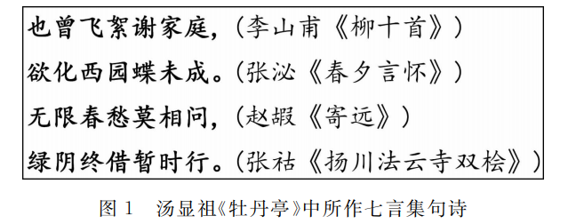
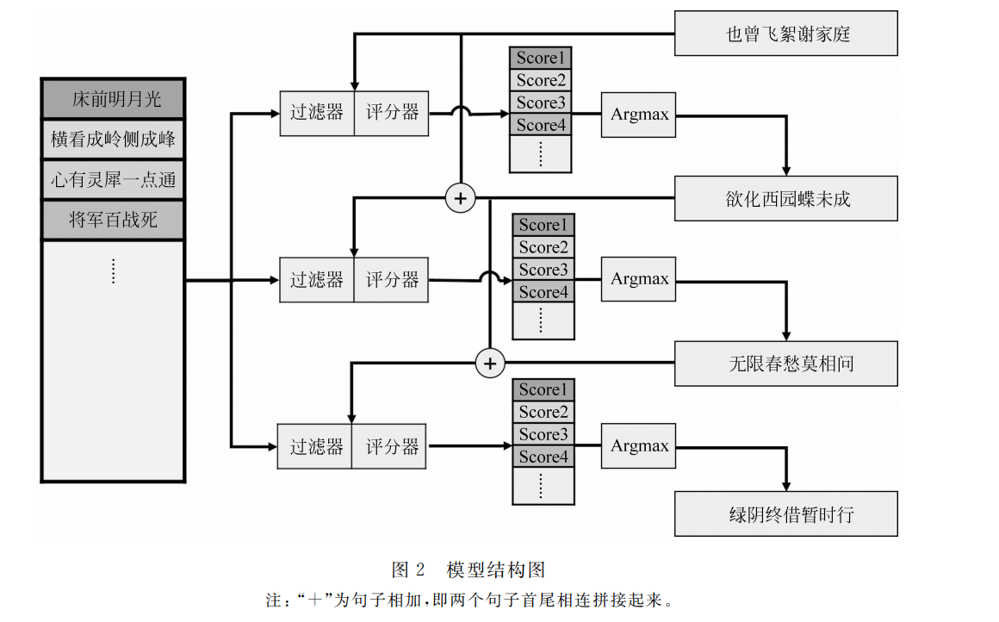
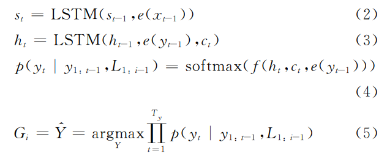
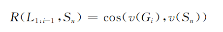
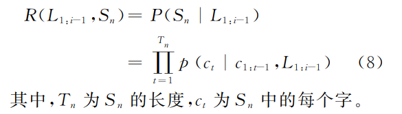
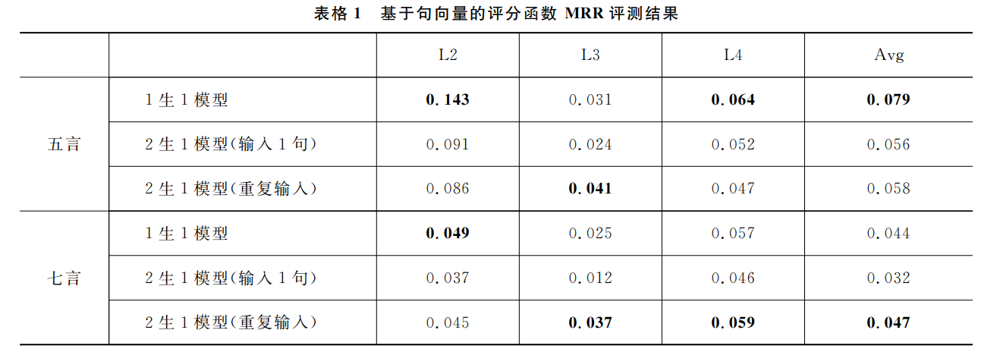
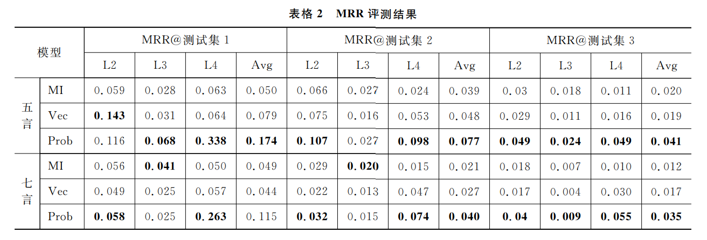
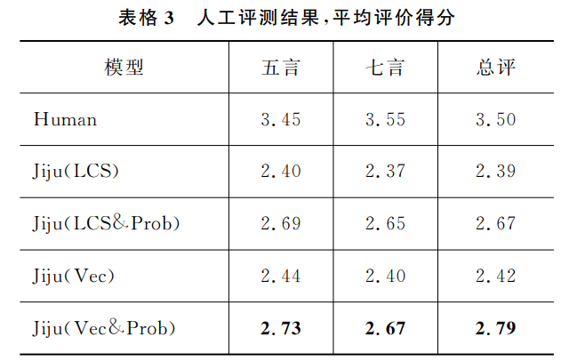
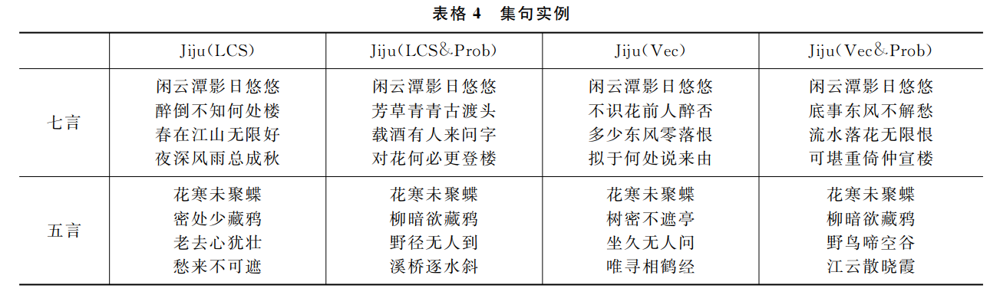

# 基于神经网络的集句诗自动生成
[toc]

- PAPER:  http://jcip.cipsc.org.cn/CN/volumn/volumn_1312.shtml#

## 摘要
集句诗是从已有诗句中选择多句组成新诗歌
- 内容完整
- 连贯上下文
- 新颖主题意旨

## 0 引言

## 2 模型设计
### 2.1 任务以及模型描述

在选取了L1, Li-1的基础上，从诗歌库中自动选取一句符合对应的言数、平仄、韵律并且和L1:i-1在语义、主题和意境上连贯一致的诗句，直到生成一首完整的集句诗歌

### 2.2 基于生成结果语义相似性的评分函数
基于编解码模型先生成诗歌，然后再根据生成的诗句去寻找相似的诗句

基于上文的诗歌的已写句数，分别训练多个seq2seq进行生成，通常采用一句生成一句来生成第二句，二句生成一句来生成其他句子

相似度计算方法
- 最大公共子序列，考虑实字和虚字对语义贡献的不同
    - 局部匹配
    - 无法处理近义词、同义词
- 基于句向量余弦距离的相似性度量
    - 将诗歌输入2式LSTM encoder中，根据句长平均，然后计算
    

### 2.3 基于上下文生成概率的评分函数
- 由于生成的实际计算往往是贪心算法或者Beam Search，最大值难取到

直接基于上文对判断下文生成新集句的概率

### 2.4 多方法结合的评分函数
为了速度考虑
- 格律等进行初筛
- 先采用相似性进行初步筛选
- 然后再基于上下文概率进行最终选择

## 3 实验
- seq2seq
    - 隐藏层 512, embedding 256, tanh
    - adam, 0.001, batch 64, 10 epoch

MRR(Mean Reciprocal Rank)
: 标准答案在被给出结果中名次的倒数作为准确度

MI为基于互信息的基线模式
: 

评分方法
: 使用诗歌的第一句、第一二句、第一二三句分别生成下一句作为标准答案
然后以三种方法选择其他的999句作为三组非标准答案集合
  1. 同言随机选择
  2.  同言、同格律、同韵脚
  3. 同言、同格律、同韵脚、匹配两个字以上

人工评测
: 收集50首人工创作的诗歌，然后让人进行评分
  

