# Attention Is All You Need
[toc]

PAPER: https://arxiv.org/pdf/1706.03762.pdf
CODE: [TENSOR2TENSOR](https://github.com/tensorflow/tensor2tensor)
## Abstract
- 主流序列转导模型基于复杂的循环神经网络或卷积神经网络，这些神经网络包含一个编码器和一个解码器
- 我们提出一种新的简单的网络架构Transformer，仅基于attention机制并完全避免循环和卷积

## 1 Introduction
- 循环模型通常是对输入和输出序列的符号位置进行因子计算。 通过在计算期间将位置与步骤对齐，它们根据前一步的隐藏状态ht-1和输入产生位置t的隐藏状态序列ht。这种固有的顺序特性阻碍样本训练的并行化，这在更长的序列长度上变得至关重要，因为有限的内存限制样本的批次大小
- 在各种任务中，attention机制已经成为序列建模和转导模型不可或缺的一部分，它可以建模依赖关系而不考虑其在输入或输出序列中的距离

## 2 Background
- 减少顺序计算的目标也构成扩展的神经网络GPU、ByteNet和ConvS2S的基础，它们都使用卷积神经网络作为基本构建模块、并行计算所有输入和输出位置的隐藏表示。 在这些模型中，关联任意两个输入和输出位置的信号所需的操作次数会随着位置之间的距离而增加，ConvS2S是线性增加，而ByteNet是对数增加。 这使得学习远程位置之间的依赖性变得更加困难
- 在Transformer中，这种操作减少到固定的次数，尽管由于对用attention权重化的位置取平均降低了效果，但是我使用Multi-Head Attention进行抵消
- Self-attention，有时称为intra-attention，是一种attention机制，它关联单个序列的不同位置以计算序列的表示。 Self-attention已成功用于各种任务，包括阅读理解、摘要概括、文本蕴涵和学习与任务无关的句子表征

## 3 Model Architecture

- 大部分神经序列转导模型都有一个编码器-解码器结构。 这里，编码器映射一个用符号表示的输入序列(x1,...,xn) 到一个连续的表示z = (z1,...,zn)。 根据z，解码器生成符号的一个输出序列(y1,...,ym) ，一次一个元素。 在每一步中，模型都是自回归的，当生成下一个时，使用先前生成的符号作为附加输入。
-  Transformer遵循这种整体架构，编码器和解码器都使用self-attention堆叠和point-wise、完全连接的层，分别显示在图1的左边和右边。

### 3.1 Encoder and Decoder Stacks
编码器
: 编码器由N = 6 个完全相同的层堆叠而成。 每一层都有两个子层。 第一个子层是一个multi-head self-attention机制，第二个子层是一个简单的、位置完全连接的前馈网络。 我们对每个子层再采用一个残差连接，接着进行层标准化。 也就是说，每个子层的输出是LayerNorm(x + Sublayer(x))，其中Sublayer(x) 是由子层本身实现的函数。 为了方便这些残差连接，模型中的所有子层以及嵌入层产生的输出维度都为dmodel = 512

解码器
: 解码器同样由N = 6 个完全相同的层堆叠而成。 除了每个编码器层中的两个子层之外，解码器还插入第三个子层，该层对编码器堆栈的输出执行multi-head attention。 与编码器类似，我们在每个子层再采用残差连接，然后进行层标准化。 我们还修改解码器堆栈中的self-attention子层，以防止位置关注到后面的位置。 这种掩码结合将输出嵌入偏移一个位置，确保对位置的预测 i 只能依赖小于i 的已知输出

### 3.2 Attention
- Attention函数可以描述为将query和一组key-value对映射到输出，其中query、key、value和输出都是向量。 输出为value的加权和，其中分配给每个value的权重通过query与相应key的兼容函数来计算

#### 3.2.1 Scaled Dot-Product Attention

- 特殊的attention为“缩放版的点积attention”。 输入由query、dk 维的key和dv 维的value组成。 我们计算query和所有key的点积、用√-- dk相除，然后应用一个softmax函数以获得值的权重

- 在实践中，我们同时计算一组query的attention函数，并将它们组合成一个矩阵Q。 key和value也一起打包成矩阵 K 和 V 。 我们计算输出矩阵为
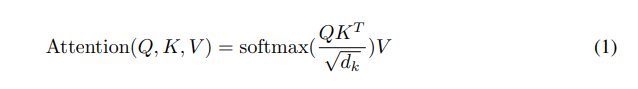

- 个最常用的attention函数是加法attention和点积（乘法）attention。 除了缩放因子1/ √dk之外，点积attention与我们的算法相同。 加法attention使用具有单个隐藏层的前馈网络计算兼容性函数。 虽然两者在理论上的复杂性相似，但在实践中点积attention的速度更快、更节省空间，因为它可以使用高度优化的矩阵乘法代码来实现。

- 当dk的值比较小的时候，这两个机制的性能相差相近，当dk比较大时，加法attention比不带缩放的点积attention性能好。 我们怀疑，对于很大的dk值，点积大幅度增长，将softmax函数推向具有极小梯度的区域。 为了抵消这种影响，我们缩小点积1/√ dk倍

#### 3.2.2 Multi-Head Attention
- 我们发现将query、key和value分别用不同的、学到的线性映射h倍到dk、dk和dv维效果更好，而不是用d model维的query、key和value执行单个attention函数。 基于每个映射版本的query、key和value，我们并行执行attention函数，产生dv 维输出值。 将它们连接并再次映射，产生最终值

- Multi-head attention允许模型的不同表示子空间联合关注不同位置的信息。 如果只有一个attention head，它的平均值会削弱这个信息
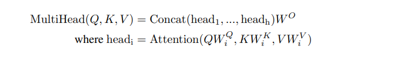

- 其中，映射为参数矩阵WiQ ∈ ℝdmodel×dk , WiK ∈ ℝdmodel×dk , WiV ∈ ℝdmodel×dv 及W O ∈ ℝhdv×dmodel
- 在这项工作中，我们采用h = 8 个并行attention层或head。 对每个head，我们使用dk =dv =dmodel ∕ h = 64。 由于每个head的大小减小，总的计算成本与具有全部维度的单个head attention相似

#### 3.2.3 Applications of Attention in our Model
Transformer使用以3种方式使用multi-head attention：

- 在“编码器—解码器attention”层，query来自上面的解码器层，key和value来自编码器的输出。 这允许解码器中的每个位置能关注到输入序列中的所有位置。 这模仿序列到序列模型中典型的编码器—解码器的attention机制
 
- 编码器包含self-attention层。 在self-attention层中，所有的key、value和query来自同一个地方，在这里是编码器中前一层的输出。 编码器中的每个位置都可以关注编码器上一层的所有位置

- 类似地，解码器中的self-attention层允许解码器中的每个位置都关注解码器中直到并包括该位置的所有位置。 我们需要防止解码器中的向左信息流来保持自回归属性。 通过屏蔽softmax的输入中所有不合法连接的值（设置为-∞），我们在缩放版的点积attention中实现

### 3.3 Position-wise Feed-Forward Networks
- 除了attention子层之外，我们的编码器和解码器中的每个层都包含一个完全连接的前馈网络，该前馈网络单独且相同地应用于每个位置。 它由两个线性变换组成，之间有一个ReLU激活
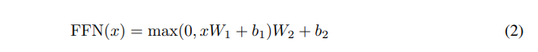

- 尽管线性变换在不同位置上是相同的，但它们层与层之间使用不同的参数。 它的另一种描述方式是两个内核大小为1的卷积。 输入和输出的维度为dmodel = 512，内部层的维度为dff = 2048

### 3.4 Embeddings and Softmax
与其他序列转导模型类似，我们使用学习到的嵌入将输入词符和输出词符转换为维度为dmodel的向量。 我们还使用普通的线性变换和softmax函数将解码器输出转换为预测的下一个词符的概率。 在我们的模型中，两个嵌入层之间和pre-softmax线性变换共享相同的权重矩阵，类似于[30]。 在嵌入层中，我们将这些权重乘以√ dmodel

### 3.5 Positional Encoding
- 由于我们的模型不包含循环和卷积，为了让模型利用序列的顺序，我们必须注入序列中关于词符相对或者绝对位置的一些信息。 为此，我们将“位置编码”添加到编码器和解码器堆栈底部的输入嵌入中。 位置编码和嵌入的维度dmodel相同，所以它们俩可以相加。 有多种位置编码可以选择，例如通过学习得到的位置编码和固定的位置编码

- 在这项工作中，我们使用不同频率的正弦和余弦函数：

其中pos 是位置，i 是维度。 也就是说，位置编码的每个维度对应于一个正弦曲线。 这些波长形成一个几何级数，从2π 到10000 ⋅ 2π。 我们选择这个函数是因为我们假设它允许模型很容易学习对相对位置的关注，因为对任意确定的偏移k, PEpos+k可以表示为PEpos的线性函数

- 我们还使用学习到的位置嵌入进行了试验，发现这两个版本产生几乎相同的结果。 我们选择了正弦曲线，因为它可以允许模型推断比训练期间遇到的更长的序列

## 4 Why Self-Attention
- 我们比较self-attention与循环层和卷积层的各个方面，它们通常用于映射变长的符号序列表示(x1,...,xn) 到另一个等长的序列(z1,...,zn)，其中xi,zi ∈ ℝd，例如一个典型的序列转导编码器或解码器中的隐藏层。 我们使用self-attention是考虑到解决三个问题
    - 一个是每层计算的总复杂度
    - 另一个是可以并行的计算量，以所需的最小顺序操作的数量来衡量
    - 第三个是网络中长距离依赖之间的路径长度。 学习长距离依赖性是许多序列转导任务中的关键挑战。 影响学习这种依赖性能力的一个关键因素是前向和后向信号必须在网络中传播的路径长度。 输入和输出序列中任意位置组合之间的这些路径越短，学习远距离依赖性就越容易。 因此，我们还比较了由不同图层类型组成的网络中任意两个输入和输出位置之间的最大路径长度

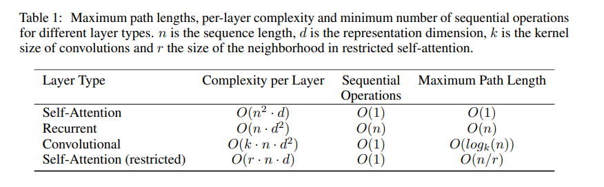
如表1所示，self-attention层将所有位置连接到恒定数量的顺序执行的操作，而循环层需要O(n) 顺序操作。 在计算复杂性方面，当序列长度n 小于表示维度d 时，self-attention层比循环层快，这是机器翻译中最先进的模型最常见情况，例如单词表示法和字节对表示法。 为了提高涉及很长序列的任务的计算性能，可以将self-attention限制在仅考虑大小为r 的邻域。 这会将最大路径长度增加到O(n ∕ r)。 我们计划在未来的工作中进一步调查这种方法。

- 核宽度为k < n的单层卷积不会连接每一对输入和输出的位置。 要这么做，在邻近核的情况下需要O(n∕k) 个卷积层， 在扩展卷积的情况下需要O(logk(n)) 个层，它们增加了网络中任意两个位置之间的最长路径的长度。 卷积层通常比循环层更昂贵，与因子k有关。然而，可分卷积大幅减少复杂度到O(k ⋅n⋅d + n⋅d2)。 然而，即使k = n，一个可分卷积的复杂度等同于self-attention层和point-wise前向层的组合，即我们的模型采用的方法。
- 间接的好处是self-attention可以产生更可解释的模型。 我们从我们的模型中研究attention的分布，并在附录中展示和讨论示例。 每个attention head不仅清楚地学习到执行不同的任务，许多似乎展现与句子的句法和语义结构的行为

## 5 Training
### 5.1 Training Data and Batching
- 在标准的WMT 2014英语-德语数据集上进行了训练，其中包含约450万个句子对。 这些句子使用字节对编码进行编码，源语句和目标语句共享大约37000个词符的词汇表。 对于英语-法语翻译，我们使用大得多的WMT 2014英法数据集，它包含3600万个句子，并将词符分成32000个word-piece词汇表。 序列长度相近的句子一起进行批处理。 每个训练批次的句子对包含大约25000个源词符和25000个目标词符

### 5.2 Hardware and Schedule
- 在一台具有8个NVIDIA P100 GPU的机器上训练我们的模型。 使用本文描述的超参数的基础模型，每个训练步骤耗时约0.4秒。 我们的基础模型共训练了10万步或12小时。 大模型每步需要1秒，大模型训练了30万步（3.5天）

### 5.3 Optimizer
- 我们使用Adam优化器，其中β1 = 0.9, β2 = 0.98及ϵ= 10-9。 我们根据以下公式在训练过程中改变学习率
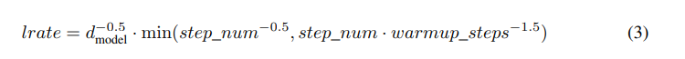
- 这对应于在第一次warmup_steps 步骤中线性地增加学习速率，并且随后将其与步骤数的平方根成比例地减小。 我们使用warmup_steps = 4000

### 5.4 Regularization
训练期间我们采用三种正则化：

- 残差Dropout 我们将Dropout应用到每个子层的输出，在将它与子层的输入相加和规范化之前。 此外，在编码器和解码器堆栈中，我们将Dropout应用到嵌入和位置编码的和。 对于基本模型，我们使用Pdrop = 0.1丢弃率
- Label Smoothing 在训练过程中，我们使用的label smoothing的值为ϵls = 0.1。 这让模型不易理解，因为模型学得更加不确定，但提高了准确性和BLEU得分
- 
## 6 Results
### 6.1 Machine Translation
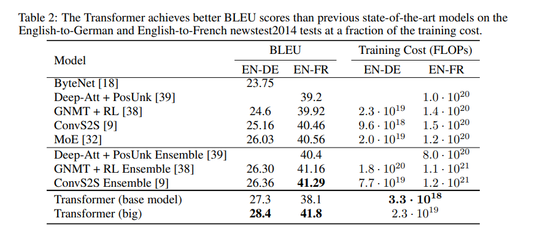

### 6.2 Model Variations
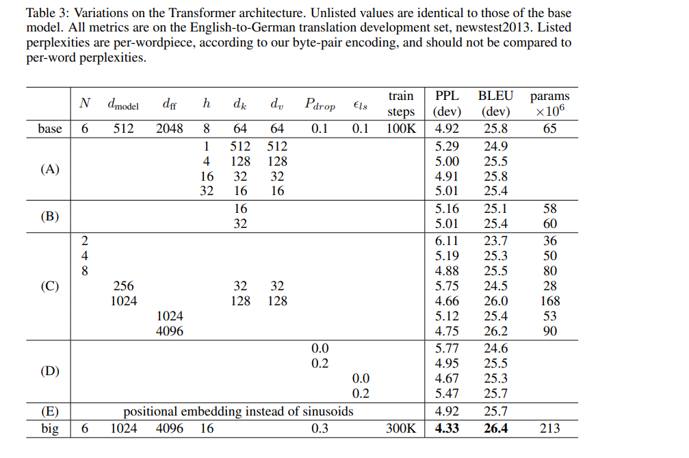
- 在表3的行（A）中，我们改变attention head的数量和attention key和value的维度，保持计算量不变，如3.2.2节所述。 虽然只有一个head attention比最佳设置差0.9 BLEU，但质量也随着head太多而下降。
- 在表3行（B）中，我们观察到减小key的大小dk会有损模型质量。 这表明确定兼容性并不容易，并且比点积更复杂的兼容性函数可能更有用。 我们在行（C）和（D）中进一步观察到，如预期的那样，更大的模型更好，并且Dropout对避免过度拟合非常有帮助。 在行（E）中，我们用学习到的位置嵌入来替换我们的正弦位置编码，并观察到与基本模型几乎相同的结果。

### 6.3 English Constituency Parsing
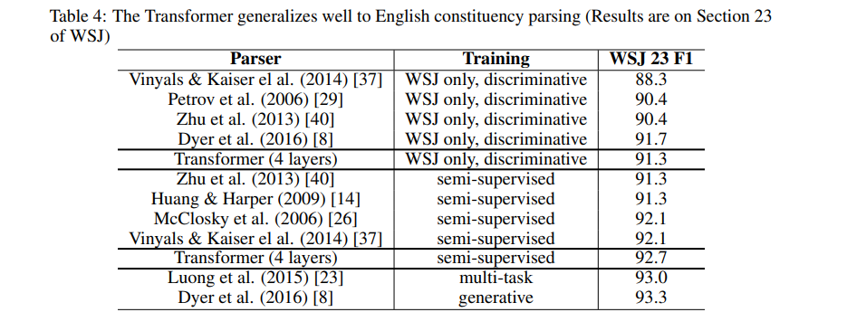

## 7 Conclusion
在这项工作中，我们提出了Transformer，第一个完全基于关注的序列转导模型，用multi-headed self-attention取代了编码器-解码器架构中最常用的循环层。

对于翻译任务，Transformer可以比基于循环或卷积层的体系结构训练更快。 在WMT 2014英语-德语和WMT 2014英语-法语翻译任务中，我们取得了最好的结果。 在前面的任务中，我们最好的模型甚至胜过以前报道过的所有整合模型。

我们对基于attention的模型的未来感到兴奋，并计划将它们应用于其他任务。 我们计划将Transformer扩展到除文本之外的涉及输入和输出模式的问题，并调查局部的、受限attention机制以有效处理大型输入和输出，如图像、音频和视频。 让生成具有更少的顺序性是我们的另一个研究目标。

## 可视化
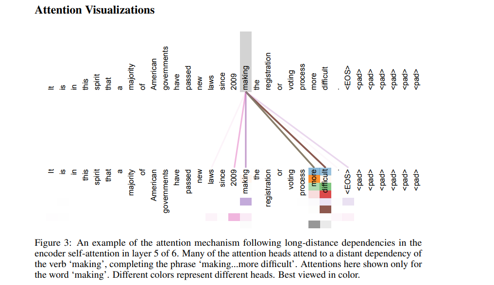
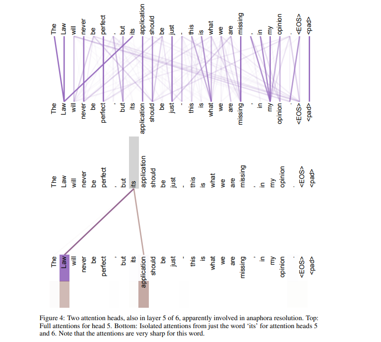
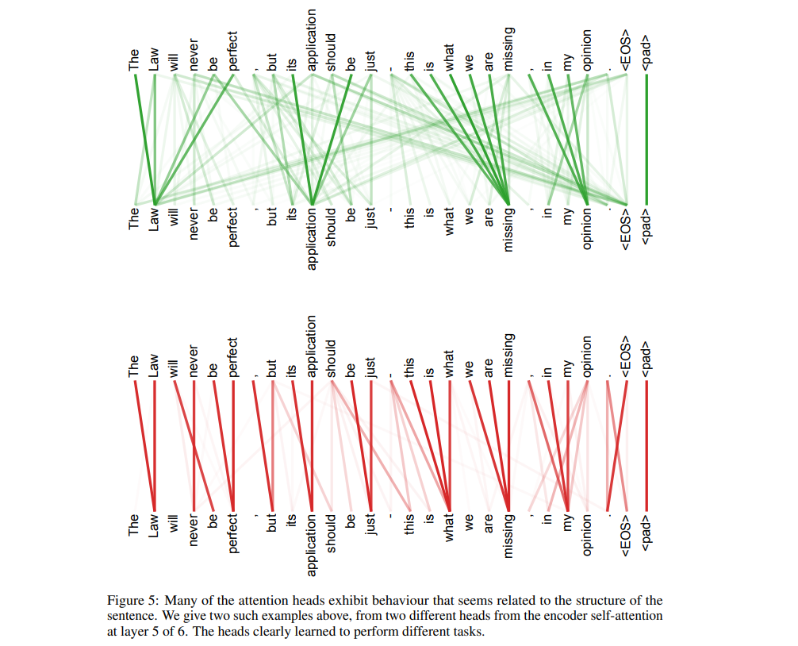