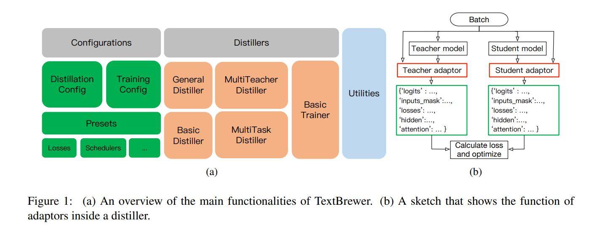
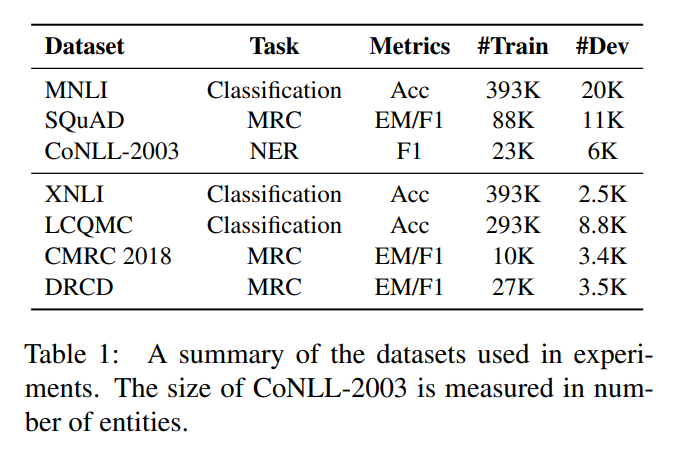
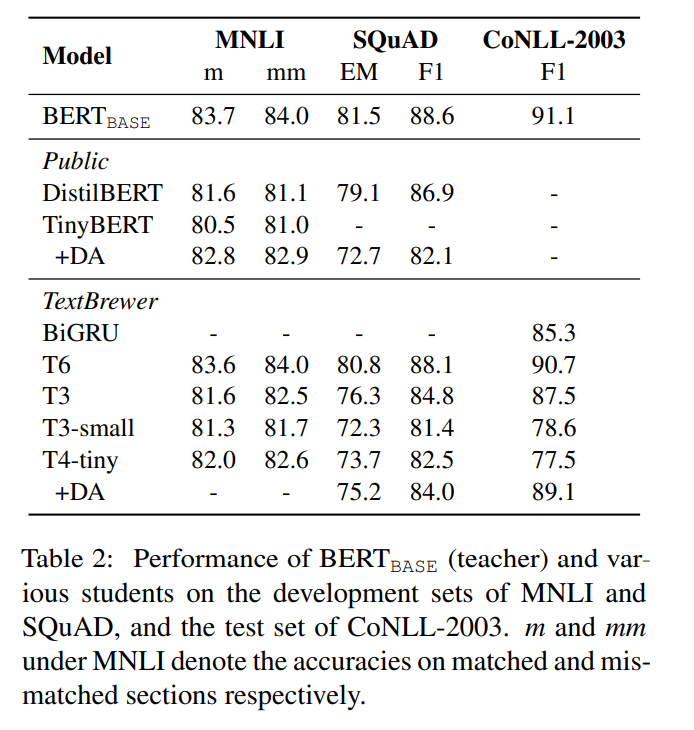
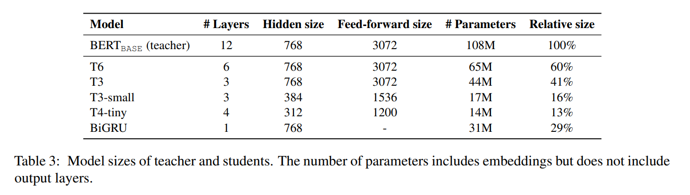
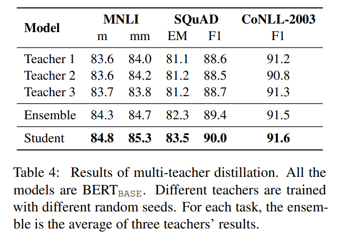
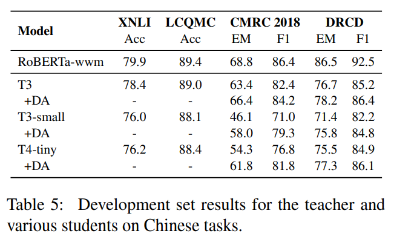

<!-- TOC -->

- [TextBrewer: An Open-Source Knowledge Distillation Toolkit for Natural Language Processing](#textbrewer-an-open-source-knowledge-distillation-toolkit-for-natural-language-processing)
  - [ABSTRACT](#abstract)
  - [1 INTRODUCTION](#1-introduction)
  - [2 RELATED WORK](#2-related-work)
  - [3 ARCHITECTURE AND DESIGN](#3-architecture-and-design)
  - [4 EXPERIMENTS](#4-experiments)

<!-- /TOC -->
# TextBrewer: An Open-Source Knowledge Distillation Toolkit for Natural Language Processing
- https://arxiv.org/abs/2002.12620
- http://textbrewer.hfl-rc.com

## ABSTRACT
- 使用不同的神经网络模型工作，并支持各种任务，如文本分类、阅读理解、序列标记
- 提供了一个简单和统一的工作流程，可以快速建立具有高度灵活配置的蒸馏实验
- 获得的结果与最先进的性能相当甚至更高

## 1 INTRODUCTION
- 大型预训练语言模型通常有数亿个参数，需要几个千兆字节的内存来进行训练和推理——这使得将它们部署到移动或在线系统上变得不切实际
- 知识蒸馏(KD)是一种将知识从教师模型转化为学生模型的技术，这种技术通常比教师模型小。学生模型被训练来模拟教师模型的输出
- 工作流程: 首先对教师模型进行训练，然后通过减少教师和学生输出之间的计算损失来优化学生模型
- 我们希望有一个可重用的蒸馏工作流框架，并将不同的蒸馏策略和技巧视为插件，这样它们就可以轻松和任意地添加到框架中。通过这种方式，我们也可以在试验不同的蒸馏策略组合和比较它们的效果方面获得很大的灵活性
- TextBrewer 提供了简单易用的 api、一组蒸馏方法和高度可定制的配置
  - 任务和模型的多功能性。它适用于各种模型，从基于 rnn 的模型到基于 transformer 的模型。它不假定任何教师和学生模型的网络结构。它在文本分类、阅读理解分析和序列标注等任务中的可用性也经过了充分的测试
  - 配置的灵活性。蒸馏过程通过配置对象进行配置，配置对象可以从 JSON 文件初始化，并包含许多可调超参数。如果预设不满足用户的要求，他们可以扩展配置与新的自定义损失，调度等
  - 包括各种蒸馏方法和策略。KD 在计算机视觉领域得到了广泛的研究，并取得了巨大的成功。因为这些研究中的一些方法也可以应用到文本中，所以将这些研究引入到自然语言处理领域是值得的
    - flow of solution procedure (FSP) matrix loss Yim et al. (2017), neuron selectivity transfer (NST) Huang and Wang (2017), probability shift and dynamic temperature Wen et al. (2019), attention matrix loss, multi-task distillation Liu et al. (2019a)
  - 非侵入性和使用简单。非侵入性意味着不需要修改现有的模型代码

## 2 RELATED WORK
- TinyBERT
- ERNIE Slim

## 3 ARCHITECTURE AND DESIGN

- BasicDistiller 用于单任务单教师蒸馏; 
- GeneralDistiller 还支持更高级的中间损失函数; 
- MultiTeacherDistiller 将一组教师模型提取为单个学生模型; 
- MultiTaskDistiller 将不同任务的多个教师模型提取为单个多任务学生模型。
- BasicTrainer，对教师进行标记数据的培训，以统一监督式学习和蒸馏的工作流程。所有的蒸馏器共享相同的界面和用法。它们可以很容易地互相替换

---
- TrainingConfig 定义了深度学习实验常用的设置，包括存储日志和学生模型的目录(log_dir，output_dir)、要使用的设备(device)、存储和评估学生模型的频率(ckpt_frequencey)等
- DistillationConfig
  - KD loss (kd_loss_type), the temperature and weight of KD loss (temperature and kd_loss_weight), the weight of hard-label loss (hard_label_weight), probability shift switch, schedulers and intermediate losses
  - Schedulers are used to adjust loss weight or temperature dynamically
  - 配置选项(如损失函数和调度程序)的可用值在预设置中被定义为字典。例如，损失函数字典包括隐藏状态损失、余弦距离损失、 FSP 损失、 NST 损失等

---
- 在使用 TextBrewer 提取教师模型之前，必须完成一些初步工作
  - 在一个标记的数据集上训练一个教师模型
  - 定义和初始化学生模型
  - 为数据集构建一个 DataLoader，以便提取和初始化优化器和学习速率调度程序

- 进行蒸馏，请采取以下附加步骤
  - 初始化培训和蒸馏配置，并构建一个蒸馏器
  - 定义适配器和回调函数
  - 调用蒸馏器的训练方法

- Callback Function
  - 监控学生模型在训练过程中的表现，除了记录损失曲线之外，人们通常还会在一些检查点对学生模型进行评估
  - 回调函数接收两个参数: 学生模型和当前训练步骤
  - checkpoint (determined by num_train_epochs and ckpt_frequencey)

- Adaptor
  - 需要一个翻译器将模型输出转换为有意义的数据。适配器扮演译者的角色。适配器是一个接口，负责为蒸馏器解释老师和学生的输入和输出
  - Adaptor 接受两个参数: 模型输入和模型输出。它将返回一个带有特定键的字典

---
- TextBrewer 还可以使用用户的自定义模块。新的 LOSS 函数和调度器可以很容易地添加到工具包中

## 4 EXPERIMENTS
- 选择的损失函数是隐损，它计算两个隐状态之间的均方损失和 NST 损失
- 隐藏大小不同，我们使用 proj 选项添加线性层来匹配尺寸
- 数据增强至关重要。它显著地提高了性能，特别是对于训练集大小较小的情况

---

---

- 训练三个具有相同体系结构但种子不同的教师模型。这个**学生和老师有相同的体系结构**。学习速率设置为3e-5，并且不使用中间损失。表4显示了结果。学生模型的性能最好，比整体效果要好

---

