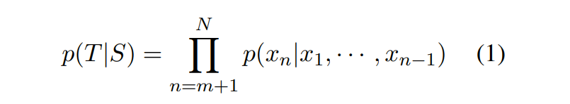
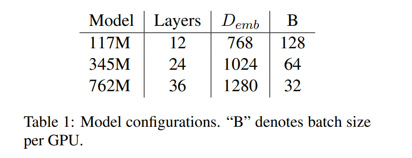
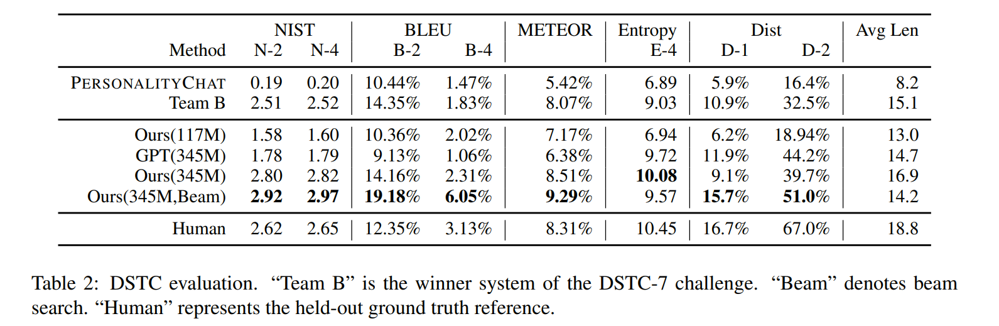
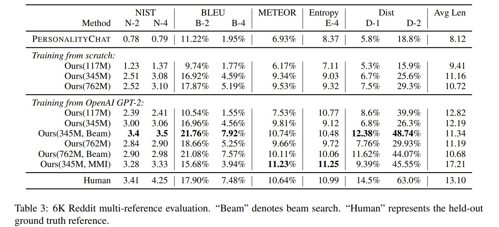
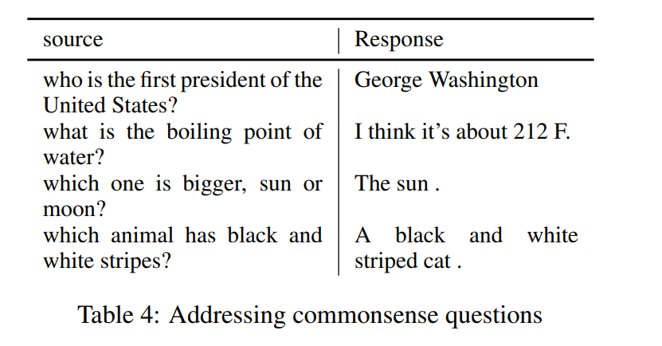
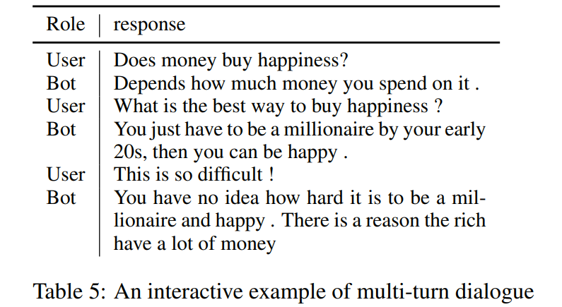
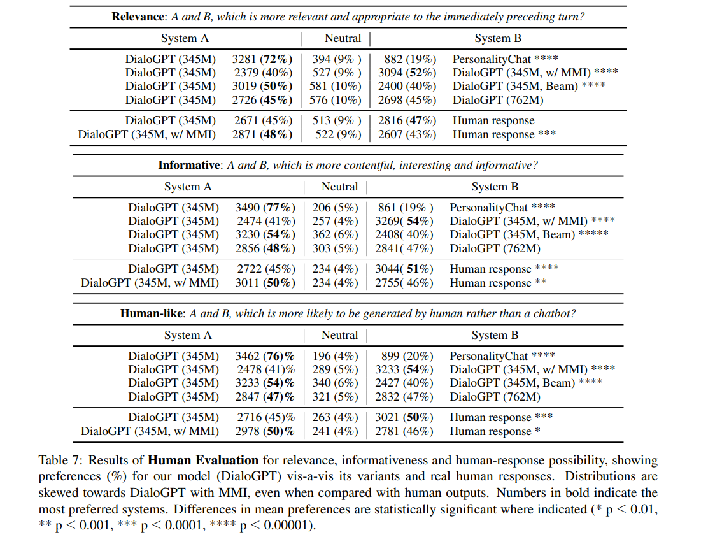

# DIALOGPT : Large-Scale Generative Pre-training for Conversational Response Generation
[toc]

论文地址: https://arxiv.org/pdf/1911.00536.pdf
项目地址: https://www.microsoft.com/en-us/research/project/large-scale-pretraining-for-response-generation/
代码地址: https://github.com/microsoft/DialoGPT
https://github.com/mgalley/DSTC7-End-to-End-Conversation-Modeling

### 1 Introduction
- GPT2可以捕捉长距离依赖，能够生成流畅、多样性、丰富的句子
- DialoGPT 是对 GPT-2 的扩展，目标是解决对话神经响应生成中的挑战性难题。神经响应生成是文本生成的一个子类。而文本生成任务的目标都是生成与提示有关联的看起来自然的文本（同时又与任何训练实例都不同）
- 建模对话面临着很多显著的难题，因为人类对话中两个参与者的目标可能是相互抵触的，而且可能响应的范围在本质上也更具多样性。因此，对话生成中的一对多问题通常比神经机器翻译、文本摘要和文本释义等其它文本生成任务的问题更为困难。人类对话通常更加不正式、噪声更多，而当以文本形式聊天时，通常还含有非正式的缩写或句法/词法错误
- 类似于 GPT-2，DialoGPT 是以自回归语言模型的形式构建的，其模型架构使用了多层 transformer。但不同于 GPT-2，DialoGPT 的训练使用了从 Reddit 讨论链中提取出的大规模对话对/会话
- 目的是为了DialoGPT 学到对话流中更细粒度的 P(Target, Source) 的联合分布，结果分析显示DialoGPT 生成的句子丰富多样而且包含特定于源提示的信息，类似于 GPT-2 为连续文本生成的结果
- 在DSTC-7和一个新的从 Reddit 帖子中提取出的 6k 大小的多参照测试数据集上对新提出的预训练模型进行了评估。结果表明，DialoGPT 在自动评估和人类评估方面都取得了当前最佳的表现，将对话生成结果的质量提升到了接近人类的水平

### 2 Dataset
- 2005 ～ 2007 Reddit 上面的评论链进行抽取的
- 从根节点到叶子节点作为一组多轮对话
- 筛选方法
    - 含有URL
    - 重复字包含3个以及以上
    - 不包含英语的top50词，可能为外语
    - 含有[], 可能为标志语言
    - 源和目标长度和超过200
    - 侮辱性词语，黑名单
    - 去掉回复中包含90%的tri-gram都出现1000次以上
-  147,116,725 dialogue instances, in total 1.8 billion words

### 3 Method
##### 3.1 Model Architecture
- DialoGPT 模型基于 GPT-2 架构。它从 GPT-2 继承了带有层归一化的 12 到 24 层 transformer、一种适用于经过作者修改的模型深度的初始化方案，用于 token 化器的字节对编码BPE。遵照 OpenAI 的 GPT-2 方法，作者将多轮对话会话建模为了长文本，将生成任务纳入到了语言建模任务的框架中
- 将一个对话会话中所有对话回合连接成一个长文本 x_1, · · · , x_N（N 为序列长度），并以「文本结束 token」结束。可将源句子（对话历史）记为 S = x_1, · · · , x_m，将目标句子（基本真值响应）记为 T = x_{m+1}, · · · , x_N，则 P(T|S) 的条件分布可以写为一系列条件概率的积

- 对于多轮对话实例 T_1, · · · , T_K，（1）式可写为 p(T_K, · · · , T_2|T_1)，这本质上就是 p(T_i |T_1, · · · , T_{i−1}) 的条件概率的积。最终，对单个目标 p(T_K, · · · , T_2|T_1) 的优化可以被视为是优化所有的 p(T_i |T_1, · · · , T_{i−1}) 源-目标对

##### 3.2 Mutual InformationMaximization
- 开放域文本生成模型有一个众所周知的困难，即会生成枯燥的、没有信息的样本
- MMI是利用一个预训练的后向模型来预测给定响应的源句子，即P(Source|target)
- 首先使用 top-K 采样生成一组假设，然后使用 P(Source|Hypothesis) 的概率来对所有假设重新排序
- 最大化后向模型似然会对所有枯燥的假设施加惩罚，因为频繁的和重复性的假设可能与很多可能的查询有关，因此在任意特定查询下得到的概率会更低

### 4 Result

##### 4.1 Experimental Details
模型设置
: 

##### 4.2 DSTC-7 Dialogue Generation Challenge
- 与另外两个基准进行了比较：序列到序列模型 PersonalityChat，基于 Twitter 数据训练的，已经在微软 Azure 的 Cognitive Service 得到了实际应用。表 2 总结了自动化评估的结果。有 345M 个参数的 DialoGPT 以及 BeamSearch 在几乎所有基准上都得到了最高的自动评估分数

##### 4.3 A New Reddit Multi-reference Dataset
在一个有 6K 个样本的多参照测试集上评估了 DialoGPT。结果见表 3。测试过程使用了两种设置：从头开始训练以及使用 GPT-2 作为预训练模型进行微调。在这两种设置中，更大的模型都总是优于更小的模型。

##### 4.4 Re-ranking The Response Using MMI
表 3 的倒数第二行总结了执行互信息最大化的结果，相比贪心算法获得更高的NIST, METEOR, Entropy, Dist, 对 BLEU 有轻微下降

##### 4.5 Generation Examples

- 模型表现出了在一定程度上解决常识问题的能力，作者猜想这可能要归功于 Reddit 数据中可以学习到的丰富信息
- 在某些案例中，模型并不是给出「所需的」答案，而会生成另一个可替代的合理答案。作者观察到，该系统能比 RNN 对话生成系统更好地处理多轮对话生成，而且往往在上下文方面更能保持一致

##### 4.6 Human Evaluation
- 众包评估了从 Reddit 6K 测试数据集随机采样的 2000 个测试源。系统经过了配对，每一对系统的输出都被随机呈现给 3 位评判者，他们会根据相关性、信息量和生成结果与人类结果的相似程度使用一个 3 分制的类 Likert 度量对这些结果进行排名。作者先要求这些评判者经过了一个资格测试，并采用了一种垃圾检测制度。表 7 给出了评判者在相关性、信息量和人类相似度方面的整体偏好，结果用原始数值与占整体的百分比来表示

### 5 Related work

### 6 Limitations and risks

### 7 Conclusion
