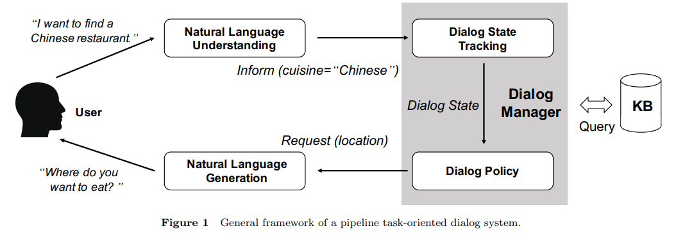
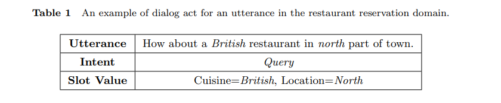
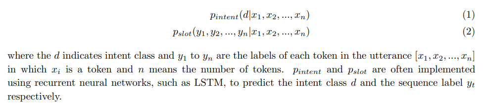
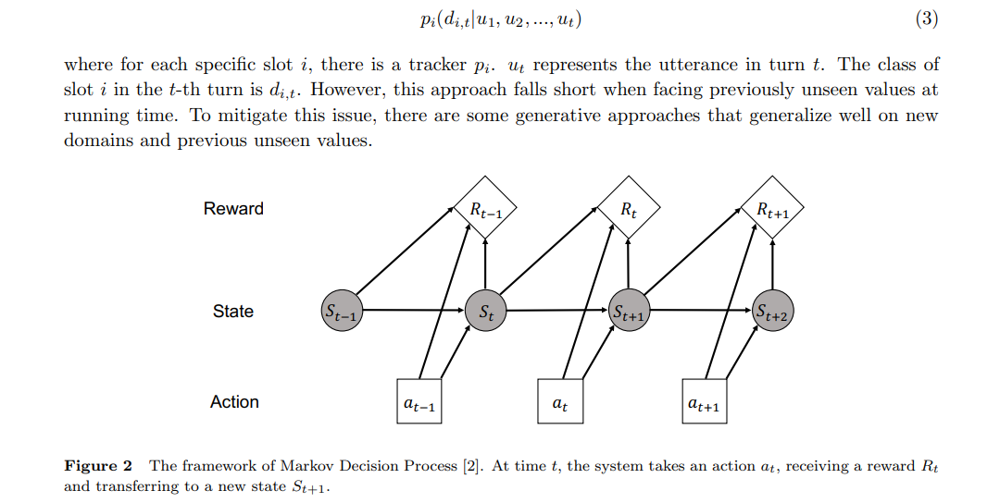
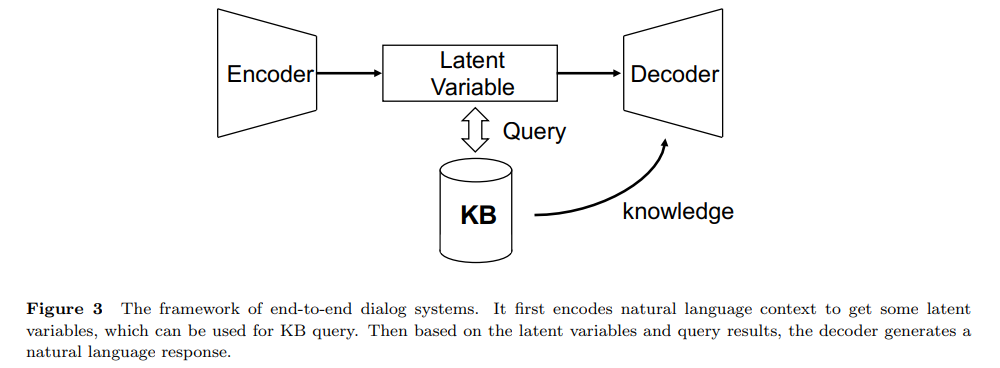
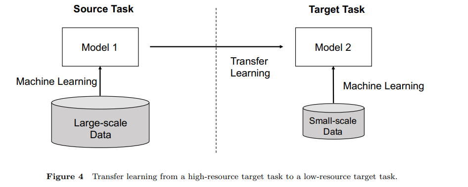
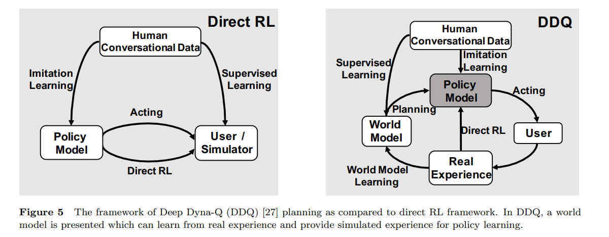

# Recent Advances and Challenges in Task-oriented Dialog System

[toc]

- https://arxiv.org/pdf/2003.07490.pdf

## ABSTRACT
- 三个关键主题：
  - 提高数据效率以在资源不足的情况下促进对话系统建模；
  - 为对话策略学习建模多轮动态学习以实现更好的任务性能；
  - 将领域本体知识集成到管道模型和端到端模型中的对话模型中

- keywords
  - task-oriented dialog, low-resource, dialog state tracking, dialog policy, end-to-end model

## 1 Introduction
- 面向任务的对话系统旨在帮助用户完成特定领域中的某些任务，例如餐厅预订，天气查询和航班预订
  - 开放域对话系统主要目标是最大程度地提高用户参与度，面向任务的对话系统更着重于在一个或多个域中完成某些特定任务
- 通常，面向任务的对话系统是建立在结构化本体之上的，该本体定义了任务的领域知识

### 1.1 General Framework

- 管道模型通常由几个组件组成
  - 自然语言理解（NLU），对话状态跟踪（DST），对话策略和自然语言生成（NLG）
    - 将NLU，DST和NLG组件聚合在一起之前，通常会对其进行单独的训练，而在组成的系统中对对话策略组件进行训练
- 端到端方法中，对话系统以端到端的方式训练，而无需指定每个单独的组件
  - 将训练过程表述为在给定对话上下文和后端知识库的情况下生成响应话语

#### 1.1.1 Natural Language Understanding

- 给定用户的话语，自然语言理解（NLU）组件将其映射到结构化的语义表示
  -  流行的语义表示模式是dialog act，它由意图和槽位值组成
  -  意图类型是话语的高级表示形式，例如Query和Inform
  -  槽值对是在讲话中提到的特定于任务的语义元素
  -  基于对话行为结构，NLU的任务可以进一步分解为两个任务：意图检测和槽值提取。前者通常通过将话语作为输入来表述为意图分类任务，而槽值提取任务通常被视为序列标签问题

#### 1.1.2 Dialog State Tracking
- 对话状态跟踪器通过将整个对话上下文作为输入来估计每个时间步骤中的用户目标
  - 在时间t的对话状态可以看作是直到t之前的多轮对话的抽象表示
  - 大多数都采用信念状态 belief state 作为对话状态表示，其中状态由每个槽值词汇表上的几种概率分布组成
  - 此问题可以表述为多任务分类任务 

#### 1.1.3 Dialog Policy
- 以对话状态为条件，对话策略会生成下一个系统操作
- 由于对话中的对话行为是顺序生成的，因此通常被表述为马尔可夫决策过程（MDP），可以通过强化学习（RL）解决
- 一种典型的方法是，首先通过基于对话语料库的监督学习或模仿学习来离线训练对话策略，然后通过RL与实际用户对模型进行微调。由于真实的用户对话价格昂贵，因此引入了用户模拟技术以提供可负担的训练对话

#### 1.1.4 Natural Language Generation
- 给定由对话策略生成的对话行为，自然语言生成组件会将行为映射为自然语言话语，这通常被建模为条件语言生成任务
  - 充分传达对话行为的语义以完成任务
  - 与人类语言类似，自然，特定，信息丰富

#### 1.1.5 End-to-end Methods

- 面向任务的对话系统的端到端方法受到开放域对话系统研究的启发，该研究使用神经模型以端到端的方式构建系统而无需模块化设计
- 这些方法大多数都使用seq2seq神经网络作为基础结构框架。端到端的公式化可以避免训练期间级联组件内的错误传播问题

### 1.2 Main Challenges
- 管道方法
  - 最近的研究更多地集中在对话框状态跟踪和对话框策略组件上，这也称为“ 对话管理”
  - 因为NLU和NLG组件都是独立的语言处理任务，在对话系统中与任务的交织较少
  - 基于域本体，通过预测每个槽值，可以将DST任务视为分类任务
    - 当训练数据不足时，此类基于分类的方法可能会遇到OOV问题，无法直接推广到新领域
  - 对话策略学习任务通常被认为是强化学习任务
    - 对话策略的训练需要真实的人作为环境，这是非常昂贵
    - 大多数现有方法使用手动定义的奖励，例如任务完成率和会话轮次
  
- 端到端方法
    - 简单序列到序列模型的数据饥渴性质使得难以在有限的领域特定数据量的面向任务的对话系统中学习复杂的槽填充机制
    - 知识库查询问题要求模型除了编码器和解码器之外还生成一个中间查询，这并不简单
    - 另一个缺点是编码器-解码器框架使用了字级策略，这可能会导致次优性能，因为该策略和语言功能相互纠缠在一起

- 三个关键问题
  - 数据效率：资源匮乏的问题是主要的挑战之一
  - 多轮动态学习：
    - 开放域对话相比，面向任务的对话的核心功能是在多回合策略中强调目标驱动
    - 由于昂贵的训练环境和不完善的奖励定义，在许多任务上表现出优异性能的无模型RL方法不能直接用于面向任务的对话
  - 知识集成
    - 向任务的对话系统必须查询知识库（KB）以检索某些实体以生成响应
    - 管道方法中，KB查询主要是根据DST结果构造的
    - 端到端方法绕过模块化模型，需要细粒度的注释和领域专业知识，由于没有用于构造查询的显式状态表示形式，因此这种简化值得怀疑

## 2 Data Efficiency
- 面向任务的对话系统的数据驱动方法通常需要细粒度的标注来学习特定域中的对话模型，例如对话动作和状态标签
- 通常很难在特定域中获得大规模的带标注的语料库
  - 由于其特定于任务的功能，与在开放域设置中相比，收集特定于域的语料库更加困难
  - 进行注释细粒标签需要大量的人力资源，昂贵且耗时
- 将回顾一些最近提出的缓解此问题的方法
  - 首先回顾一下迁移学习方法，该方法从大规模数据中获取先验知识，或者从其他任务中获得可靠的训练模型
  - 介绍一些无监督的方法
  - 回顾了最近在构建数据驱动的用户模拟器方面的工作

### 2.1 Dialog Transfer Learning

- 机器学习的一个主要假设是训练和测试数据应具有相同的分布
  - 许多实际场景中，当我们在目标任务中只有有限的数据，而在另一任务中具有不同数据分布的足够数据时，这可能不成立
  - 提出了迁移学习以通过将知识从源任务转移到目标任务来减轻此问题

- 面向任务的对话系统中经常会出现相同的问题
  - 当旅馆域中只有有限的数据时，如何将餐馆预定的对话系统调整为旅馆预定
  - 两个域的本体是相似的，共享许多对话行为和插槽

- Domain 迁移
    - 36 提出通过在多个域数据集上进行多任务学习来学习对话状态跟踪模型 
    - 19 直接从源域模型传递共享槽的参数以初始化目标模型
    - 35 提出通过学习行为和状态转移函数在没有共享槽的域之间转移对话策略模型，该行为和状态转移函数直接从源特征空间映射到目标空间

- 个性化的知识迁移
  - 74 提出了一种混合DQN策略，以在不同的客户之间转移知识
  - 34 通过在RNN解码器框架内设计新颖的个人控制门，同时在保持每个用户的个人偏好不变的同时，在不同的人之间传递了更细粒度的短语级知识

- 跨语言转移
    - 48 研究了三种跨语言方法：（1）将训练数据转换为目标语言，（2）预训练跨语言嵌入，以及（3）使用多语言机器翻译编码器共享上下文相关知识单词表示

- 11 与模型无关的方法用于对话系统中的转移学习，这主要是受模型无关的元学习（MAML）框架的启发
  - 33 43 通过将这种方法用到NLG，该模型可以得到在低资源设置更好的效果和更好域泛化
  - 31 仅利用从目标用户收集的一些对话样本而不使用特定角色的描述，进一步将该方法扩展到了个性化对话系统

### 2.2 Unsupervised Methods
- 对话策略学习中的一个关键问题是奖励监督，这在实际应用中很难获得。因此，有必要建立一种在RL训练期间提供奖励信号的奖励估计模型
  - 通过将对话策略视为生成器，并将奖励函数视为判别器，可以使用生成对抗网络（GAN）以无监督的方式学习奖励函数
  - 30 使用GAN通过区别真实用户对话框中的模拟来学习二进制奖励函数
  - 73 使用预测的奖励作为失败的指标，扩展了故障对话检测的想法
  - 53 使用了另一种使用高斯过程进行奖励估算的方法
    - 通过对预测报酬的不确定性进行建模，该模型可以主动要求人工干预潜在的失败案例
    - 实验中，随着奖励估算不确定性的降低，对人为干预的要求也大大降低，从而显着减轻了人力

- 对话系统的本体是人类专家通过精心设计的领域工程构建的。另一项工作是通过自动从未标记的语料库中学习对话结构来协助人类专家进行此过程
  - 52 提出通过基于变分自动编码器（VAE）的方法来学习对话过程的有限状态机
    - 首先使用没有中间注释的原始对话语料库对基于VAE的对话框模型进行了预训练
    - 根据潜在变量可以发现几种对话状态。此后，可以通过估计状态之间的转移概率来构建状态转移图
  - 分析面向任务的结构以促进语言理解
    - 56 在面向任务的对话中用于主题分割和标记的RL方法，旨在检测对话多轮之间的主题边界并为其分配主题标签

- 预训练方法在许多NLP任务中显示出了优异的性能
  - 68 在大规模对话数据上预先训练一个transformer模型，然后通过多任务学习在个性化对话任务上对该模型进行微调
  - 4 在没有明确的独立对话策略和生成模块的情况下，该思想进一步用于面向任务的对话
    - 首先将信念状态和数据库状态转换为自然语言文本
    - 然后将其作为上下文之外的转换器解码器的输入

### 2.3 User Simulation
- 用户仿真技术通过提供理论上无限数量的训练交互，减轻了基于RL的对话策略模型的数据紧张问题
  - 47 基于议程的用户模拟器（ABUS）
    - 通过一些启发式方法来维持代表用户目标的类似堆栈的结构。构建基于议程的模拟器需要人类专家明确定义议程和启发式规则
  - 以数据驱动的方式构建用户模拟器来缓解上述问题
    - 1 提出了一个考虑到对话上下文的对话动作级别seq2seq用户模拟模型
    - 6 提出了另一个seq2seq模型，该模型将自然语言上下文作为输入并输出自然语言响应
    - 21 引入了神经用户模拟器（NUS），它可以模仿语料库的用户行为并生成单词级别的用户响应
    - 13 提出的分层seq2seq用户模拟器（HUS），它首先对用户目标和系统转向进行编码，并生成用户对话行为
  - 将模拟器与目标对话系统一起训练，可以将其视为多代理方式
    - 29 提出首先通过监督学习训练基于对话语料库的对话系统和模拟器，然后通过强化学习对两种模型进行微调
    - 38 55 71 Deep Dyna-Q（DDQ）世界模型基于对话框的规划框架, DDQ中的世界模型是使用实际经验通过监督学习进行更新的

## 3 Multi-turn Dynamics
- 面向任务的对话研究的一个主要特征是其对多回状态动作动力学的重视
  - 开放域对话系统中，研究更多地集中在生成合理，一致且语义丰富的响应上，以最大程度地提高用户参与度
  - 对对话管理的研究负责跟踪对话的状态和对话流，并作为对话系统的基础

- 将人类对话表述为马尔可夫决策过程（MDP）
  - 在每个时间步上，系统都会通过采取某些行动a从某些状态s过渡到新状态s '
  - 强化学习通常用于解决对话系统中的这种MDP问题

- 面向任务的对话系统动力学的最新研究主要集中于以下主题
  - 计划对话策略学习以提高样本效率
  - 奖励稀疏性问题的奖励估计
  - 端到端对话策略学习

### 3.1 Planning for Dialog Policy Learning

- 通过与真实用户互动学习，无模型RL方法主导了神经对话策略的早期研究。它非常耗数据，需要大量的交互才能有效地训练策略模型
  - 用户模拟器不能完全模仿真实的人类对话行为，并且其归纳偏差可能会导致次最佳模型在真实的人类对话中表现不佳
- 基于模型的RL方法来对环境进行建模，从而可以进行对话策略学习的计划
  - 在基于模型的RL方法中，对环境进行建模以模拟对话的动态。然后在RL训练阶段，通过从实际用户那里学习并使用环境模型进行规划来交替训练对话策略
  - 38 DDQ
    - 有一个世界模型，它接受了真实的用户体验培训，可以捕获环境动态
    - 对话策略是通过直接RL与真实用户以及模拟RL与世界模型一起训练的
    - 在训练期间，还将根据不断增加的实际经验，通过监督学习来更新世界模型
    - 用于Q学习的真实体验与模拟体验的比率在原始DDQ框架中是固定的
  - 55 71 提出了通过动态地调节真实到模拟经验的比率来世界模型的性能
  - 上面的规划方法称为背景规划，通过对世界模型的模拟经验进行培训来改进策略
- 基于计划的研究的另一条线是决策时间计划，它可以基于一些模拟经验直接决定要在特定状态
S t下采取哪种行动
  - 以这种方式使用的计划可能比在决策时提前一步更深入（在人类活动中很常见）
  - 国际象棋游戏为例，玩家经常通过向前看几个步骤来进行心理模拟，然后决定如何移动棋子
  - 24 76 引入对话部署计划进行协商，其中代理针对多个候选响应模拟处于特定状态St的完整对话，以获取其预期奖励，并采用奖励最高的响应
  - 20 建议仅展望几个有限的步骤，并将这些步骤用作策略模型做出决策的附加功能

### 3.2 Reward Estimation
- 在基于RL的对话模型中，奖励对于政策学习至关重要
- 54 奖励功能定义的一种典型方法是，在成功的会话结束时分配较大的正向奖励，而每一轮分配较小的负向惩罚，以鼓励简短的对话
  - 在无法实现用户目标的实际应用中，无法有效地估算此回报
  - 当奖励信号由预定义规则客观地计算或由真实用户主观给出时，奖励信号就不一致。为了缓解上述问题，有一些研究学习了独立的奖励功能以提供可靠的监督信号

- 奖励估算的一种方法是使用带注释的数据进行离线学习
  - 通过将对话话语和中间注释作为输入特征，可以将奖励学习表述为有监督的回归或分类任务
  - 可以从人工注释或用户模拟器中获得带注释的奖励。然而，由于输入特征空间复杂，因此需要大量的手动注释

- 53 使用在线学习进行奖励估算
  - 奖励估计通常被公式化为高斯过程回归任务，可以额外地为其估计提供不确定性度量。在这种情况下，采用主动学习来减少对真实奖励信号的需求，在这种情况下，仅当不确定性得分超过阈值时才要求用户提供反馈。在其他情况下，当估计不确定性较小时，将使用估计奖励

- 30 73 57
  - Inverse RL（IRL）并非通过带注释的标签来估计奖励信号，而是旨在通过观察专家演示来恢复奖励功能
  - 对抗性学习往往是通过区分模拟和真实对话采用对话报酬估计

### 3.3 End-to-end Dialog Policy Learning

## 4 Knowledge Integration

### 4.1 Generative DST

### 4.2 End-to-end Knowledge Integration

## 5 Evaluation

### 5.1 Automatic Evaluation

### 5.2 Simulated Evaluation

### 5.3 Human Evaluation

## 6 Task-oriented Dialog Corpora

## 7 Discussion and Future Trends

