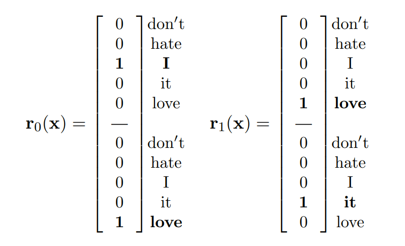
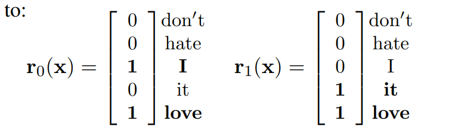
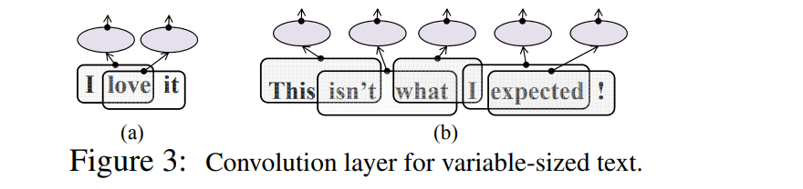
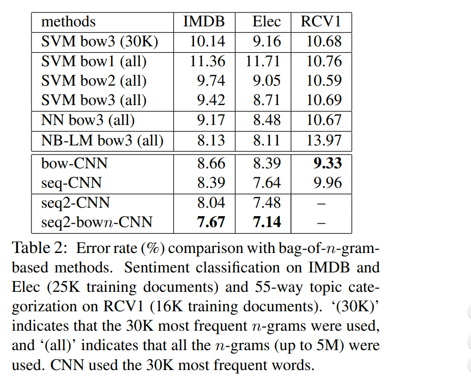

# Effective Use of Word Order for Text Categorization with Convolutional Neural Networks
[toc]

https://arxiv.org/pdf/1412.1058.pdf

## 1 Introduction
- 常见分类算法： BOW + SVM
    - 问题：丢失词序，在情感分析领域有问题
    - 方法：使用n-gram(n>1)，在某些时候并不能起作用
- CNN进行分类使用中，第一层往往是embedding
- 为了研究CNN在文本分类上的有效性，避免其他因素的影响，所以采用embedding层与后续网络一起训练的形式。CNN的本质就是将固定大小局部区域进行特征提取，因此，embedding层就是学习每一个词的embedding，就是CNN的size=1的特殊情况
- 我们直接使用CNN对高维的one-hot编码进行学习

## 2 CNN for document classification
### 2.1 Preliminary: CNN for image
略

### 2.2 CNN for text
文档使用基于全词典的one-hot序列编码

#### 2.2.1 seq-CNN for text
利用one-hot模型表示每一个词，对于bi-gram，则将相邻的两个词形成向量。例如“I love it”,则表示如下：

#### 2.2.2 bow-CNN for text
CNN用于文本问题和图像问题有一个本质的区别，就是图像一般只有RGB三个通道，而文本的通道数量则取决于词库的大小，很可能有上千上万维，而维数与参数的个数密切相关，向量的维度越高则代表所需要学习的参数越多，这样一来会使模型过拟合，并且学习速度特别慢，加大算法的计算复杂度，因此bow-CNN采用bag-of-word的形式进行表示。同样地，“I love it”采用2-gram将表示如下：

#### 2.2.3 Pooling for text
无论是seq-CNN还是bow-CNN，输出都是变化的长度，如下图。如果使用传统的pooling层，会将输出大小的可变性传递下去，因此本文固定pooling单元的个数，动态改变pooling单元作用区域大小来获得国定大小的输出

### 2.3 CNN vs. bag-of-n-grams
略

## 3 Experiments

