# Deep unordered composition rivals syntactic methods for text classification
[toc]

- https://www.aclweb.org/anthology/P15-1162.pdf

## Abstract
- 效果与基于语法结构的模型类似
- 性能好很多
- 在实验中针对词语的dropout起作用

## 1 Introduction
- 对于句子或文档，需要选择合适的composition function
  - 两类
    - unordered and syntactic 无序和基于句法的
- 当前基于句法的好于无序的
  - 更多训练时间
  - 更多计算资源
- deep averaging network (DAN)
  - 词向量化平均
  - 多层MLP
  - softmax

## 2 Unordered vs. Syntactic Composition
### 2.1 Neural Bag-of-Words Models
- neural bagof-words models (NBOW)
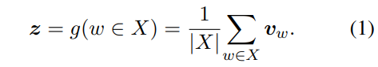
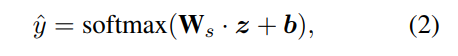
- 损伤函数
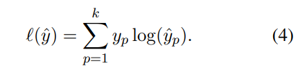

### 2.2 Considering Syntax for Composition
- Recursive neural networks (RecNNs)
  - 使用语法树
  - 需要在每个节点都设置错误信号
  - One root softmax is not strong enough for the model to learn compositional relations and leads to worse accuracies than standard bag-of-words models 

## 3 Deep Averaging Networks
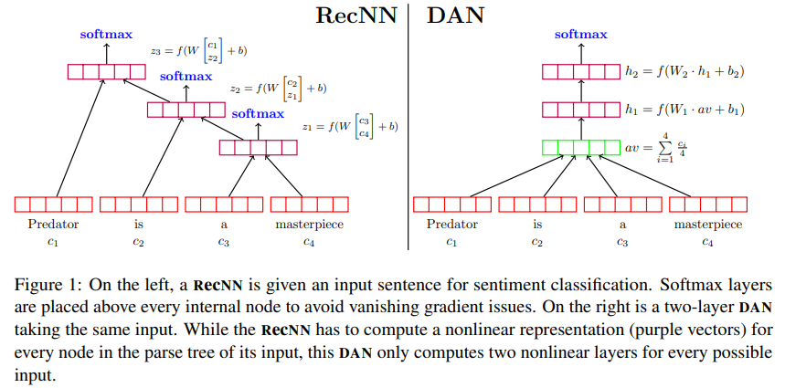

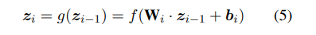

### 3.1 Word Dropout Improves Robustness
对每个词语进行独立的Bernoulli，概率为p
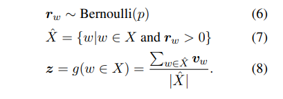

对于短的输入可能会删除掉重要词语，考虑到预测结果相关的词语比预测结果无关的句子中词语要少，从结果上来看，相对NBOW还是有很大量的提高

word dropout to leaf nodes in RecNNs 无效

## 4 Experiments
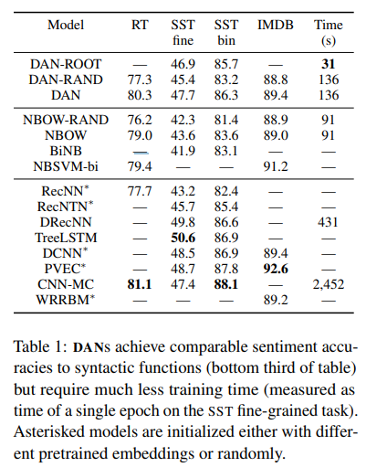
- bigram na¨ıve Bayes (BINB)
- na¨ıve Bayes support vector machine (NBSVM-BI)
- -RAND 随机300维词向量初始化
- 其他300-d GloVe 初始化
- DAN-ROOT model only has access to sentence-level labels SST experiments

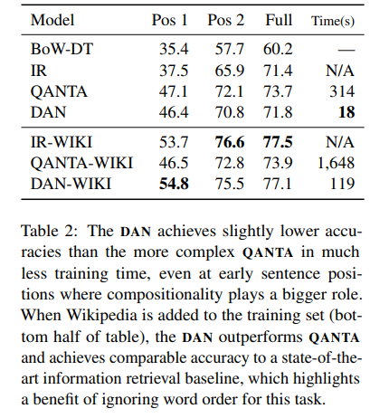

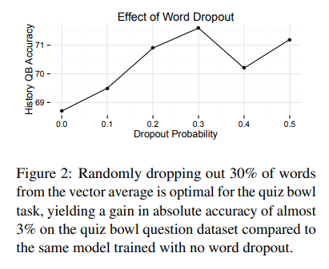

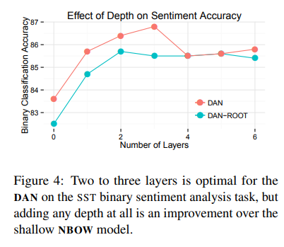

## 5 How Do DANs Work?
### 5.1 Perturbation Analysis
### 5.2 Handling Negations and “but”: Where Syntax is Still Needed

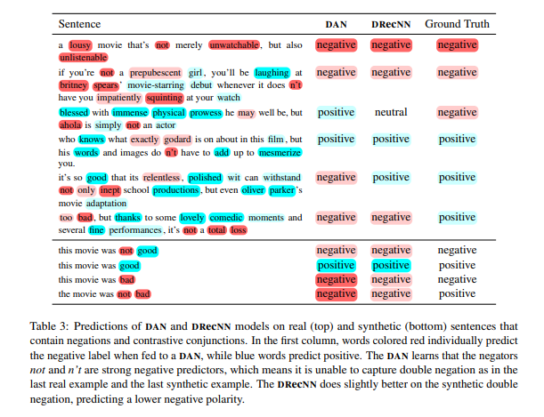

### 5.3 Unsupervised Embeddings Capture Sentimen