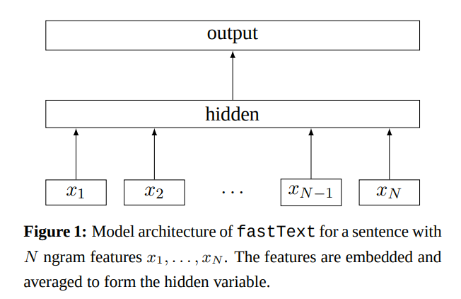
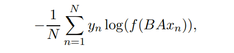
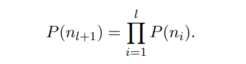
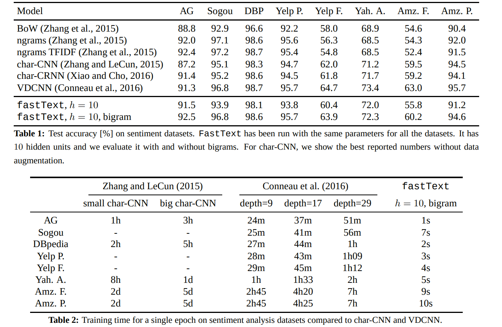
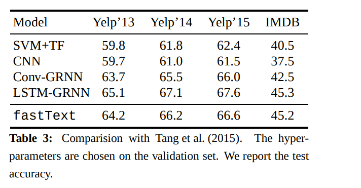
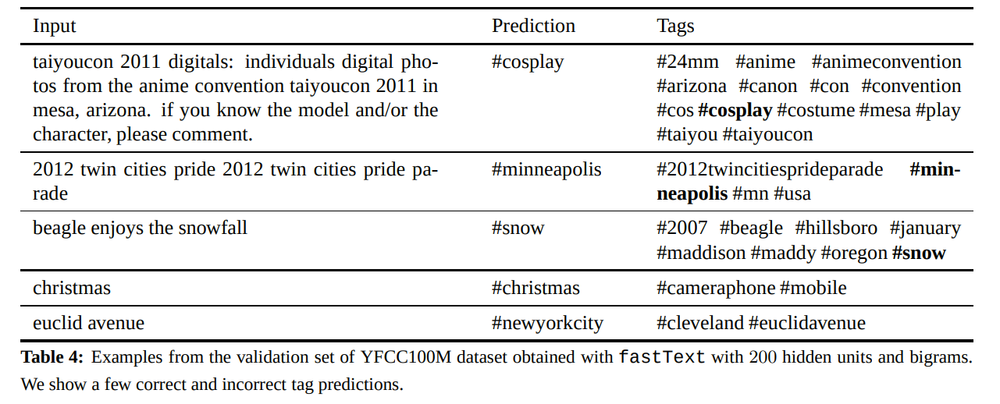
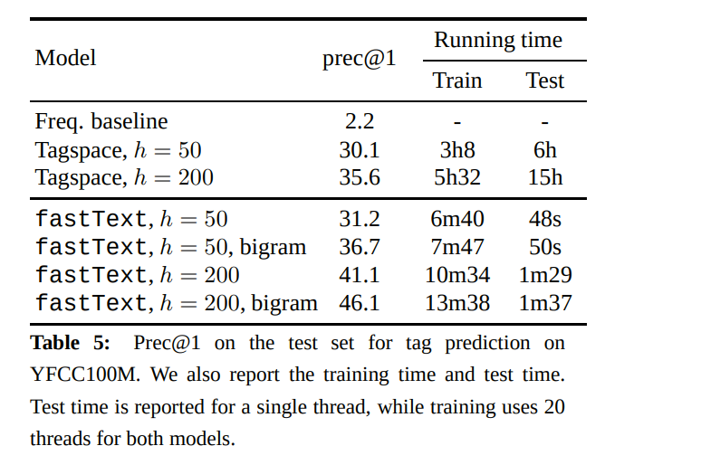

# Bag of Tricks for Efficient Text Classification
[toc]

- https://arxiv.org/abs/1607.01759
## Abstract
- fastText在准确率上与深度学习分类器基本相当，在训练和评价方面，速度提高了许多数量级。使用一个标准的多核CPU，我们可以在不到10分钟的时间内训练快速文本处理超过10亿个单词，并且在不到一分钟的时间内在312K个类中分类50万个句子

## 1 Introduction
- 文本分类是自然语言处理中的一项重要任务，有许多应用，如web搜索、信息检索、排序和文档分类
- 在文本分类问题里，线性分类器常常被视为强基线分类器。虽然它们构造简单，如果能够构造正确的特征，往往能够取得很好的效果
- 带有秩约束和损失快速估计的线性模型可以在十分钟内训练10亿单词。对两个不同的任务，标签预测和情感分析进行了质量评价

## 2 Model architecture
- 基于BOW的线性分类器不会在特征和类之间共享参数。这限制它们在大输出空间上下文中的泛化，其中一些类只有很少的例子
- 常见解决方案是将线性分类器分解为低秩矩阵或使用多层神经网络
- 低秩矩阵

图1显示了一个带有秩约束的简单线性模型。第一个权重矩阵A是单词的查找表。然后将单词表示平均为文本表示，然后将文本表示反馈给线性分类器。文本表征是一个隐藏层变量被重用。这种架构类似于Mikolov等人(2013)的cbow模型，其中中间的单词被一个标签替代。我们使用softmax函数f来计算预定义类的概率分布。对于一组N个文档，这将导致类的负对数似然最小化

Xn 是第n个文档的归一化特征袋，Yn是对应的特征标签，A 和 B 权重矩阵

### 2.1 Hierarchical softmax
- 当类数较大时，线性分类器的计算开销较大。更精确地说，计算复杂度是O(kh)，其中k是类的数量，h是文本表示的维数
- 使用了基于霍夫曼编码树的Hierarchical softmax。在训练过程中，计算复杂度降低到O(h log2(k))
- 分层Softmax在测试分类的时候也能很快搜索相似分类。因为每个节点和从根到该节点的路径的概率在概率上关联。如果该节点是在深度 l 1 与父母 n1，...，nl关联，那么其概率是

- 节点的概率总是小于其父节点的概率。先深度搜索树，然后跟踪叶子之间的最大概率，这样我们就可以丢弃任何与小概率相关的分支
- 进一步在使用二叉堆的时候，将复杂度进一步降低到 O(log(T))，T是堆顶目标数

### 2.2 N-gram features
- 词袋对词序是固定不变的，但是明确地计算这种词序往往是非常复杂
- 使用 N-gram袋作为附加特征来留存一些相近词序的部分信息。这种做法能够和显式使用词序的方法得到非常有效和相似的效果
- 使用哈希算法 (温伯格 et al.2009年) 来维持一个高效的内存N-gram映射，同样的哈希函数也出现在 Mikolov 等人 （2011 年）算法。这么做，我们可以把1亿特征的映射成1千万的二元映射

## 3 Experiments
- 使用 fastText 对两个不同的任务进行了评估。首先，我们将它和现有文本分类的情感分析算法进行比较，然后，我们通过一个超大标签预测数据集来评估其高维输出空间应用能力

### 3.1 Sentiment analysis
- 使用10个隐藏单元，运行5个epochs的fastText，在{0.05,0.1,0.25,0.5}的验证集上选择一个学习率
- 在这个任务中，添加bigram信息可以将性能提高1-4%
- 准确率略好于charn - cnn和charn - crnn，略差于VDCNN
- 可以通过使用更多的n-g来稍微提高精度，例如使用三元组，搜狗的性能可以提高到97.1%

- 调整对验证集的超参，观察到使用 N-gram到五元的时候，可以达到最佳的性能
- fastText 不使用预先训练的 词嵌入，这就是大家在精度上有 1%差异的原因

### 3.2 Tag prediction
- YFCC100M 数据集。这是一个1亿幅具有标题、 标题和标签图像的数据集。专注于预测标题和标题标签
- 删除出现频率低于100的。并且把数据分成训练、 验证和测试三类。训练集包含 91,188,648 个样本 (150亿个标记)。验证集包含930,497 个样本，测试集包含 543,424个样本。字典的大小是 297,141和312,116 的独特标记

- 准确度更高，训练速度更快

## 4 Discussion and conclusion
- 与来自word2vec的未经监督训练的单词向量不同，我们的单词特征可以平均在一起，形成良好的句子表示
- fastText的性能与最近提出的方法相当，这些方法受到了深度学习的启发，而且速度更快

