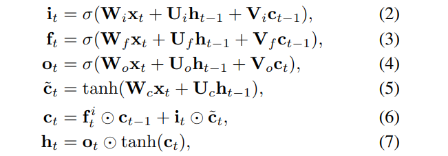
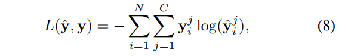
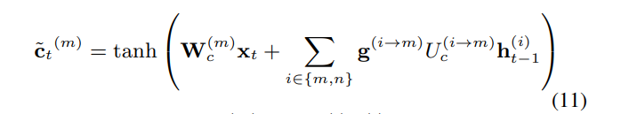
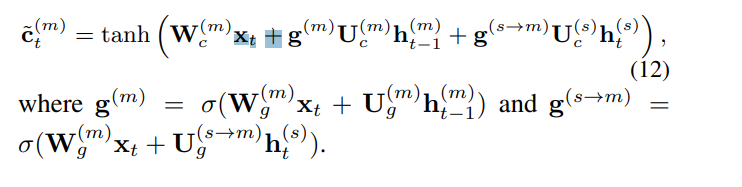
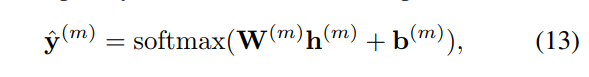
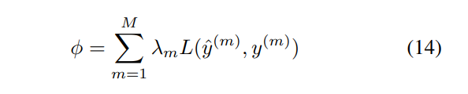

# Recurrent Neural Network for Text Classification with Multi-Task Learning

[toc]

- https://arxiv.org/pdf/1605.05101

## Abstract
- 之前的任务大多来源雨单任务，受限于训练数据
- 本文中介绍3中多任务中共享信息的模型

## 1 Introduction
- 希望对短语、句子、段落、文章等不定长的文本进行编码，使其成为固定长度的向量
- 有限的数据下很难训练成泛化的模型，模型参数越多需要的数据量越大
- 使用无监督的预训练能够提高性能
- 多任务学习通过利用多个关系的任务的相关性来平行学习来
- 基础的多任务学习结构是共享低层的来学习公共的特征
- 贡献
  - 提出基于RNN的多任务学习结构
  - 在多个文本分类任务上达到stoa

## 2 Recurrent Neural Network for Specific-Task Text Classification
### 2.1 Recurrent Neural Network
LSTM
: 

### 2.2 Task-Specific Output Layer
使用最后的隐藏状态进行softmax

其中N为样本数目，C为类别数目

## 3 Three Sharing Models for RNN based Multi-Task Learning

### Model-I: Uniform-Layer Architecture
每个任务的Embedding由两部分组成，分别是自己独立的和共享的
$$\hat X_t^{(m)} = X_t^{(m)}⊕X_t^{(s)}$$

### Model-II: Coupled-Layer Architecture
每个任务有自己专门的LSTM层，同时还有一个全局的门控单元来控制接受自己应该接受多少信息

### Model-III: Shared-Layer Architecture
每个任务有自己单独的LSTM层，同时引入一个双向LSTM来获取所有任务的公共信息

## 4 Training
输出层
: 

全局损失函数
: 
