# Hierarchical Attention Networks for Document Classification
[toc]

- https://www.cs.cmu.edu/~hovy/papers/16HLT-hierarchical-attention-networks.pdf

## Abstract
特点
- 与文档结构相似的层次化结构
- 两层注意力机制分别针对词语和句子

## 1 Introduction
文本分类历史悠久
- 传统使用n-gram等稀疏表示然后在分类算法上学习
- 深度学习使用CNN、LSTM等进行文本的表示学习

本文假设：文档结构知识可以获得更好的文本表示
直觉来源于决定回答一个问题的段落是建模词语之间的相关性，而不是隔离地看词语是否出现 > attention?

HAN
- 基于文档结构构建层次化模型，来合并句子的表示到文档的表示
- 不同的词语和句子在文档中信息不一样，是依赖于其上下文的，因此加入两层注意力机制
    - 同时可以对决策进行解释
    

## 2 Hierarchical Attention Networks

### 2.1 GRU-based sequence encoder

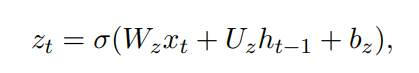
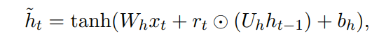
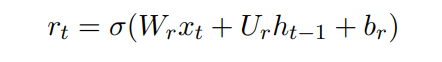

### 2.2 Hierarchical Attention
Word Encoder
: 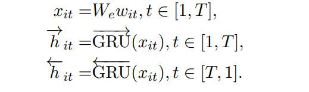

Word Attention
: 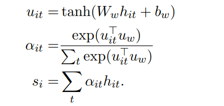
上下文向量uw, 可以看着对query"哪个词语重要"的高级别表征，随机初始化，在训练过程中学习

Sentence Encoder
: 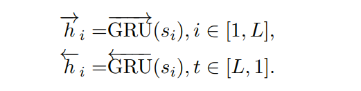

Sentence Attention
: 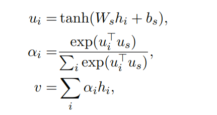

### 2.3 Document Classification

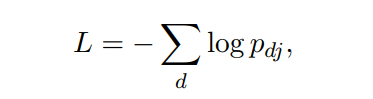

## 3 Experiments
### 3.1 Data sets
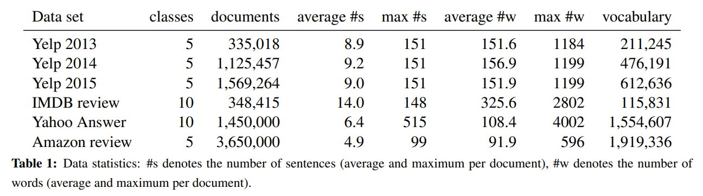
### 3.2 Baselines
Linear methods
: BOW and BOW+TFIDF; 50,000
n-grams and n-grams+TFIDF: 500,000 n-grams (up to 5-grams)
Bag-of-means:  average word2vec embedding

 SVMs
 : SVM+Unigrams, Bigrams, Text Features, AverageSG, SSWE
Text Features:  word and character n-grams, sentiment lexicon features etc
AverageSG: 200-dimensional word vectors using word2vec, average
SSWE: uses sentiment specific word embeddings according to (Tang et al., 2014).

Neural Network methods
: CNN-word
CNN-char
LSTM:  average of the hidden states of all words
Conv-GRNN and LSTM-GRNN: CNN or LSTM provides a sentence vector; gated recurrent neural network (GRNN) combines sentence vectors

### 3.3 Model configuration and training
- Stanford’s CoreNLP: split documents into sentences and tokenize 
- more than 5 times -> vocabulary; replace other as UNK token
- word2vec on train/validation data, 初始化embedding
- 超参数进行调优
    - word embedding dimension to be 200
    - GRU dimension to be 50
    - word/sentence context vectors： 100
    - mini-batch size of 64， 使用长度相似的构造成batch
    -  length-adjustment can accelerate training by three times
    - stochastic gradient descent,  momentum of 0.9

### 3.4 Results and analysis
HN stands for Hierarchical Network, AVE indicates averaging, MAX indicates max-pooling, and ATT indicates attention model
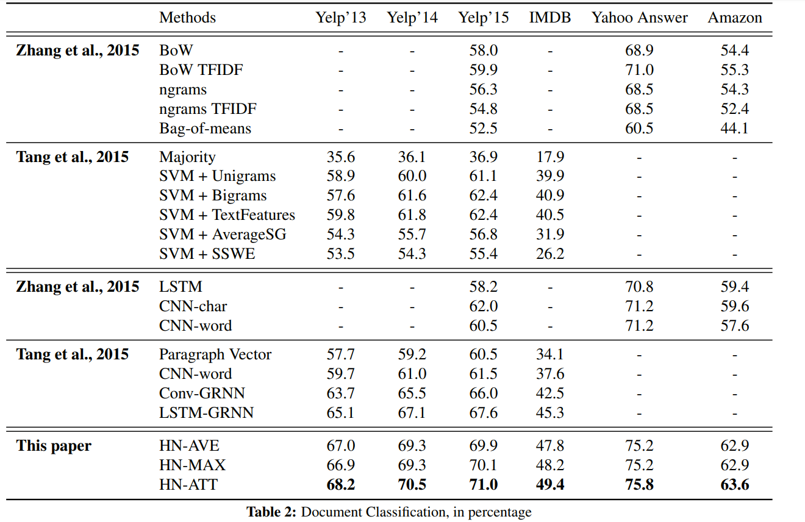

### 3.5 Context dependent attention weights

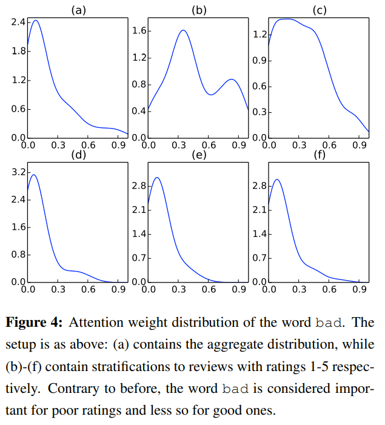
能够学习到基于上下文的权重，如Good这个词，在感情色彩分类的不同打分情况下其权重范围不一样

### 3.6 Visualization of attention
可视化 √pspw， 句子和词语的权重
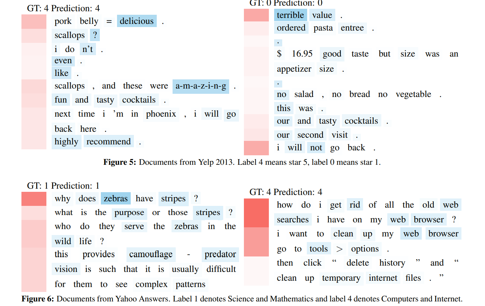

## 5 Conclusion
