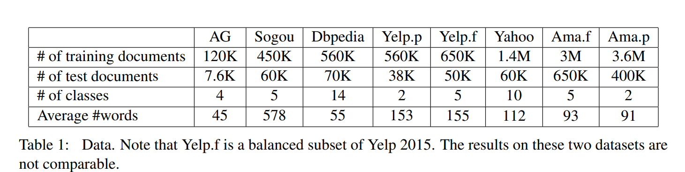
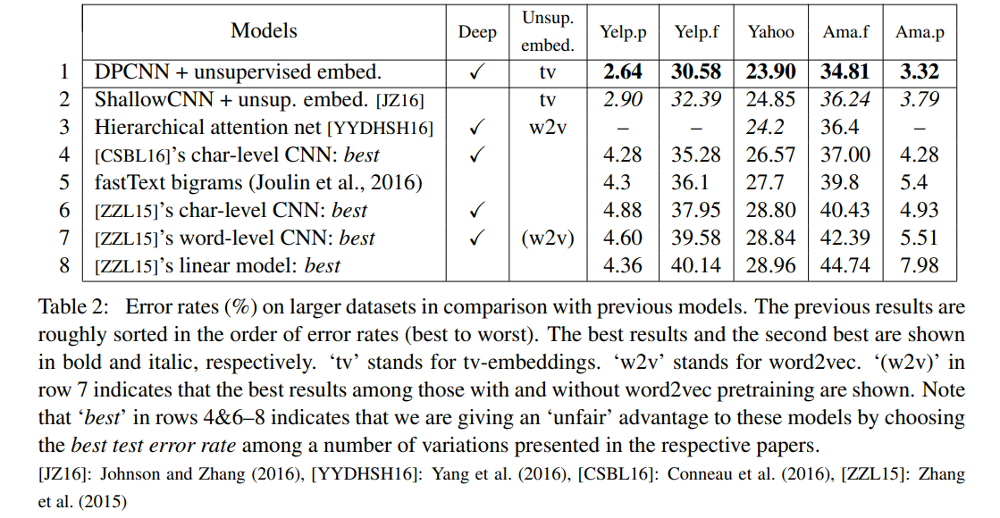
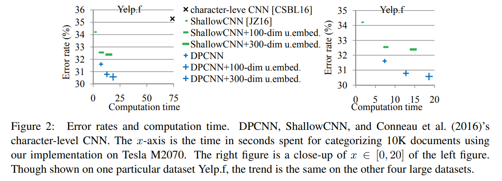
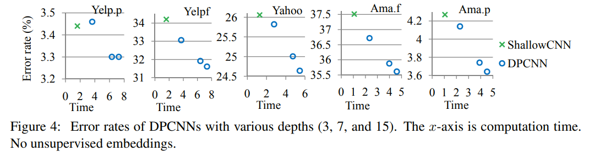
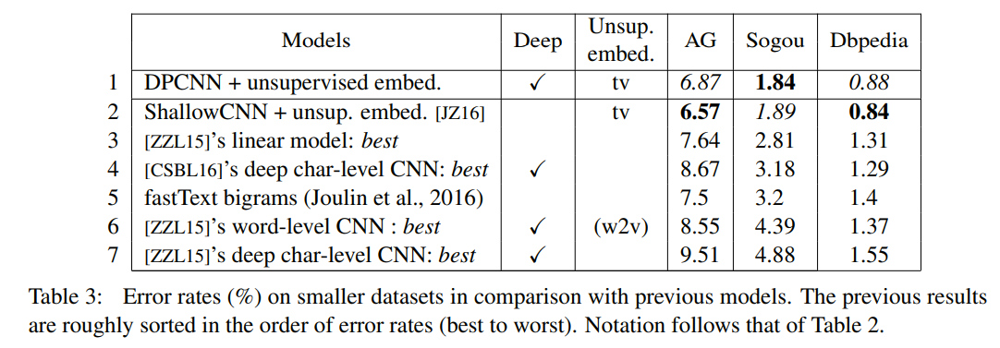
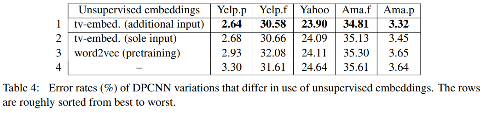

# Deep Pyramid Convolutional Neural Networks for Text Categorization
[toc]

URL: https://ai.tencent.com/ailab/media/publications/ACL3-Brady.pdf

## Abstract
本论文提供 低复杂度，词语级别的 深度CNN分类模型，能表征长距离文本
- 有论文显示基于word的浅层CNN结构比基于字的深层CNN效果和速度更好
- 本文使用深层CNN获取text的全局表征, 长距离的文本依赖

## 1 Introduction
- 文本分类：垃圾分类、情感分类、主题分类
- 基于CNN、RNN提出一些分类模型，用于百万级语料
- 相比深层的基于字的CNN，浅层的（30k字典）基于词的网络效果更好
- knowledge of word leads to a powerful representation词语的知识能获得更强的语义表示
- 基于此找到在大数据设定下的低复杂度CNN深度结构，并且总体计算时间为常量

DPCNN
- network depth can be treated as a meta-parameter
-  long-range associations in the text (and so more global information)
- ShallowCNN only short-range associations

## 2 Word-level deep pyramid CNN (DPCNN) for text categorization
- Downsampling without increasing the number of feature maps，下采样不增加特征个数，这样每次的特征数都减半，其总体的计算时间有限制
- Shortcut connections with pre-activation and identity mapping 添加深度网络训练的容易程度
- Text region embedding enhanced with unsupervised embeddings 使用非监督训练文本嵌入

### 2.1 Network architecture
Downsampling with the number of feature maps fixed
: - max-pooling with size 3 and stride 2: pyramid

增加feature map数量并没有提高准确度
L层后，$2^L$ can be represented. 长距离的文本依赖
deep pyramid CNN is computationally efficient for representing long-range associations and so more global information

Shortcut connections with pre-activation
:  Wσ(x) + b 见图，本文中使用RELU，有实验显示pre-activation更好

No need for dimension matching
:  not letting any shortcut skip a downsampling layer Shortcut 不跨越下采样
fixing the number of feature maps throughout the network 整个网络中设置CNN过滤器数目固定

### 2.2 Text region embedding
text region embedding 
: embedding of a region of text covering one or more words 

Basic region embedding
: 计算k-word region (i.e., window)， Wx + b， Wb和其他层一起运算，激活函数遗留到下层做
straightforward representation of a k-word region for x:
(1) sequential input: the kv-dimensional concatenation of k one-hot vectors;  序列输入, 相当于一个浅层CNN的第一层CNN
(2) bow input: a v-dimensional bag-of-word (bow) vector;  BOW输入，可以使用向量的均值
(3) bag-of-n-gram input: e.g., a bag of word uni, bi, and trigrams contained in the region BOW输入的N-gram
相当于输入为one-hot,该功能为embedding层，针对输入进行映射，k = 1时即为word embedding
**从结果中看，序列输入并不如BOW输入，原因是序列的表征能力过强，导致过拟合**

tv-embedding training
: 定义一个text regine为view1， 其相邻的regine为view2
使用单隐藏层网络来从view-1预测view-2

Enhancing region embedding with unsupervised embeddings I
:  tv embedding training

## 3 Experiments
### 3.1 Experimental setup

- upper-case letters were converted to lower-case letters 转小写
- 字典长度限制为3万，变长数据，未进行剪短或者padding
- minibatch SGD with momentum 0.9 was conducted for n epochs (n was fixed to 50 for AG, 30 for Yelp.f/p and Dbpedia, and 15 for the rest) while the learning rate was set to η for the first 4/5 n epochs and then 0.1η for the rest 使用minibatch SGD (monmentum为.9)，n epochs, 后1/5 epochs LR将为之前的 1/ 10
- batch size: 100
- weight decay with the parameter 0.0001
- optional dropout  with 0.5 applied to the input to the top layer
- 在LR下降后，在观察到过拟合的情况下，基于验证数据集执行early stop
- 权重初始化
    - Gaussian distribution with zero mean and standard deviation 0.01
- discrete input to the region embedding
    - bow input
    -  size was chosen from {1,3,5}
    - output dimensionality to 250
- tvembeddings
    -  embeddings of 5- and 9-word regions
    -  30K-dim bow or 200K-dim bags of {1,2,3}-grams, retaining only the most frequent 30K words or 200K {1,2,3}-grams
    - Training was done on the labeled data
    -  objectives to the prediction of adjacent regions of the same size as the input region (i.e., 5 or 9)
    - Weighted square loss Pi,j αi,j (zi[j] − pi[j])2 was minimized
    - unsupervised embeddings was set to 300
    - Unsupervised embeddings were fixed during the supervised training
- 15 means 7 convolution blocks of 2 layers plus 1 layer for region embedding

Large data results
: 

Computation time
:  

Depth
: 

Small data results
: 
more complex models require more training data, and with the paucity of training data, simpler models can outperform more complex ones

Unsupervised embeddings
: 