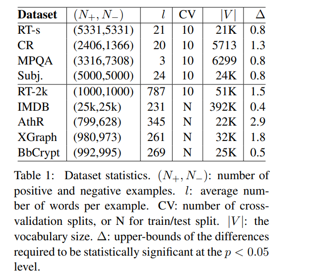
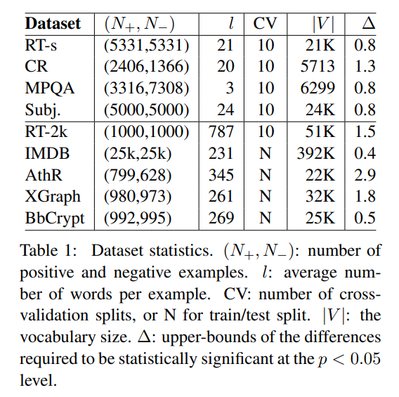
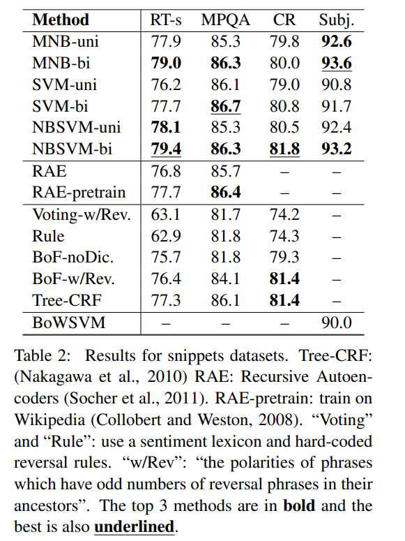
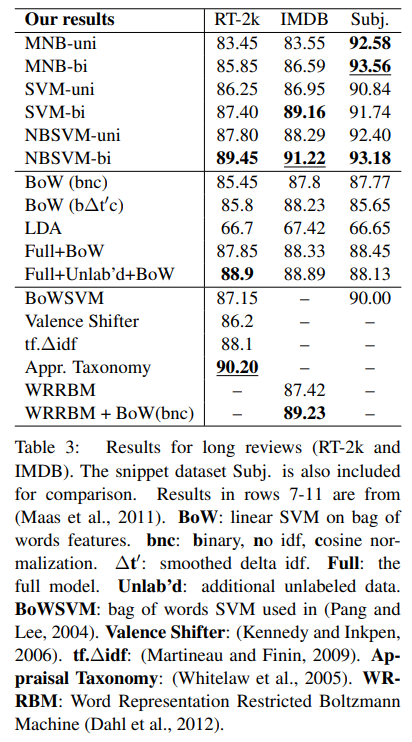
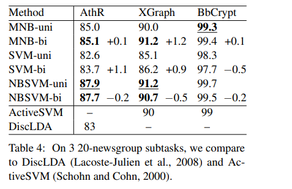

# Baselines and Bigrams: Simple, Good Sentiment and Topic Classification

- https://www.aclweb.org/anthology/P12-2018.pdf

## Abstract
- 基于 Naive Bayes (NB) 以及 Support Vector Machines (SVM) 进行实验
- 实验结果
  -  the inclusion of word bigram features gives consistent gains on sentiment analysis tasks 情感分析任务中使用 Bigram 性能有提升
  -  for short snippet sentiment tasks, NB actually does better than SVMs (while for longer documents the opposite result holds) 短文本情感分析中 NB 效果更好，反之 SVM 更好
  -  a simple but novel SVM variant using NB log-count ratios as feature values consistently performs well across tasks and datasets NB-SVM 效果很好

## The Methods
### Multinomial Naive Bayes (MNB)

## Datasets and Task
- RT-s: Short movie reviews dataset containing one sentence per review (Pang and Lee, 2005).
- CR: Customer review dataset (Hu and Liu, 2004) processed like in (Nakagawa et al., 2010).2
- MPQA: Opinion polarity subtask of the MPQA dataset (Wiebe et al., 2005).3
- Subj: The subjectivity dataset with subjective reviews and objective plot summaries (Pang and Lee, 2004)
- RT-2k: The standard 2000 full-length movie review dataset (Pang and Lee, 2004)
- IMDB: A large movie review dataset with 50k fulllength reviews (Maas et al., 2011).4
- AthR, XGraph, BbCrypt: Classify pairs of newsgroups in the 20-newsgroups dataset with all headers stripped off (the third (18828) version5 ), namely: alt.atheism vs. religion.misc, comp.windows.x vs. comp.graphics, and rec.sport.baseball vs. sci.crypt, respectively.

## Experiments and Results
-  use α = 1, C = 1, β = 0.25 for NBSVM, and C = 0.1 for SVM

