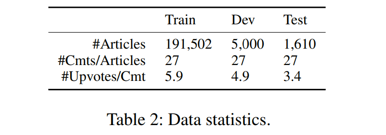
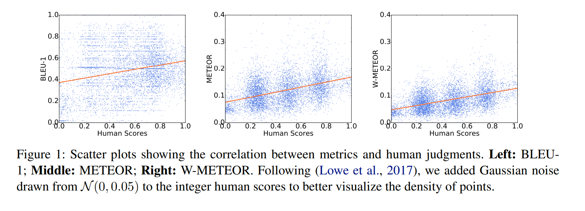
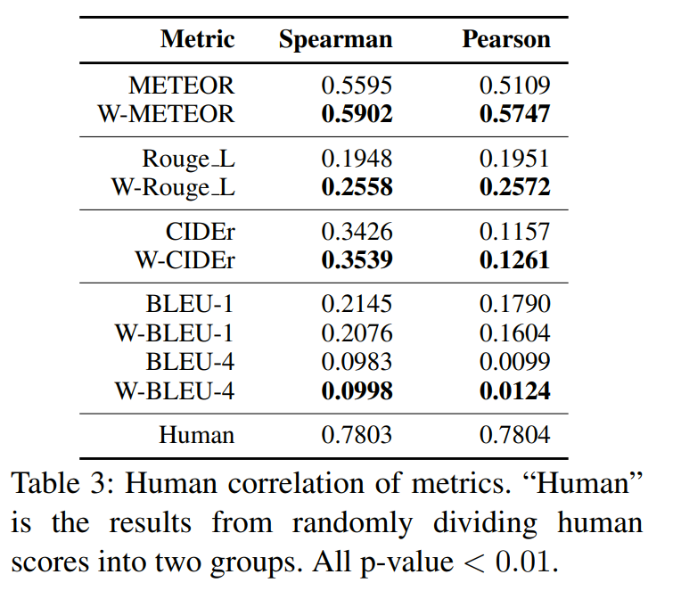

# Automatic Article Commenting: the Task and Dataset
[toc]
https://arxiv.org/pdf/1805.03668.pdf

## Abstract
- 提出评论生成任务、数据集以及质量标注
- 提出了一系列指标用以衡量评论质量

## 1 Introduction
- 评论能提供信息以及个人看法，增强作者与读者之间的交互
- 评论也是聊天机器人的重要技能之一
- 评论不需要像摘要一样覆盖文章中所有要点，往往描述一些不在文章中出现的附加信息
- 评论也不同于产品评论，产品评论输入往往是结构化的特征，而评论是纯文本

## 2 Related Work
- 自然语言生成
- 生成评价指标

## 3 Article Commenting Dataset

- 从腾讯新闻获取, 2017年4月到8月，过滤掉正文少于３０，评论少于２０

- 字典：1,858,452，平均长度：标题１５，正文５５４个正文词语，评论１７

Test Set Comment Quality Annotations
: 为了直到评论生成，对评论进行标注是必须的
筛选一些高阅读评论进行人工标注打分

## 4 Quality Weighted Automatic Metrics
- 常见指标如BLEU\METEOR\ROUGE\CIDEr对于各个参考同等对待
- 增强版 METEOR

其中c为生成的评论，R为参考集，sj为单个参考的归一化质量参数（人工标记），位于0~1之间

## 5 Experiments
Setup
: 首选采用tf-idf（标题、标题与正文）获取相似的新闻，然后通过一个ＣＮＮ模型对其下面的评论与目标文章进行预测，对于生成则采用seq2seq，分别有无注意力以及是否有正文

Results
: 针对测试集中的新闻分别IR-T, IR-TC, Seq2seq, Att, and Att-TC获取5个评论，然后一个原文的正常评论（不放入参考集合中），然后分别进行人工评分以及机器指标计算，结果如下，提出的指标增加了与人工评价的相关性

## 6 Conclusions and Future Work
略
