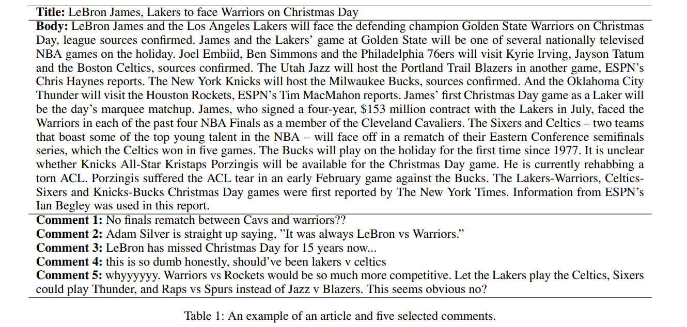
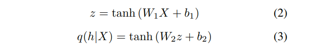
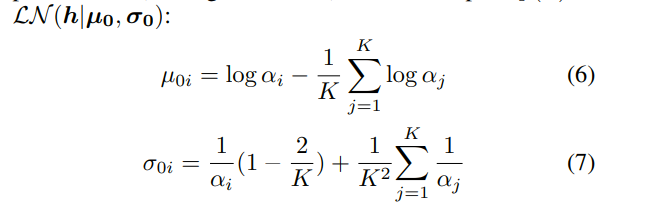
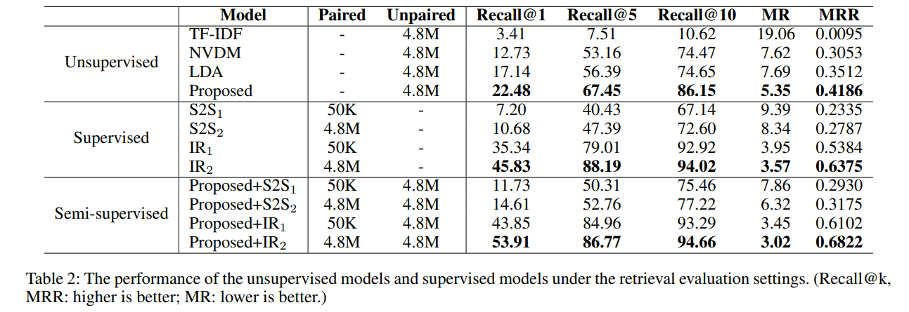
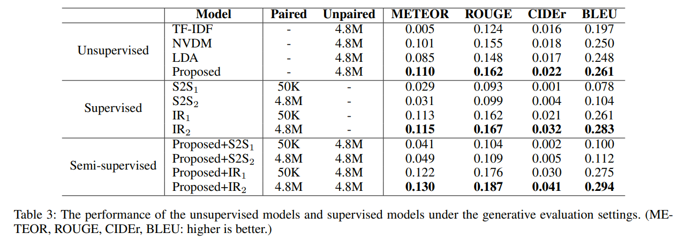
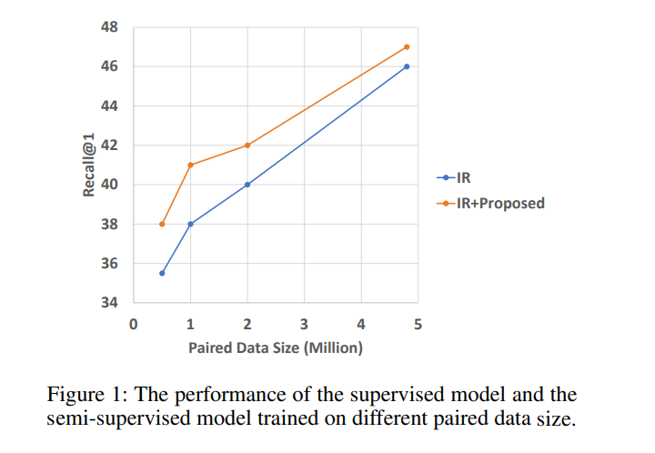
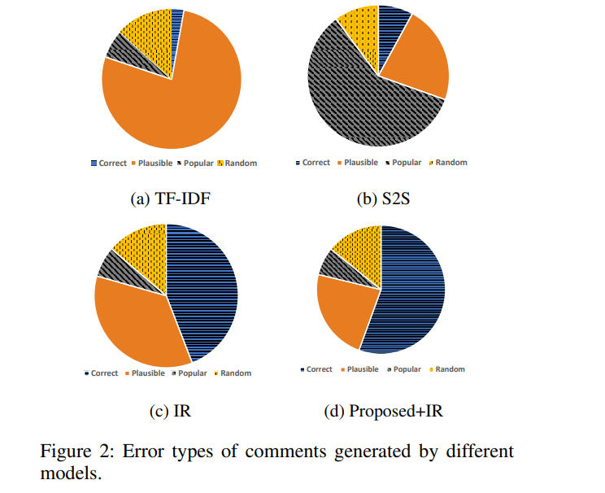

# Unsupervised Machine Commenting with Neural Variational Topic Model
[toc]
https://arxiv.org/pdf/1809.04960.pdf
## Introduction
- 文章评论需要对文章的理解、主旨的归纳、观点的挖掘以及自然语言生成
- 评论能够提供附加信息以及外部的观点，帮忙读者对文章的理解
- 腾讯数据集中只有1610个新闻有标注，大部分分数都在4以下，只有6.8%比4大，因此大部分数据其实是不匹配的，作为监督学习来说可能有潜在的伤害
- 互联网上有大量的非匹配数据，如微博与新闻网站等
- 文章和评论之间是存在语义差别的，使用MT等翻译模型是有害的
- 作者提出非监督主题模型来对文章和评论进行处理，然后基于查询方式来使用相同主题评论进行评论

## Machine Commenting
### Challenges
Mode Collapse Problem
: 常见Seq2Seq模型的输出出现同质化现象，原因可能是平行数据的有限与评论生成的模式复杂的矛盾
与翻译、摘要等任务不同，这些任务的输出信息都在输入当中
评论往往与文章弱相关，其中部分信息甚至来源于外部，因此其可能需要更多的数据

Falsely Negative Samples
: 新闻可以有很多评论，而且每个评论之间语义可以有很多的区别
在监督学习中，出现的正例只有少许，而其他一些有趣、有信息量的评论（不和该文章关联），被丢失或当着负例

Semantic Gap
: 评论和文章之间有语义鸿沟，评论有外部信息，有些甚至与文章观点相反，因此比较难挖掘评论与文章之间的关系

### Solutions
Retrieval Model
: 检索模型可以获得更多的性能
  - 没有Mode Collapse Problem
  - 产生的评论更容易预测与控制
  - 可以与生成模型相结合，将生成的模型作为候选加入到检索中

Unsupervised Learning
: 非监督学习能让模型学习更多的数据
  像推特微博等含有很多对时事的评论而没有对应的文章
  不需要负例，因此避免了上面的负例问题

Modeling Topic
: 我们发现匹配的文章和评论含有同样的主题
与人比较相似，人也不需要看完整篇文章只需要抓住主题就可以进行评论

## Proposed Approach
### Retrieval-based Commenting
两个挑战
- 如何度量文章与评论的匹配度
- 如何快速地计算文章与评论的匹配度

文章h_a, 评论h_c，点乘计算分数
$$s(a, c) = h_a^T h_c$$

 Maximum Inner Product Search (MIPS)

### Neural Variational Topic Model
文章编码，使用BOW对标题与正文的连接进行编码为X, $X\in R^{|V|}$, $x_i\in R^{|V|}$为序列中第i个词

解码器
$$p(X|h) = \prod_{i=1}^Np(x_i|h)$$
$$p(x_i|h) = softmax (h^TMx_i)$$
我们使用Diirichlet先验而不是Gaussian先验，由于很难对该先验进行快速参数更新，我们使用Laplace近视

### Training
我们扩展了一个监督训练框架来合并监督模型与非监督模型
我们联合训练非监督学习refloss, 监督学习seq2seq的交叉熵
 $$L = L_{unsuper} + \lambda L_{super}$$

## Experiments
### Datasets
略

### Implementation Details
- hidden size: 512, batch: 64, K: 100, lambda: 1.0
- Vob: 30000, epoch: 20, Adam, lr: 5e-5, Batch Normalization
- 从0到１增加KL项

### Baselines
- TF-IDF, LDA, NVDM
- S2S with Attention生成模型, IR使用CNN进行文章、评论匹配分数计算

### Retrieval Evaluation
- 使用ｒａｎｋ来对结果进行评估

### Generative Evaluation
- 参考集不在候选集中

### Analysis and Discussion
- 与数据集大小的关系

- 错误分析
    - Correct: 正确的评论
    - Plausible: 50最相似的评论，ｔｆｉｄｆ余弦相似度
    - Popular: 50最流行的评论
    - Random: 随机

- TF-IDF的top-1往往来至于plausible
- S2S来至于popular，主要是因为mode collapse problem以及data sparsity
- IR也有plausible问题，主要是其没有建模主题信息导致同主题的正确评论由于文本相似的问题获得较低的分数
- proposed+IR，效果最佳
## Related Work
略

## Conclusion
略