# Coherent Comment Generation for Chinese Articles with a Graph-to-Sequence Model
[toc]

https://arxiv.org/pdf/1906.01231.pdf
https://github.com/lancopku/Graph-to-seq-comment-generation
https://pan.baidu.com/s/1b5zAe7qqUBmuHz6nTU95UA#6xdw

## Abstract
- 使用常规编码解码器进行评论生成会导致生成通用的以及不相关的评论

## 1 Introduction
评论生成有如下几个挑战
- 新闻文本会很长，常见的seq2seq难以驾驭，而标题又太短，难以提供足够的信息
- 有时候题目与正文不相关
- 用户往往是基于不同的视角（主题 topic）进行评论的，会使评论很发散

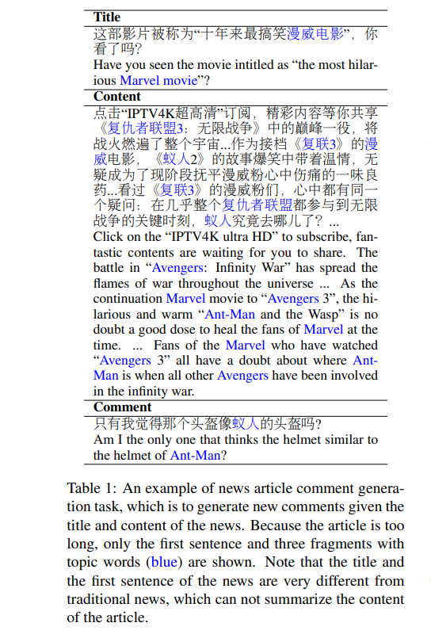

- 我们提出一种主题交互图来表示文章内容，其将文章文本分解为多个以主题为中心的文本簇，每个簇表示文章的关键主题
- 簇构成顶点，主题之间的关系构成边
- 结果显示我们的模型能够生成一致以及有信息量的评论

本文的贡献有以下几点：
- 提出了一种主题交互图来对新闻文本建模
- 提出了基于主题交互图的graph2seq生成模型
- 收集并公布了包含新闻标题、新闻内容、新闻评论的数据集

## 2 Related Work
- GNN：图网络不仅可以用于结构化数据如社交网络、推荐、知识图谱，也可以用于非结构化数据如文本、图像等
- 有研究使用图网络用于文本分类，其将长文本建模成词共现图
- Yao et al.(2018)将词或文档建模成同一个图，边表示PMI，文档和词语之间的边使用tf-idf，然后使用GCN进行分类
- Liu et al. (2018)使用孪生GCN网络将文本匹配转换为图交互
- Zhang et al. (2018)使用同样的方法来进行query和文档的映射

## 3 Graph-to-Sequence Model

### 3.1 Graph Construction
- 文章可能有很多噪声，如“谢谢大家点开这篇文章
- 我们从文章中提取关键词并将关键词作为文章主题，大部分关键词是命名实体词
- 具体方法：分词，命名实体识别，然后通过textrank等方法来获取补充关键词
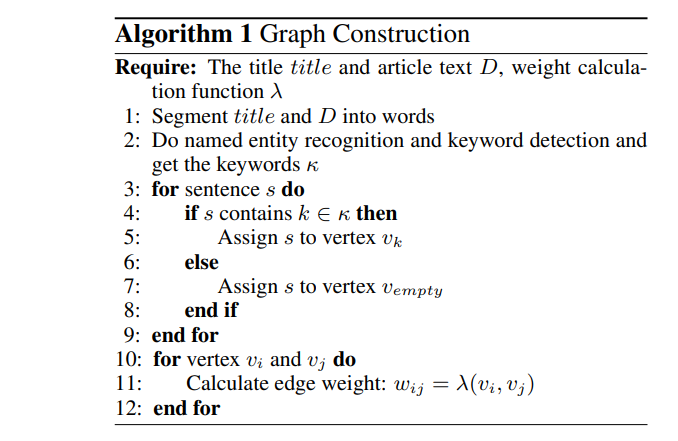

- 获取关键词后，将每一句根据出现在其里面的关键词将其进行分配，将这些句子拼接起来作为节点内容，一句话可以分配到多个关键词，无关键词的句子华为为Empty，标题单独作为一个顶点
- 如果两节点包含同一句子，我们就将两节点连接起来，边的权重计算方法为λ，本文中λ是包含相同句子的数量，也可以使用tf-idf相似度进行计算

### 3.2 Vertex Encoder
- 使用多头自注意力来将图中每个节点编码成向量
- 对于每个节点中的文本，我们在开头加上节点对应的关键词k，我们用词向量 ei 和位置向量pi 作为文本每个词的初始化： $\epsilon_i = e_i + p_i$ ，然后经过self-attention进行编码，所得第i个词的隐层状态为ai， e p为可以学习的参数
- 目的是为了让节点学习到上下文内容
- Q, K, V 表示同样的向量, Wo, WQi, WKi, WVi为可以学习的向量

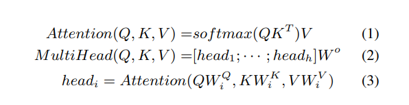
我们选用 a0 ,即句首的关键词对应的表示作为节点的表示

### 3.3 Graph Encoder
- 图编码器选用标准GCN作为信息迭代方法
- $A_{ij} = w_{ij}, A\in R^{NxN}$, 添加上到自己的边，W是可学习矩阵
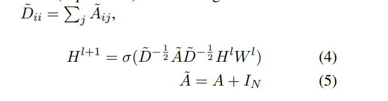
两层之间添加残差链接，最后一层使用FFN
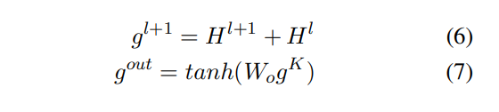
- 可以使用标题的编码作为解码初始值也可以使用全部的max或者平均pool作为初始值

### 3.4 Decoder
通过t0以及 GCN编码结果<g0, g1, · · · , gn>来生成输出词语，δ 是注意力机制，ci是上下文向量
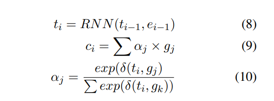
考虑到抽取出的关键词本身的重要性，因此使用copy机制, 使用概率pcopy 来选择复制关键词还是生成一个词
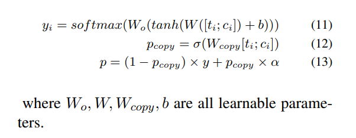

## 4 Experiment
### 4.1 Corpus
来源于腾讯快报
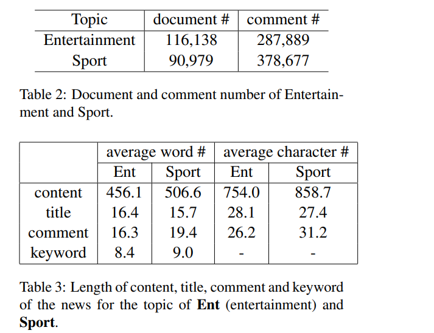

### 4.2 Experiment Settings
略

### 4.3 Evaluation Metrics
这里作者使用三种评价标准对生成评论进行衡量：相关度、信息丰富度以及流畅程度，三个指标均为0-10的得分，由人工给出

### 4.5 Results
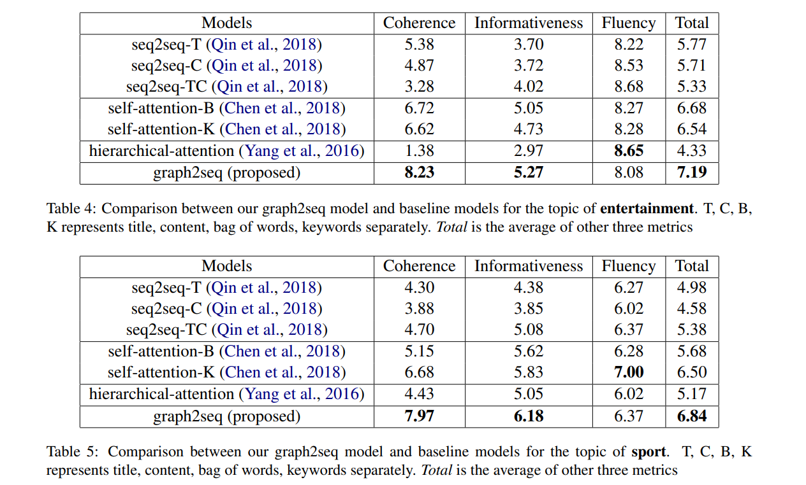
可以看出，graph2seq的模型在相关性和信息丰富度两个方面都优势很明显，在生成通用句的问题上有比较大的改善

Coherence
: g2s不是使用与文章不太相关或者不相关的高频词，这是基础seq模型经常出现的
其他模型容易出现通用的评论，在碰到不常见的主题时
self-attention能获得高分，我们分析最相关的词语由BOW以及关键词输入维护

Informativeness
: 模型如果有更高的Coherence则倾向于更高的信息量，来源事实，低信息量的评论往往是通用的评论，其与文章天然不Coherence的
可以采用句子中非停止词的个数进行分析
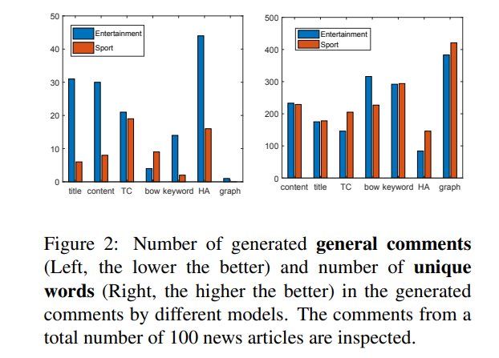

Fluency
: 我们发现了如下产生不流畅评论的CASES
  - 产生的评论不符合知识：大餐是个好演员
  - 不能区分相同的词语：鹿晗是谁？我只认识鹿晗
  - 多次重复某一个名字：训练集中可能有这种情况，copy模式导致

### 4.6 Case Study
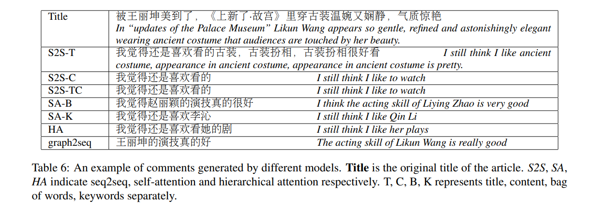

## 5 Conclusion
本文在图的构建上并没有像大部分工作一样以词和句子为节点，而是依照关键词设置“主题”节点，把相关句子聚合在一起作为节点内容，为平衡图节点数量与质量，以及节点抽象意义的赋予方式提供了一种思路。

模型在解码器部分对图编码信息的利用率比起初版graph2seq有较高提升，也比较好地融合了传统生成任务的已有方案。
