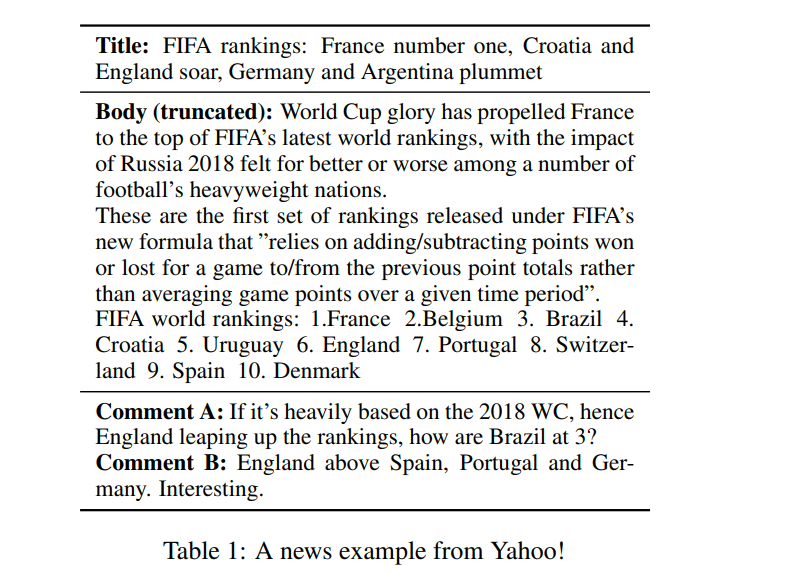
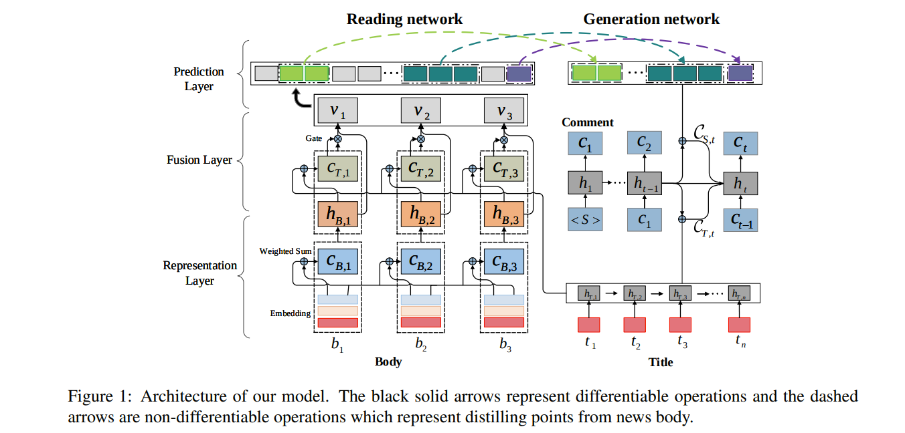
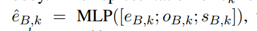
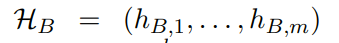
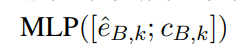
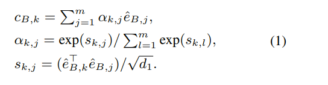
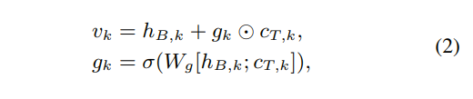

# Read, Attend and Comment: A Deep Architecture for Automatic News Comment Generation
[toc]
- https://arxiv.org/abs/1909.11974

## Abstract

## 1 Introduction
- 机器评论可能会有道德问题，导致政治操控等
- 直接使用标题进行序列生成则丢失了大量有用信息（标题太短）
- 另一方面使用正文，对于生成来说则引入了噪声问题（正文比起评论来长太多）
- 人的评论行为：阅读，关注到文章中某点，针对该点进行评论

用雅虎新闻的一个例子说明了新闻评论的产生机制。这篇新闻报道的是国际足联的新排名，作者从众多评论中挑选了两条评论来解释人们是如何进行评论的。首先，这两位评论者都浏览了整篇文章，因为他们的评论是建立在正文中的细节之上的。其次，文章给出了关于新排名的许多细节，但两位评论者都只评论了几点。第三，两位评论者的关注点不同：第一位评论者注意到排名是基于新世界杯的结果，对巴西的位置感到好奇；第二位评论者只是对英格兰的新位置有兴趣。这个例子说明新闻评论是通过 “阅读 - 关注 - 评论”这一过程而产生的，作者受此启发，构建了自动生成新闻评论的模型 DeepCom

为了模仿“阅读 - 关注 - 评论”的过程，作者提出了一个阅读网络和一个生成网络。阅读网络模拟人们理解新闻文章，作为新闻的编码器。生成网络模拟人们在阅读新闻后如何评论新闻，作为评论的解码器。阅读网络从下到上由表示层、融合层和预测层组成。
- 第一层使用 RNN-GRU 提取新闻标题的表示，并通过自关注机制提取新闻主体的表示，可以模拟词语之间的长距离依赖关系。
- 第二层通过注意力机制和门机制将标题的信息融合到新闻主体的表示中，形成整个新闻文章的表示。注意力机制在标题中选择有用的信息，而门机制进一步控制标题信息流入到新闻主体表示中的程度。
- 最后，在前两层之上构建第三层，使用多标签分类器和指针网络来预测文章中的一组显著分段（例如单词、短语和句子等）。通过阅读网络，模型可以理解新闻文章，并从中提炼出一些关键点（即显著分段）。生成网络的结构为 RNN 模型，它通过注意力机制关注阅读网络选择的分段和新闻标题，然后逐字生成评论。在训练中，由于显著分段不是直接可用的，所以作者将其视为隐变量，然后通过蒙特卡罗采样方法优化真实目标的下界，从新闻 - 评论数据对中联合学习两个网络。这样，评论预测中的误差可以反向传播到分段选择中，并用于指导阅读网络理解新闻。

作者在两个大数据集上进行了实验。一个是腾讯最近发布的中文新闻数据集，另一个是从雅虎网站上搜集的新闻。在这两个数据集上的结果均表明，该模型在自动评价指标和人工评分上都明显优于现有方法。雅虎新闻语料库和源代码均已公开。

本文的贡献主要体现在四个方面：（1）提出了一种基于“阅读 - 关注 - 评论”过程的新闻评论生成结构，包括阅读网络和生成网络；（2）采用端到端的学习方法对两个网络进行联合优化；（3）在两个公开数据集上，从自动评价指标和人工评分两个方面验证了所提出模型的有效性；（4）发布了一个英文新闻评论数据集。

## 2 Related Work
略

## 3 Approach
### 3.1 Problem Formalization
$$P(C|T,B)$$
C评论，Ｔ标题，Ｂ新闻正文

假设有一个数据集 D={(Ti, Bi, Ci)}，每个三元组（Ti，Bi，Ci）由新闻标题 Ti，新闻主体 Bi，和评论 Ci 组成。生成新闻评论的目标是从 D 中估计概率分布 P(C|T,B)，这样，对于新的新闻数据 (T, B)，可以根据 P(C|T,B) 生成评论 C

### 3.2 Model Overview

该模型由一个阅读网络和一个生成网络组成。阅读网络首先在表示层中分别表示新闻标题和新闻正文，然后通过融合层将标题信息融合到正文表示中，形成对整篇新闻的表示，最后通过预测层从新闻中提炼出一些显著性分段（salient span）。然后将显著性分段和新闻标题反馈到生成网络以生成评论。利用这两个网络，可以将生成概率 P(C|T,B) 分解为 P(S|T,B)* P(C|S,T)，其中 S=(s1,…,sw) 表示 B 的一组分段，P(S|T,B) 表示阅读网络，P(C|S,T) 表示生成网络

### 3.3 Reading Network
在表示层中，假设 T=(t1,…,tn)，表示新闻标题，其中 tj 表示第 j 个词，B=(b1,…,bm) 表示新闻正文，bk 表示第 k 个词。首先通过内嵌表示，将 tj 和 bk 分别表示为 eTj 和 eBk。为了强调新闻正文中单词的位置信息，作者增加了 oBk 和 sBk 表示。oBk 指示新闻正文单词 bk 在句子中的位置，而 sBk 表示这个句子在新闻正文中的位置。于是 bk 的最终表示由下式得到：

T 和 B 的初始表示分别为：(eT1, eT2,...,eTn) 和 (eB1, eB2,...,eBm)。阅读网络随后利用 RNN-GRU 将 T 和 B 转换成隐矢量序列

$h_{B,K}=$

融合层的输入为 HT 和 HB，通过融合 HT 和 HB，生成 V=(v1,...,vm) 作为整个新闻的表示。对于 HB 中的一个元素 hBk，首先让 hBk 关注 HT，以识别标题中的有用信息，并且通过门单元，平衡标题和新闻主体的影响。

阅读网络的顶层（预测层）基于整体表示 V 提取新闻的显著性分段（span）。假设 S=((a1,e1),…,(aw,ew)) 表示显著性分段，其中 ai 和 ei 指代第 i 个分段的开始点和终止点。作者利用多标签分类问题来识别起始点，将整体表示 V 作为输入，L=(l1,...,lm) 作为输出。如果第 k 个词是分段的起始点，那么 lk=1，否则 lk=0。由于各个分段的起始点是互相独立的，可以通过设计多个二值分类器进行识别。该方法能够有效灵活地从长度变化的新闻中检测出不同数量的分段，并且由于多个分类器之间没有依赖性，可以平行计算。给定 ak，终止位置 ek 可以通过指针网络得到：

