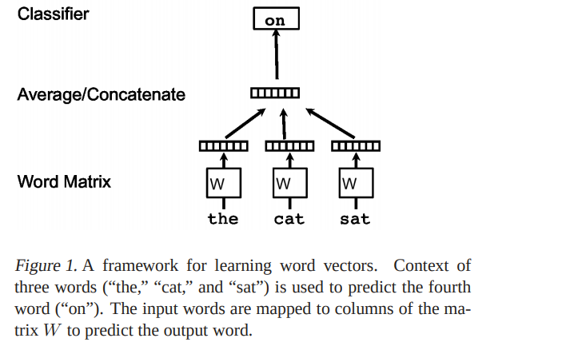
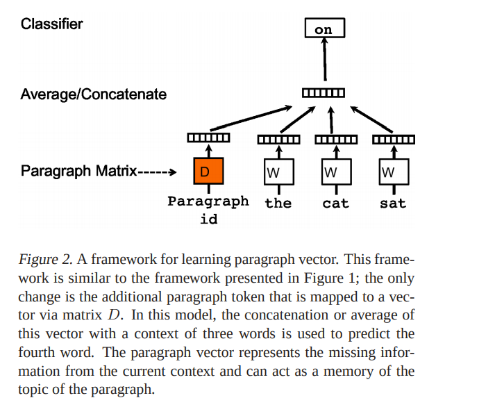
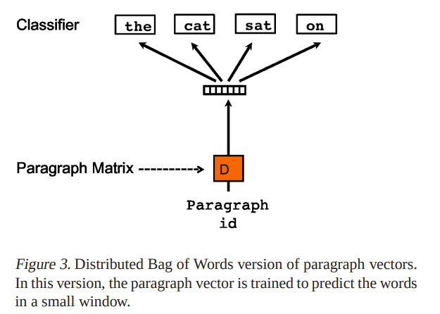
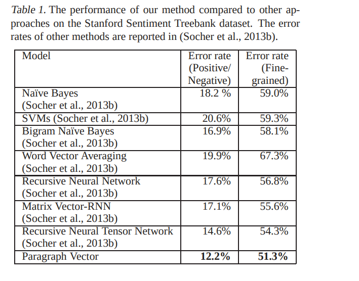
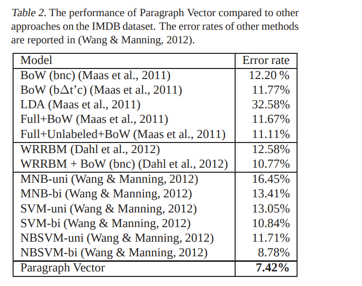
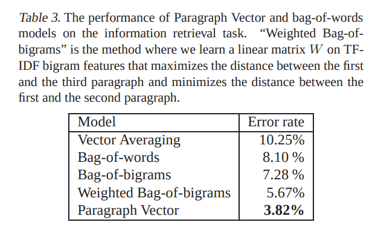

# Distributed Representations of Sentences and Documents
[toc]
- https://arxiv.org/abs/1405.4053

## Abstract
- 机器学习算法需要文本的固定长度表示
- 常见的表示是BOW: 无序，未考虑词语的语义
- Paragraph Vector, 非监督算法学习变长文本的固定语义表示，在多项句子分类和情感分类的数据集上获得STOA

## 1. Introduction
- BOW和Bag-of-Ngrams问题
    - 丢失词序，使用同样词语的不同句子含有同样的表示
    - 无语义信息，无法计算词语之间的距离
- Paragraph Vector
    - 学习变长文本的连续分布向量表征
    - 连接Paragraph Vector和几个词向量来预测在上下文中下面应该出现的词
    - 每个段落计算自己的向量，而词向量共享
    - 预测时，Paragraph Vector被词向量进行推理，直到收敛
- 之前的工作
    - 词向量进行权重平均 -》句向量：缺少词序
    - 基于句子解析树进行合并 -> 需要解析结构，只能用于句子

## 2. Algorithms
### 2.1. Learning Vector Representation of Words

- 损失函数 $$\frac{1}{T}\sum_{t=k}^{T-k} \log p(w_t| w_{t-k}, ...,w_{t+k})$$
$$p(w_t|w_{t−k}, ..., w_{t+k}) = \frac{e^{y_{w_t}}}{\sum_i e^{y_i}}$$
$$y = b + Uh(w_{t−k}, ..., w_{t+k}; W)$$
U, b 是softmax的参数
h是从W里面提取的词向量的平均连接构成的

- 实际中可以使用层次化softmax
- 训练后
    - 相似的词语词向量相近
    - 词向量之间的差别也含有语义：词类别

### 2.2. Paragraph Vector: A distributed memory model

- D表示段落向量矩阵，每个段落映射到唯一，同样W表示词向量矩阵
- 段落向量和词向量平均或者连接后预测下一个出现的词语，实验中使用连接
- 段落向量可以看着另外一个词向量，作用是用来记录当前上下文所缺失的信息，或者说表征该段落的主题，模型称为 Distributed Memory Model of Paragraph Vectors (PV-DM)
- 使用随机梯度下降进行训练，通过反向传播进行梯度更新
- 预测时，softmax（U、b）和W参数固定，计算D的参数
- 训练后，D中的向量可以直接作为逻辑回归、SCM、K-means等模型的特征输入

Advantages of paragraph vectors
: 优点之一是使用的是非标注数据，因此对于无足够数据的任务有好处
计算了词语的语义
考虑了词语的顺序，在小范围上下文中与n-gram相似，解决了n-gram(BOW)的高维稀疏问题

### 2.3. Paragraph Vector without word ordering: Distributed bag of words
Distributed Bag of Words version of Paragraph Vector (PV-DBOW)

- 在输入中不考虑正文，直接使用段落向量来预测词语。每次选择一个窗口，从窗口中随机一个词语进行训练。
- 存储较少的数据，只需要存储softmax的参数
- 用PV-DM训练出的向量有不错的效果，但在实验中采用了两种模型分别计算出的向量组合作为最终的paragraph vector，效果会更佳

## 3. Experiments
- 情感分析数据集
    - Stanford sentiment treebank dataset (Socher et al., 2013b) and IMDB dataset (Maas et al., 2011)
- 信息检索：判断一个文档是否能够查询一个查询

### 3.1. Sentiment Analysis with the Stanford Sentiment Treebank Dataset

### 3.2. Beyond One Sentence: Sentiment Analysis with IMDB dataset

### 3.3. Information Retrieval with Paragraph Vectors

### 3.4. Some further observations
- PV_DM比PV-DBOW要好，两者合并更好
- 组合模型，连接比平均更好
- 窗口长度位于5~12之间效果最好

## 4. Related Work

## 5. Discussion
- 虽然主要是用于文本，而该方法同样可以用于序列数据，而不只是文本
- 期待该方法是BOW, BO-n-gram的另外一种替代
