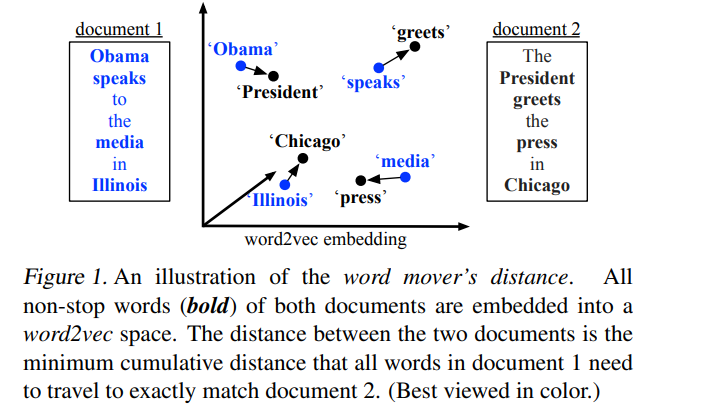
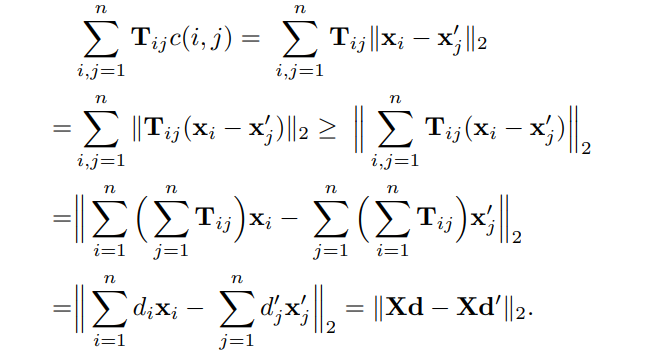
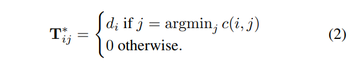
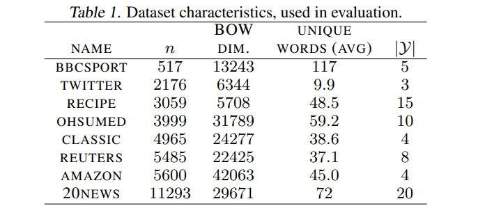
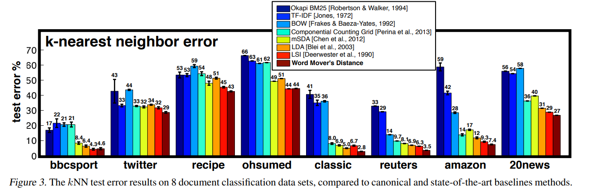
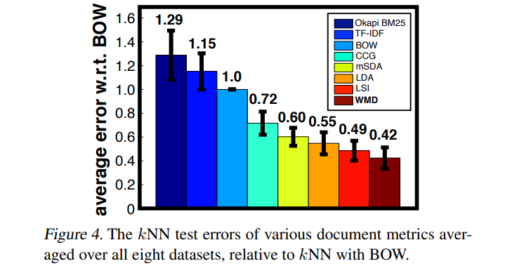
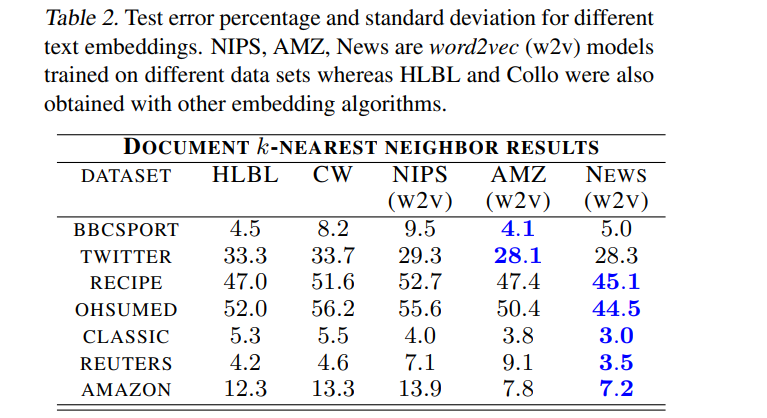
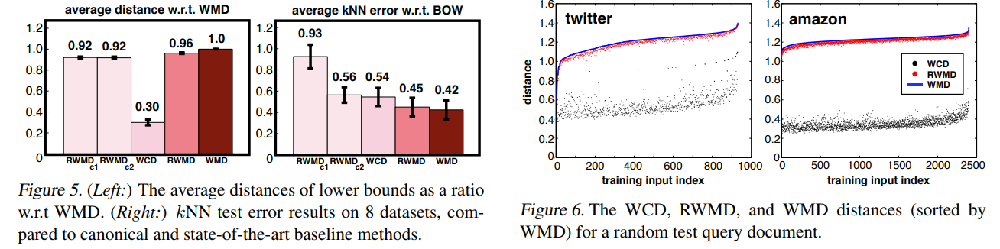

# From Word Embeddings To Document Distances
[toc]

- http://proceedings.mlr.press/v37/kusnerb15.pdf

### Abstract
文主要提出了一种基于词移动距离（Word Mover's Distance, WMD）的文本相似度的计算方法。其主要工作都是基于词在句子中的共现概率而训练的词向量来展开的（其实就是用了word2vec训练出来的词向量）。WMD的距离计算方法简单理解就是，针对一篇文章中的每一个词，我们都能在对比文章中找到一个词，使得该词“移动／转移”到该词的“代价／距离”最小（其实就是俩个词向量的距离最小），而两篇文章的相似度就是，一篇文章中的所有词转到另一篇文章的词的“总代价／距离”。这个距离的度量方法其实与著名的交通运输问题“Earth Mover's Distance”思路是一样的。这种度量的方法的一个好处就是，其没有超参数需要去优化，计算直接了当。然后，本文所做的实验也论证了这种（WMD）的度量方法确实简单有效，且在当时击败（用最小k近邻误差来衡量）了其他7种主流的文本相似度度量算法。

### 1. Introduction
- 计算语句相似度的方法
  - BOW和Tfidf: 词语之间无语义关系
  - LDA/LSA
  - Word2Vector Based
    - word2vector中的词类比证明词语之间的差是有语义信息的
    - 这个启发了该算法

- WMD有几个特征
  - 无超参数
  - 可解释
  - 高查询准确度

### 2. Related Work
- 略

### 3. Word2Vec Embedding

### 4. Word Mover’s Distance

- 词向量矩阵$X \in R^{d*n}$，其中n是词典库的大小，d是词向量的维度
- 一篇文章可以被表示成被归一化后的词袋向量(normalized bag-of-words (nBOW))$b \in R^{n}$。每一维就是该词在文章中出现的次数（归一化除以总数后），显然这个词袋向量是非常稀疏的，因为大量的词不会出现在一篇文章中
- 两个用词不一样的nBOW仍然可以是语义相似的
- Word travel cost：两个词语之间的距离，可以采用词向量距离表示 $$c(i, j) = ||x_i - x_j||_2$$
- Document distance: 定义一个转移矩阵$T \in R^{n*n}$，其上的每一个值$T_{ij}$代表单词i有多少权重要流入到单词j，我们只需要保证，该单词流出的权重等于该单词在词袋向量中所有的权重即可$\sum_jT_{ij} = d_{i}$，而对于流入方单词同理，其流入的权重等于其在词袋向量中的权重
- Transportation problem: 
- Visualization

#### 4.1. Fast Distance Computation
- 算法的复杂度很高，$O(p^3logp)$。因此论文里还提了几个简单的优化思路（取下限）
- WCD（Word Centroid Distance），带权重的相加（weighted word vector），然后直接计算两个向量之间的距离

- Relaxed word moving distance： 取消一下WMD中的限制，即我们不严格要求流入词的权重是与词在文章中的权重是一致的，那相当于就是尽可能多的词去做匹配而不做严格的限制

### 5. Results

#### 5.1. Dataset Description and Setup

#### 5.2. Document classification

#### 5.3. Word embeddings.

#### 5.4. Lower Bounds and Pruning

### 6. Discussion and Conclusion
- 略
