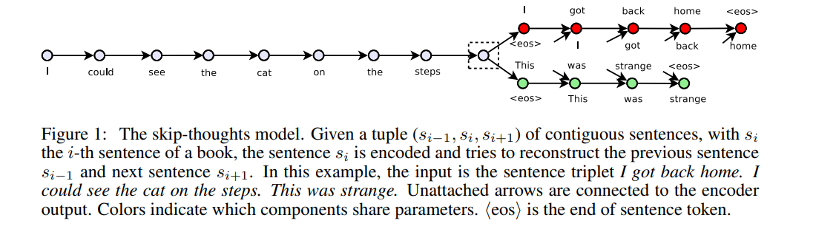
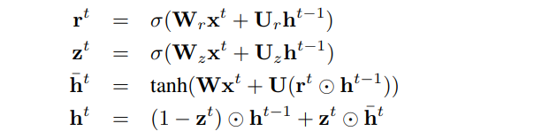
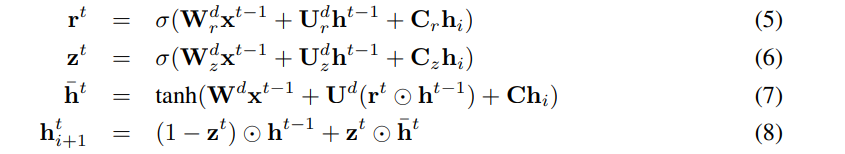
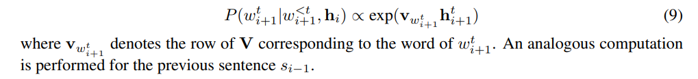

# Skip-Thought Vectors
[toc]

- URL： https://arxiv.org/pdf/1506.06726.pdf
- https://github.com/tensorflow/models/tree/master/research/skip_thoughts

## 1 Introduction
- 近年开发了基于RNN、递归神经网络、CNN等网络的方法将词向量映射到句子向量，但是上面这些方法都需要监督学习以及需要一个类别标签进行反向梯度传播
- Doc2Vector是一种非监督的方法
- 本文提出了
  - 不需要特定监督任务而学习到高质量的句向量
  - 从skip-gram获取灵感，利用中间的句子来预测两侧的句子也即是其上下文，所以叫 skip-thoughts

## 2 Approach
### 2.1 Inducing skip-thought vectors
- 编解码模型可以使用CNN、RNN、LSTM、GRU
- 实验中使用基于GRU的RNN作为编码器，使用条件GRU的RNN作为解码器

基于GRU的编码器
: 

解码器
: 

hi编码器输出；

目标
: 
根据中间句子的向量以及<t Step的词语输出t步的词语概率

### 2.2 Vocabulary expansion
词汇扩展主要是为了弥补我们的 Decoder 模型中词汇不足的问题。具体的做法就是
- 用 Vw2v 表示我们训练的词向量空间，用 Vrnn 表示我们模型中的词向量空间，在这里 Vw2v 是远远大于 Vrnn 的
- 引入一个矩阵 W 来构建一个映射函数：f:Vw2v−>Vrnn 。使得有 v′=Wv ，其中 v∈Vw2v,v′∈Vrnn 
- 通过映射函数就可以将任何在 Vw2v 中的词映射到 Vrnn 中

## 3 Experiments
对BookCorpus数据集进行训练之后，评估编码器作为通用特征提取器的能力。 在每个任务上的实验设置如下：
- 使用学习的编码器作为特征提取器，为所有句子提取skip-thought vectors。
- 如果任务涉及计算句对之间的分数，则计算成对之间的分量特征。 这将在每个实验中更详细地描述。
- 在提取的特征之上训练一个线性分类器，不需要通过skip-thoughts模型进行额外的微调或反向传播。