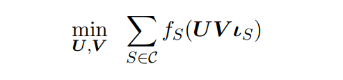
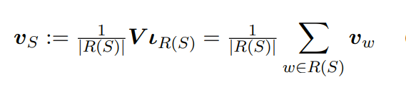
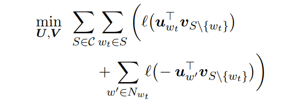
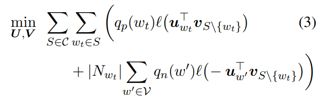
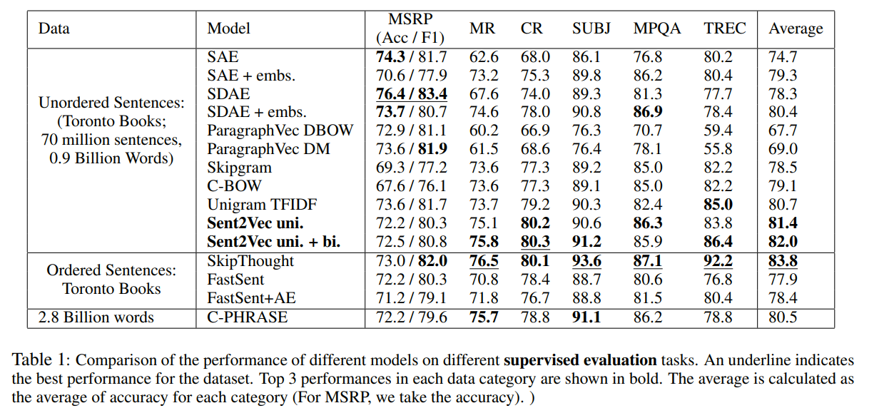
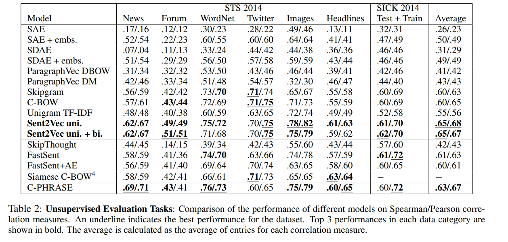
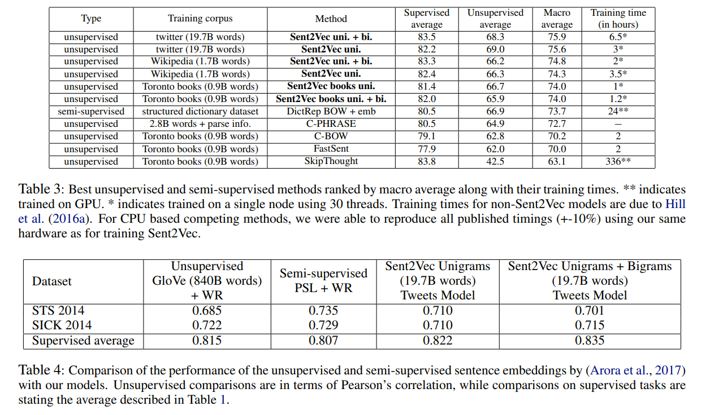

# Unsupervised Learning of Sentence Embeddings using Compositional n-Gram Features
[toc]
- http://github.com/epfml/sent2vec
- https://arxiv.org/abs/1703.02507
## 1 Introduction
- 词向量成为当前NLP应用的主要模块之一
- 两种趋势
    - 使用RNN,LSTM,注意力机制,神经图灵机等复杂模型
    - 使用矩阵分解、双线性模型等浅层模型
- 提出模型，相当于扩展CBOW训练目标为句子而不是词语，并且保持模型的训练和推理复杂度较低
- 贡献
    - 提出Sent2Vec，简单非监督句子表示模型
    - 高效和扩展性，训练与推理复杂度针对单个词语为O(1)，能够用于大数据集上
    - 性能

## 2 Model
想法来源于矩阵因子模型（双线性模型）在词向量训练以及句子分类中的使用

- V源词向量，维度 h * |Vocabulay|
- U目标词向量，维度 k * h
- ls编码句子的指示向量，BOW表示，维度 |Vocabulay|，每位{0, 1}表示
- S可以表示为固定长度上下文窗口内，如W2v，也可以是非固定的，如句子
- fs是损失函数，将$R^k->R$

### 2.1 Proposed Unsupervised Model
- 针对每个词语学习一个源向量和目标向量
- 句子向量即是各个词源向量的平均，后续还会增加n-gram的向量

- 使用负样本抽样来替代softmax提高训练效率
- $l : x → log (1 + e^{-x})$使用逻辑函数
- 损失函数：
- 负抽样抽样概率：$ q_n(w) := \sqrt{f_w} / \sum_{w_i\in v}\sqrt{f_{w_i}}$, fw为标准化词频
- 正样本选择概率：$ q_p(w) := min (1, \sqrt {t / f_w} + t/ f_w )$, 使用 1 - p(w) 进行丢弃，t作为超参数，避免高频词对训练进行偏差影响

### 2.2 Computational Efficiency
- 源表示: |S|*h 或者 |R(S)| * h

### 2.3 Comparison to C-BOW
- 模型可以理解为将窗口限制为一句的CBOW模型扩展
- CBOW的下采样阻止n-gram的生成以及剥夺句子的重要语法结构
- CBOW使用的动态窗口调整(1~ws)，训练出本地表示与我们的目标不同

### 2.4 Model Training
- the Toronto book corpus , Wikipedia sentences and tweets
- 随机选择一句话，下采样一个目标词语，然后使用SGD更新参数
- 避免过拟合，在n-gram集合上施行dropout

## 3 Related Work
### 3.1 Unsupervised Models Independent of Sentence Ordering
- ParagraphVector DBOW: 使用句向量以及几个词语向量，预测后面的词语
- ParagraphVector DM:　使用句向量直接预测词语
- Sequential (Denoising) Autoencoder, S(D)AE: 首先针对一个句子中的词语使用p_0进行删除，然后针对非叠加的2-gram进行p_1概率的交换，最后通过LSTM进行编码后解码原先的句子，当两个参数都为0则就是Sequential Autoencoder
- variant (S(D)AE + embs: 所有词语使用预训练词向量固定表示

### 3.2 Unsupervised Models Depending on Sentence Ordering
- SkipThought: 使用编码器对句子进行编码，２个解码器分别预测上一句和下一句
- FastSent: 
- FastSent + AE:
- Siamese C-BOW:

### 3.3 Models requiring structured data
- DictRep
- CaptionRep

## 4 Evaluation Tasks

在监督任务的评估上上，我们的方法，平均来说，取得了比其他所有非监督的竞争者更好的性能，除了SkipThought向量。然而，SkipThought向量在句子相似度任务上的表现非常差，而我们的模型对于这些评估来说是最先进的