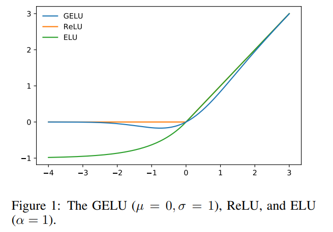

<!-- TOC -->

- [Gaussian Error Linear Units (GELUs) 高斯误差线性单位(GELUs)](#gaussian-error-linear-units-gelus-高斯误差线性单位gelus)
  - [ABSTRACT](#abstract)
  - [1 INTRODUCTION 引言](#1-introduction-引言)
  - [2 GELUS AND THE STOCHASTIC](#2-gelus-and-the-stochastic)
  - [3 EXPERIMENTS](#3-experiments)

<!-- /TOC -->
# Gaussian Error Linear Units (GELUs) 高斯误差线性单位(GELUs)
- https://arxiv.org/abs/1606.08415

## ABSTRACT
- GELU 非线性度是随机应用恒等式或零映射的随机正则化子的期望变换，它在尊重神经元值的同时，结合dropout 和 zoneout 的直观性。这种联系提出了对非线性的一种新的概率理解。我们根据 ReLU 和 ELU 的激活对 GELU 非线性进行了实证评估，发现所有任务的性能都有所提高

## 1 INTRODUCTION 引言
- Sigmoid 函数神经网络曾经是神经网络中最流行的非线性激活函数。尽管有概率解释，但由于收敛速度缓慢且不准确
- 广泛使用的 ReLU 激活通常表明优越的收敛，但缺乏其概率解释
- dropout 随机设置神经元值为零，而 zoneout 随机保留以前计算的神经元值
- ReLU 是确定性的零映射或标识映射，具体取决于输入值
- 本文通过考虑一种新的依赖于输入值的随机正则化方法，弥补了非线性和随机正则化方法之间的差距。然后，我们将随机调整器封装到一个确定性的激活函数中，我们称之为高斯误差线性单元(GELU)

## 2 GELUS AND THE STOCHASTIC
- 正则化子为随机0-i 映射(SOI 映射)

- 高斯累积分布函数是用误差函数计算出来的，所以我们将高斯误差线性单元(GELU)定义为

- ReLUs 和 ELUs 是凸单调激活，在正域是线性的，因此缺乏曲率
- 曲率增加和非单调性使 GELUs 比 ReLUs 或 ELUs 更容易逼近复杂函数

## 3 EXPERIMENTS
- MNIST CLASSIFICATION

- MNIST AUTOENCODER

